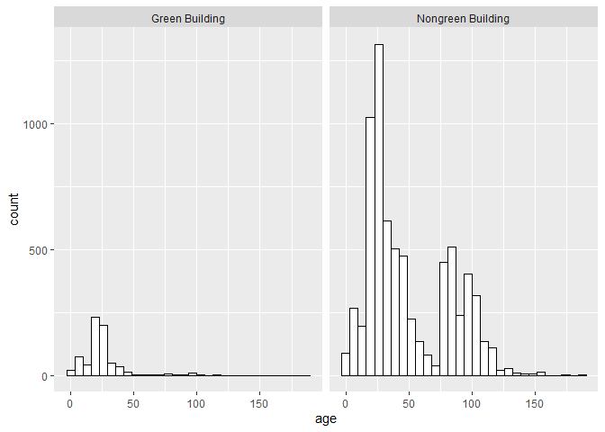
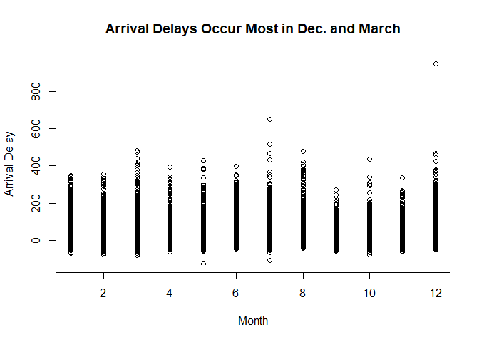
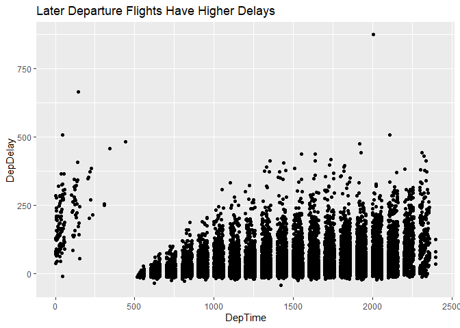
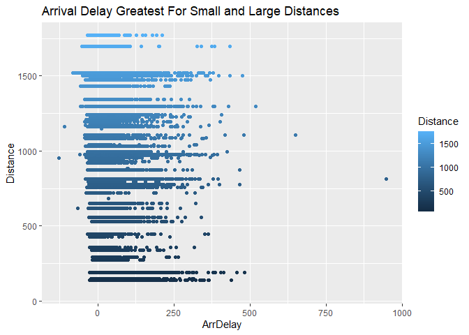
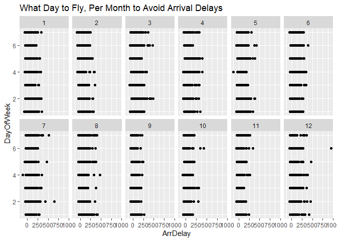
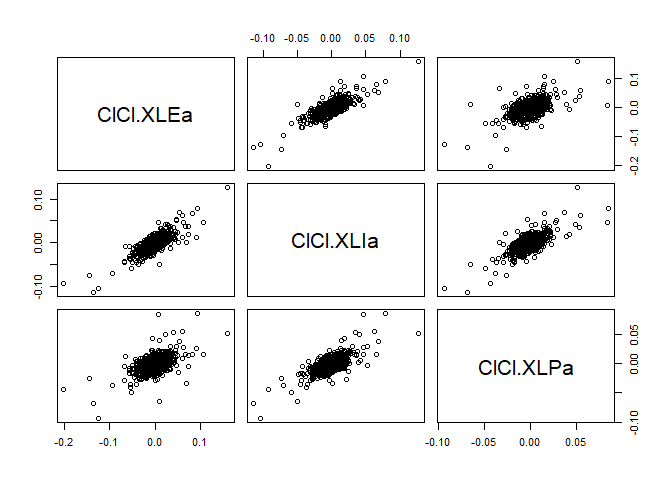
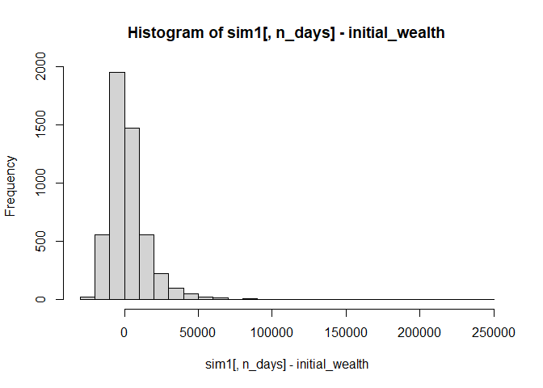
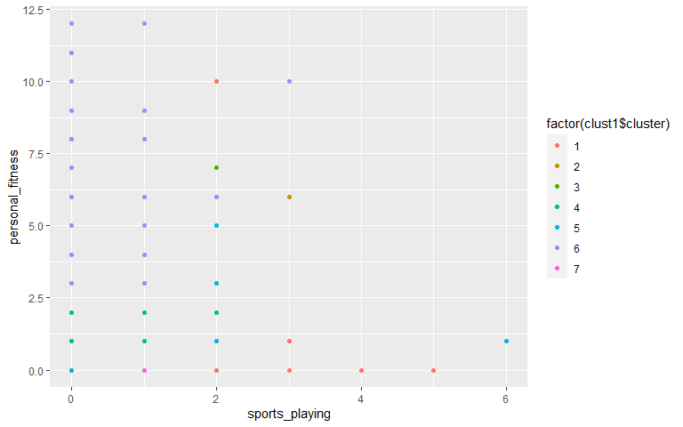
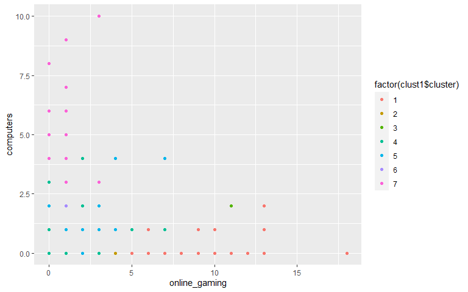

HW2
================
Shruti Kapur, Immanuel Ponminissery, Patricia Schutter, Dian Zhao
08/17/2020

    ## Loading required package: dplyr

    ## 
    ## Attaching package: 'dplyr'

    ## The following objects are masked from 'package:stats':
    ## 
    ##     filter, lag

    ## The following objects are masked from 'package:base':
    ## 
    ##     intersect, setdiff, setequal, union

    ## Loading required package: lattice

    ## Loading required package: ggformula

    ## Loading required package: ggplot2

    ## Loading required package: ggstance

    ## 
    ## Attaching package: 'ggstance'

    ## The following objects are masked from 'package:ggplot2':
    ## 
    ##     geom_errorbarh, GeomErrorbarh

    ## 
    ## New to ggformula?  Try the tutorials: 
    ##  learnr::run_tutorial("introduction", package = "ggformula")
    ##  learnr::run_tutorial("refining", package = "ggformula")

    ## Loading required package: mosaicData

    ## Loading required package: Matrix

    ## Registered S3 method overwritten by 'mosaic':
    ##   method                           from   
    ##   fortify.SpatialPolygonsDataFrame ggplot2

    ## 
    ## The 'mosaic' package masks several functions from core packages in order to add 
    ## additional features.  The original behavior of these functions should not be affected by this.
    ## 
    ## Note: If you use the Matrix package, be sure to load it BEFORE loading mosaic.
    ## 
    ## Have you tried the ggformula package for your plots?

    ## 
    ## Attaching package: 'mosaic'

    ## The following object is masked from 'package:Matrix':
    ## 
    ##     mean

    ## The following object is masked from 'package:ggplot2':
    ## 
    ##     stat

    ## The following objects are masked from 'package:dplyr':
    ## 
    ##     count, do, tally

    ## The following objects are masked from 'package:stats':
    ## 
    ##     binom.test, cor, cor.test, cov, fivenum, IQR, median, prop.test,
    ##     quantile, sd, t.test, var

    ## The following objects are masked from 'package:base':
    ## 
    ##     max, mean, min, prod, range, sample, sum

    ## -- Attaching packages ------------------------------------------------------------------------------ tidyverse 1.3.0 --

    ## v tibble  3.0.1     v purrr   0.3.4
    ## v tidyr   1.1.0     v stringr 1.4.0
    ## v readr   1.3.1     v forcats 0.5.0

    ## -- Conflicts --------------------------------------------------------------------------------- tidyverse_conflicts() --
    ## x mosaic::count()            masks dplyr::count()
    ## x purrr::cross()             masks mosaic::cross()
    ## x mosaic::do()               masks dplyr::do()
    ## x tidyr::expand()            masks Matrix::expand()
    ## x dplyr::filter()            masks stats::filter()
    ## x ggstance::geom_errorbarh() masks ggplot2::geom_errorbarh()
    ## x dplyr::lag()               masks stats::lag()
    ## x tidyr::pack()              masks Matrix::pack()
    ## x mosaic::stat()             masks ggplot2::stat()
    ## x mosaic::tally()            masks dplyr::tally()
    ## x tidyr::unpack()            masks Matrix::unpack()

    ## 
    ## Attaching package: 'scales'

    ## The following object is masked from 'package:purrr':
    ## 
    ##     discard

    ## The following object is masked from 'package:readr':
    ## 
    ##     col_factor

    ## The following object is masked from 'package:mosaic':
    ## 
    ##     rescale

\#Problem 1

Basic information about our building: Total GFA: 250,000 sqft Storie: 15
Age: 0 Baseline Construction Cost per sqft: $400

The question we are trying to answer is whether buildings with green
certificates can commnad higher rent, with *everything else being
equal*. So the key is to use a comparable set of buildings data to
estimate rents for our building, both with and without green
certificates.

There are lots of factors that influence average rents. The stats guru
only accounted for leasing rate and outliers by getting rid of the
buildings with leasing\_rate \< 10% and use median rent instead of mean
rent. However, he did not account for other factors that may skew the
comparison between green buildings and non-green buildings.

For example, the following histogram shows that nearlly all of the green
buildings are less than 50 years but a significant amount of nongreen
buildings are more than 50 years old. Since newer buildings generally
charge higher rents, the rent differential between green and nongreen
buildings may be the result of the age of the building, and not
necessarily due to the green certificate.

``` r
ggplot(greenbuilding,aes(x=age)) + 
  geom_histogram(bins = 30,color="black", fill="white") +
  facet_wrap(~ green,nrow = 1)
```

<!-- -->

In addition, only one third of the nongreen buildings are class a
buildings whereas more than three quarters of green buildings are class
a building. Thus the higher rent charged by green buildings could also
be explained by building quality.

``` r
ggplot(greenbuilding) +
  geom_col(aes(x = 1, y = n, fill = class), position = "fill") +
  coord_polar(theta = "y") +
  facet_wrap(~ green) +
    theme_bw() +
    theme(axis.title = element_blank(),
          axis.text = element_blank(),
          axis.ticks = element_blank(),
          panel.grid.major = element_blank(),
          panel.grid.minor = element_blank(),
          panel.border = element_blank())
```

<!-- -->

Green buildings also tend to have better amenities.

``` r
ggplot(greenbuilding) +
  geom_col(aes(x = 1, y = n, fill = amenities), position = "fill") +
  coord_polar(theta = "y") +
  facet_wrap(~ green) +
    theme_bw() +
    theme(axis.title = element_blank(),
          axis.text = element_blank(),
          axis.ticks = element_blank(),
          panel.grid.major = element_blank(),
          panel.grid.minor = element_blank(),
          panel.border = element_blank()) +
  labs(
    caption = "Amenities = 1 means with amenities and 0 means without"
  )
```

<!-- -->

Lastly, we have to account for location. If green buildings are
generally built in areas with higher rent, then the rent differential
between green and nongreen buildings are not due to the green
certificate, but more likely due to location premium.

Thus, we have to compare rent differentials between buildings in the
same location. We first create a compare\_set that only include
buildings with leasing rate more than 10%, less than 50 years old, with
class a ratings and have amenities.

``` r
compare_set <- subset(greenbuilding, leasing_rate > 10 &
                      age < 50 & class_a == 1 & amenities == 1)
```

We then create two subsets for green and nongreen buildings. For each
subset, we calculate the median rent for each cluster. We then create a
separate data table with each cluster as one row and with three columns:
median rent for green buildings, median rent for nongreen buildings and
rent differentials between green and nongreen buildings.

``` r
green <- compare_set[compare_set$green_rating == 1, ]
nongreen <- compare_set[compare_set$green_rating == 0, ]

green_median = green %>%
  group_by(cluster) %>%
  summarize(median_rent = median(Rent))
```

    ## `summarise()` ungrouping output (override with `.groups` argument)

``` r
nongreen_median = nongreen %>%
  group_by(cluster) %>%
  summarize(median_rent = median(Rent))
```

    ## `summarise()` ungrouping output (override with `.groups` argument)

``` r
merged = merge(nongreen_median,green_median,by.x = 'cluster', by.y = 'cluster',suffixes  = c(".nongreen", ".green"))

merged$rent_diff = merged$median_rent.green-merged$median_rent.nongreen
```

The scatterplot shows that the rent differentials are equally spread
along the 0 line. The average rent differential is -0.123, suggesting
that green buildings do not in fact command a higher rent compared to
non green buildings.

``` r
ggplot(data = merged) + 
  geom_point(mapping = aes(x = cluster, y = rent_diff)) +
  geom_hline(aes(yintercept=0),
            color="blue", linetype="dashed", size=1) +
  annotate("text", x=20, y=20, color="red", label= paste('avg rent differential: ', mean(merged$rent_diff)),hjust=0) 
```

<!-- -->

In conclusion, our analysis shows that green certificates do not
generate rent premium. The higher rent charged by green buildings are
likely the result of other factors such as newer buildings and better
amenities. Thus, from a purely economic perspective, it is not advisable
to get green certified.

\#Problem 2 The following is an analysis of Austin Bergstrom
International Airport. The data has been grouped in a way that shows
optimal times for flying in regards to month, day of week, time of day,
and carrier in order to avoid arrival and/or departure delays.

``` r
library(mosaic)
library(tidyverse)
library(ggplot2)

data1 <-"data/ABIA.csv"
ABIA = read.csv(data1)
#ABIA = read.csv('ABIA.csv')
head(ABIA)
```

    ##   Year Month DayofMonth DayOfWeek DepTime CRSDepTime ArrTime CRSArrTime
    ## 1 2008     1          1         2     120       1935     309       2130
    ## 2 2008     1          1         2     555        600     826        835
    ## 3 2008     1          1         2     600        600     728        729
    ## 4 2008     1          1         2     601        605     727        750
    ## 5 2008     1          1         2     601        600     654        700
    ## 6 2008     1          1         2     636        645     934        932
    ##   UniqueCarrier FlightNum TailNum ActualElapsedTime CRSElapsedTime AirTime
    ## 1            9E      5746  84129E               109            115      88
    ## 2            AA      1614  N438AA               151            155     133
    ## 3            YV      2883  N922FJ               148            149     125
    ## 4            9E      5743  89189E                86            105      70
    ## 5            AA      1157  N4XAAA                53             60      38
    ## 6            NW      1674   N967N               178            167     145
    ##   ArrDelay DepDelay Origin Dest Distance TaxiIn TaxiOut Cancelled
    ## 1      339      345    MEM  AUS      559      3      18         0
    ## 2       -9       -5    AUS  ORD      978      7      11         0
    ## 3       -1        0    AUS  PHX      872      7      16         0
    ## 4      -23       -4    AUS  MEM      559      4      12         0
    ## 5       -6        1    AUS  DFW      190      5      10         0
    ## 6        2       -9    AUS  MSP     1042     11      22         0
    ##   CancellationCode Diverted CarrierDelay WeatherDelay NASDelay SecurityDelay
    ## 1                         0          339            0        0             0
    ## 2                         0           NA           NA       NA            NA
    ## 3                         0           NA           NA       NA            NA
    ## 4                         0           NA           NA       NA            NA
    ## 5                         0           NA           NA       NA            NA
    ## 6                         0           NA           NA       NA            NA
    ##   LateAircraftDelay
    ## 1                 0
    ## 2                NA
    ## 3                NA
    ## 4                NA
    ## 5                NA
    ## 6                NA

``` r
# Delays vs. Month
plot(ABIA$Month, ABIA$ArrDelay, main = "Arrival Delays Occur Most in Dec. and March", xlab= "Month", ylab= "Arrival Delay")
```

<!-- --> This is
showing the arrival delays per month. From this, it appears that most
arrival delays occur in December and March.

``` r
plot(ABIA$Month, ABIA$DepDelay, main = "Departure Delay Occur Most in March and August", xlab= "Month", ylab= "Departure Delay")
```

<!-- --> To
compare arrival delays with depature delays, departure delays were aslo
ran against months. Departure delays occur most in March and August. As
March was present in both results, March seems to be full of delays of
both kinds.

``` r
# Delays vs. Day of Week
plot(ABIA$DayOfWeek, ABIA$ArrDelay, main = "Tuesday Has Lowest Arrival Delay", xlab= "Day of Week", ylab= "Arrival Delay")
```

<!-- -->

``` r
plot(ABIA$DayOfWeek, ABIA$DepDelay, main = "Tuesday Has Lowest Departure Delay", xlab= "Day of Week", ylab= "Departure Delay")
```

<!-- --> These are
a couple plots that represent what day is best to fly on in order to
avoid delays. Tuesday was found as the best day to fly in order to avoid
delays.

``` r
# Departure Time vs. Delay
ggplot(data = ABIA) + 
  geom_point(mapping = aes(x = DepTime, y = DepDelay)) +
  ggtitle("Later Departure Flights Have Higher Delays")
```

    ## Warning: Removed 1413 rows containing missing values (geom_point).

<!-- -->

``` r
# Arrival Time vs. Delay
ggplot(data = ABIA) + 
  geom_point(mapping = aes(x = ArrTime, y = ArrDelay)) +
  ggtitle("      Arrival Delays Greatest At Night")
```

    ## Warning: Removed 1601 rows containing missing values (geom_point).

<!-- --> Now that
month and day have been narrowed down, the next step was to narrow down
a time to fly. From these plots, it appears that mornings are best to
fly. However this does not mean morning as in midnight, but rather
around 5AM. The increase around midnight is rollover from the high level
of delays as it gets later in the night.

``` r
################################################

# Departure Delay vs. Distance
ggplot(data = ABIA) + 
  geom_point(mapping = aes(x = DepDelay, y = Distance, color = Distance)) + 
  ggtitle("Departure Delay Greatest For Small and Large Distances")
```

    ## Warning: Removed 1413 rows containing missing values (geom_point).

<!-- -->

``` r
# Arrival Delay vs. Distance
ggplot(data = ABIA) + 
  geom_point(mapping = aes(x = ArrDelay, y = Distance, color = Distance)) + 
  ggtitle("Arrival Delay Greatest For Small and Large Distances")
```

    ## Warning: Removed 1601 rows containing missing values (geom_point).

<!-- --> Next, I
wanted to see whether distance was a factor in delays. From these plots,
we can see that delays are greatest both on the extremes. This makes
sense as shorter flights don’t have enough distance to make up for lost
time and long distances tend to require more preparations.

``` r
# Arrival Delay vs. Carrier
ggplot(data = ABIA) + 
  geom_point(mapping = aes(x = ArrDelay, y = UniqueCarrier, color = UniqueCarrier)) + 
  ggtitle("Arrival Delay Greatest Among JetBlue and SouthWest")
```

    ## Warning: Removed 1601 rows containing missing values (geom_point).

<!-- -->

``` r
# Departure Delay vs. Carrier
ggplot(data = ABIA) + 
  geom_point(mapping = aes(x = DepDelay, y = UniqueCarrier, color = UniqueCarrier)) + 
  ggtitle("Departure Delay Greatest Among JetBlue")
```

    ## Warning: Removed 1413 rows containing missing values (geom_point).

<!-- --> These
plots are testing whether a specific carrier tends to have more delays
than others. Both Jetblue and SouthWest tend to have the most arrival
delays, while JetBlue also seems to have the greatest departure delays.
To avoid delays, one might want to fly with someone other than JetBlue.

``` r
###
# facets
###

#####################################################################
# Departure Delay vs. Day of Week vs. Month
ggplot(data = ABIA) + 
  geom_point(mapping = aes(x = DepDelay, y = DayOfWeek)) + 
  facet_wrap(~ Month, nrow = 2) +
  ggtitle("What Day to Fly, Per Month to Avoid Departure Delays")
```

    ## Warning: Removed 1413 rows containing missing values (geom_point).

<!-- -->

``` r
# Arrival Delay vs. Day of Week vs. Month
ggplot(data = ABIA) + 
  geom_point(mapping = aes(x = ArrDelay, y = DayOfWeek)) + 
  facet_wrap(~ Month, nrow = 2) +
  ggtitle("What Day to Fly, Per Month to Avoid Arrival Delays")
```

    ## Warning: Removed 1601 rows containing missing values (geom_point).

<!-- -->

``` r
###################################################################33
```

In preparation for your next flight, you might want to know what a
certain day looks like on the particular month you need to travel. These
two plots will point you in the right direction, where you will first be
able to look at the month that you are flying and then find the smallest
line, indicating that is the day with the fewest delays during that
month.

\#Problem 3

``` r
library(mosaic)
library(quantmod)
```

    ## Loading required package: xts

    ## Loading required package: zoo

    ## 
    ## Attaching package: 'zoo'

    ## The following objects are masked from 'package:base':
    ## 
    ##     as.Date, as.Date.numeric

    ## 
    ## Attaching package: 'xts'

    ## The following objects are masked from 'package:dplyr':
    ## 
    ##     first, last

    ## Loading required package: TTR

    ## Registered S3 method overwritten by 'quantmod':
    ##   method            from
    ##   as.zoo.data.frame zoo

    ## Version 0.4-0 included new data defaults. See ?getSymbols.

``` r
library(foreach)
```

    ## 
    ## Attaching package: 'foreach'

    ## The following objects are masked from 'package:purrr':
    ## 
    ##     accumulate, when

``` r
#### Possibility 1
#### XLE is an energy ETF, XLI is an industrial ETF, XLP is a consumer staples ETF
#### This is a homogeneous portfolio

mystocks = c("XLE", "XLI", "XLP")
myprices = getSymbols(mystocks, from = "2014-01-01")
```

    ## 'getSymbols' currently uses auto.assign=TRUE by default, but will
    ## use auto.assign=FALSE in 0.5-0. You will still be able to use
    ## 'loadSymbols' to automatically load data. getOption("getSymbols.env")
    ## and getOption("getSymbols.auto.assign") will still be checked for
    ## alternate defaults.
    ## 
    ## This message is shown once per session and may be disabled by setting 
    ## options("getSymbols.warning4.0"=FALSE). See ?getSymbols for details.

``` r
#### Adjusting Stocks
for(ticker in mystocks) {
  expr = paste0(ticker, "a = adjustOHLC(", ticker, ")")
  eval(parse(text=expr))
}
```

    ## Warning in read.table(file = file, header = header, sep = sep,
    ## quote = quote, : incomplete final line found by readTableHeader
    ## on 'https://query1.finance.yahoo.com/v7/finance/download/XLE?
    ## period1=-2208988800&period2=1597708800&interval=1d&events=split&crumb=t9WeiACaouH'

    ## Warning in read.table(file = file, header = header, sep = sep,
    ## quote = quote, : incomplete final line found by readTableHeader
    ## on 'https://query2.finance.yahoo.com/v7/finance/download/XLE?
    ## period1=-2208988800&period2=1597708800&interval=1d&events=split&crumb=t9WeiACaouH'

    ## Warning in read.table(file = file, header = header, sep = sep,
    ## quote = quote, : incomplete final line found by readTableHeader
    ## on 'https://query2.finance.yahoo.com/v7/finance/download/XLI?
    ## period1=-2208988800&period2=1597708800&interval=1d&events=split&crumb=t9WeiACaouH'
    
    ## Warning in read.table(file = file, header = header, sep = sep,
    ## quote = quote, : incomplete final line found by readTableHeader
    ## on 'https://query2.finance.yahoo.com/v7/finance/download/XLI?
    ## period1=-2208988800&period2=1597708800&interval=1d&events=split&crumb=t9WeiACaouH'

    ## Warning in read.table(file = file, header = header, sep = sep,
    ## quote = quote, : incomplete final line found by readTableHeader
    ## on 'https://query2.finance.yahoo.com/v7/finance/download/XLP?
    ## period1=-2208988800&period2=1597708800&interval=1d&events=split&crumb=t9WeiACaouH'

    ## Warning in read.table(file = file, header = header, sep = sep,
    ## quote = quote, : incomplete final line found by readTableHeader
    ## on 'https://query1.finance.yahoo.com/v7/finance/download/XLP?
    ## period1=-2208988800&period2=1597708800&interval=1d&events=split&crumb=t9WeiACaouH'

``` r
# Combine all the returns in a matrix
all_returns = cbind(    ClCl(XLEa),
                     ClCl(XLIa),
                     ClCl(XLPa))
all_returns = as.matrix(na.omit(all_returns))

# Compute the returns from the closing prices
pairs(all_returns)
```

<!-- -->

``` r
# Sample a random return from the empirical joint distribution
return.today = resample(all_returns, 1, orig.ids=FALSE)

# Update the value of your holdings, assuming equal allocation
total_wealth = 100000
my_weights = c(0.34,0.33,0.33)
holdings = total_wealth*my_weights
holdings = holdings*(1 + return.today)

# Compute new total wealth
holdings
```

    ##            ClCl.XLEa ClCl.XLIa ClCl.XLPa
    ## 2015-11-24  34726.63  32946.09  33086.65

``` r
total_wealth = sum(holdings)
total_wealth
```

    ## [1] 100759.4

``` r
# Now simulate many different possible futures
initial_wealth = 100000
sim1 = foreach(i=1:5000, .combine='rbind') %do% {
  total_wealth = initial_wealth
  weights = c(0.34,0.33,0.33)
  holdings = weights * total_wealth
  n_days = 20
  wealthtracker = rep(0, n_days)
  for(today in 1:n_days) {
    return.today = resample(all_returns, 1, orig.ids=FALSE)
    holdings = holdings + holdings*return.today
    total_wealth = sum(holdings)
    wealthtracker[today] = total_wealth
  }
  wealthtracker
}

# each row is a simulated trajectory
# each column is a data
head(sim1)
```

    ##               [,1]      [,2]      [,3]      [,4]      [,5]      [,6]      [,7]
    ## result.1  99994.19  98913.95  97633.36  97772.74  97463.83  97884.48  99960.65
    ## result.2 100185.15 100173.97 100715.31  99251.14  99669.33  99448.30  99395.11
    ## result.3  97214.73  97352.05  97211.56  97102.09  96577.59  95831.95  96497.08
    ## result.4  99937.88 100440.22 101343.17 100496.71 100193.69 100158.49  99808.51
    ## result.5 100206.64 100635.02 101472.00 102427.03 103538.38 102135.46 103897.85
    ## result.6 101224.90 100125.44  99797.12 100066.61 100379.22 100133.28  99767.01
    ##               [,8]      [,9]     [,10]     [,11]     [,12]     [,13]     [,14]
    ## result.1  98294.83  98367.14  99385.98 100000.29  99813.31  99964.86 101368.12
    ## result.2  99456.88 100018.47 101877.36 101215.76  99856.73  99779.52  99877.36
    ## result.3  95732.59  94953.15  95480.34  95550.76  96416.91  96322.31  93948.33
    ## result.4 100130.31 100945.16  98805.14  98375.99  97790.87  98337.72  99076.15
    ## result.5 103305.72 103714.29 103364.74 103850.83 103796.69 103962.78 104283.97
    ## result.6 100600.71 100203.56 100094.97  99812.28 100339.48 100593.20  99332.35
    ##              [,15]     [,16]     [,17]     [,18]     [,19]     [,20]
    ## result.1 101574.89  99689.32  99347.40 100014.74  99865.93  99404.78
    ## result.2 100324.17  99417.09  98449.76 100535.97  99855.49 100200.51
    ## result.3  93413.74  93659.58  92876.96  92911.28  93569.98  93580.87
    ## result.4  99337.16 100069.78 100274.20  99890.87  99858.70  99500.40
    ## result.5 103637.10 104292.84 103379.03 102472.19 102918.77 102320.13
    ## result.6  99802.05  99374.14  99368.15 100377.41 100526.25 100382.68

``` r
hist(sim1[,n_days], 25)
```

<!-- -->

``` r
# Profit/loss
mean(sim1[,n_days])
```

    ## [1] 100446.3

``` r
mean(sim1[,n_days] - initial_wealth)
```

    ## [1] 446.3273

``` r
hist(sim1[,n_days]- initial_wealth, breaks=30)
```

<!-- -->

``` r
# 5% value at risk:
quantile(sim1[,n_days]- initial_wealth, prob=0.05)
```

    ##        5% 
    ## -8689.014

Portfolio 1 is a small and homogeneous portfolio containng : XLE - an
energy ETF, XLI - an industrial ETF, XXP - a consumer staples ETF. We
see a nearly normal distribution, with the returns skewed slightly
towards the negative side.

``` r
#### Possibility 2
#### VWO is an Asia Pacific ETF, GCX is a China ETF, EZU is an Europe ETF, EWJ is a Japan ETF, EWZ is a latin America ETF
#### This is a globally hedged portfolio

mystocks = c("VWO", "GCX", "EZU", "EWJ", "EWZ")
myprices = getSymbols(mystocks, from = "2014-01-01")
```

    ## Warning: GCX contains missing values. Some functions will not work if objects
    ## contain missing values in the middle of the series. Consider using na.omit(),
    ## na.approx(), na.fill(), etc to remove or replace them.

``` r
#### Adjusting Stocks
for(ticker in mystocks) {
  expr = paste0(ticker, "a = adjustOHLC(", ticker, ")")
  eval(parse(text=expr))
}
```

    ## Warning in read.table(file = file, header = header, sep = sep,
    ## quote = quote, : incomplete final line found by readTableHeader
    ## on 'https://query2.finance.yahoo.com/v7/finance/download/VWO?
    ## period1=-2208988800&period2=1597708800&interval=1d&events=split&crumb=t9WeiACaouH'

    ## Warning in read.table(file = file, header = header, sep = sep,
    ## quote = quote, : incomplete final line found by readTableHeader
    ## on 'https://query1.finance.yahoo.com/v7/finance/download/VWO?
    ## period1=-2208988800&period2=1597708800&interval=1d&events=split&crumb=t9WeiACaouH'

    ## Warning in read.table(file = file, header = header, sep = sep,
    ## quote = quote, : incomplete final line found by readTableHeader
    ## on 'https://query1.finance.yahoo.com/v7/finance/download/GCX?
    ## period1=-2208988800&period2=1597708800&interval=1d&events=div&crumb=t9WeiACaouH'

    ## Warning in read.table(file = file, header = header, sep = sep,
    ## quote = quote, : incomplete final line found by readTableHeader
    ## on 'https://query2.finance.yahoo.com/v7/finance/download/GCX?
    ## period1=-2208988800&period2=1597708800&interval=1d&events=split&crumb=t9WeiACaouH'
    
    ## Warning in read.table(file = file, header = header, sep = sep,
    ## quote = quote, : incomplete final line found by readTableHeader
    ## on 'https://query2.finance.yahoo.com/v7/finance/download/GCX?
    ## period1=-2208988800&period2=1597708800&interval=1d&events=split&crumb=t9WeiACaouH'

    ## Warning in read.table(file = file, header = header, sep = sep,
    ## quote = quote, : incomplete final line found by readTableHeader
    ## on 'https://query2.finance.yahoo.com/v7/finance/download/EZU?
    ## period1=-2208988800&period2=1597708800&interval=1d&events=split&crumb=t9WeiACaouH'
    
    ## Warning in read.table(file = file, header = header, sep = sep,
    ## quote = quote, : incomplete final line found by readTableHeader
    ## on 'https://query2.finance.yahoo.com/v7/finance/download/EZU?
    ## period1=-2208988800&period2=1597708800&interval=1d&events=split&crumb=t9WeiACaouH'

    ## Warning in read.table(file = file, header = header, sep = sep,
    ## quote = quote, : incomplete final line found by readTableHeader
    ## on 'https://query2.finance.yahoo.com/v7/finance/download/EWJ?
    ## period1=-2208988800&period2=1597708800&interval=1d&events=split&crumb=t9WeiACaouH'

    ## Warning in read.table(file = file, header = header, sep = sep,
    ## quote = quote, : incomplete final line found by readTableHeader
    ## on 'https://query1.finance.yahoo.com/v7/finance/download/EWJ?
    ## period1=-2208988800&period2=1597708800&interval=1d&events=split&crumb=t9WeiACaouH'

    ## Warning in read.table(file = file, header = header, sep = sep,
    ## quote = quote, : incomplete final line found by readTableHeader
    ## on 'https://query2.finance.yahoo.com/v7/finance/download/EWZ?
    ## period1=-2208988800&period2=1597708800&interval=1d&events=split&crumb=t9WeiACaouH'

    ## Warning in read.table(file = file, header = header, sep = sep,
    ## quote = quote, : incomplete final line found by readTableHeader
    ## on 'https://query1.finance.yahoo.com/v7/finance/download/EWZ?
    ## period1=-2208988800&period2=1597708800&interval=1d&events=split&crumb=t9WeiACaouH'

``` r
# Combine all the returns in a matrix
all_returns = cbind(    ClCl(VWOa),
                     ClCl(GCXa),
                     ClCl(EZUa),
                     ClCl(EWJa),
                     ClCl(EWZa))
all_returns = as.matrix(na.omit(all_returns))

# Compute the returns from the closing prices
pairs(all_returns)
```

<!-- -->

``` r
# Sample a random return from the empirical joint distribution
return.today = resample(all_returns, 1, orig.ids=FALSE)

# Update the value of your holdings, assuming equal allocation
total_wealth = 100000
my_weights = c(0.2,0.2,0.2,0.2,0.2)
holdings = total_wealth*my_weights
holdings = holdings*(1 + return.today)

# Compute new total wealth
holdings
```

    ##            ClCl.VWOa ClCl.GCXa ClCl.EZUa ClCl.EWJa ClCl.EWZa
    ## 2014-09-10  19911.87     20000  20019.98  20221.65  19805.13

``` r
total_wealth = sum(holdings)
total_wealth
```

    ## [1] 99958.64

``` r
# Now simulate many different possible futures
initial_wealth = 100000
sim1 = foreach(i=1:5000, .combine='rbind') %do% {
  total_wealth = initial_wealth
  weights = c(0.2,0.2,0.2,0.2,0.2)
  holdings = weights * total_wealth
  n_days = 20
  wealthtracker = rep(0, n_days)
  for(today in 1:n_days) {
    return.today = resample(all_returns, 1, orig.ids=FALSE)
    holdings = holdings + holdings*return.today
    total_wealth = sum(holdings)
    wealthtracker[today] = total_wealth
  }
  wealthtracker
}

# each row is a simulated trajectory
# each column is a data
head(sim1)
```

    ##               [,1]      [,2]      [,3]      [,4]      [,5]      [,6]      [,7]
    ## result.1 106560.29 108232.91 123213.95 122860.19 128308.34 129246.38 128229.94
    ## result.2  94767.85  95130.59  94138.85  94431.36  95191.18  94688.98  94798.48
    ## result.3  99169.04 100606.98 101230.99 101155.86 102339.80 102164.48  99961.75
    ## result.4 100987.31 101498.00 101727.25 101529.75 123400.96 122638.84 123056.47
    ## result.5 100933.69  98257.15  97806.68  98653.94  90367.26  91694.45  91906.53
    ## result.6  99772.79  98982.50  91544.74  91664.24  92561.92  92750.05  92893.66
    ##               [,8]      [,9]     [,10]     [,11]     [,12]     [,13]     [,14]
    ## result.1 129158.96 128627.41 126419.93 127130.17 126757.22 173083.43 174151.73
    ## result.2  95895.64  95453.90 111111.87 110296.40 110104.24 108799.84 100854.89
    ## result.3  99658.82 100258.21 100618.83 100622.78  99717.22  98382.79  98509.25
    ## result.4 117978.81 117973.05 117709.33 118234.74 118640.89 118266.32 118819.10
    ## result.5  93593.09  93866.79  95165.09  95676.38  95305.14  96093.45  97795.04
    ## result.6  94174.87  94005.24  90303.94  91317.59  92120.33  93401.71  93640.46
    ##              [,15]     [,16]     [,17]     [,18]     [,19]     [,20]
    ## result.1 173848.57 173784.96 174345.77 174658.01 174448.62 175109.59
    ## result.2 101485.39 100997.50 101570.69 100192.65 101455.00 101292.67
    ## result.3  98457.08  99031.50 105582.93 132045.26 131289.54 131406.53
    ## result.4 119742.94 119687.52 119796.48 116919.69 116313.41 115587.92
    ## result.5  97413.12  97961.37 103167.28 100612.78  97829.20  98470.69
    ## result.6  93459.13  93438.92  93833.78  93173.52  94008.83  93499.38

``` r
hist(sim1[,n_days], 25)
```

<!-- -->

``` r
# Profit/loss
mean(sim1[,n_days])
```

    ## [1] 102839.8

``` r
mean(sim1[,n_days] - initial_wealth)
```

    ## [1] 2839.755

``` r
hist(sim1[,n_days]- initial_wealth, breaks=30)
```

<!-- -->

``` r
# 5% value at risk:
quantile(sim1[,n_days]- initial_wealth, prob=0.05)
```

    ##        5% 
    ## -13408.87

Portfolio 2 is a globally hedged portfolio, with holdings across
geographies. VWO is an Asia Pacific ETF, GCX is a China ETF, EZU is an
Europe ETF, EWJ is a Japan ETF, EWZ is a latin America ETF. We see the
simulation giving us a positively skewed return over time. This is
logical, given the geographic hedging. However, it is worthwhile to note
that the frequency is highest for the 0 to slightly negative bin (almost
-10,000).

``` r
#### Possibility 3
#### SPY is a large cap growth ETF, SHY is a short treasury bond ETF, MBB is a mortgage backed security ETF,
#### USO is an oil and gas commodity ETF, DBB is a metals commodity ETF, DBA is an agriculture commodity ETF,
#### VNQ is a real estate ETF, SH is an inverse equities ETF, EUO is a leveraged currencies ETF, FGD is a global equities ETF
#### This is an aggresive portfolio with an inverse ETF as a hedge

mystocks = c("SPY", "SHY", "MBB", "USO", "DBB", "DBA", "VNQ", "SH", "EUO", "FGD")
myprices = getSymbols(mystocks, from = "2014-01-01")
```

    ## pausing 1 second between requests for more than 5 symbols
    ## pausing 1 second between requests for more than 5 symbols
    ## pausing 1 second between requests for more than 5 symbols
    ## pausing 1 second between requests for more than 5 symbols
    ## pausing 1 second between requests for more than 5 symbols
    ## pausing 1 second between requests for more than 5 symbols

``` r
#### Adjusting Stocks
for(ticker in mystocks) {
  expr = paste0(ticker, "a = adjustOHLC(", ticker, ")")
  eval(parse(text=expr))
}
```

    ## Warning in read.table(file = file, header = header, sep = sep,
    ## quote = quote, : incomplete final line found by readTableHeader
    ## on 'https://query2.finance.yahoo.com/v7/finance/download/SPY?
    ## period1=-2208988800&period2=1597708800&interval=1d&events=split&crumb=t9WeiACaouH'

    ## Warning in read.table(file = file, header = header, sep = sep,
    ## quote = quote, : incomplete final line found by readTableHeader
    ## on 'https://query1.finance.yahoo.com/v7/finance/download/SPY?
    ## period1=-2208988800&period2=1597708800&interval=1d&events=split&crumb=t9WeiACaouH'

    ## Warning in read.table(file = file, header = header, sep = sep,
    ## quote = quote, : incomplete final line found by readTableHeader
    ## on 'https://query2.finance.yahoo.com/v7/finance/download/SHY?
    ## period1=-2208988800&period2=1597708800&interval=1d&events=split&crumb=t9WeiACaouH'

    ## Warning in read.table(file = file, header = header, sep = sep,
    ## quote = quote, : incomplete final line found by readTableHeader
    ## on 'https://query1.finance.yahoo.com/v7/finance/download/SHY?
    ## period1=-2208988800&period2=1597708800&interval=1d&events=split&crumb=t9WeiACaouH'

    ## Warning in read.table(file = file, header = header, sep = sep,
    ## quote = quote, : incomplete final line found by readTableHeader
    ## on 'https://query1.finance.yahoo.com/v7/finance/download/MBB?
    ## period1=-2208988800&period2=1597708800&interval=1d&events=split&crumb=t9WeiACaouH'
    
    ## Warning in read.table(file = file, header = header, sep = sep,
    ## quote = quote, : incomplete final line found by readTableHeader
    ## on 'https://query1.finance.yahoo.com/v7/finance/download/MBB?
    ## period1=-2208988800&period2=1597708800&interval=1d&events=split&crumb=t9WeiACaouH'

    ## Warning in read.table(file = file, header = header, sep = sep,
    ## quote = quote, : incomplete final line found by readTableHeader
    ## on 'https://query2.finance.yahoo.com/v7/finance/download/USO?
    ## period1=-2208988800&period2=1597708800&interval=1d&events=div&crumb=t9WeiACaouH'

    ## Warning in read.table(file = file, header = header, sep = sep,
    ## quote = quote, : incomplete final line found by readTableHeader
    ## on 'https://query1.finance.yahoo.com/v7/finance/download/USO?
    ## period1=-2208988800&period2=1597708800&interval=1d&events=split&crumb=t9WeiACaouH'
    
    ## Warning in read.table(file = file, header = header, sep = sep,
    ## quote = quote, : incomplete final line found by readTableHeader
    ## on 'https://query1.finance.yahoo.com/v7/finance/download/USO?
    ## period1=-2208988800&period2=1597708800&interval=1d&events=split&crumb=t9WeiACaouH'

    ## Warning in read.table(file = file, header = header, sep = sep,
    ## quote = quote, : incomplete final line found by readTableHeader
    ## on 'https://query2.finance.yahoo.com/v7/finance/download/DBB?
    ## period1=-2208988800&period2=1597708800&interval=1d&events=div&crumb=t9WeiACaouH'

    ## Warning in read.table(file = file, header = header, sep = sep,
    ## quote = quote, : incomplete final line found by readTableHeader
    ## on 'https://query1.finance.yahoo.com/v7/finance/download/DBB?
    ## period1=-2208988800&period2=1597708800&interval=1d&events=split&crumb=t9WeiACaouH'
    
    ## Warning in read.table(file = file, header = header, sep = sep,
    ## quote = quote, : incomplete final line found by readTableHeader
    ## on 'https://query1.finance.yahoo.com/v7/finance/download/DBB?
    ## period1=-2208988800&period2=1597708800&interval=1d&events=split&crumb=t9WeiACaouH'

    ## Warning in read.table(file = file, header = header, sep = sep,
    ## quote = quote, : incomplete final line found by readTableHeader
    ## on 'https://query2.finance.yahoo.com/v7/finance/download/DBA?
    ## period1=-2208988800&period2=1597708800&interval=1d&events=div&crumb=t9WeiACaouH'

    ## Warning in read.table(file = file, header = header, sep = sep,
    ## quote = quote, : incomplete final line found by readTableHeader
    ## on 'https://query1.finance.yahoo.com/v7/finance/download/DBA?
    ## period1=-2208988800&period2=1597708800&interval=1d&events=split&crumb=t9WeiACaouH'
    
    ## Warning in read.table(file = file, header = header, sep = sep,
    ## quote = quote, : incomplete final line found by readTableHeader
    ## on 'https://query1.finance.yahoo.com/v7/finance/download/DBA?
    ## period1=-2208988800&period2=1597708800&interval=1d&events=split&crumb=t9WeiACaouH'

    ## Warning in read.table(file = file, header = header, sep = sep,
    ## quote = quote, : incomplete final line found by readTableHeader
    ## on 'https://query1.finance.yahoo.com/v7/finance/download/VNQ?
    ## period1=-2208988800&period2=1597708800&interval=1d&events=split&crumb=t9WeiACaouH'
    
    ## Warning in read.table(file = file, header = header, sep = sep,
    ## quote = quote, : incomplete final line found by readTableHeader
    ## on 'https://query1.finance.yahoo.com/v7/finance/download/VNQ?
    ## period1=-2208988800&period2=1597708800&interval=1d&events=split&crumb=t9WeiACaouH'

    ## Warning in read.table(file = file, header = header, sep = sep,
    ## quote = quote, : incomplete final line found by readTableHeader
    ## on 'https://query2.finance.yahoo.com/v7/finance/download/SH?
    ## period1=-2208988800&period2=1597708800&interval=1d&events=split&crumb=t9WeiACaouH'

    ## Warning in read.table(file = file, header = header, sep = sep,
    ## quote = quote, : incomplete final line found by readTableHeader
    ## on 'https://query1.finance.yahoo.com/v7/finance/download/SH?
    ## period1=-2208988800&period2=1597708800&interval=1d&events=split&crumb=t9WeiACaouH'

    ## Warning in read.table(file = file, header = header, sep = sep,
    ## quote = quote, : incomplete final line found by readTableHeader
    ## on 'https://query2.finance.yahoo.com/v7/finance/download/EUO?
    ## period1=-2208988800&period2=1597708800&interval=1d&events=div&crumb=t9WeiACaouH'

    ## Warning in read.table(file = file, header = header, sep = sep,
    ## quote = quote, : incomplete final line found by readTableHeader
    ## on 'https://query2.finance.yahoo.com/v7/finance/download/EUO?
    ## period1=-2208988800&period2=1597708800&interval=1d&events=split&crumb=t9WeiACaouH'

    ## Warning in read.table(file = file, header = header, sep = sep,
    ## quote = quote, : incomplete final line found by readTableHeader
    ## on 'https://query1.finance.yahoo.com/v7/finance/download/EUO?
    ## period1=-2208988800&period2=1597708800&interval=1d&events=split&crumb=t9WeiACaouH'

    ## Warning in read.table(file = file, header = header, sep = sep,
    ## quote = quote, : incomplete final line found by readTableHeader
    ## on 'https://query2.finance.yahoo.com/v7/finance/download/FGD?
    ## period1=-2208988800&period2=1597708800&interval=1d&events=split&crumb=t9WeiACaouH'
    
    ## Warning in read.table(file = file, header = header, sep = sep,
    ## quote = quote, : incomplete final line found by readTableHeader
    ## on 'https://query2.finance.yahoo.com/v7/finance/download/FGD?
    ## period1=-2208988800&period2=1597708800&interval=1d&events=split&crumb=t9WeiACaouH'

``` r
# Combine all the returns in a matrix
all_returns = cbind(    ClCl(SPYa),
                     ClCl(SHYa),
                     ClCl(MBBa),
                     ClCl(USOa),
                     ClCl(DBBa),
                     ClCl(DBAa),
                     ClCl(VNQa),
                     ClCl(SHa),
                     ClCl(EUOa),
                     ClCl(FGDa))
all_returns = as.matrix(na.omit(all_returns))

# Compute the returns from the closing prices
pairs(all_returns)
```

<!-- -->

``` r
# Sample a random return from the empirical joint distribution
return.today = resample(all_returns, 1, orig.ids=FALSE)

# Update the value of your holdings, assuming equal allocation
total_wealth = 100000
my_weights = c(0.1,0.1,0.1,0.1,0.1,0.1,0.1,0.1,0.1,0.1)
holdings = total_wealth*my_weights
holdings = holdings*(1 + return.today)

# Compute new total wealth
holdings
```

    ##            ClCl.SPYa ClCl.SHYa ClCl.MBBa ClCl.USOa ClCl.DBBa ClCl.DBAa
    ## 2020-05-28   9981.55  10004.62  9977.488     10012     10000  10021.99
    ##            ClCl.VNQa ClCl.SHa ClCl.EUOa ClCl.FGDa
    ## 2020-05-28  10047.53 10008.68  9863.897  10016.75

``` r
total_wealth = sum(holdings)
total_wealth
```

    ## [1] 99934.51

``` r
# Now simulate many different possible futures
initial_wealth = 100000
sim1 = foreach(i=1:5000, .combine='rbind') %do% {
  total_wealth = initial_wealth
  weights = c(0.1,0.1,0.1,0.1,0.1,0.1,0.1,0.1,0.1,0.1)
  holdings = weights * total_wealth
  n_days = 20
  wealthtracker = rep(0, n_days)
  for(today in 1:n_days) {
    return.today = resample(all_returns, 1, orig.ids=FALSE)
    holdings = holdings + holdings*return.today
    total_wealth = sum(holdings)
    wealthtracker[today] = total_wealth
  }
  wealthtracker
}

# each row is a simulated trajectory
# each column is a data
head(sim1)
```

    ##               [,1]      [,2]      [,3]      [,4]      [,5]      [,6]     [,7]
    ## result.1  99720.68  99495.72  99910.34  99958.65  99571.73  99755.85 99618.28
    ## result.2  99963.06  99826.08  99998.30 100283.40 100082.38 100222.14 98775.92
    ## result.3  99970.35  99701.37  99547.12  91896.73  91905.48  92171.43 92370.23
    ## result.4  99812.65 100282.82 100570.11 100235.30  99777.38  99748.79 99698.66
    ## result.5  99863.13  96756.34  96935.75  96813.25  96605.83  96129.68 96099.06
    ## result.6 100030.97 100177.71 100271.87  99877.95  99832.70  99782.88 99765.71
    ##              [,8]     [,9]     [,10]     [,11]    [,12]    [,13]    [,14]
    ## result.1 99364.85 99557.93 100050.22 100053.16 99983.83 99699.64 99889.88
    ## result.2 98572.18 98026.62  98439.55  98828.79 98567.24 97885.48 97971.53
    ## result.3 92192.26 92187.34  92280.41  92312.17 92210.00 91784.54 91797.73
    ## result.4 99145.46 99226.60  99259.40  99346.93 99575.73 99522.55 99787.31
    ## result.5 96069.43 95984.87  95951.36  95487.43 95525.64 95470.22 95345.69
    ## result.6 99770.51 99749.00  99926.62  99980.23 99998.53 99974.17 99836.84
    ##              [,15]     [,16]     [,17]    [,18]     [,19]     [,20]
    ## result.1  99922.64  99037.47  98995.80 99092.28  99350.69  99583.62
    ## result.2  98919.34  99420.96  99117.61 99010.84  99060.28 100054.50
    ## result.3  91897.51  91894.51  91464.39 91683.30  91578.60  91488.95
    ## result.4 100239.42  99907.92  99761.37 99765.15 100193.10 100887.24
    ## result.5  95508.32  95915.39  95682.84 95981.77  96107.20  95214.21
    ## result.6  99996.93 100173.28 100107.21 99984.55  99915.71  99958.08

``` r
hist(sim1[,n_days], 25)
```

<!-- -->

``` r
# Profit/loss
mean(sim1[,n_days])
```

    ## [1] 99747.43

``` r
mean(sim1[,n_days] - initial_wealth)
```

    ## [1] -252.5694

``` r
hist(sim1[,n_days]- initial_wealth, breaks=30)
```

<!-- -->

``` r
# 5% value at risk:
quantile(sim1[,n_days]- initial_wealth, prob=0.05)
```

    ##        5% 
    ## -4570.604

This is an aggressive portolio with multiple ETF’s across bonds, large
caps, mid caps, commodities, inverse equities, leveraged currencies and
global equities. SPY is a large cap growth ETF, SHY is a short treasury
bond ETF, MBB is a mortgage backed security ETF, USO is an oil and gas
commodity ETF, DBB is a metals commodity ETF, DBA is an agriculture
commodity ETF, VNQ is a real estate ETF, SH is an inverse equities ETF,
EUO is a leveraged currencies ETF, FGD is a global equities ETF. Here we
see the high risk, high reward strategy paying dividends. We find the
highest frequency of returns to be positive, though by a slight margin.
Also, it is worthwhile to note here that there is a long tail of very
negative returns (high risk).

\#Problem 4

The goal of this report is to help NutrientH2O find market segments that
may be of interest. For the purposes of this goal, k-means clustering
has been used and several different predictors have been plotted to try
and understand the market segments present with NutrientH2O’s online
audience.

## Cleaning data

It is important to note that the dataset received from Amazon’s
Mechanical Turk Service has to be cleaned in order to better understand
the market. In order to do this any row which had adult or spam content
was deleted from the dataset. The next step taken was to filter out rows
with high density of uncategorized and chatter content. Upon closer
inspection, it was recognized that several rows had high counts in the
chatter column. So, it was decided that any row that had a chatter count
of more than 2 would be deleted from the dataset along with rows that
had content in the uncategorized column.

## Scaling data

After cleaning the dataset, steps were taken to scale the dataset.In the
process of scaling, columns for adult, spam, uncategorized and chatter
were deleted. The means and the standard deviations of the dataset were
saved so that they could be reverted back to understandable data points
once clusters were made.

## Choosing a value for k

In order to create the model, a number had to be chosen for the k. The
Gap statistic method was first used for this purpose. The plot from the
gap statistic method is shown:

As can be seen, no clear dip could be observed. So, it was decided after
several trials that a k value of 7 would be chosen. This was based on
formation of discernible clusters for this specific value of k.

## Identifying clusters

At first, a combination of different variables were plotted. One of the
first pairs of covariates that showed an interesting cluster was beauty
and fashion.


The concentration of members of the same cluster for higher number of
tweets in fashion and beauty suggests that it is a pretty clear cluster
which can considered as an exploitable market.This cluster can be
thought as consisting of young individuals who are interested in
appearance and fashion trends.

Driven by this finding of clusters formed by individuals who were
interested in fashion and beauty, another plot was created with the
covariates of travel and personal\_fitness.


In the plot above, two other clusters emerge: one of people who are very
interested in personal fitness and another group for individuals who are
very interested in travel. In order to see if the cluster of people
interested in personal fitness were in someway also interested in
playing sports, another plot was created.


The above plot suggests that the hypothesis of the existence of a market
segment that is interested in both playing sports and fitness is
invalid. However, in order to further investigate if the brand’s
audience included active college students, a plot was created with the
variables college\_uni and sports\_playing.


The existence of two distinct clusters is clear in the plot above. One
with individuals who attend college and have an active lifestyle and
another with neither one of those qualities.Since the demographic that
goes to college and plays sports consists of young adults, further
investigation was conducted into the online gaming community since its
membership is dominated to a certain extent by young adults.


From the above plot, it is clear that there is cluster of individuals
who are heavily involved in online gaming and are interested in
NutrientH2O.In an effort to see if there exists clusters among tech
savvy individuals, the covariates online\_gaming and computers were
plotted.



This shows that there are actually two distinct clusters: a group for
online gamers and others who are solely interested in computers. So this
could be interpreted as clusters for younger individuals and another for
possibly older individuals just interested in computers.

In an effort to understand if individuals who were interested in healthy
eating were a target audience, a plot was made using personal\_fitness
and health\_nutrition. As can be seen below, two distinct clusetrs form:
one whose membership consists of individuals interested in healthy
eating and personal fitness and another who are not interested in
either.


It is worth noting that other covariates such as politics, news, family
etc. were plotted but informative clusters were not found.

## Conclusion

From the above analysis it is clear that the brand NutrientH2O appeals
to certain groups of the general populace, namely:

\-individuals interested in beauty and fashion: possibly the younger
side of the population who follow influencers. -active individuals
attending college: a demographic primarily between the ages of 18 and
22. -fitness obsessed individuals. -individuals interested in travel.
-online gamers: once again, most likely a younger portion of the
population. -individuals interested in technology.

\#Problem 5

``` r
# library(stringr)
# library(dplyr)
# library(tm) 
# library(tidyverse)
# library(slam)
# library(proxy)
# 
# list_of_files<-list.files(path = "data/ReutersC50/", pattern= ".txt",recursive = TRUE)
# train<-NULL
# 
# for(i in 1:length(list_of_files)){
#   cur.file<-read.delim(header=FALSE,stringsAsFactors = FALSE,str_c("data/ReutersC50/",list_of_files[i]))
#   train<-c(train,cur.file)
# }
# train=train %>% unlist()
# 
# ## once you have documents in a vector, you 
# ## create a text mining 'corpus' with: 
# documents_raw = Corpus(VectorSource(train))
# 
# ## Some pre-processing/tokenization steps.
# ## tm_map just maps some function to every document in the corpus
# my_documents = documents_raw %>%
#   tm_map(content_transformer(tolower))  %>%             # make everything lowercase
#   tm_map(content_transformer(removeNumbers)) %>%        # remove numbers
#   tm_map(content_transformer(removePunctuation)) %>%    # remove punctuation
#   tm_map(content_transformer(stripWhitespace))          # remove excess white-space
# 
# ## Remove stopwords.  Always be careful with this: one person's trash is another one's treasure.
# # 2 example built-in sets of stop words
# stopwords("en")
# stopwords("SMART")
# ?stopwords
# # let's just use the "basic English" stop words
# my_documents = tm_map(my_documents, content_transformer(removeWords), stopwords("en"))
# 
# ## create a doc-term-matrix from the corpus
# DTM_train = DocumentTermMatrix(my_documents)
# DTM_train # some basic summary statistics
# 
# # Get test data
# test<-NULL
# 
# for(i in 1:length(list_of_files)){
#   test.file<-read.delim(header=FALSE,stringsAsFactors = FALSE,str_c("data/ReutersC50/",list_of_files[i]))
#   train<-c(test,test.file)
# }
# test=test %>% unlist()
# 
# ## once you have documents in a vector, you 
# ## create a text mining 'corpus' with: 
# test_raw = Corpus(VectorSource(test))
# 
# ## Some pre-processing/tokenization steps.
# ## tm_map just maps some function to every document in the corpus
# my_test_docs = test_raw %>%
#   tm_map(content_transformer(tolower))  %>%             # make everything lowercase
#   tm_map(content_transformer(removeNumbers)) %>%        # remove numbers
#   tm_map(content_transformer(removePunctuation)) %>%    # remove punctuation
#   tm_map(content_transformer(stripWhitespace))          # remove excess white-space
# 
# ## Remove stopwords.  Always be careful with this: one person's trash is another one's treasure.
# # 2 example built-in sets of stop words
# stopwords("en")
# stopwords("SMART")
# ?stopwords
# # let's just use the "basic English" stop words
# my_test_docs = tm_map(my_test_docs, content_transformer(removeWords), stopwords("en"))
# 
# ## create a doc-term-matrix from the corpus
# DTM_test = DocumentTermMatrix(my_test_docs)
# DTM_test 
# 
# 
# #############################################################
# 
# inspect(DTM_train[1:10,1:20])
# 
# findFreqTerms(DTM_train, 50)
# 
# findAssocs(DTM_train, "genetic", .5)
# 
# DTM_train = removeSparseTerms(DTM_train, 0.95)
# DTM_train
# 
# tfidf_train = weightTfIdf(DTM_train)
# 
# #####################################################
# 
# ####
# # Compare /cluster documents
# ####
# i = 15
# j = 16
# sum(tfidf_train[i,] * (tfidf_train[j,]))/(sqrt(sum(tfidf_train[i,]^2)) * sqrt(sum(tfidf_train[j,]^2)))
# # the proxy library has a built-in function to calculate cosine distance
# # define the cosine distance matrix for our DTM using this function
# cosine_dist_mat = proxy::dist(as.matrix(tfidf_train), method='cosine')
# ######### error: negative length vectors are not allowed
```

We attempted this problem by loading in the sets of test and training
data. For the pre-processing, we removed all white spaces, made
everything lowercase, removed all numbers, and removed punctuation. When
it came time to try the tests, we received the error “negative length
vectors are not allowed”. After some Googling, we saw that this could be
the result of our computer not having enough memory to run the code. The
suggestions were to run smaller samples or use a machine with more
memory. As these are not options for us, we had no choice but to forgo
that method.

If we were able to run this, we would have received the TF-IDF score for
the training data. We would have repeated this process for the test data
and compared the test to train to ultimately predict what author wrote
the piece of test data.

\#Problem 6

``` r
library(tidyverse)
library(arules)  
```

    ## 
    ## Attaching package: 'arules'

    ## The following objects are masked from 'package:mosaic':
    ## 
    ##     inspect, lhs, rhs

    ## The following object is masked from 'package:dplyr':
    ## 
    ##     recode

    ## The following objects are masked from 'package:base':
    ## 
    ##     abbreviate, write

``` r
library(arulesViz)
```

    ## Loading required package: grid

    ## Registered S3 method overwritten by 'seriation':
    ##   method         from 
    ##   reorder.hclust gclus

``` r
# Reading in as a sparse matrix
grocery_list <- read.transactions("data/groceries.txt", sep=',')
summary(grocery_list)
```

    ## transactions as itemMatrix in sparse format with
    ##  9835 rows (elements/itemsets/transactions) and
    ##  169 columns (items) and a density of 0.02609146 
    ## 
    ## most frequent items:
    ##       whole milk other vegetables       rolls/buns             soda 
    ##             2513             1903             1809             1715 
    ##           yogurt          (Other) 
    ##             1372            34055 
    ## 
    ## element (itemset/transaction) length distribution:
    ## sizes
    ##    1    2    3    4    5    6    7    8    9   10   11   12   13   14   15   16 
    ## 2159 1643 1299 1005  855  645  545  438  350  246  182  117   78   77   55   46 
    ##   17   18   19   20   21   22   23   24   26   27   28   29   32 
    ##   29   14   14    9   11    4    6    1    1    1    1    3    1 
    ## 
    ##    Min. 1st Qu.  Median    Mean 3rd Qu.    Max. 
    ##   1.000   2.000   3.000   4.409   6.000  32.000 
    ## 
    ## includes extended item information - examples:
    ##             labels
    ## 1 abrasive cleaner
    ## 2 artif. sweetener
    ## 3   baby cosmetics

``` r
# Checking frequencies of first ten items. This will give us an idea on the 'support'
itemFrequency(grocery_list[, 1:10])
```

    ## abrasive cleaner artif. sweetener   baby cosmetics        baby food 
    ##     0.0035587189     0.0032536858     0.0006100661     0.0001016777 
    ##             bags    baking powder bathroom cleaner             beef 
    ##     0.0004067107     0.0176919166     0.0027452974     0.0524656838 
    ##          berries        beverages 
    ##     0.0332486019     0.0260294865

``` r
# Running the apriori rule
grocery_rules <- apriori(grocery_list, parameter = list(support = 0.003, confidence = 0.25, minlen = 2))
```

    ## Apriori
    ## 
    ## Parameter specification:
    ##  confidence minval smax arem  aval originalSupport maxtime support minlen
    ##        0.25    0.1    1 none FALSE            TRUE       5   0.003      2
    ##  maxlen target  ext
    ##      10  rules TRUE
    ## 
    ## Algorithmic control:
    ##  filter tree heap memopt load sort verbose
    ##     0.1 TRUE TRUE  FALSE TRUE    2    TRUE
    ## 
    ## Absolute minimum support count: 29 
    ## 
    ## set item appearances ...[0 item(s)] done [0.00s].
    ## set transactions ...[169 item(s), 9835 transaction(s)] done [0.02s].
    ## sorting and recoding items ... [136 item(s)] done [0.00s].
    ## creating transaction tree ... done [0.01s].
    ## checking subsets of size 1 2 3 4 5 done [0.01s].
    ## writing ... [1771 rule(s)] done [0.00s].
    ## creating S4 object  ... done [0.00s].

``` r
summary(grocery_rules)
```

    ## set of 1771 rules
    ## 
    ## rule length distribution (lhs + rhs):sizes
    ##    2    3    4    5 
    ##  228 1207  326   10 
    ## 
    ##    Min. 1st Qu.  Median    Mean 3rd Qu.    Max. 
    ##   2.000   3.000   3.000   3.067   3.000   5.000 
    ## 
    ## summary of quality measures:
    ##     support           confidence        coverage             lift        
    ##  Min.   :0.003050   Min.   :0.2500   Min.   :0.003559   Min.   : 0.9932  
    ##  1st Qu.:0.003457   1st Qu.:0.3056   1st Qu.:0.008541   1st Qu.: 1.8089  
    ##  Median :0.004270   Median :0.3846   Median :0.011591   Median : 2.1879  
    ##  Mean   :0.005984   Mean   :0.4055   Mean   :0.016290   Mean   : 2.3102  
    ##  3rd Qu.:0.006202   3rd Qu.:0.4924   3rd Qu.:0.017692   3rd Qu.: 2.6962  
    ##  Max.   :0.074835   Max.   :0.8857   Max.   :0.255516   Max.   :11.4214  
    ##      count       
    ##  Min.   : 30.00  
    ##  1st Qu.: 34.00  
    ##  Median : 42.00  
    ##  Mean   : 58.85  
    ##  3rd Qu.: 61.00  
    ##  Max.   :736.00  
    ## 
    ## mining info:
    ##          data ntransactions support confidence
    ##  grocery_list          9835   0.003       0.25

We see that our data contains 9835 transactions and 169 different items.
Also there were 2159 transactions with only one item purchased, 1643
transactions with two items purchased and so on. Also, item frequencies
tell us the support for the first ten products, like the abrasive
cleaner has 0.36% support, artificial sweetener has 0.32% support, baby
cosmetics have 0.061% support and so on.

``` r
# Looking at a list of first twenty grocery rules, ordered by lift (to find the most interesting ones)
inspect(sort(grocery_rules, by = 'lift')[1:20])
```

    ##      lhs                        rhs                      support confidence    coverage      lift count
    ## [1]  {Instant food products} => {hamburger meat}     0.003050330  0.3797468 0.008032537 11.421438    30
    ## [2]  {flour}                 => {sugar}              0.004982206  0.2865497 0.017386884  8.463112    49
    ## [3]  {processed cheese}      => {white bread}        0.004168785  0.2515337 0.016573462  5.975445    41
    ## [4]  {citrus fruit,                                                                                    
    ##       other vegetables,                                                                                
    ##       tropical fruit,                                                                                  
    ##       whole milk}            => {root vegetables}    0.003152008  0.6326531 0.004982206  5.804238    31
    ## [5]  {other vegetables,                                                                                
    ##       root vegetables,                                                                                 
    ##       tropical fruit,                                                                                  
    ##       whole milk}            => {citrus fruit}       0.003152008  0.4492754 0.007015760  5.428284    31
    ## [6]  {liquor}                => {bottled beer}       0.004677173  0.4220183 0.011082867  5.240594    46
    ## [7]  {citrus fruit,                                                                                    
    ##       other vegetables,                                                                                
    ##       root vegetables,                                                                                 
    ##       whole milk}            => {tropical fruit}     0.003152008  0.5438596 0.005795628  5.183004    31
    ## [8]  {berries,                                                                                         
    ##       whole milk}            => {whipped/sour cream} 0.004270463  0.3620690 0.011794611  5.050990    42
    ## [9]  {herbs,                                                                                           
    ##       whole milk}            => {root vegetables}    0.004168785  0.5394737 0.007727504  4.949369    41
    ## [10] {tropical fruit,                                                                                  
    ##       whole milk,                                                                                      
    ##       yogurt}                => {curd}               0.003965430  0.2617450 0.015149975  4.912713    39
    ## [11] {other vegetables,                                                                                
    ##       whipped/sour cream,                                                                              
    ##       whole milk}            => {butter}             0.003965430  0.2708333 0.014641586  4.887424    39
    ## [12] {butter,                                                                                          
    ##       other vegetables,                                                                                
    ##       whole milk}            => {whipped/sour cream} 0.003965430  0.3451327 0.011489578  4.814724    39
    ## [13] {herbs,                                                                                           
    ##       other vegetables}      => {root vegetables}    0.003863752  0.5000000 0.007727504  4.587220    38
    ## [14] {citrus fruit,                                                                                    
    ##       root vegetables,                                                                                 
    ##       tropical fruit,                                                                                  
    ##       whole milk}            => {other vegetables}   0.003152008  0.8857143 0.003558719  4.577509    31
    ## [15] {onions,                                                                                          
    ##       whole milk}            => {butter}             0.003050330  0.2521008 0.012099644  4.549379    30
    ## [16] {butter,                                                                                          
    ##       other vegetables,                                                                                
    ##       yogurt}                => {tropical fruit}     0.003050330  0.4761905 0.006405694  4.538114    30
    ## [17] {citrus fruit,                                                                                    
    ##       other vegetables,                                                                                
    ##       tropical fruit}        => {root vegetables}    0.004473818  0.4943820 0.009049314  4.535678    44
    ## [18] {beef,                                                                                            
    ##       tropical fruit}        => {root vegetables}    0.003762074  0.4933333 0.007625826  4.526057    37
    ## [19] {onions,                                                                                          
    ##       other vegetables,                                                                                
    ##       whole milk}            => {root vegetables}    0.003253686  0.4923077 0.006609049  4.516648    32
    ## [20] {beef,                                                                                            
    ##       soda}                  => {root vegetables}    0.003965430  0.4875000 0.008134215  4.472540    39

``` r
# Depending on the value of lifts in the previous output, generating a subset of rules to plot (cutoff by lift threshold)
int_rules <- subset(grocery_rules, subset= lift > 4.5)

# Visualizing the subset
plot(int_rules, method="graph", control=list(type="items"))
```

    ## Warning: Unknown control parameters: type

    ## Available control parameters (with default values):
    ## main  =  Graph for 19 rules
    ## nodeColors    =  c("#66CC6680", "#9999CC80")
    ## nodeCol   =  c("#EE0000FF", "#EE0303FF", "#EE0606FF", "#EE0909FF", "#EE0C0CFF", "#EE0F0FFF", "#EE1212FF", "#EE1515FF", "#EE1818FF", "#EE1B1BFF", "#EE1E1EFF", "#EE2222FF", "#EE2525FF", "#EE2828FF", "#EE2B2BFF", "#EE2E2EFF", "#EE3131FF", "#EE3434FF", "#EE3737FF", "#EE3A3AFF", "#EE3D3DFF", "#EE4040FF", "#EE4444FF", "#EE4747FF", "#EE4A4AFF", "#EE4D4DFF", "#EE5050FF", "#EE5353FF", "#EE5656FF", "#EE5959FF", "#EE5C5CFF", "#EE5F5FFF", "#EE6262FF", "#EE6666FF", "#EE6969FF", "#EE6C6CFF", "#EE6F6FFF", "#EE7272FF", "#EE7575FF",  "#EE7878FF", "#EE7B7BFF", "#EE7E7EFF", "#EE8181FF", "#EE8484FF", "#EE8888FF", "#EE8B8BFF", "#EE8E8EFF", "#EE9191FF", "#EE9494FF", "#EE9797FF", "#EE9999FF", "#EE9B9BFF", "#EE9D9DFF", "#EE9F9FFF", "#EEA0A0FF", "#EEA2A2FF", "#EEA4A4FF", "#EEA5A5FF", "#EEA7A7FF", "#EEA9A9FF", "#EEABABFF", "#EEACACFF", "#EEAEAEFF", "#EEB0B0FF", "#EEB1B1FF", "#EEB3B3FF", "#EEB5B5FF", "#EEB7B7FF", "#EEB8B8FF", "#EEBABAFF", "#EEBCBCFF", "#EEBDBDFF", "#EEBFBFFF", "#EEC1C1FF", "#EEC3C3FF", "#EEC4C4FF", "#EEC6C6FF", "#EEC8C8FF",  "#EEC9C9FF", "#EECBCBFF", "#EECDCDFF", "#EECFCFFF", "#EED0D0FF", "#EED2D2FF", "#EED4D4FF", "#EED5D5FF", "#EED7D7FF", "#EED9D9FF", "#EEDBDBFF", "#EEDCDCFF", "#EEDEDEFF", "#EEE0E0FF", "#EEE1E1FF", "#EEE3E3FF", "#EEE5E5FF", "#EEE7E7FF", "#EEE8E8FF", "#EEEAEAFF", "#EEECECFF", "#EEEEEEFF")
    ## edgeCol   =  c("#474747FF", "#494949FF", "#4B4B4BFF", "#4D4D4DFF", "#4F4F4FFF", "#515151FF", "#535353FF", "#555555FF", "#575757FF", "#595959FF", "#5B5B5BFF", "#5E5E5EFF", "#606060FF", "#626262FF", "#646464FF", "#666666FF", "#686868FF", "#6A6A6AFF", "#6C6C6CFF", "#6E6E6EFF", "#707070FF", "#727272FF", "#747474FF", "#767676FF", "#787878FF", "#7A7A7AFF", "#7C7C7CFF", "#7E7E7EFF", "#808080FF", "#828282FF", "#848484FF", "#868686FF", "#888888FF", "#8A8A8AFF", "#8C8C8CFF", "#8D8D8DFF", "#8F8F8FFF", "#919191FF", "#939393FF",  "#959595FF", "#979797FF", "#999999FF", "#9A9A9AFF", "#9C9C9CFF", "#9E9E9EFF", "#A0A0A0FF", "#A2A2A2FF", "#A3A3A3FF", "#A5A5A5FF", "#A7A7A7FF", "#A9A9A9FF", "#AAAAAAFF", "#ACACACFF", "#AEAEAEFF", "#AFAFAFFF", "#B1B1B1FF", "#B3B3B3FF", "#B4B4B4FF", "#B6B6B6FF", "#B7B7B7FF", "#B9B9B9FF", "#BBBBBBFF", "#BCBCBCFF", "#BEBEBEFF", "#BFBFBFFF", "#C1C1C1FF", "#C2C2C2FF", "#C3C3C4FF", "#C5C5C5FF", "#C6C6C6FF", "#C8C8C8FF", "#C9C9C9FF", "#CACACAFF", "#CCCCCCFF", "#CDCDCDFF", "#CECECEFF", "#CFCFCFFF", "#D1D1D1FF",  "#D2D2D2FF", "#D3D3D3FF", "#D4D4D4FF", "#D5D5D5FF", "#D6D6D6FF", "#D7D7D7FF", "#D8D8D8FF", "#D9D9D9FF", "#DADADAFF", "#DBDBDBFF", "#DCDCDCFF", "#DDDDDDFF", "#DEDEDEFF", "#DEDEDEFF", "#DFDFDFFF", "#E0E0E0FF", "#E0E0E0FF", "#E1E1E1FF", "#E1E1E1FF", "#E2E2E2FF", "#E2E2E2FF", "#E2E2E2FF")
    ## alpha     =  0.5
    ## cex   =  1
    ## itemLabels    =  TRUE
    ## labelCol  =  #000000B3
    ## measureLabels     =  FALSE
    ## precision     =  3
    ## layout    =  NULL
    ## layoutParams  =  list()
    ## arrowSize     =  0.5
    ## engine    =  igraph
    ## plot  =  TRUE
    ## plot_options  =  list()
    ## max   =  100
    ## verbose   =  FALSE

<!-- --> Here we
have created a graph to see the top rules with the highest ‘lifts’,
which signifies that these rules can probably be insightful as they
happen frequently and not at random. Here are some interesting trends:
1. Customers who bought instant food products are 12 times more likely
to buy hamburger meat\! 2. Customers who bought flour are 9 times more
likely to buy sugar. Seems like flour relates to baking more often than
not\! 3. Customers who bought processed cheese are 6 times more likely
to buy white bread. Looks like these go well together\! 4. An
interesting one is someone buying onions and whole milk is 5 times more
likely to buy butter. Speaking from personal experience, this could
relate to the similar frequency of usage of these items in cooking\! 5.
Another interesting one is someone who picks beef and soda is nearly 5
times more likely to pick root vegetables. Looks like an European
cuisine of meat and veggies with soda accompaniment is popular in the
US\!

``` r
# Visualizing on the value of support and lift, based on confidence
plotly_arules(grocery_rules, measure = c("support", "lift"), shading = "confidence")
```

    ## Warning: 'plotly_arules' is deprecated.
    ## Use 'plot' instead.
    ## See help("Deprecated")

    ## Warning: plot: Too many rules supplied. Only plotting the best 1000 rules using
    ## measure confidence (change parameter max if needed)

    ## To reduce overplotting, jitter is added! Use jitter = 0 to prevent jitter.

    ## Warning: `arrange_()` is deprecated as of dplyr 0.7.0.
    ## Please use `arrange()` instead.
    ## See vignette('programming') for more help
    ## This warning is displayed once every 8 hours.
    ## Call `lifecycle::last_warnings()` to see where this warning was generated.

<!-- --> The plot
gives an overview of the distribution of support and lift in the grocery
rule set. There are a few high-lift rules, located close to the minimum
support threshold. This means that there are some items which might not
occur frequently but form strong rules with some other products,
according to the apriori principle.

``` r
plotly_arules(grocery_rules, method = "two-key plot")
```

    ## Warning: 'plotly_arules' is deprecated.
    ## Use 'plot' instead.
    ## See help("Deprecated")

    ## Warning: plot: Too many rules supplied. Only plotting the best 1000 rules using
    ## measure NA (change parameter max if needed)

    ## To reduce overplotting, jitter is added! Use jitter = 0 to prevent jitter.

<!-- --> Here we
see a plot between support and confidence. We find a lot of points with
high confidence and support in the bottom left corner, extending upwards
on both the x and the y axes. This means that there are items which
occur frequently in the grocery list and they also form strong rules
with other group of items as per the apriori principle.

``` r
# Visualizing frequency of top 10 support items
itemFrequencyPlot(grocery_list, topN = 10)
```

<!-- -->

``` r
# For each item in the previous list, building a subset of rules

# inspecting rules for 'whole milk'
ham_rules <- subset(grocery_rules, items %in% 'ham')
inspect(ham_rules)[1:10,]
```

    ##      lhs                       rhs                support     confidence
    ## [1]  {ham}                  => {yogurt}           0.006710727 0.2578125 
    ## [2]  {ham}                  => {rolls/buns}       0.006914082 0.2656250 
    ## [3]  {ham}                  => {other vegetables} 0.009150991 0.3515625 
    ## [4]  {ham}                  => {whole milk}       0.011489578 0.4414062 
    ## [5]  {ham,yogurt}           => {other vegetables} 0.003050330 0.4545455 
    ## [6]  {ham,other vegetables} => {yogurt}           0.003050330 0.3333333 
    ## [7]  {ham,yogurt}           => {whole milk}       0.003965430 0.5909091 
    ## [8]  {ham,whole milk}       => {yogurt}           0.003965430 0.3451327 
    ## [9]  {ham,rolls/buns}       => {whole milk}       0.003457041 0.5000000 
    ## [10] {ham,whole milk}       => {rolls/buns}       0.003457041 0.3008850 
    ## [11] {ham,other vegetables} => {whole milk}       0.004778851 0.5222222 
    ## [12] {ham,whole milk}       => {other vegetables} 0.004778851 0.4159292 
    ##      coverage    lift     count
    ## [1]  0.026029487 1.848095  66  
    ## [2]  0.026029487 1.444125  68  
    ## [3]  0.026029487 1.816930  90  
    ## [4]  0.026029487 1.727509 113  
    ## [5]  0.006710727 2.349162  30  
    ## [6]  0.009150991 2.389456  30  
    ## [7]  0.006710727 2.312611  39  
    ## [8]  0.011489578 2.474038  39  
    ## [9]  0.006914082 1.956825  34  
    ## [10] 0.011489578 1.635823  34  
    ## [11] 0.009150991 2.043794  47  
    ## [12] 0.011489578 2.149587  47

    ##                         lhs                   rhs     support confidence
    ## [1]                   {ham} =>           {yogurt} 0.006710727  0.2578125
    ## [2]                   {ham} =>       {rolls/buns} 0.006914082  0.2656250
    ## [3]                   {ham} => {other vegetables} 0.009150991  0.3515625
    ## [4]                   {ham} =>       {whole milk} 0.011489578  0.4414062
    ## [5]            {ham,yogurt} => {other vegetables} 0.003050330  0.4545455
    ## [6]  {ham,other vegetables} =>           {yogurt} 0.003050330  0.3333333
    ## [7]            {ham,yogurt} =>       {whole milk} 0.003965430  0.5909091
    ## [8]        {ham,whole milk} =>           {yogurt} 0.003965430  0.3451327
    ## [9]        {ham,rolls/buns} =>       {whole milk} 0.003457041  0.5000000
    ## [10]       {ham,whole milk} =>       {rolls/buns} 0.003457041  0.3008850
    ##         coverage     lift count
    ## [1]  0.026029487 1.848095    66
    ## [2]  0.026029487 1.444125    68
    ## [3]  0.026029487 1.816930    90
    ## [4]  0.026029487 1.727509   113
    ## [5]  0.006710727 2.349162    30
    ## [6]  0.009150991 2.389456    30
    ## [7]  0.006710727 2.312611    39
    ## [8]  0.011489578 2.474038    39
    ## [9]  0.006914082 1.956825    34
    ## [10] 0.011489578 1.635823    34

``` r
# inspecting rules for 'other vegetables'
veg_rules <- subset(grocery_rules, items %in% 'other vegetables')
inspect(veg_rules)[1:10,]
```

    ##       lhs                           rhs                      support confidence    coverage     lift count
    ## [1]   {soups}                    => {other vegetables}   0.003152008  0.4626866 0.006812405 2.391236    31
    ## [2]   {specialty cheese}         => {other vegetables}   0.004270463  0.5000000 0.008540925 2.584078    42
    ## [3]   {flower (seeds)}           => {other vegetables}   0.003762074  0.3627451 0.010371124 1.874723    37
    ## [4]   {turkey}                   => {other vegetables}   0.003965430  0.4875000 0.008134215 2.519476    39
    ## [5]   {rice}                     => {other vegetables}   0.003965430  0.5200000 0.007625826 2.687441    39
    ## [6]   {spread cheese}            => {other vegetables}   0.003050330  0.2727273 0.011184545 1.409497    30
    ## [7]   {cling film/bags}          => {other vegetables}   0.003253686  0.2857143 0.011387900 1.476616    32
    ## [8]   {salt}                     => {other vegetables}   0.003660397  0.3396226 0.010777834 1.755223    36
    ## [9]   {mayonnaise}               => {other vegetables}   0.003558719  0.3888889 0.009150991 2.009838    35
    ## [10]  {frozen dessert}           => {other vegetables}   0.003660397  0.3396226 0.010777834 1.755223    36
    ## [11]  {canned vegetables}        => {other vegetables}   0.004677173  0.4339623 0.010777834 2.242784    46
    ## [12]  {roll products}            => {other vegetables}   0.004778851  0.4653465 0.010269446 2.404983    47
    ## [13]  {frozen fish}              => {other vegetables}   0.004677173  0.4000000 0.011692933 2.067262    46
    ## [14]  {cake bar}                 => {other vegetables}   0.003762074  0.2846154 0.013218099 1.470937    37
    ## [15]  {seasonal products}        => {other vegetables}   0.003660397  0.2571429 0.014234875 1.328954    36
    ## [16]  {dishes}                   => {other vegetables}   0.005998983  0.3410405 0.017590239 1.762550    59
    ## [17]  {mustard}                  => {other vegetables}   0.003253686  0.2711864 0.011997966 1.401534    32
    ## [18]  {red/blush wine}           => {other vegetables}   0.004982206  0.2592593 0.019217082 1.339892    49
    ## [19]  {pot plants}               => {other vegetables}   0.004372140  0.2529412 0.017285206 1.307239    43
    ## [20]  {canned fish}              => {other vegetables}   0.005083884  0.3378378 0.015048297 1.745998    50
    ## [21]  {pasta}                    => {other vegetables}   0.004270463  0.2837838 0.015048297 1.466639    42
    ## [22]  {herbs}                    => {other vegetables}   0.007727504  0.4750000 0.016268429 2.454874    76
    ## [23]  {processed cheese}         => {other vegetables}   0.005490595  0.3312883 0.016573462 1.712150    54
    ## [24]  {semi-finished bread}      => {other vegetables}   0.005185562  0.2931034 0.017691917 1.514804    51
    ## [25]  {detergent}                => {other vegetables}   0.006405694  0.3333333 0.019217082 1.722719    63
    ## [26]  {pickled vegetables}       => {other vegetables}   0.006405694  0.3579545 0.017895272 1.849965    63
    ## [27]  {baking powder}            => {other vegetables}   0.007320793  0.4137931 0.017691917 2.138547    72
    ## [28]  {flour}                    => {other vegetables}   0.006304016  0.3625731 0.017386884 1.873834    62
    ## [29]  {soft cheese}              => {other vegetables}   0.007117438  0.4166667 0.017081851 2.153398    70
    ## [30]  {grapes}                   => {other vegetables}   0.009049314  0.4045455 0.022369090 2.090754    89
    ## [31]  {cat food}                 => {other vegetables}   0.006507372  0.2794760 0.023284189 1.444375    64
    ## [32]  {meat}                     => {other vegetables}   0.009964413  0.3858268 0.025826131 1.994013    98
    ## [33]  {frozen meals}             => {other vegetables}   0.007524148  0.2652330 0.028368073 1.370765    74
    ## [34]  {hard cheese}              => {other vegetables}   0.009456024  0.3858921 0.024504321 1.994350    93
    ## [35]  {butter milk}              => {other vegetables}   0.010371124  0.3709091 0.027961362 1.916916   102
    ## [36]  {ham}                      => {other vegetables}   0.009150991  0.3515625 0.026029487 1.816930    90
    ## [37]  {sliced cheese}            => {other vegetables}   0.009049314  0.3692946 0.024504321 1.908572    89
    ## [38]  {oil}                      => {other vegetables}   0.009964413  0.3550725 0.028063040 1.835070    98
    ## [39]  {onions}                   => {other vegetables}   0.014234875  0.4590164 0.031011693 2.372268   140
    ## [40]  {berries}                  => {other vegetables}   0.010269446  0.3088685 0.033248602 1.596280   101
    ## [41]  {hamburger meat}           => {other vegetables}   0.013828165  0.4159021 0.033248602 2.149447   136
    ## [42]  {hygiene articles}         => {other vegetables}   0.009557702  0.2901235 0.032943569 1.499403    94
    ## [43]  {salty snack}              => {other vegetables}   0.010777834  0.2849462 0.037824098 1.472646   106
    ## [44]  {sugar}                    => {other vegetables}   0.010777834  0.3183183 0.033858668 1.645119   106
    ## [45]  {waffles}                  => {other vegetables}   0.010066090  0.2619048 0.038434164 1.353565    99
    ## [46]  {long life bakery product} => {other vegetables}   0.010676157  0.2853261 0.037417387 1.474610   105
    ## [47]  {dessert}                  => {other vegetables}   0.011591256  0.3123288 0.037112354 1.614164   114
    ## [48]  {cream cheese}             => {other vegetables}   0.013726487  0.3461538 0.039654296 1.788977   135
    ## [49]  {chicken}                  => {other vegetables}   0.017895272  0.4170616 0.042907982 2.155439   176
    ## [50]  {white bread}              => {other vegetables}   0.013726487  0.3260870 0.042094560 1.685268   135
    ## [51]  {chocolate}                => {other vegetables}   0.012709710  0.2561475 0.049618709 1.323810   125
    ## [52]  {frozen vegetables}        => {other vegetables}   0.017793594  0.3699789 0.048093543 1.912108   175
    ## [53]  {beef}                     => {other vegetables}   0.019725470  0.3759690 0.052465684 1.943066   194
    ## [54]  {curd}                     => {other vegetables}   0.017183528  0.3225191 0.053279105 1.666829   169
    ## [55]  {napkins}                  => {other vegetables}   0.014438231  0.2757282 0.052364006 1.425006   142
    ## [56]  {pork}                     => {other vegetables}   0.021657346  0.3756614 0.057651246 1.941476   213
    ## [57]  {frankfurter}              => {other vegetables}   0.016471784  0.2793103 0.058973055 1.443519   162
    ## [58]  {brown bread}              => {other vegetables}   0.018708693  0.2884013 0.064870361 1.490503   184
    ## [59]  {margarine}                => {other vegetables}   0.019725470  0.3368056 0.058566345 1.740663   194
    ## [60]  {butter}                   => {other vegetables}   0.020030503  0.3614679 0.055414337 1.868122   197
    ## [61]  {domestic eggs}            => {other vegetables}   0.022267412  0.3509615 0.063446873 1.813824   219
    ## [62]  {fruit/vegetable juice}    => {other vegetables}   0.021047280  0.2911392 0.072292832 1.504653   207
    ## [63]  {whipped/sour cream}       => {other vegetables}   0.028876462  0.4028369 0.071682766 2.081924   284
    ## [64]  {pip fruit}                => {other vegetables}   0.026131164  0.3454301 0.075648195 1.785237   257
    ## [65]  {pastry}                   => {other vegetables}   0.022572445  0.2537143 0.088967972 1.311235   222
    ## [66]  {citrus fruit}             => {other vegetables}   0.028876462  0.3488943 0.082765633 1.803140   284
    ## [67]  {sausage}                  => {other vegetables}   0.026944586  0.2867965 0.093950178 1.482209   265
    ## [68]  {tropical fruit}           => {other vegetables}   0.035892222  0.3420543 0.104931368 1.767790   353
    ## [69]  {root vegetables}          => {other vegetables}   0.047381800  0.4347015 0.108998475 2.246605   466
    ## [70]  {yogurt}                   => {other vegetables}   0.043416370  0.3112245 0.139501779 1.608457   427
    ## [71]  {other vegetables}         => {whole milk}         0.074834774  0.3867578 0.193492628 1.513634   736
    ## [72]  {whole milk}               => {other vegetables}   0.074834774  0.2928770 0.255516014 1.513634   736
    ## [73]  {herbs,                                                                                             
    ##        root vegetables}          => {other vegetables}   0.003863752  0.5507246 0.007015760 2.846231    38
    ## [74]  {herbs,                                                                                             
    ##        other vegetables}         => {root vegetables}    0.003863752  0.5000000 0.007727504 4.587220    38
    ## [75]  {herbs,                                                                                             
    ##        other vegetables}         => {whole milk}         0.004067107  0.5263158 0.007727504 2.059815    40
    ## [76]  {herbs,                                                                                             
    ##        whole milk}               => {other vegetables}   0.004067107  0.5263158 0.007727504 2.720082    40
    ## [77]  {detergent,                                                                                         
    ##        other vegetables}         => {whole milk}         0.003558719  0.5555556 0.006405694 2.174249    35
    ## [78]  {detergent,                                                                                         
    ##        whole milk}               => {other vegetables}   0.003558719  0.3977273 0.008947636 2.055516    35
    ## [79]  {baking powder,                                                                                     
    ##        other vegetables}         => {whole milk}         0.004372140  0.5972222 0.007320793 2.337318    43
    ## [80]  {baking powder,                                                                                     
    ##        whole milk}               => {other vegetables}   0.004372140  0.4725275 0.009252669 2.442095    43
    ## [81]  {flour,                                                                                             
    ##        other vegetables}         => {whole milk}         0.003762074  0.5967742 0.006304016 2.335565    37
    ## [82]  {flour,                                                                                             
    ##        whole milk}               => {other vegetables}   0.003762074  0.4457831 0.008439248 2.303877    37
    ## [83]  {other vegetables,                                                                                  
    ##        soft cheese}              => {whole milk}         0.003457041  0.4857143 0.007117438 1.900915    34
    ## [84]  {soft cheese,                                                                                       
    ##        whole milk}               => {other vegetables}   0.003457041  0.4594595 0.007524148 2.374558    34
    ## [85]  {grapes,                                                                                            
    ##        tropical fruit}           => {other vegetables}   0.003660397  0.6000000 0.006100661 3.100893    36
    ## [86]  {grapes,                                                                                            
    ##        other vegetables}         => {tropical fruit}     0.003660397  0.4044944 0.009049314 3.854847    36
    ## [87]  {grapes,                                                                                            
    ##        other vegetables}         => {whole milk}         0.003863752  0.4269663 0.009049314 1.670996    38
    ## [88]  {grapes,                                                                                            
    ##        whole milk}               => {other vegetables}   0.003863752  0.5277778 0.007320793 2.727638    38
    ## [89]  {cat food,                                                                                          
    ##        other vegetables}         => {whole milk}         0.003050330  0.4687500 0.006507372 1.834523    30
    ## [90]  {cat food,                                                                                          
    ##        whole milk}               => {other vegetables}   0.003050330  0.3448276 0.008845958 1.782123    30
    ## [91]  {meat,                                                                                              
    ##        rolls/buns}               => {other vegetables}   0.003152008  0.4558824 0.006914082 2.356071    31
    ## [92]  {meat,                                                                                              
    ##        other vegetables}         => {rolls/buns}         0.003152008  0.3163265 0.009964413 1.719774    31
    ## [93]  {meat,                                                                                              
    ##        other vegetables}         => {whole milk}         0.004168785  0.4183673 0.009964413 1.637343    41
    ## [94]  {meat,                                                                                              
    ##        whole milk}               => {other vegetables}   0.004168785  0.4183673 0.009964413 2.162188    41
    ## [95]  {frozen meals,                                                                                      
    ##        other vegetables}         => {whole milk}         0.003660397  0.4864865 0.007524148 1.903937    36
    ## [96]  {frozen meals,                                                                                      
    ##        whole milk}               => {other vegetables}   0.003660397  0.3711340 0.009862735 1.918078    36
    ## [97]  {hard cheese,                                                                                       
    ##        root vegetables}          => {other vegetables}   0.003457041  0.6181818 0.005592272 3.194860    34
    ## [98]  {hard cheese,                                                                                       
    ##        other vegetables}         => {root vegetables}    0.003457041  0.3655914 0.009456024 3.354096    34
    ## [99]  {hard cheese,                                                                                       
    ##        other vegetables}         => {whole milk}         0.004372140  0.4623656 0.009456024 1.809537    43
    ## [100] {hard cheese,                                                                                       
    ##        whole milk}               => {other vegetables}   0.004372140  0.4343434 0.010066090 2.244754    43
    ## [101] {butter milk,                                                                                       
    ##        pip fruit}                => {other vegetables}   0.003253686  0.6400000 0.005083884 3.307620    32
    ## [102] {butter milk,                                                                                       
    ##        other vegetables}         => {pip fruit}          0.003253686  0.3137255 0.010371124 4.147164    32
    ## [103] {butter milk,                                                                                       
    ##        yogurt}                   => {other vegetables}   0.004168785  0.4880952 0.008540925 2.522552    41
    ## [104] {butter milk,                                                                                       
    ##        other vegetables}         => {yogurt}             0.004168785  0.4019608 0.010371124 2.881403    41
    ## [105] {butter milk,                                                                                       
    ##        other vegetables}         => {whole milk}         0.004677173  0.4509804 0.010371124 1.764979    46
    ## [106] {butter milk,                                                                                       
    ##        whole milk}               => {other vegetables}   0.004677173  0.4035088 0.011591256 2.085396    46
    ## [107] {ham,                                                                                               
    ##        yogurt}                   => {other vegetables}   0.003050330  0.4545455 0.006710727 2.349162    30
    ## [108] {ham,                                                                                               
    ##        other vegetables}         => {yogurt}             0.003050330  0.3333333 0.009150991 2.389456    30
    ## [109] {ham,                                                                                               
    ##        other vegetables}         => {whole milk}         0.004778851  0.5222222 0.009150991 2.043794    47
    ## [110] {ham,                                                                                               
    ##        whole milk}               => {other vegetables}   0.004778851  0.4159292 0.011489578 2.149587    47
    ## [111] {sliced cheese,                                                                                     
    ##        tropical fruit}           => {other vegetables}   0.003050330  0.5769231 0.005287239 2.981628    30
    ## [112] {other vegetables,                                                                                  
    ##        sliced cheese}            => {tropical fruit}     0.003050330  0.3370787 0.009049314 3.212373    30
    ## [113] {root vegetables,                                                                                   
    ##        sliced cheese}            => {other vegetables}   0.003762074  0.6727273 0.005592272 3.476759    37
    ## [114] {other vegetables,                                                                                  
    ##        sliced cheese}            => {root vegetables}    0.003762074  0.4157303 0.009049314 3.814093    37
    ## [115] {sliced cheese,                                                                                     
    ##        yogurt}                   => {other vegetables}   0.003050330  0.3797468 0.008032537 1.962591    30
    ## [116] {other vegetables,                                                                                  
    ##        sliced cheese}            => {yogurt}             0.003050330  0.3370787 0.009049314 2.416304    30
    ## [117] {other vegetables,                                                                                  
    ##        sliced cheese}            => {whole milk}         0.004575496  0.5056180 0.009049314 1.978811    45
    ## [118] {sliced cheese,                                                                                     
    ##        whole milk}               => {other vegetables}   0.004575496  0.4245283 0.010777834 2.194028    45
    ## [119] {oil,                                                                                               
    ##        root vegetables}          => {other vegetables}   0.003863752  0.5507246 0.007015760 2.846231    38
    ## [120] {oil,                                                                                               
    ##        other vegetables}         => {root vegetables}    0.003863752  0.3877551 0.009964413 3.557436    38
    ## [121] {oil,                                                                                               
    ##        yogurt}                   => {other vegetables}   0.003253686  0.6153846 0.005287239 3.180403    32
    ## [122] {oil,                                                                                               
    ##        other vegetables}         => {yogurt}             0.003253686  0.3265306 0.009964413 2.340691    32
    ## [123] {oil,                                                                                               
    ##        other vegetables}         => {whole milk}         0.005083884  0.5102041 0.009964413 1.996760    50
    ## [124] {oil,                                                                                               
    ##        whole milk}               => {other vegetables}   0.005083884  0.4504505 0.011286223 2.327998    50
    ## [125] {onions,                                                                                            
    ##        whipped/sour cream}       => {other vegetables}   0.003152008  0.6200000 0.005083884 3.204256    31
    ## [126] {citrus fruit,                                                                                      
    ##        onions}                   => {other vegetables}   0.003558719  0.6363636 0.005592272 3.288826    35
    ## [127] {onions,                                                                                            
    ##        other vegetables}         => {citrus fruit}       0.003558719  0.2500000 0.014234875 3.020577    35
    ## [128] {onions,                                                                                            
    ##        tropical fruit}           => {other vegetables}   0.003660397  0.6428571 0.005693950 3.322386    36
    ## [129] {onions,                                                                                            
    ##        other vegetables}         => {tropical fruit}     0.003660397  0.2571429 0.014234875 2.450581    36
    ## [130] {onions,                                                                                            
    ##        root vegetables}          => {other vegetables}   0.005693950  0.6021505 0.009456024 3.112008    56
    ## [131] {onions,                                                                                            
    ##        other vegetables}         => {root vegetables}    0.005693950  0.4000000 0.014234875 3.669776    56
    ## [132] {onions,                                                                                            
    ##        yogurt}                   => {other vegetables}   0.003863752  0.5352113 0.007219115 2.766055    38
    ## [133] {onions,                                                                                            
    ##        other vegetables}         => {yogurt}             0.003863752  0.2714286 0.014234875 1.945700    38
    ## [134] {onions,                                                                                            
    ##        rolls/buns}               => {other vegetables}   0.003355363  0.4925373 0.006812405 2.545509    33
    ## [135] {onions,                                                                                            
    ##        other vegetables}         => {whole milk}         0.006609049  0.4642857 0.014234875 1.817051    65
    ## [136] {onions,                                                                                            
    ##        whole milk}               => {other vegetables}   0.006609049  0.5462185 0.012099644 2.822942    65
    ## [137] {berries,                                                                                           
    ##        root vegetables}          => {other vegetables}   0.003050330  0.4615385 0.006609049 2.385303    30
    ## [138] {berries,                                                                                           
    ##        other vegetables}         => {root vegetables}    0.003050330  0.2970297 0.010269446 2.725081    30
    ## [139] {berries,                                                                                           
    ##        yogurt}                   => {other vegetables}   0.003863752  0.3653846 0.010574479 1.888365    38
    ## [140] {berries,                                                                                           
    ##        other vegetables}         => {yogurt}             0.003863752  0.3762376 0.010269446 2.697009    38
    ## [141] {berries,                                                                                           
    ##        other vegetables}         => {whole milk}         0.004982206  0.4851485 0.010269446 1.898701    49
    ## [142] {berries,                                                                                           
    ##        whole milk}               => {other vegetables}   0.004982206  0.4224138 0.011794611 2.183100    49
    ## [143] {hamburger meat,                                                                                    
    ##        root vegetables}          => {other vegetables}   0.003660397  0.5901639 0.006202339 3.050059    36
    ## [144] {hamburger meat,                                                                                    
    ##        other vegetables}         => {root vegetables}    0.003660397  0.2647059 0.013828165 2.428528    36
    ## [145] {hamburger meat,                                                                                    
    ##        yogurt}                   => {other vegetables}   0.003457041  0.5312500 0.006507372 2.745583    34
    ## [146] {hamburger meat,                                                                                    
    ##        other vegetables}         => {yogurt}             0.003457041  0.2500000 0.013828165 1.792092    34
    ## [147] {hamburger meat,                                                                                    
    ##        rolls/buns}               => {other vegetables}   0.004677173  0.5411765 0.008642603 2.796884    46
    ## [148] {hamburger meat,                                                                                    
    ##        other vegetables}         => {rolls/buns}         0.004677173  0.3382353 0.013828165 1.838886    46
    ## [149] {hamburger meat,                                                                                    
    ##        other vegetables}         => {whole milk}         0.006304016  0.4558824 0.013828165 1.784164    62
    ## [150] {hamburger meat,                                                                                    
    ##        whole milk}               => {other vegetables}   0.006304016  0.4275862 0.014743264 2.209832    62
    ## [151] {hygiene articles,                                                                                  
    ##        other vegetables}         => {whole milk}         0.005185562  0.5425532 0.009557702 2.123363    51
    ## [152] {hygiene articles,                                                                                  
    ##        whole milk}               => {other vegetables}   0.005185562  0.4047619 0.012811388 2.091872    51
    ## [153] {other vegetables,                                                                                  
    ##        salty snack}              => {whole milk}         0.004880529  0.4528302 0.010777834 1.772218    48
    ## [154] {salty snack,                                                                                       
    ##        whole milk}               => {other vegetables}   0.004880529  0.4363636 0.011184545 2.255195    48
    ## [155] {root vegetables,                                                                                   
    ##        sugar}                    => {other vegetables}   0.003457041  0.5396825 0.006405694 2.789163    34
    ## [156] {other vegetables,                                                                                  
    ##        sugar}                    => {root vegetables}    0.003457041  0.3207547 0.010777834 2.942745    34
    ## [157] {other vegetables,                                                                                  
    ##        sugar}                    => {whole milk}         0.006304016  0.5849057 0.010777834 2.289115    62
    ## [158] {sugar,                                                                                             
    ##        whole milk}               => {other vegetables}   0.006304016  0.4189189 0.015048297 2.165038    62
    ## [159] {root vegetables,                                                                                   
    ##        waffles}                  => {other vegetables}   0.003253686  0.4923077 0.006609049 2.544323    32
    ## [160] {other vegetables,                                                                                  
    ##        waffles}                  => {root vegetables}    0.003253686  0.3232323 0.010066090 2.965476    32
    ## [161] {waffles,                                                                                           
    ##        yogurt}                   => {other vegetables}   0.003152008  0.4189189 0.007524148 2.165038    31
    ## [162] {other vegetables,                                                                                  
    ##        waffles}                  => {yogurt}             0.003152008  0.3131313 0.010066090 2.244640    31
    ## [163] {other vegetables,                                                                                  
    ##        waffles}                  => {whole milk}         0.004677173  0.4646465 0.010066090 1.818463    46
    ## [164] {waffles,                                                                                           
    ##        whole milk}               => {other vegetables}   0.004677173  0.3680000 0.012709710 1.901881    46
    ## [165] {long life bakery product,                                                                          
    ##        root vegetables}          => {other vegetables}   0.003355363  0.6346154 0.005287239 3.279791    33
    ## [166] {long life bakery product,                                                                          
    ##        other vegetables}         => {root vegetables}    0.003355363  0.3142857 0.010676157 2.883396    33
    ## [167] {long life bakery product,                                                                          
    ##        yogurt}                   => {other vegetables}   0.003660397  0.4186047 0.008744281 2.163414    36
    ## [168] {long life bakery product,                                                                          
    ##        other vegetables}         => {yogurt}             0.003660397  0.3428571 0.010676157 2.457726    36
    ## [169] {long life bakery product,                                                                          
    ##        other vegetables}         => {whole milk}         0.005693950  0.5333333 0.010676157 2.087279    56
    ## [170] {long life bakery product,                                                                          
    ##        whole milk}               => {other vegetables}   0.005693950  0.4210526 0.013523132 2.176065    56
    ## [171] {dessert,                                                                                           
    ##        sausage}                  => {other vegetables}   0.003253686  0.5517241 0.005897306 2.851396    32
    ## [172] {dessert,                                                                                           
    ##        other vegetables}         => {sausage}            0.003253686  0.2807018 0.011591256 2.987772    32
    ## [173] {dessert,                                                                                           
    ##        root vegetables}          => {other vegetables}   0.003457041  0.5964912 0.005795628 3.082759    34
    ## [174] {dessert,                                                                                           
    ##        other vegetables}         => {root vegetables}    0.003457041  0.2982456 0.011591256 2.736237    34
    ## [175] {dessert,                                                                                           
    ##        soda}                     => {other vegetables}   0.003253686  0.3298969 0.009862735 1.704959    32
    ## [176] {dessert,                                                                                           
    ##        other vegetables}         => {soda}               0.003253686  0.2807018 0.011591256 1.609739    32
    ## [177] {dessert,                                                                                           
    ##        yogurt}                   => {other vegetables}   0.004575496  0.4639175 0.009862735 2.397598    45
    ## [178] {dessert,                                                                                           
    ##        other vegetables}         => {yogurt}             0.004575496  0.3947368 0.011591256 2.829619    45
    ## [179] {dessert,                                                                                           
    ##        other vegetables}         => {whole milk}         0.004982206  0.4298246 0.011591256 1.682182    49
    ## [180] {dessert,                                                                                           
    ##        whole milk}               => {other vegetables}   0.004982206  0.3629630 0.013726487 1.875849    49
    ## [181] {cream cheese,                                                                                      
    ##        whipped/sour cream}       => {other vegetables}   0.003355363  0.5238095 0.006405694 2.707129    33
    ## [182] {cream cheese,                                                                                      
    ##        tropical fruit}           => {other vegetables}   0.003152008  0.4366197 0.007219115 2.256519    31
    ## [183] {cream cheese,                                                                                      
    ##        root vegetables}          => {other vegetables}   0.004473818  0.5945946 0.007524148 3.072957    44
    ## [184] {cream cheese,                                                                                      
    ##        other vegetables}         => {root vegetables}    0.004473818  0.3259259 0.013726487 2.990188    44
    ## [185] {cream cheese,                                                                                      
    ##        yogurt}                   => {other vegetables}   0.005287239  0.4262295 0.012404677 2.202820    52
    ## [186] {cream cheese,                                                                                      
    ##        other vegetables}         => {yogurt}             0.005287239  0.3851852 0.013726487 2.761149    52
    ## [187] {cream cheese,                                                                                      
    ##        rolls/buns}               => {other vegetables}   0.003457041  0.3469388 0.009964413 1.793034    34
    ## [188] {cream cheese,                                                                                      
    ##        other vegetables}         => {rolls/buns}         0.003457041  0.2518519 0.013726487 1.369244    34
    ## [189] {cream cheese,                                                                                      
    ##        other vegetables}         => {whole milk}         0.006710727  0.4888889 0.013726487 1.913340    66
    ## [190] {cream cheese,                                                                                      
    ##        whole milk}               => {other vegetables}   0.006710727  0.4074074 0.016471784 2.105545    66
    ## [191] {chicken,                                                                                           
    ##        frozen vegetables}        => {other vegetables}   0.003558719  0.5303030 0.006710727 2.740689    35
    ## [192] {butter,                                                                                            
    ##        chicken}                  => {other vegetables}   0.003050330  0.5263158 0.005795628 2.720082    30
    ## [193] {chicken,                                                                                           
    ##        domestic eggs}            => {other vegetables}   0.003355363  0.5409836 0.006202339 2.795887    33
    ## [194] {chicken,                                                                                           
    ##        whipped/sour cream}       => {other vegetables}   0.003863752  0.5352113 0.007219115 2.766055    38
    ## [195] {chicken,                                                                                           
    ##        citrus fruit}             => {other vegetables}   0.003558719  0.5147059 0.006914082 2.660080    35
    ## [196] {chicken,                                                                                           
    ##        sausage}                  => {other vegetables}   0.003152008  0.5961538 0.005287239 3.081016    31
    ## [197] {chicken,                                                                                           
    ##        tropical fruit}           => {other vegetables}   0.003660397  0.5714286 0.006405694 2.953232    36
    ## [198] {chicken,                                                                                           
    ##        root vegetables}          => {other vegetables}   0.005693950  0.5233645 0.010879512 2.704829    56
    ## [199] {chicken,                                                                                           
    ##        other vegetables}         => {root vegetables}    0.005693950  0.3181818 0.017895272 2.919140    56
    ## [200] {chicken,                                                                                           
    ##        soda}                     => {other vegetables}   0.003050330  0.3658537 0.008337570 1.890789    30
    ## [201] {chicken,                                                                                           
    ##        yogurt}                   => {other vegetables}   0.004880529  0.5853659 0.008337570 3.025262    48
    ## [202] {chicken,                                                                                           
    ##        other vegetables}         => {yogurt}             0.004880529  0.2727273 0.017895272 1.955009    48
    ## [203] {chicken,                                                                                           
    ##        rolls/buns}               => {other vegetables}   0.004982206  0.5157895 0.009659380 2.665680    49
    ## [204] {chicken,                                                                                           
    ##        other vegetables}         => {rolls/buns}         0.004982206  0.2784091 0.017895272 1.513628    49
    ## [205] {chicken,                                                                                           
    ##        other vegetables}         => {whole milk}         0.008439248  0.4715909 0.017895272 1.845641    83
    ## [206] {chicken,                                                                                           
    ##        whole milk}               => {other vegetables}   0.008439248  0.4797688 0.017590239 2.479520    83
    ## [207] {whipped/sour cream,                                                                                
    ##        white bread}              => {other vegetables}   0.003355363  0.6111111 0.005490595 3.158317    33
    ## [208] {tropical fruit,                                                                                    
    ##        white bread}              => {other vegetables}   0.004168785  0.4767442 0.008744281 2.463888    41
    ## [209] {other vegetables,                                                                                  
    ##        white bread}              => {tropical fruit}     0.004168785  0.3037037 0.013726487 2.894308    41
    ## [210] {root vegetables,                                                                                   
    ##        white bread}              => {other vegetables}   0.003965430  0.5000000 0.007930859 2.584078    39
    ## [211] {other vegetables,                                                                                  
    ##        white bread}              => {root vegetables}    0.003965430  0.2888889 0.013726487 2.650394    39
    ## [212] {soda,                                                                                              
    ##        white bread}              => {other vegetables}   0.003965430  0.3861386 0.010269446 1.995624    39
    ## [213] {other vegetables,                                                                                  
    ##        white bread}              => {soda}               0.003965430  0.2888889 0.013726487 1.656689    39
    ## [214] {white bread,                                                                                       
    ##        yogurt}                   => {other vegetables}   0.003965430  0.4382022 0.009049314 2.264697    39
    ## [215] {other vegetables,                                                                                  
    ##        white bread}              => {yogurt}             0.003965430  0.2888889 0.013726487 2.070862    39
    ## [216] {other vegetables,                                                                                  
    ##        white bread}              => {whole milk}         0.005897306  0.4296296 0.013726487 1.681420    58
    ## [217] {white bread,                                                                                       
    ##        whole milk}               => {other vegetables}   0.005897306  0.3452381 0.017081851 1.784244    58
    ## [218] {chocolate,                                                                                         
    ##        sausage}                  => {other vegetables}   0.003152008  0.4769231 0.006609049 2.464813    31
    ## [219] {chocolate,                                                                                         
    ##        tropical fruit}           => {other vegetables}   0.003558719  0.4375000 0.008134215 2.261068    35
    ## [220] {chocolate,                                                                                         
    ##        other vegetables}         => {tropical fruit}     0.003558719  0.2800000 0.012709710 2.668411    35
    ## [221] {chocolate,                                                                                         
    ##        root vegetables}          => {other vegetables}   0.003355363  0.5238095 0.006405694 2.707129    33
    ## [222] {chocolate,                                                                                         
    ##        other vegetables}         => {root vegetables}    0.003355363  0.2640000 0.012709710 2.422052    33
    ## [223] {chocolate,                                                                                         
    ##        soda}                     => {other vegetables}   0.003660397  0.2706767 0.013523132 1.398899    36
    ## [224] {chocolate,                                                                                         
    ##        other vegetables}         => {soda}               0.003660397  0.2880000 0.012709710 1.651592    36
    ## [225] {chocolate,                                                                                         
    ##        yogurt}                   => {other vegetables}   0.003660397  0.3956044 0.009252669 2.044545    36
    ## [226] {chocolate,                                                                                         
    ##        other vegetables}         => {yogurt}             0.003660397  0.2880000 0.012709710 2.064490    36
    ## [227] {chocolate,                                                                                         
    ##        rolls/buns}               => {other vegetables}   0.003863752  0.3275862 0.011794611 1.693016    38
    ## [228] {chocolate,                                                                                         
    ##        other vegetables}         => {rolls/buns}         0.003863752  0.3040000 0.012709710 1.652758    38
    ## [229] {chocolate,                                                                                         
    ##        other vegetables}         => {whole milk}         0.005490595  0.4320000 0.012709710 1.690696    54
    ## [230] {chocolate,                                                                                         
    ##        whole milk}               => {other vegetables}   0.005490595  0.3292683 0.016675140 1.701710    54
    ## [231] {coffee,                                                                                            
    ##        root vegetables}          => {other vegetables}   0.003457041  0.4722222 0.007320793 2.440518    34
    ## [232] {coffee,                                                                                            
    ##        other vegetables}         => {root vegetables}    0.003457041  0.2575758 0.013421454 2.363113    34
    ## [233] {coffee,                                                                                            
    ##        yogurt}                   => {other vegetables}   0.003558719  0.3645833 0.009761057 1.884223    35
    ## [234] {coffee,                                                                                            
    ##        other vegetables}         => {yogurt}             0.003558719  0.2651515 0.013421454 1.900703    35
    ## [235] {coffee,                                                                                            
    ##        other vegetables}         => {whole milk}         0.006405694  0.4772727 0.013421454 1.867878    63
    ## [236] {coffee,                                                                                            
    ##        whole milk}               => {other vegetables}   0.006405694  0.3423913 0.018708693 1.769532    63
    ## [237] {frozen vegetables,                                                                                 
    ##        fruit/vegetable juice}    => {other vegetables}   0.003762074  0.4805195 0.007829181 2.483399    37
    ## [238] {frozen vegetables,                                                                                 
    ##        whipped/sour cream}       => {other vegetables}   0.003965430  0.5000000 0.007930859 2.584078    39
    ## [239] {frozen vegetables,                                                                                 
    ##        pip fruit}                => {other vegetables}   0.003355363  0.4583333 0.007320793 2.368738    33
    ## [240] {citrus fruit,                                                                                      
    ##        frozen vegetables}        => {other vegetables}   0.003253686  0.4923077 0.006609049 2.544323    32
    ## [241] {frozen vegetables,                                                                                 
    ##        tropical fruit}           => {other vegetables}   0.004168785  0.4767442 0.008744281 2.463888    41
    ## [242] {frozen vegetables,                                                                                 
    ##        root vegetables}          => {other vegetables}   0.006100661  0.5263158 0.011591256 2.720082    60
    ## [243] {frozen vegetables,                                                                                 
    ##        other vegetables}         => {root vegetables}    0.006100661  0.3428571 0.017793594 3.145522    60
    ## [244] {frozen vegetables,                                                                                 
    ##        soda}                     => {other vegetables}   0.003253686  0.3764706 0.008642603 1.945659    32
    ## [245] {frozen vegetables,                                                                                 
    ##        yogurt}                   => {other vegetables}   0.005287239  0.4262295 0.012404677 2.202820    52
    ## [246] {frozen vegetables,                                                                                 
    ##        other vegetables}         => {yogurt}             0.005287239  0.2971429 0.017793594 2.130029    52
    ## [247] {frozen vegetables,                                                                                 
    ##        rolls/buns}               => {other vegetables}   0.004270463  0.4200000 0.010167768 2.170625    42
    ## [248] {frozen vegetables,                                                                                 
    ##        other vegetables}         => {whole milk}         0.009659380  0.5428571 0.017793594 2.124552    95
    ## [249] {frozen vegetables,                                                                                 
    ##        whole milk}               => {other vegetables}   0.009659380  0.4726368 0.020437214 2.442661    95
    ## [250] {beef,                                                                                              
    ##        pork}                     => {other vegetables}   0.004168785  0.5466667 0.007625826 2.825258    41
    ## [251] {beef,                                                                                              
    ##        newspapers}               => {other vegetables}   0.003253686  0.5079365 0.006405694 2.625095    32
    ## [252] {beef,                                                                                              
    ##        domestic eggs}            => {other vegetables}   0.003355363  0.5593220 0.005998983 2.890663    33
    ## [253] {beef,                                                                                              
    ##        whipped/sour cream}       => {other vegetables}   0.003762074  0.5606061 0.006710727 2.897299    37
    ## [254] {beef,                                                                                              
    ##        citrus fruit}             => {other vegetables}   0.003355363  0.3975904 0.008439248 2.054809    33
    ## [255] {beef,                                                                                              
    ##        tropical fruit}           => {other vegetables}   0.004473818  0.5866667 0.007625826 3.031985    44
    ## [256] {beef,                                                                                              
    ##        root vegetables}          => {other vegetables}   0.007930859  0.4561404 0.017386884 2.357404    78
    ## [257] {beef,                                                                                              
    ##        other vegetables}         => {root vegetables}    0.007930859  0.4020619 0.019725470 3.688692    78
    ## [258] {beef,                                                                                              
    ##        soda}                     => {other vegetables}   0.003558719  0.4375000 0.008134215 2.261068    35
    ## [259] {beef,                                                                                              
    ##        yogurt}                   => {other vegetables}   0.005185562  0.4434783 0.011692933 2.291965    51
    ## [260] {beef,                                                                                              
    ##        other vegetables}         => {yogurt}             0.005185562  0.2628866 0.019725470 1.884468    51
    ## [261] {beef,                                                                                              
    ##        rolls/buns}               => {other vegetables}   0.005795628  0.4253731 0.013624809 2.198395    57
    ## [262] {beef,                                                                                              
    ##        other vegetables}         => {rolls/buns}         0.005795628  0.2938144 0.019725470 1.597383    57
    ## [263] {beef,                                                                                              
    ##        other vegetables}         => {whole milk}         0.009252669  0.4690722 0.019725470 1.835784    91
    ## [264] {beef,                                                                                              
    ##        whole milk}               => {other vegetables}   0.009252669  0.4354067 0.021250635 2.250250    91
    ## [265] {butter,                                                                                            
    ##        curd}                     => {other vegetables}   0.003050330  0.4477612 0.006812405 2.314099    30
    ## [266] {curd,                                                                                              
    ##        domestic eggs}            => {other vegetables}   0.003457041  0.5312500 0.006507372 2.745583    34
    ## [267] {curd,                                                                                              
    ##        whipped/sour cream}       => {other vegetables}   0.004372140  0.4174757 0.010472801 2.157579    43
    ## [268] {curd,                                                                                              
    ##        other vegetables}         => {whipped/sour cream} 0.004372140  0.2544379 0.017183528 3.549499    43
    ## [269] {curd,                                                                                              
    ##        pip fruit}                => {other vegetables}   0.003355363  0.4285714 0.007829181 2.214924    33
    ## [270] {curd,                                                                                              
    ##        pastry}                   => {other vegetables}   0.003253686  0.4324324 0.007524148 2.234878    32
    ## [271] {citrus fruit,                                                                                      
    ##        curd}                     => {other vegetables}   0.003152008  0.4428571 0.007117438 2.288755    31
    ## [272] {curd,                                                                                              
    ##        sausage}                  => {other vegetables}   0.003355363  0.4400000 0.007625826 2.273988    33
    ## [273] {curd,                                                                                              
    ##        tropical fruit}           => {other vegetables}   0.005287239  0.5148515 0.010269446 2.660833    52
    ## [274] {curd,                                                                                              
    ##        other vegetables}         => {tropical fruit}     0.005287239  0.3076923 0.017183528 2.932320    52
    ## [275] {curd,                                                                                              
    ##        root vegetables}          => {other vegetables}   0.005490595  0.5046729 0.010879512 2.608228    54
    ## [276] {curd,                                                                                              
    ##        other vegetables}         => {root vegetables}    0.005490595  0.3195266 0.017183528 2.931478    54
    ## [277] {curd,                                                                                              
    ##        yogurt}                   => {other vegetables}   0.006100661  0.3529412 0.017285206 1.824055    60
    ## [278] {curd,                                                                                              
    ##        other vegetables}         => {yogurt}             0.006100661  0.3550296 0.017183528 2.544982    60
    ## [279] {curd,                                                                                              
    ##        rolls/buns}               => {other vegetables}   0.003660397  0.3636364 0.010066090 1.879329    36
    ## [280] {curd,                                                                                              
    ##        other vegetables}         => {whole milk}         0.009862735  0.5739645 0.017183528 2.246296    97
    ## [281] {curd,                                                                                              
    ##        whole milk}               => {other vegetables}   0.009862735  0.3774319 0.026131164 1.950627    97
    ## [282] {napkins,                                                                                           
    ##        whipped/sour cream}       => {other vegetables}   0.003355363  0.4647887 0.007219115 2.402100    33
    ## [283] {napkins,                                                                                           
    ##        tropical fruit}           => {other vegetables}   0.003965430  0.3939394 0.010066090 2.035940    39
    ## [284] {napkins,                                                                                           
    ##        other vegetables}         => {tropical fruit}     0.003965430  0.2746479 0.014438231 2.617405    39
    ## [285] {napkins,                                                                                           
    ##        root vegetables}          => {other vegetables}   0.004575496  0.4591837 0.009964413 2.373133    45
    ## [286] {napkins,                                                                                           
    ##        other vegetables}         => {root vegetables}    0.004575496  0.3169014 0.014438231 2.907393    45
    ## [287] {napkins,                                                                                           
    ##        soda}                     => {other vegetables}   0.003050330  0.2542373 0.011997966 1.313938    30
    ## [288] {napkins,                                                                                           
    ##        yogurt}                   => {other vegetables}   0.003965430  0.3223140 0.012302999 1.665769    39
    ## [289] {napkins,                                                                                           
    ##        other vegetables}         => {yogurt}             0.003965430  0.2746479 0.014438231 1.968777    39
    ## [290] {napkins,                                                                                           
    ##        rolls/buns}               => {other vegetables}   0.004168785  0.3565217 0.011692933 1.842560    41
    ## [291] {napkins,                                                                                           
    ##        other vegetables}         => {rolls/buns}         0.004168785  0.2887324 0.014438231 1.569753    41
    ## [292] {napkins,                                                                                           
    ##        other vegetables}         => {whole milk}         0.006812405  0.4718310 0.014438231 1.846581    67
    ## [293] {napkins,                                                                                           
    ##        whole milk}               => {other vegetables}   0.006812405  0.3453608 0.019725470 1.784878    67
    ## [294] {domestic eggs,                                                                                     
    ##        pork}                     => {other vegetables}   0.003050330  0.5454545 0.005592272 2.818994    30
    ## [295] {pork,                                                                                              
    ##        whipped/sour cream}       => {other vegetables}   0.004067107  0.4938272 0.008235892 2.552176    40
    ## [296] {pip fruit,                                                                                         
    ##        pork}                     => {other vegetables}   0.003762074  0.6166667 0.006100661 3.187029    37
    ## [297] {citrus fruit,                                                                                      
    ##        pork}                     => {other vegetables}   0.003355363  0.5156250 0.006507372 2.664830    33
    ## [298] {pork,                                                                                              
    ##        tropical fruit}           => {other vegetables}   0.003660397  0.4285714 0.008540925 2.214924    36
    ## [299] {pork,                                                                                              
    ##        root vegetables}          => {other vegetables}   0.007015760  0.5149254 0.013624809 2.661214    69
    ## [300] {other vegetables,                                                                                  
    ##        pork}                     => {root vegetables}    0.007015760  0.3239437 0.021657346 2.972002    69
    ## [301] {pork,                                                                                              
    ##        soda}                     => {other vegetables}   0.003863752  0.3247863 0.011896289 1.678546    38
    ## [302] {pork,                                                                                              
    ##        yogurt}                   => {other vegetables}   0.004677173  0.4893617 0.009557702 2.529097    46
    ## [303] {pork,                                                                                              
    ##        rolls/buns}               => {other vegetables}   0.005592272  0.4954955 0.011286223 2.560798    55
    ## [304] {other vegetables,                                                                                  
    ##        pork}                     => {rolls/buns}         0.005592272  0.2582160 0.021657346 1.403844    55
    ## [305] {other vegetables,                                                                                  
    ##        pork}                     => {whole milk}         0.010167768  0.4694836 0.021657346 1.837394   100
    ## [306] {pork,                                                                                              
    ##        whole milk}               => {other vegetables}   0.010167768  0.4587156 0.022165735 2.370714   100
    ## [307] {frankfurter,                                                                                       
    ##        whipped/sour cream}       => {other vegetables}   0.003050330  0.4918033 0.006202339 2.541716    30
    ## [308] {frankfurter,                                                                                       
    ##        pip fruit}                => {other vegetables}   0.003660397  0.5070423 0.007219115 2.620473    36
    ## [309] {frankfurter,                                                                                       
    ##        sausage}                  => {other vegetables}   0.003152008  0.3131313 0.010066090 1.618311    31
    ## [310] {frankfurter,                                                                                       
    ##        tropical fruit}           => {other vegetables}   0.003965430  0.4193548 0.009456024 2.167291    39
    ## [311] {frankfurter,                                                                                       
    ##        root vegetables}          => {other vegetables}   0.003965430  0.3900000 0.010167768 2.015581    39
    ## [312] {frankfurter,                                                                                       
    ##        soda}                     => {other vegetables}   0.003253686  0.2882883 0.011286223 1.489919    32
    ## [313] {frankfurter,                                                                                       
    ##        yogurt}                   => {other vegetables}   0.004880529  0.4363636 0.011184545 2.255195    48
    ## [314] {frankfurter,                                                                                       
    ##        other vegetables}         => {yogurt}             0.004880529  0.2962963 0.016471784 2.123961    48
    ## [315] {frankfurter,                                                                                       
    ##        rolls/buns}               => {other vegetables}   0.005592272  0.2910053 0.019217082 1.503961    55
    ## [316] {frankfurter,                                                                                       
    ##        other vegetables}         => {rolls/buns}         0.005592272  0.3395062 0.016471784 1.845795    55
    ## [317] {frankfurter,                                                                                       
    ##        other vegetables}         => {whole milk}         0.007625826  0.4629630 0.016471784 1.811875    75
    ## [318] {frankfurter,                                                                                       
    ##        whole milk}               => {other vegetables}   0.007625826  0.3712871 0.020538892 1.918870    75
    ## [319] {bottled beer,                                                                                      
    ##        bottled water}            => {other vegetables}   0.004168785  0.2645161 0.015760041 1.367060    41
    ## [320] {bottled beer,                                                                                      
    ##        other vegetables}         => {bottled water}      0.004168785  0.2578616 0.016166751 2.333090    41
    ## [321] {bottled beer,                                                                                      
    ##        tropical fruit}           => {other vegetables}   0.003253686  0.3950617 0.008235892 2.041740    32
    ## [322] {bottled beer,                                                                                      
    ##        root vegetables}          => {other vegetables}   0.004270463  0.4421053 0.009659380 2.284869    42
    ## [323] {bottled beer,                                                                                      
    ##        other vegetables}         => {root vegetables}    0.004270463  0.2641509 0.016166751 2.423437    42
    ## [324] {bottled beer,                                                                                      
    ##        other vegetables}         => {soda}               0.004067107  0.2515723 0.016166751 1.442690    40
    ## [325] {bottled beer,                                                                                      
    ##        yogurt}                   => {other vegetables}   0.003660397  0.3956044 0.009252669 2.044545    36
    ## [326] {bottled beer,                                                                                      
    ##        rolls/buns}               => {other vegetables}   0.004067107  0.2985075 0.013624809 1.542733    40
    ## [327] {bottled beer,                                                                                      
    ##        other vegetables}         => {rolls/buns}         0.004067107  0.2515723 0.016166751 1.367725    40
    ## [328] {bottled beer,                                                                                      
    ##        other vegetables}         => {whole milk}         0.007625826  0.4716981 0.016166751 1.846061    75
    ## [329] {bottled beer,                                                                                      
    ##        whole milk}               => {other vegetables}   0.007625826  0.3731343 0.020437214 1.928416    75
    ## [330] {brown bread,                                                                                       
    ##        fruit/vegetable juice}    => {other vegetables}   0.003457041  0.4146341 0.008337570 2.142894    34
    ## [331] {brown bread,                                                                                       
    ##        whipped/sour cream}       => {other vegetables}   0.003050330  0.6521739 0.004677173 3.370536    30
    ## [332] {brown bread,                                                                                       
    ##        pip fruit}                => {other vegetables}   0.003762074  0.4933333 0.007625826 2.549623    37
    ## [333] {brown bread,                                                                                       
    ##        pastry}                   => {other vegetables}   0.003355363  0.3473684 0.009659380 1.795254    33
    ## [334] {brown bread,                                                                                       
    ##        citrus fruit}             => {other vegetables}   0.003457041  0.4146341 0.008337570 2.142894    34
    ## [335] {brown bread,                                                                                       
    ##        shopping bags}            => {other vegetables}   0.003050330  0.3296703 0.009252669 1.703788    30
    ## [336] {brown bread,                                                                                       
    ##        sausage}                  => {other vegetables}   0.004473818  0.4190476 0.010676157 2.165703    44
    ## [337] {brown bread,                                                                                       
    ##        tropical fruit}           => {other vegetables}   0.004168785  0.3904762 0.010676157 2.018042    41
    ## [338] {brown bread,                                                                                       
    ##        root vegetables}          => {other vegetables}   0.004067107  0.4000000 0.010167768 2.067262    40
    ## [339] {brown bread,                                                                                       
    ##        soda}                     => {other vegetables}   0.004168785  0.3306452 0.012608033 1.708826    41
    ## [340] {brown bread,                                                                                       
    ##        yogurt}                   => {other vegetables}   0.005185562  0.3566434 0.014539908 1.843188    51
    ## [341] {brown bread,                                                                                       
    ##        other vegetables}         => {yogurt}             0.005185562  0.2771739 0.018708693 1.986884    51
    ## [342] {brown bread,                                                                                       
    ##        rolls/buns}               => {other vegetables}   0.004067107  0.3225806 0.012608033 1.667147    40
    ## [343] {brown bread,                                                                                       
    ##        other vegetables}         => {whole milk}         0.009354347  0.5000000 0.018708693 1.956825    92
    ## [344] {brown bread,                                                                                       
    ##        whole milk}               => {other vegetables}   0.009354347  0.3709677 0.025216065 1.917219    92
    ## [345] {butter,                                                                                            
    ##        margarine}                => {other vegetables}   0.003558719  0.5303030 0.006710727 2.740689    35
    ## [346] {domestic eggs,                                                                                     
    ##        margarine}                => {other vegetables}   0.003965430  0.4756098 0.008337570 2.458025    39
    ## [347] {margarine,                                                                                         
    ##        whipped/sour cream}       => {other vegetables}   0.003457041  0.5074627 0.006812405 2.622646    34
    ## [348] {margarine,                                                                                         
    ##        pip fruit}                => {other vegetables}   0.003558719  0.4166667 0.008540925 2.153398    35
    ## [349] {bottled water,                                                                                     
    ##        margarine}                => {other vegetables}   0.003457041  0.3366337 0.010269446 1.739775    34
    ## [350] {margarine,                                                                                         
    ##        tropical fruit}           => {other vegetables}   0.003965430  0.4239130 0.009354347 2.190849    39
    ## [351] {margarine,                                                                                         
    ##        root vegetables}          => {other vegetables}   0.005897306  0.5321101 0.011082867 2.750028    58
    ## [352] {margarine,                                                                                         
    ##        other vegetables}         => {root vegetables}    0.005897306  0.2989691 0.019725470 2.742874    58
    ## [353] {margarine,                                                                                         
    ##        yogurt}                   => {other vegetables}   0.005693950  0.4000000 0.014234875 2.067262    56
    ## [354] {margarine,                                                                                         
    ##        other vegetables}         => {yogurt}             0.005693950  0.2886598 0.019725470 2.069219    56
    ## [355] {margarine,                                                                                         
    ##        rolls/buns}               => {other vegetables}   0.005185562  0.3517241 0.014743264 1.817765    51
    ## [356] {margarine,                                                                                         
    ##        other vegetables}         => {rolls/buns}         0.005185562  0.2628866 0.019725470 1.429237    51
    ## [357] {margarine,                                                                                         
    ##        other vegetables}         => {whole milk}         0.009252669  0.4690722 0.019725470 1.835784    91
    ## [358] {margarine,                                                                                         
    ##        whole milk}               => {other vegetables}   0.009252669  0.3823529 0.024199288 1.976059    91
    ## [359] {butter,                                                                                            
    ##        domestic eggs}            => {other vegetables}   0.004575496  0.4736842 0.009659380 2.448074    45
    ## [360] {butter,                                                                                            
    ##        fruit/vegetable juice}    => {other vegetables}   0.003355363  0.4177215 0.008032537 2.158850    33
    ## [361] {butter,                                                                                            
    ##        whipped/sour cream}       => {other vegetables}   0.005795628  0.5700000 0.010167768 2.945849    57
    ## [362] {butter,                                                                                            
    ##        other vegetables}         => {whipped/sour cream} 0.005795628  0.2893401 0.020030503 4.036397    57
    ## [363] {butter,                                                                                            
    ##        pip fruit}                => {other vegetables}   0.004067107  0.5555556 0.007320793 2.871198    40
    ## [364] {butter,                                                                                            
    ##        pastry}                   => {other vegetables}   0.003863752  0.5066667 0.007625826 2.618532    38
    ## [365] {butter,                                                                                            
    ##        citrus fruit}             => {other vegetables}   0.004575496  0.5000000 0.009150991 2.584078    45
    ## [366] {butter,                                                                                            
    ##        sausage}                  => {other vegetables}   0.003863752  0.4470588 0.008642603 2.310470    38
    ## [367] {bottled water,                                                                                     
    ##        butter}                   => {other vegetables}   0.003660397  0.4090909 0.008947636 2.114245    36
    ## [368] {butter,                                                                                            
    ##        tropical fruit}           => {other vegetables}   0.005490595  0.5510204 0.009964413 2.847759    54
    ## [369] {butter,                                                                                            
    ##        other vegetables}         => {tropical fruit}     0.005490595  0.2741117 0.020030503 2.612295    54
    ## [370] {butter,                                                                                            
    ##        root vegetables}          => {other vegetables}   0.006609049  0.5118110 0.012913066 2.645119    65
    ## [371] {butter,                                                                                            
    ##        other vegetables}         => {root vegetables}    0.006609049  0.3299492 0.020030503 3.027100    65
    ## [372] {butter,                                                                                            
    ##        soda}                     => {other vegetables}   0.003558719  0.4022989 0.008845958 2.079143    35
    ## [373] {butter,                                                                                            
    ##        yogurt}                   => {other vegetables}   0.006405694  0.4375000 0.014641586 2.261068    63
    ## [374] {butter,                                                                                            
    ##        other vegetables}         => {yogurt}             0.006405694  0.3197970 0.020030503 2.292422    63
    ## [375] {butter,                                                                                            
    ##        rolls/buns}               => {other vegetables}   0.005693950  0.4242424 0.013421454 2.192551    56
    ## [376] {butter,                                                                                            
    ##        other vegetables}         => {rolls/buns}         0.005693950  0.2842640 0.020030503 1.545459    56
    ## [377] {butter,                                                                                            
    ##        other vegetables}         => {whole milk}         0.011489578  0.5736041 0.020030503 2.244885   113
    ## [378] {butter,                                                                                            
    ##        whole milk}               => {other vegetables}   0.011489578  0.4169742 0.027554652 2.154987   113
    ## [379] {newspapers,                                                                                        
    ##        whipped/sour cream}       => {other vegetables}   0.003253686  0.4507042 0.007219115 2.329310    32
    ## [380] {citrus fruit,                                                                                      
    ##        newspapers}               => {other vegetables}   0.003762074  0.4512195 0.008337570 2.331973    37
    ## [381] {newspapers,                                                                                        
    ##        sausage}                  => {other vegetables}   0.003355363  0.4177215 0.008032537 2.158850    33
    ## [382] {bottled water,                                                                                     
    ##        newspapers}               => {other vegetables}   0.003355363  0.2972973 0.011286223 1.536479    33
    ## [383] {newspapers,                                                                                        
    ##        tropical fruit}           => {other vegetables}   0.004270463  0.3620690 0.011794611 1.871229    42
    ## [384] {newspapers,                                                                                        
    ##        root vegetables}          => {other vegetables}   0.005998983  0.5221239 0.011489578 2.698417    59
    ## [385] {newspapers,                                                                                        
    ##        other vegetables}         => {root vegetables}    0.005998983  0.3105263 0.019318760 2.848905    59
    ## [386] {newspapers,                                                                                        
    ##        soda}                     => {other vegetables}   0.004982206  0.3402778 0.014641586 1.758608    49
    ## [387] {newspapers,                                                                                        
    ##        other vegetables}         => {soda}               0.004982206  0.2578947 0.019318760 1.478947    49
    ## [388] {newspapers,                                                                                        
    ##        yogurt}                   => {other vegetables}   0.005592272  0.3642384 0.015353330 1.882441    55
    ## [389] {newspapers,                                                                                        
    ##        other vegetables}         => {yogurt}             0.005592272  0.2894737 0.019318760 2.075054    55
    ## [390] {newspapers,                                                                                        
    ##        rolls/buns}               => {other vegetables}   0.005490595  0.2783505 0.019725470 1.438559    54
    ## [391] {newspapers,                                                                                        
    ##        other vegetables}         => {rolls/buns}         0.005490595  0.2842105 0.019318760 1.545169    54
    ## [392] {newspapers,                                                                                        
    ##        other vegetables}         => {whole milk}         0.008337570  0.4315789 0.019318760 1.689049    82
    ## [393] {newspapers,                                                                                        
    ##        whole milk}               => {other vegetables}   0.008337570  0.3048327 0.027351296 1.575423    82
    ## [394] {domestic eggs,                                                                                     
    ##        fruit/vegetable juice}    => {other vegetables}   0.003457041  0.4303797 0.008032537 2.224269    34
    ## [395] {domestic eggs,                                                                                     
    ##        whipped/sour cream}       => {other vegetables}   0.005083884  0.5102041 0.009964413 2.636814    50
    ## [396] {domestic eggs,                                                                                     
    ##        pip fruit}                => {other vegetables}   0.003965430  0.4588235 0.008642603 2.371271    39
    ## [397] {domestic eggs,                                                                                     
    ##        pastry}                   => {other vegetables}   0.004067107  0.4494382 0.009049314 2.322767    40
    ## [398] {citrus fruit,                                                                                      
    ##        domestic eggs}            => {other vegetables}   0.004473818  0.4313725 0.010371124 2.229400    44
    ## [399] {domestic eggs,                                                                                     
    ##        shopping bags}            => {other vegetables}   0.003457041  0.3820225 0.009049314 1.974352    34
    ## [400] {domestic eggs,                                                                                     
    ##        sausage}                  => {other vegetables}   0.003762074  0.3936170 0.009557702 2.034274    37
    ## [401] {bottled water,                                                                                     
    ##        domestic eggs}            => {other vegetables}   0.004067107  0.4444444 0.009150991 2.296958    40
    ## [402] {domestic eggs,                                                                                     
    ##        tropical fruit}           => {other vegetables}   0.004778851  0.4196429 0.011387900 2.168780    47
    ## [403] {domestic eggs,                                                                                     
    ##        root vegetables}          => {other vegetables}   0.007320793  0.5106383 0.014336553 2.639058    72
    ## [404] {domestic eggs,                                                                                     
    ##        other vegetables}         => {root vegetables}    0.007320793  0.3287671 0.022267412 3.016254    72
    ## [405] {domestic eggs,                                                                                     
    ##        soda}                     => {other vegetables}   0.005083884  0.4098361 0.012404677 2.118097    50
    ## [406] {domestic eggs,                                                                                     
    ##        yogurt}                   => {other vegetables}   0.005795628  0.4042553 0.014336553 2.089254    57
    ## [407] {domestic eggs,                                                                                     
    ##        other vegetables}         => {yogurt}             0.005795628  0.2602740 0.022267412 1.865739    57
    ## [408] {domestic eggs,                                                                                     
    ##        rolls/buns}               => {other vegetables}   0.005897306  0.3766234 0.015658363 1.946448    58
    ## [409] {domestic eggs,                                                                                     
    ##        other vegetables}         => {rolls/buns}         0.005897306  0.2648402 0.022267412 1.439858    58
    ## [410] {domestic eggs,                                                                                     
    ##        other vegetables}         => {whole milk}         0.012302999  0.5525114 0.022267412 2.162336   121
    ## [411] {domestic eggs,                                                                                     
    ##        whole milk}               => {other vegetables}   0.012302999  0.4101695 0.029994916 2.119820   121
    ## [412] {fruit/vegetable juice,                                                                             
    ##        whipped/sour cream}       => {other vegetables}   0.004270463  0.4719101 0.009049314 2.438905    42
    ## [413] {fruit/vegetable juice,                                                                             
    ##        pip fruit}                => {other vegetables}   0.004372140  0.4574468 0.009557702 2.364156    43
    ## [414] {citrus fruit,                                                                                      
    ##        fruit/vegetable juice}    => {other vegetables}   0.004778851  0.4607843 0.010371124 2.381405    47
    ## [415] {fruit/vegetable juice,                                                                             
    ##        sausage}                  => {other vegetables}   0.003457041  0.3434343 0.010066090 1.774922    34
    ## [416] {bottled water,                                                                                     
    ##        fruit/vegetable juice}    => {other vegetables}   0.004067107  0.2857143 0.014234875 1.476616    40
    ## [417] {fruit/vegetable juice,                                                                             
    ##        tropical fruit}           => {other vegetables}   0.006609049  0.4814815 0.013726487 2.488371    65
    ## [418] {fruit/vegetable juice,                                                                             
    ##        other vegetables}         => {tropical fruit}     0.006609049  0.3140097 0.021047280 2.992524    65
    ## [419] {fruit/vegetable juice,                                                                             
    ##        root vegetables}          => {other vegetables}   0.006609049  0.5508475 0.011997966 2.846865    65
    ## [420] {fruit/vegetable juice,                                                                             
    ##        other vegetables}         => {root vegetables}    0.006609049  0.3140097 0.021047280 2.880863    65
    ## [421] {fruit/vegetable juice,                                                                             
    ##        yogurt}                   => {other vegetables}   0.008235892  0.4402174 0.018708693 2.275112    81
    ## [422] {fruit/vegetable juice,                                                                             
    ##        other vegetables}         => {yogurt}             0.008235892  0.3913043 0.021047280 2.805013    81
    ## [423] {fruit/vegetable juice,                                                                             
    ##        rolls/buns}               => {other vegetables}   0.004372140  0.3006993 0.014539908 1.554061    43
    ## [424] {fruit/vegetable juice,                                                                             
    ##        other vegetables}         => {whole milk}         0.010472801  0.4975845 0.021047280 1.947371   103
    ## [425] {fruit/vegetable juice,                                                                             
    ##        whole milk}               => {other vegetables}   0.010472801  0.3931298 0.026639553 2.031756   103
    ## [426] {pip fruit,                                                                                         
    ##        whipped/sour cream}       => {other vegetables}   0.005592272  0.6043956 0.009252669 3.123610    55
    ## [427] {pastry,                                                                                            
    ##        whipped/sour cream}       => {other vegetables}   0.004168785  0.5540541 0.007524148 2.863438    41
    ## [428] {citrus fruit,                                                                                      
    ##        whipped/sour cream}       => {other vegetables}   0.005693950  0.5233645 0.010879512 2.704829    56
    ## [429] {shopping bags,                                                                                     
    ##        whipped/sour cream}       => {other vegetables}   0.003660397  0.4615385 0.007930859 2.385303    36
    ## [430] {sausage,                                                                                           
    ##        whipped/sour cream}       => {other vegetables}   0.004880529  0.5393258 0.009049314 2.787320    48
    ## [431] {bottled water,                                                                                     
    ##        whipped/sour cream}       => {other vegetables}   0.003863752  0.4418605 0.008744281 2.283604    38
    ## [432] {tropical fruit,                                                                                    
    ##        whipped/sour cream}       => {other vegetables}   0.007829181  0.5661765 0.013828165 2.926088    77
    ## [433] {other vegetables,                                                                                  
    ##        whipped/sour cream}       => {tropical fruit}     0.007829181  0.2711268 0.028876462 2.583849    77
    ## [434] {root vegetables,                                                                                   
    ##        whipped/sour cream}       => {other vegetables}   0.008540925  0.5000000 0.017081851 2.584078    84
    ## [435] {other vegetables,                                                                                  
    ##        whipped/sour cream}       => {root vegetables}    0.008540925  0.2957746 0.028876462 2.713567    84
    ## [436] {soda,                                                                                              
    ##        whipped/sour cream}       => {other vegetables}   0.004880529  0.4210526 0.011591256 2.176065    48
    ## [437] {whipped/sour cream,                                                                                
    ##        yogurt}                   => {other vegetables}   0.010167768  0.4901961 0.020742247 2.533410   100
    ## [438] {other vegetables,                                                                                  
    ##        whipped/sour cream}       => {yogurt}             0.010167768  0.3521127 0.028876462 2.524073   100
    ## [439] {rolls/buns,                                                                                        
    ##        whipped/sour cream}       => {other vegetables}   0.006710727  0.4583333 0.014641586 2.368738    66
    ## [440] {other vegetables,                                                                                  
    ##        whipped/sour cream}       => {whole milk}         0.014641586  0.5070423 0.028876462 1.984385   144
    ## [441] {whipped/sour cream,                                                                                
    ##        whole milk}               => {other vegetables}   0.014641586  0.4542587 0.032231825 2.347679   144
    ## [442] {pastry,                                                                                            
    ##        pip fruit}                => {other vegetables}   0.004677173  0.4380952 0.010676157 2.264144    46
    ## [443] {citrus fruit,                                                                                      
    ##        pip fruit}                => {other vegetables}   0.005897306  0.4264706 0.013828165 2.204066    58
    ## [444] {pip fruit,                                                                                         
    ##        sausage}                  => {other vegetables}   0.003660397  0.3396226 0.010777834 1.755223    36
    ## [445] {bottled water,                                                                                     
    ##        pip fruit}                => {other vegetables}   0.003050330  0.2884615 0.010574479 1.490814    30
    ## [446] {pip fruit,                                                                                         
    ##        tropical fruit}           => {other vegetables}   0.009456024  0.4626866 0.020437214 2.391236    93
    ## [447] {other vegetables,                                                                                  
    ##        pip fruit}                => {tropical fruit}     0.009456024  0.3618677 0.026131164 3.448613    93
    ## [448] {other vegetables,                                                                                  
    ##        tropical fruit}           => {pip fruit}          0.009456024  0.2634561 0.035892222 3.482649    93
    ## [449] {pip fruit,                                                                                         
    ##        root vegetables}          => {other vegetables}   0.008134215  0.5228758 0.015556685 2.702304    80
    ## [450] {other vegetables,                                                                                  
    ##        pip fruit}                => {root vegetables}    0.008134215  0.3112840 0.026131164 2.855857    80
    ## [451] {pip fruit,                                                                                         
    ##        soda}                     => {other vegetables}   0.004677173  0.3511450 0.013319776 1.814772    46
    ## [452] {pip fruit,                                                                                         
    ##        yogurt}                   => {other vegetables}   0.008134215  0.4519774 0.017996950 2.335890    80
    ## [453] {other vegetables,                                                                                  
    ##        pip fruit}                => {yogurt}             0.008134215  0.3112840 0.026131164 2.231398    80
    ## [454] {pip fruit,                                                                                         
    ##        rolls/buns}               => {other vegetables}   0.005083884  0.3649635 0.013929842 1.886188    50
    ## [455] {other vegetables,                                                                                  
    ##        pip fruit}                => {whole milk}         0.013523132  0.5175097 0.026131164 2.025351   133
    ## [456] {pip fruit,                                                                                         
    ##        whole milk}               => {other vegetables}   0.013523132  0.4493243 0.030096594 2.322178   133
    ## [457] {citrus fruit,                                                                                      
    ##        pastry}                   => {other vegetables}   0.003253686  0.3333333 0.009761057 1.722719    32
    ## [458] {pastry,                                                                                            
    ##        shopping bags}            => {other vegetables}   0.003355363  0.2820513 0.011896289 1.457685    33
    ## [459] {pastry,                                                                                            
    ##        sausage}                  => {other vegetables}   0.003965430  0.3170732 0.012506355 1.638683    39
    ## [460] {pastry,                                                                                            
    ##        tropical fruit}           => {other vegetables}   0.005083884  0.3846154 0.013218099 1.987752    50
    ## [461] {pastry,                                                                                            
    ##        root vegetables}          => {other vegetables}   0.005897306  0.5370370 0.010981190 2.775491    58
    ## [462] {other vegetables,                                                                                  
    ##        pastry}                   => {root vegetables}    0.005897306  0.2612613 0.022572445 2.396926    58
    ## [463] {pastry,                                                                                            
    ##        soda}                     => {other vegetables}   0.005490595  0.2608696 0.021047280 1.348214    54
    ## [464] {pastry,                                                                                            
    ##        yogurt}                   => {other vegetables}   0.006609049  0.3735632 0.017691917 1.930633    65
    ## [465] {other vegetables,                                                                                  
    ##        pastry}                   => {yogurt}             0.006609049  0.2927928 0.022572445 2.098846    65
    ## [466] {pastry,                                                                                            
    ##        rolls/buns}               => {other vegetables}   0.006100661  0.2912621 0.020945602 1.505288    60
    ## [467] {other vegetables,                                                                                  
    ##        pastry}                   => {rolls/buns}         0.006100661  0.2702703 0.022572445 1.469380    60
    ## [468] {other vegetables,                                                                                  
    ##        pastry}                   => {whole milk}         0.010574479  0.4684685 0.022572445 1.833421   104
    ## [469] {pastry,                                                                                            
    ##        whole milk}               => {other vegetables}   0.010574479  0.3180428 0.033248602 1.643695   104
    ## [470] {citrus fruit,                                                                                      
    ##        sausage}                  => {other vegetables}   0.004473818  0.3963964 0.011286223 2.048638    44
    ## [471] {bottled water,                                                                                     
    ##        citrus fruit}             => {other vegetables}   0.005083884  0.3759398 0.013523132 1.942916    50
    ## [472] {citrus fruit,                                                                                      
    ##        tropical fruit}           => {other vegetables}   0.009049314  0.4540816 0.019928826 2.346765    89
    ## [473] {citrus fruit,                                                                                      
    ##        other vegetables}         => {tropical fruit}     0.009049314  0.3133803 0.028876462 2.986526    89
    ## [474] {other vegetables,                                                                                  
    ##        tropical fruit}           => {citrus fruit}       0.009049314  0.2521246 0.035892222 3.046248    89
    ## [475] {citrus fruit,                                                                                      
    ##        root vegetables}          => {other vegetables}   0.010371124  0.5862069 0.017691917 3.029608   102
    ## [476] {citrus fruit,                                                                                      
    ##        other vegetables}         => {root vegetables}    0.010371124  0.3591549 0.028876462 3.295045   102
    ## [477] {citrus fruit,                                                                                      
    ##        soda}                     => {other vegetables}   0.004168785  0.3253968 0.012811388 1.681701    41
    ## [478] {citrus fruit,                                                                                      
    ##        yogurt}                   => {other vegetables}   0.007625826  0.3521127 0.021657346 1.819773    75
    ## [479] {citrus fruit,                                                                                      
    ##        other vegetables}         => {yogurt}             0.007625826  0.2640845 0.028876462 1.893055    75
    ## [480] {citrus fruit,                                                                                      
    ##        rolls/buns}               => {other vegetables}   0.005998983  0.3575758 0.016776817 1.848007    59
    ## [481] {citrus fruit,                                                                                      
    ##        other vegetables}         => {whole milk}         0.013014743  0.4507042 0.028876462 1.763898   128
    ## [482] {citrus fruit,                                                                                      
    ##        whole milk}               => {other vegetables}   0.013014743  0.4266667 0.030503305 2.205080   128
    ## [483] {sausage,                                                                                           
    ##        shopping bags}            => {other vegetables}   0.005388917  0.3441558 0.015658363 1.778651    53
    ## [484] {bottled water,                                                                                     
    ##        shopping bags}            => {other vegetables}   0.003050330  0.2777778 0.010981190 1.435599    30
    ## [485] {shopping bags,                                                                                     
    ##        tropical fruit}           => {other vegetables}   0.004778851  0.3533835 0.013523132 1.826341    47
    ## [486] {root vegetables,                                                                                   
    ##        shopping bags}            => {other vegetables}   0.006609049  0.5158730 0.012811388 2.666112    65
    ## [487] {other vegetables,                                                                                  
    ##        shopping bags}            => {root vegetables}    0.006609049  0.2850877 0.023182511 2.615520    65
    ## [488] {shopping bags,                                                                                     
    ##        yogurt}                   => {other vegetables}   0.005388917  0.3533333 0.015251652 1.826082    53
    ## [489] {rolls/buns,                                                                                        
    ##        shopping bags}            => {other vegetables}   0.005287239  0.2708333 0.019522115 1.399709    52
    ## [490] {other vegetables,                                                                                  
    ##        shopping bags}            => {whole milk}         0.007625826  0.3289474 0.023182511 1.287385    75
    ## [491] {shopping bags,                                                                                     
    ##        whole milk}               => {other vegetables}   0.007625826  0.3112033 0.024504321 1.608347    75
    ## [492] {bottled water,                                                                                     
    ##        sausage}                  => {other vegetables}   0.005083884  0.4237288 0.011997966 2.189896    50
    ## [493] {sausage,                                                                                           
    ##        tropical fruit}           => {other vegetables}   0.005998983  0.4306569 0.013929842 2.225702    59
    ## [494] {root vegetables,                                                                                   
    ##        sausage}                  => {other vegetables}   0.006812405  0.4557823 0.014946619 2.355554    67
    ## [495] {other vegetables,                                                                                  
    ##        sausage}                  => {root vegetables}    0.006812405  0.2528302 0.026944586 2.319575    67
    ## [496] {sausage,                                                                                           
    ##        soda}                     => {other vegetables}   0.007219115  0.2970711 0.024300966 1.535310    71
    ## [497] {other vegetables,                                                                                  
    ##        sausage}                  => {soda}               0.007219115  0.2679245 0.026944586 1.536465    71
    ## [498] {sausage,                                                                                           
    ##        yogurt}                   => {other vegetables}   0.008134215  0.4145078 0.019623793 2.142241    80
    ## [499] {other vegetables,                                                                                  
    ##        sausage}                  => {yogurt}             0.008134215  0.3018868 0.026944586 2.164035    80
    ## [500] {rolls/buns,                                                                                        
    ##        sausage}                  => {other vegetables}   0.008845958  0.2890365 0.030604982 1.493786    87
    ## [501] {other vegetables,                                                                                  
    ##        sausage}                  => {rolls/buns}         0.008845958  0.3283019 0.026944586 1.784881    87
    ## [502] {other vegetables,                                                                                  
    ##        sausage}                  => {whole milk}         0.010167768  0.3773585 0.026944586 1.476849   100
    ## [503] {sausage,                                                                                           
    ##        whole milk}               => {other vegetables}   0.010167768  0.3401361 0.029893238 1.757876   100
    ## [504] {bottled water,                                                                                     
    ##        tropical fruit}           => {other vegetables}   0.006202339  0.3351648 0.018505338 1.732184    61
    ## [505] {bottled water,                                                                                     
    ##        other vegetables}         => {tropical fruit}     0.006202339  0.2500000 0.024809354 2.382510    61
    ## [506] {bottled water,                                                                                     
    ##        root vegetables}          => {other vegetables}   0.007015760  0.4480519 0.015658363 2.315602    69
    ## [507] {bottled water,                                                                                     
    ##        other vegetables}         => {root vegetables}    0.007015760  0.2827869 0.024809354 2.594411    69
    ## [508] {bottled water,                                                                                     
    ##        yogurt}                   => {other vegetables}   0.008134215  0.3539823 0.022979156 1.829436    80
    ## [509] {bottled water,                                                                                     
    ##        other vegetables}         => {yogurt}             0.008134215  0.3278689 0.024809354 2.350284    80
    ## [510] {bottled water,                                                                                     
    ##        rolls/buns}               => {other vegetables}   0.007320793  0.3025210 0.024199288 1.563476    72
    ## [511] {bottled water,                                                                                     
    ##        other vegetables}         => {rolls/buns}         0.007320793  0.2950820 0.024809354 1.604274    72
    ## [512] {bottled water,                                                                                     
    ##        other vegetables}         => {whole milk}         0.010777834  0.4344262 0.024809354 1.700192   106
    ## [513] {bottled water,                                                                                     
    ##        whole milk}               => {other vegetables}   0.010777834  0.3136095 0.034367056 1.620783   106
    ## [514] {root vegetables,                                                                                   
    ##        tropical fruit}           => {other vegetables}   0.012302999  0.5845411 0.021047280 3.020999   121
    ## [515] {other vegetables,                                                                                  
    ##        tropical fruit}           => {root vegetables}    0.012302999  0.3427762 0.035892222 3.144780   121
    ## [516] {other vegetables,                                                                                  
    ##        root vegetables}          => {tropical fruit}     0.012302999  0.2596567 0.047381800 2.474538   121
    ## [517] {soda,                                                                                              
    ##        tropical fruit}           => {other vegetables}   0.007219115  0.3463415 0.020843925 1.789947    71
    ## [518] {tropical fruit,                                                                                    
    ##        yogurt}                   => {other vegetables}   0.012302999  0.4201389 0.029283172 2.171343   121
    ## [519] {other vegetables,                                                                                  
    ##        tropical fruit}           => {yogurt}             0.012302999  0.3427762 0.035892222 2.457146   121
    ## [520] {other vegetables,                                                                                  
    ##        yogurt}                   => {tropical fruit}     0.012302999  0.2833724 0.043416370 2.700550   121
    ## [521] {rolls/buns,                                                                                        
    ##        tropical fruit}           => {other vegetables}   0.007829181  0.3181818 0.024605999 1.644413    77
    ## [522] {other vegetables,                                                                                  
    ##        tropical fruit}           => {whole milk}         0.017081851  0.4759207 0.035892222 1.862587   168
    ## [523] {tropical fruit,                                                                                    
    ##        whole milk}               => {other vegetables}   0.017081851  0.4038462 0.042297916 2.087140   168
    ## [524] {root vegetables,                                                                                   
    ##        soda}                     => {other vegetables}   0.008235892  0.4426230 0.018607016 2.287544    81
    ## [525] {other vegetables,                                                                                  
    ##        soda}                     => {root vegetables}    0.008235892  0.2515528 0.032740214 2.307856    81
    ## [526] {root vegetables,                                                                                   
    ##        yogurt}                   => {other vegetables}   0.012913066  0.5000000 0.025826131 2.584078   127
    ## [527] {other vegetables,                                                                                  
    ##        root vegetables}          => {yogurt}             0.012913066  0.2725322 0.047381800 1.953611   127
    ## [528] {other vegetables,                                                                                  
    ##        yogurt}                   => {root vegetables}    0.012913066  0.2974239 0.043416370 2.728698   127
    ## [529] {rolls/buns,                                                                                        
    ##        root vegetables}          => {other vegetables}   0.012201322  0.5020921 0.024300966 2.594890   120
    ## [530] {other vegetables,                                                                                  
    ##        root vegetables}          => {rolls/buns}         0.012201322  0.2575107 0.047381800 1.400010   120
    ## [531] {other vegetables,                                                                                  
    ##        rolls/buns}               => {root vegetables}    0.012201322  0.2863962 0.042602949 2.627525   120
    ## [532] {other vegetables,                                                                                  
    ##        root vegetables}          => {whole milk}         0.023182511  0.4892704 0.047381800 1.914833   228
    ## [533] {root vegetables,                                                                                   
    ##        whole milk}               => {other vegetables}   0.023182511  0.4740125 0.048906965 2.449770   228
    ## [534] {other vegetables,                                                                                  
    ##        whole milk}               => {root vegetables}    0.023182511  0.3097826 0.074834774 2.842082   228
    ## [535] {soda,                                                                                              
    ##        yogurt}                   => {other vegetables}   0.008337570  0.3048327 0.027351296 1.575423    82
    ## [536] {other vegetables,                                                                                  
    ##        soda}                     => {yogurt}             0.008337570  0.2546584 0.032740214 1.825485    82
    ## [537] {rolls/buns,                                                                                        
    ##        soda}                     => {other vegetables}   0.009862735  0.2572944 0.038332486 1.329738    97
    ## [538] {other vegetables,                                                                                  
    ##        soda}                     => {rolls/buns}         0.009862735  0.3012422 0.032740214 1.637765    97
    ## [539] {other vegetables,                                                                                  
    ##        soda}                     => {whole milk}         0.013929842  0.4254658 0.032740214 1.665124   137
    ## [540] {soda,                                                                                              
    ##        whole milk}               => {other vegetables}   0.013929842  0.3477157 0.040061007 1.797049   137
    ## [541] {rolls/buns,                                                                                        
    ##        yogurt}                   => {other vegetables}   0.011489578  0.3343195 0.034367056 1.727815   113
    ## [542] {other vegetables,                                                                                  
    ##        yogurt}                   => {rolls/buns}         0.011489578  0.2646370 0.043416370 1.438753   113
    ## [543] {other vegetables,                                                                                  
    ##        rolls/buns}               => {yogurt}             0.011489578  0.2696897 0.042602949 1.933235   113
    ## [544] {other vegetables,                                                                                  
    ##        yogurt}                   => {whole milk}         0.022267412  0.5128806 0.043416370 2.007235   219
    ## [545] {whole milk,                                                                                        
    ##        yogurt}                   => {other vegetables}   0.022267412  0.3974592 0.056024403 2.054131   219
    ## [546] {other vegetables,                                                                                  
    ##        whole milk}               => {yogurt}             0.022267412  0.2975543 0.074834774 2.132979   219
    ## [547] {other vegetables,                                                                                  
    ##        rolls/buns}               => {whole milk}         0.017895272  0.4200477 0.042602949 1.643919   176
    ## [548] {rolls/buns,                                                                                        
    ##        whole milk}               => {other vegetables}   0.017895272  0.3159785 0.056634469 1.633026   176
    ## [549] {onions,                                                                                            
    ##        other vegetables,                                                                                  
    ##        root vegetables}          => {whole milk}         0.003253686  0.5714286 0.005693950 2.236371    32
    ## [550] {onions,                                                                                            
    ##        root vegetables,                                                                                   
    ##        whole milk}               => {other vegetables}   0.003253686  0.6808511 0.004778851 3.518744    32
    ## [551] {onions,                                                                                            
    ##        other vegetables,                                                                                  
    ##        whole milk}               => {root vegetables}    0.003253686  0.4923077 0.006609049 4.516648    32
    ## [552] {cream cheese,                                                                                      
    ##        other vegetables,                                                                                  
    ##        yogurt}                   => {whole milk}         0.003457041  0.6538462 0.005287239 2.558924    34
    ## [553] {cream cheese,                                                                                      
    ##        whole milk,                                                                                        
    ##        yogurt}                   => {other vegetables}   0.003457041  0.5230769 0.006609049 2.703343    34
    ## [554] {cream cheese,                                                                                      
    ##        other vegetables,                                                                                  
    ##        whole milk}               => {yogurt}             0.003457041  0.5151515 0.006710727 3.692795    34
    ## [555] {frozen vegetables,                                                                                 
    ##        other vegetables,                                                                                  
    ##        root vegetables}          => {whole milk}         0.003863752  0.6333333 0.006100661 2.478644    38
    ## [556] {frozen vegetables,                                                                                 
    ##        root vegetables,                                                                                   
    ##        whole milk}               => {other vegetables}   0.003863752  0.6229508 0.006202339 3.219507    38
    ## [557] {frozen vegetables,                                                                                 
    ##        other vegetables,                                                                                  
    ##        whole milk}               => {root vegetables}    0.003863752  0.4000000 0.009659380 3.669776    38
    ## [558] {frozen vegetables,                                                                                 
    ##        other vegetables,                                                                                  
    ##        yogurt}                   => {whole milk}         0.003558719  0.6730769 0.005287239 2.634187    35
    ## [559] {frozen vegetables,                                                                                 
    ##        whole milk,                                                                                        
    ##        yogurt}                   => {other vegetables}   0.003558719  0.5833333 0.006100661 3.014757    35
    ## [560] {frozen vegetables,                                                                                 
    ##        other vegetables,                                                                                  
    ##        whole milk}               => {yogurt}             0.003558719  0.3684211 0.009659380 2.640977    35
    ## [561] {beef,                                                                                              
    ##        other vegetables,                                                                                  
    ##        root vegetables}          => {whole milk}         0.003965430  0.5000000 0.007930859 1.956825    39
    ## [562] {beef,                                                                                              
    ##        root vegetables,                                                                                   
    ##        whole milk}               => {other vegetables}   0.003965430  0.4936709 0.008032537 2.551368    39
    ## [563] {beef,                                                                                              
    ##        other vegetables,                                                                                  
    ##        whole milk}               => {root vegetables}    0.003965430  0.4285714 0.009252669 3.931903    39
    ## [564] {beef,                                                                                              
    ##        other vegetables,                                                                                  
    ##        yogurt}                   => {whole milk}         0.003050330  0.5882353 0.005185562 2.302146    30
    ## [565] {beef,                                                                                              
    ##        whole milk,                                                                                        
    ##        yogurt}                   => {other vegetables}   0.003050330  0.5000000 0.006100661 2.584078    30
    ## [566] {beef,                                                                                              
    ##        other vegetables,                                                                                  
    ##        whole milk}               => {yogurt}             0.003050330  0.3296703 0.009252669 2.363198    30
    ## [567] {beef,                                                                                              
    ##        other vegetables,                                                                                  
    ##        rolls/buns}               => {whole milk}         0.003355363  0.5789474 0.005795628 2.265797    33
    ## [568] {beef,                                                                                              
    ##        rolls/buns,                                                                                        
    ##        whole milk}               => {other vegetables}   0.003355363  0.4925373 0.006812405 2.545509    33
    ## [569] {beef,                                                                                              
    ##        other vegetables,                                                                                  
    ##        whole milk}               => {rolls/buns}         0.003355363  0.3626374 0.009252669 1.971552    33
    ## [570] {curd,                                                                                              
    ##        other vegetables,                                                                                  
    ##        tropical fruit}           => {whole milk}         0.003152008  0.5961538 0.005287239 2.333137    31
    ## [571] {curd,                                                                                              
    ##        tropical fruit,                                                                                    
    ##        whole milk}               => {other vegetables}   0.003152008  0.4843750 0.006507372 2.503325    31
    ## [572] {curd,                                                                                              
    ##        other vegetables,                                                                                  
    ##        whole milk}               => {tropical fruit}     0.003152008  0.3195876 0.009862735 3.045682    31
    ## [573] {curd,                                                                                              
    ##        other vegetables,                                                                                  
    ##        root vegetables}          => {whole milk}         0.003152008  0.5740741 0.005490595 2.246724    31
    ## [574] {curd,                                                                                              
    ##        root vegetables,                                                                                   
    ##        whole milk}               => {other vegetables}   0.003152008  0.5081967 0.006202339 2.626440    31
    ## [575] {curd,                                                                                              
    ##        other vegetables,                                                                                  
    ##        whole milk}               => {root vegetables}    0.003152008  0.3195876 0.009862735 2.932038    31
    ## [576] {curd,                                                                                              
    ##        other vegetables,                                                                                  
    ##        yogurt}                   => {whole milk}         0.003660397  0.6000000 0.006100661 2.348189    36
    ## [577] {curd,                                                                                              
    ##        whole milk,                                                                                        
    ##        yogurt}                   => {other vegetables}   0.003660397  0.3636364 0.010066090 1.879329    36
    ## [578] {curd,                                                                                              
    ##        other vegetables,                                                                                  
    ##        whole milk}               => {yogurt}             0.003660397  0.3711340 0.009862735 2.660425    36
    ## [579] {other vegetables,                                                                                  
    ##        pork,                                                                                              
    ##        root vegetables}          => {whole milk}         0.003762074  0.5362319 0.007015760 2.098623    37
    ## [580] {pork,                                                                                              
    ##        root vegetables,                                                                                   
    ##        whole milk}               => {other vegetables}   0.003762074  0.5522388 0.006812405 2.854056    37
    ## [581] {other vegetables,                                                                                  
    ##        pork,                                                                                              
    ##        whole milk}               => {root vegetables}    0.003762074  0.3700000 0.010167768 3.394543    37
    ## [582] {other vegetables,                                                                                  
    ##        pork,                                                                                              
    ##        rolls/buns}               => {whole milk}         0.003253686  0.5818182 0.005592272 2.277032    32
    ## [583] {pork,                                                                                              
    ##        rolls/buns,                                                                                        
    ##        whole milk}               => {other vegetables}   0.003253686  0.5245902 0.006202339 2.711164    32
    ## [584] {other vegetables,                                                                                  
    ##        pork,                                                                                              
    ##        whole milk}               => {rolls/buns}         0.003253686  0.3200000 0.010167768 1.739746    32
    ## [585] {brown bread,                                                                                       
    ##        other vegetables,                                                                                  
    ##        root vegetables}          => {whole milk}         0.003152008  0.7750000 0.004067107 3.033078    31
    ## [586] {brown bread,                                                                                       
    ##        root vegetables,                                                                                   
    ##        whole milk}               => {other vegetables}   0.003152008  0.5535714 0.005693950 2.860943    31
    ## [587] {brown bread,                                                                                       
    ##        other vegetables,                                                                                  
    ##        whole milk}               => {root vegetables}    0.003152008  0.3369565 0.009354347 3.091387    31
    ## [588] {margarine,                                                                                         
    ##        other vegetables,                                                                                  
    ##        root vegetables}          => {whole milk}         0.003253686  0.5517241 0.005897306 2.159255    32
    ## [589] {margarine,                                                                                         
    ##        root vegetables,                                                                                   
    ##        whole milk}               => {other vegetables}   0.003253686  0.6530612 0.004982206 3.375122    32
    ## [590] {margarine,                                                                                         
    ##        other vegetables,                                                                                  
    ##        whole milk}               => {root vegetables}    0.003253686  0.3516484 0.009252669 3.226177    32
    ## [591] {margarine,                                                                                         
    ##        other vegetables,                                                                                  
    ##        yogurt}                   => {whole milk}         0.003152008  0.5535714 0.005693950 2.166484    31
    ## [592] {margarine,                                                                                         
    ##        whole milk,                                                                                        
    ##        yogurt}                   => {other vegetables}   0.003152008  0.4492754 0.007015760 2.321925    31
    ## [593] {margarine,                                                                                         
    ##        other vegetables,                                                                                  
    ##        whole milk}               => {yogurt}             0.003152008  0.3406593 0.009252669 2.441971    31
    ## [594] {margarine,                                                                                         
    ##        other vegetables,                                                                                  
    ##        rolls/buns}               => {whole milk}         0.003152008  0.6078431 0.005185562 2.378885    31
    ## [595] {margarine,                                                                                         
    ##        rolls/buns,                                                                                        
    ##        whole milk}               => {other vegetables}   0.003152008  0.3974359 0.007930859 2.054011    31
    ## [596] {margarine,                                                                                         
    ##        other vegetables,                                                                                  
    ##        whole milk}               => {rolls/buns}         0.003152008  0.3406593 0.009252669 1.852064    31
    ## [597] {butter,                                                                                            
    ##        domestic eggs,                                                                                     
    ##        other vegetables}         => {whole milk}         0.003050330  0.6666667 0.004575496 2.609099    30
    ## [598] {butter,                                                                                            
    ##        domestic eggs,                                                                                     
    ##        whole milk}               => {other vegetables}   0.003050330  0.5084746 0.005998983 2.627876    30
    ## [599] {butter,                                                                                            
    ##        other vegetables,                                                                                  
    ##        whole milk}               => {domestic eggs}      0.003050330  0.2654867 0.011489578 4.184394    30
    ## [600] {butter,                                                                                            
    ##        other vegetables,                                                                                  
    ##        whipped/sour cream}       => {whole milk}         0.003965430  0.6842105 0.005795628 2.677760    39
    ## [601] {butter,                                                                                            
    ##        whipped/sour cream,                                                                                
    ##        whole milk}               => {other vegetables}   0.003965430  0.5909091 0.006710727 3.053910    39
    ## [602] {butter,                                                                                            
    ##        other vegetables,                                                                                  
    ##        whole milk}               => {whipped/sour cream} 0.003965430  0.3451327 0.011489578 4.814724    39
    ## [603] {other vegetables,                                                                                  
    ##        whipped/sour cream,                                                                                
    ##        whole milk}               => {butter}             0.003965430  0.2708333 0.014641586 4.887424    39
    ## [604] {butter,                                                                                            
    ##        tropical fruit,                                                                                    
    ##        yogurt}                   => {other vegetables}   0.003050330  0.6666667 0.004575496 3.445437    30
    ## [605] {butter,                                                                                            
    ##        other vegetables,                                                                                  
    ##        tropical fruit}           => {yogurt}             0.003050330  0.5555556 0.005490595 3.982426    30
    ## [606] {butter,                                                                                            
    ##        other vegetables,                                                                                  
    ##        yogurt}                   => {tropical fruit}     0.003050330  0.4761905 0.006405694 4.538114    30
    ## [607] {butter,                                                                                            
    ##        other vegetables,                                                                                  
    ##        tropical fruit}           => {whole milk}         0.003355363  0.6111111 0.005490595 2.391674    33
    ## [608] {butter,                                                                                            
    ##        tropical fruit,                                                                                    
    ##        whole milk}               => {other vegetables}   0.003355363  0.5409836 0.006202339 2.795887    33
    ## [609] {butter,                                                                                            
    ##        other vegetables,                                                                                  
    ##        whole milk}               => {tropical fruit}     0.003355363  0.2920354 0.011489578 2.783109    33
    ## [610] {butter,                                                                                            
    ##        other vegetables,                                                                                  
    ##        root vegetables}          => {whole milk}         0.004168785  0.6307692 0.006609049 2.468609    41
    ## [611] {butter,                                                                                            
    ##        root vegetables,                                                                                   
    ##        whole milk}               => {other vegetables}   0.004168785  0.5061728 0.008235892 2.615980    41
    ## [612] {butter,                                                                                            
    ##        other vegetables,                                                                                  
    ##        whole milk}               => {root vegetables}    0.004168785  0.3628319 0.011489578 3.328779    41
    ## [613] {butter,                                                                                            
    ##        other vegetables,                                                                                  
    ##        yogurt}                   => {whole milk}         0.004372140  0.6825397 0.006405694 2.671221    43
    ## [614] {butter,                                                                                            
    ##        whole milk,                                                                                        
    ##        yogurt}                   => {other vegetables}   0.004372140  0.4673913 0.009354347 2.415551    43
    ## [615] {butter,                                                                                            
    ##        other vegetables,                                                                                  
    ##        whole milk}               => {yogurt}             0.004372140  0.3805310 0.011489578 2.727786    43
    ## [616] {newspapers,                                                                                        
    ##        other vegetables,                                                                                  
    ##        root vegetables}          => {whole milk}         0.003050330  0.5084746 0.005998983 1.989991    30
    ## [617] {newspapers,                                                                                        
    ##        root vegetables,                                                                                   
    ##        whole milk}               => {other vegetables}   0.003050330  0.5263158 0.005795628 2.720082    30
    ## [618] {newspapers,                                                                                        
    ##        other vegetables,                                                                                  
    ##        whole milk}               => {root vegetables}    0.003050330  0.3658537 0.008337570 3.356503    30
    ## [619] {domestic eggs,                                                                                     
    ##        other vegetables,                                                                                  
    ##        whipped/sour cream}       => {whole milk}         0.003558719  0.7000000 0.005083884 2.739554    35
    ## [620] {domestic eggs,                                                                                     
    ##        whipped/sour cream,                                                                                
    ##        whole milk}               => {other vegetables}   0.003558719  0.6250000 0.005693950 3.230097    35
    ## [621] {domestic eggs,                                                                                     
    ##        other vegetables,                                                                                  
    ##        whole milk}               => {whipped/sour cream} 0.003558719  0.2892562 0.012302999 4.035227    35
    ## [622] {domestic eggs,                                                                                     
    ##        other vegetables,                                                                                  
    ##        tropical fruit}           => {whole milk}         0.003050330  0.6382979 0.004778851 2.498074    30
    ## [623] {domestic eggs,                                                                                     
    ##        tropical fruit,                                                                                    
    ##        whole milk}               => {other vegetables}   0.003050330  0.4411765 0.006914082 2.280069    30
    ## [624] {domestic eggs,                                                                                     
    ##        other vegetables,                                                                                  
    ##        root vegetables}          => {whole milk}         0.004575496  0.6250000 0.007320793 2.446031    45
    ## [625] {domestic eggs,                                                                                     
    ##        root vegetables,                                                                                   
    ##        whole milk}               => {other vegetables}   0.004575496  0.5357143 0.008540925 2.768655    45
    ## [626] {domestic eggs,                                                                                     
    ##        other vegetables,                                                                                  
    ##        whole milk}               => {root vegetables}    0.004575496  0.3719008 0.012302999 3.411982    45
    ## [627] {domestic eggs,                                                                                     
    ##        other vegetables,                                                                                  
    ##        yogurt}                   => {whole milk}         0.003355363  0.5789474 0.005795628 2.265797    33
    ## [628] {domestic eggs,                                                                                     
    ##        whole milk,                                                                                        
    ##        yogurt}                   => {other vegetables}   0.003355363  0.4342105 0.007727504 2.244068    33
    ## [629] {domestic eggs,                                                                                     
    ##        other vegetables,                                                                                  
    ##        whole milk}               => {yogurt}             0.003355363  0.2727273 0.012302999 1.955009    33
    ## [630] {fruit/vegetable juice,                                                                             
    ##        other vegetables,                                                                                  
    ##        tropical fruit}           => {whole milk}         0.003253686  0.4923077 0.006609049 1.926720    32
    ## [631] {fruit/vegetable juice,                                                                             
    ##        tropical fruit,                                                                                    
    ##        whole milk}               => {other vegetables}   0.003253686  0.5423729 0.005998983 2.803067    32
    ## [632] {fruit/vegetable juice,                                                                             
    ##        other vegetables,                                                                                  
    ##        whole milk}               => {tropical fruit}     0.003253686  0.3106796 0.010472801 2.960789    32
    ## [633] {fruit/vegetable juice,                                                                             
    ##        other vegetables,                                                                                  
    ##        root vegetables}          => {whole milk}         0.003965430  0.6000000 0.006609049 2.348189    39
    ## [634] {fruit/vegetable juice,                                                                             
    ##        root vegetables,                                                                                   
    ##        whole milk}               => {other vegetables}   0.003965430  0.6093750 0.006507372 3.149345    39
    ## [635] {fruit/vegetable juice,                                                                             
    ##        other vegetables,                                                                                  
    ##        whole milk}               => {root vegetables}    0.003965430  0.3786408 0.010472801 3.473817    39
    ## [636] {fruit/vegetable juice,                                                                             
    ##        other vegetables,                                                                                  
    ##        yogurt}                   => {whole milk}         0.005083884  0.6172840 0.008235892 2.415833    50
    ## [637] {fruit/vegetable juice,                                                                             
    ##        whole milk,                                                                                        
    ##        yogurt}                   => {other vegetables}   0.005083884  0.5376344 0.009456024 2.778578    50
    ## [638] {fruit/vegetable juice,                                                                             
    ##        other vegetables,                                                                                  
    ##        whole milk}               => {yogurt}             0.005083884  0.4854369 0.010472801 3.479790    50
    ## [639] {other vegetables,                                                                                  
    ##        pip fruit,                                                                                         
    ##        whipped/sour cream}       => {whole milk}         0.003660397  0.6545455 0.005592272 2.561661    36
    ## [640] {pip fruit,                                                                                         
    ##        whipped/sour cream,                                                                                
    ##        whole milk}               => {other vegetables}   0.003660397  0.6101695 0.005998983 3.153451    36
    ## [641] {other vegetables,                                                                                  
    ##        whipped/sour cream,                                                                                
    ##        whole milk}               => {pip fruit}          0.003660397  0.2500000 0.014641586 3.304772    36
    ## [642] {other vegetables,                                                                                  
    ##        pip fruit,                                                                                         
    ##        whole milk}               => {whipped/sour cream} 0.003660397  0.2706767 0.013523132 3.776036    36
    ## [643] {citrus fruit,                                                                                      
    ##        other vegetables,                                                                                  
    ##        whipped/sour cream}       => {whole milk}         0.003660397  0.6428571 0.005693950 2.515917    36
    ## [644] {citrus fruit,                                                                                      
    ##        whipped/sour cream,                                                                                
    ##        whole milk}               => {other vegetables}   0.003660397  0.5806452 0.006304016 3.000865    36
    ## [645] {other vegetables,                                                                                  
    ##        whipped/sour cream,                                                                                
    ##        whole milk}               => {citrus fruit}       0.003660397  0.2500000 0.014641586 3.020577    36
    ## [646] {citrus fruit,                                                                                      
    ##        other vegetables,                                                                                  
    ##        whole milk}               => {whipped/sour cream} 0.003660397  0.2812500 0.013014743 3.923537    36
    ## [647] {root vegetables,                                                                                   
    ##        tropical fruit,                                                                                    
    ##        whipped/sour cream}       => {other vegetables}   0.003355363  0.7333333 0.004575496 3.789981    33
    ## [648] {other vegetables,                                                                                  
    ##        tropical fruit,                                                                                    
    ##        whipped/sour cream}       => {root vegetables}    0.003355363  0.4285714 0.007829181 3.931903    33
    ## [649] {other vegetables,                                                                                  
    ##        root vegetables,                                                                                   
    ##        whipped/sour cream}       => {tropical fruit}     0.003355363  0.3928571 0.008540925 3.743944    33
    ## [650] {other vegetables,                                                                                  
    ##        root vegetables,                                                                                   
    ##        tropical fruit}           => {whipped/sour cream} 0.003355363  0.2727273 0.012302999 3.804642    33
    ## [651] {tropical fruit,                                                                                    
    ##        whipped/sour cream,                                                                                
    ##        yogurt}                   => {other vegetables}   0.003558719  0.5737705 0.006202339 2.965335    35
    ## [652] {other vegetables,                                                                                  
    ##        tropical fruit,                                                                                    
    ##        whipped/sour cream}       => {yogurt}             0.003558719  0.4545455 0.007829181 3.258349    35
    ## [653] {other vegetables,                                                                                  
    ##        whipped/sour cream,                                                                                
    ##        yogurt}                   => {tropical fruit}     0.003558719  0.3500000 0.010167768 3.335514    35
    ## [654] {other vegetables,                                                                                  
    ##        tropical fruit,                                                                                    
    ##        yogurt}                   => {whipped/sour cream} 0.003558719  0.2892562 0.012302999 4.035227    35
    ## [655] {other vegetables,                                                                                  
    ##        tropical fruit,                                                                                    
    ##        whipped/sour cream}       => {whole milk}         0.004473818  0.5714286 0.007829181 2.236371    44
    ## [656] {tropical fruit,                                                                                    
    ##        whipped/sour cream,                                                                                
    ##        whole milk}               => {other vegetables}   0.004473818  0.5641026 0.007930859 2.915370    44
    ## [657] {other vegetables,                                                                                  
    ##        whipped/sour cream,                                                                                
    ##        whole milk}               => {tropical fruit}     0.004473818  0.3055556 0.014641586 2.911956    44
    ## [658] {other vegetables,                                                                                  
    ##        tropical fruit,                                                                                    
    ##        whole milk}               => {whipped/sour cream} 0.004473818  0.2619048 0.017081851 3.653664    44
    ## [659] {root vegetables,                                                                                   
    ##        whipped/sour cream,                                                                                
    ##        yogurt}                   => {other vegetables}   0.003457041  0.5396825 0.006405694 2.789163    34
    ## [660] {other vegetables,                                                                                  
    ##        root vegetables,                                                                                   
    ##        whipped/sour cream}       => {yogurt}             0.003457041  0.4047619 0.008540925 2.901482    34
    ## [661] {other vegetables,                                                                                  
    ##        whipped/sour cream,                                                                                
    ##        yogurt}                   => {root vegetables}    0.003457041  0.3400000 0.010167768 3.119310    34
    ## [662] {other vegetables,                                                                                  
    ##        root vegetables,                                                                                   
    ##        yogurt}                   => {whipped/sour cream} 0.003457041  0.2677165 0.012913066 3.734741    34
    ## [663] {other vegetables,                                                                                  
    ##        root vegetables,                                                                                   
    ##        whipped/sour cream}       => {whole milk}         0.005185562  0.6071429 0.008540925 2.376144    51
    ## [664] {root vegetables,                                                                                   
    ##        whipped/sour cream,                                                                                
    ##        whole milk}               => {other vegetables}   0.005185562  0.5483871 0.009456024 2.834150    51
    ## [665] {other vegetables,                                                                                  
    ##        whipped/sour cream,                                                                                
    ##        whole milk}               => {root vegetables}    0.005185562  0.3541667 0.014641586 3.249281    51
    ## [666] {other vegetables,                                                                                  
    ##        whipped/sour cream,                                                                                
    ##        yogurt}                   => {whole milk}         0.005592272  0.5500000 0.010167768 2.152507    55
    ## [667] {whipped/sour cream,                                                                                
    ##        whole milk,                                                                                        
    ##        yogurt}                   => {other vegetables}   0.005592272  0.5140187 0.010879512 2.656529    55
    ## [668] {other vegetables,                                                                                  
    ##        whipped/sour cream,                                                                                
    ##        whole milk}               => {yogurt}             0.005592272  0.3819444 0.014641586 2.737918    55
    ## [669] {other vegetables,                                                                                  
    ##        whole milk,                                                                                        
    ##        yogurt}                   => {whipped/sour cream} 0.005592272  0.2511416 0.022267412 3.503514    55
    ## [670] {other vegetables,                                                                                  
    ##        rolls/buns,                                                                                        
    ##        whipped/sour cream}       => {whole milk}         0.003762074  0.5606061 0.006710727 2.194015    37
    ## [671] {rolls/buns,                                                                                        
    ##        whipped/sour cream,                                                                                
    ##        whole milk}               => {other vegetables}   0.003762074  0.4805195 0.007829181 2.483399    37
    ## [672] {other vegetables,                                                                                  
    ##        whipped/sour cream,                                                                                
    ##        whole milk}               => {rolls/buns}         0.003762074  0.2569444 0.014641586 1.396931    37
    ## [673] {pip fruit,                                                                                         
    ##        root vegetables,                                                                                   
    ##        tropical fruit}           => {other vegetables}   0.003355363  0.6346154 0.005287239 3.279791    33
    ## [674] {other vegetables,                                                                                  
    ##        pip fruit,                                                                                         
    ##        tropical fruit}           => {root vegetables}    0.003355363  0.3548387 0.009456024 3.255447    33
    ## [675] {other vegetables,                                                                                  
    ##        pip fruit,                                                                                         
    ##        root vegetables}          => {tropical fruit}     0.003355363  0.4125000 0.008134215 3.931141    33
    ## [676] {other vegetables,                                                                                  
    ##        root vegetables,                                                                                   
    ##        tropical fruit}           => {pip fruit}          0.003355363  0.2727273 0.012302999 3.605205    33
    ## [677] {pip fruit,                                                                                         
    ##        tropical fruit,                                                                                    
    ##        yogurt}                   => {other vegetables}   0.003558719  0.5555556 0.006405694 2.871198    35
    ## [678] {other vegetables,                                                                                  
    ##        pip fruit,                                                                                         
    ##        tropical fruit}           => {yogurt}             0.003558719  0.3763441 0.009456024 2.697773    35
    ## [679] {other vegetables,                                                                                  
    ##        pip fruit,                                                                                         
    ##        yogurt}                   => {tropical fruit}     0.003558719  0.4375000 0.008134215 4.169392    35
    ## [680] {other vegetables,                                                                                  
    ##        tropical fruit,                                                                                    
    ##        yogurt}                   => {pip fruit}          0.003558719  0.2892562 0.012302999 3.823703    35
    ## [681] {other vegetables,                                                                                  
    ##        pip fruit,                                                                                         
    ##        tropical fruit}           => {whole milk}         0.004778851  0.5053763 0.009456024 1.977866    47
    ## [682] {pip fruit,                                                                                         
    ##        tropical fruit,                                                                                    
    ##        whole milk}               => {other vegetables}   0.004778851  0.5662651 0.008439248 2.926546    47
    ## [683] {other vegetables,                                                                                  
    ##        pip fruit,                                                                                         
    ##        whole milk}               => {tropical fruit}     0.004778851  0.3533835 0.013523132 3.367758    47
    ## [684] {other vegetables,                                                                                  
    ##        tropical fruit,                                                                                    
    ##        whole milk}               => {pip fruit}          0.004778851  0.2797619 0.017081851 3.698197    47
    ## [685] {other vegetables,                                                                                  
    ##        pip fruit,                                                                                         
    ##        root vegetables}          => {whole milk}         0.005490595  0.6750000 0.008134215 2.641713    54
    ## [686] {pip fruit,                                                                                         
    ##        root vegetables,                                                                                   
    ##        whole milk}               => {other vegetables}   0.005490595  0.6136364 0.008947636 3.171368    54
    ## [687] {other vegetables,                                                                                  
    ##        pip fruit,                                                                                         
    ##        whole milk}               => {root vegetables}    0.005490595  0.4060150 0.013523132 3.724961    54
    ## [688] {other vegetables,                                                                                  
    ##        pip fruit,                                                                                         
    ##        yogurt}                   => {whole milk}         0.005083884  0.6250000 0.008134215 2.446031    50
    ## [689] {pip fruit,                                                                                         
    ##        whole milk,                                                                                        
    ##        yogurt}                   => {other vegetables}   0.005083884  0.5319149 0.009557702 2.749019    50
    ## [690] {other vegetables,                                                                                  
    ##        pip fruit,                                                                                         
    ##        whole milk}               => {yogurt}             0.005083884  0.3759398 0.013523132 2.694875    50
    ## [691] {other vegetables,                                                                                  
    ##        pastry,                                                                                            
    ##        root vegetables}          => {whole milk}         0.003050330  0.5172414 0.005897306 2.024301    30
    ## [692] {pastry,                                                                                            
    ##        root vegetables,                                                                                   
    ##        whole milk}               => {other vegetables}   0.003050330  0.5357143 0.005693950 2.768655    30
    ## [693] {other vegetables,                                                                                  
    ##        pastry,                                                                                            
    ##        whole milk}               => {root vegetables}    0.003050330  0.2884615 0.010574479 2.646473    30
    ## [694] {other vegetables,                                                                                  
    ##        pastry,                                                                                            
    ##        yogurt}                   => {whole milk}         0.004067107  0.6153846 0.006609049 2.408399    40
    ## [695] {pastry,                                                                                            
    ##        whole milk,                                                                                        
    ##        yogurt}                   => {other vegetables}   0.004067107  0.4444444 0.009150991 2.296958    40
    ## [696] {other vegetables,                                                                                  
    ##        pastry,                                                                                            
    ##        whole milk}               => {yogurt}             0.004067107  0.3846154 0.010574479 2.757064    40
    ## [697] {citrus fruit,                                                                                      
    ##        root vegetables,                                                                                   
    ##        tropical fruit}           => {other vegetables}   0.004473818  0.7857143 0.005693950 4.060694    44
    ## [698] {citrus fruit,                                                                                      
    ##        other vegetables,                                                                                  
    ##        tropical fruit}           => {root vegetables}    0.004473818  0.4943820 0.009049314 4.535678    44
    ## [699] {citrus fruit,                                                                                      
    ##        other vegetables,                                                                                  
    ##        root vegetables}          => {tropical fruit}     0.004473818  0.4313725 0.010371124 4.110997    44
    ## [700] {other vegetables,                                                                                  
    ##        root vegetables,                                                                                   
    ##        tropical fruit}           => {citrus fruit}       0.004473818  0.3636364 0.012302999 4.393567    44
    ## [701] {citrus fruit,                                                                                      
    ##        tropical fruit,                                                                                    
    ##        yogurt}                   => {other vegetables}   0.003152008  0.5000000 0.006304016 2.584078    31
    ## [702] {citrus fruit,                                                                                      
    ##        other vegetables,                                                                                  
    ##        tropical fruit}           => {yogurt}             0.003152008  0.3483146 0.009049314 2.496847    31
    ## [703] {citrus fruit,                                                                                      
    ##        other vegetables,                                                                                  
    ##        yogurt}                   => {tropical fruit}     0.003152008  0.4133333 0.007625826 3.939083    31
    ## [704] {other vegetables,                                                                                  
    ##        tropical fruit,                                                                                    
    ##        yogurt}                   => {citrus fruit}       0.003152008  0.2561983 0.012302999 3.095468    31
    ## [705] {citrus fruit,                                                                                      
    ##        other vegetables,                                                                                  
    ##        tropical fruit}           => {whole milk}         0.004982206  0.5505618 0.009049314 2.154706    49
    ## [706] {citrus fruit,                                                                                      
    ##        tropical fruit,                                                                                    
    ##        whole milk}               => {other vegetables}   0.004982206  0.5505618 0.009049314 2.845389    49
    ## [707] {citrus fruit,                                                                                      
    ##        other vegetables,                                                                                  
    ##        whole milk}               => {tropical fruit}     0.004982206  0.3828125 0.013014743 3.648218    49
    ## [708] {other vegetables,                                                                                  
    ##        tropical fruit,                                                                                    
    ##        whole milk}               => {citrus fruit}       0.004982206  0.2916667 0.017081851 3.524007    49
    ## [709] {citrus fruit,                                                                                      
    ##        other vegetables,                                                                                  
    ##        root vegetables}          => {whole milk}         0.005795628  0.5588235 0.010371124 2.187039    57
    ## [710] {citrus fruit,                                                                                      
    ##        root vegetables,                                                                                   
    ##        whole milk}               => {other vegetables}   0.005795628  0.6333333 0.009150991 3.273165    57
    ## [711] {citrus fruit,                                                                                      
    ##        other vegetables,                                                                                  
    ##        whole milk}               => {root vegetables}    0.005795628  0.4453125 0.013014743 4.085493    57
    ## [712] {other vegetables,                                                                                  
    ##        root vegetables,                                                                                   
    ##        whole milk}               => {citrus fruit}       0.005795628  0.2500000 0.023182511 3.020577    57
    ## [713] {citrus fruit,                                                                                      
    ##        other vegetables,                                                                                  
    ##        yogurt}                   => {whole milk}         0.004778851  0.6266667 0.007625826 2.452553    47
    ## [714] {citrus fruit,                                                                                      
    ##        whole milk,                                                                                        
    ##        yogurt}                   => {other vegetables}   0.004778851  0.4653465 0.010269446 2.404983    47
    ## [715] {citrus fruit,                                                                                      
    ##        other vegetables,                                                                                  
    ##        whole milk}               => {yogurt}             0.004778851  0.3671875 0.013014743 2.632135    47
    ## [716] {citrus fruit,                                                                                      
    ##        other vegetables,                                                                                  
    ##        rolls/buns}               => {whole milk}         0.003050330  0.5084746 0.005998983 1.989991    30
    ## [717] {citrus fruit,                                                                                      
    ##        rolls/buns,                                                                                        
    ##        whole milk}               => {other vegetables}   0.003050330  0.4225352 0.007219115 2.183728    30
    ## [718] {other vegetables,                                                                                  
    ##        sausage,                                                                                           
    ##        tropical fruit}           => {whole milk}         0.003050330  0.5084746 0.005998983 1.989991    30
    ## [719] {sausage,                                                                                           
    ##        tropical fruit,                                                                                    
    ##        whole milk}               => {other vegetables}   0.003050330  0.4225352 0.007219115 2.183728    30
    ## [720] {other vegetables,                                                                                  
    ##        sausage,                                                                                           
    ##        whole milk}               => {tropical fruit}     0.003050330  0.3000000 0.010167768 2.859012    30
    ## [721] {other vegetables,                                                                                  
    ##        root vegetables,                                                                                   
    ##        sausage}                  => {whole milk}         0.003457041  0.5074627 0.006812405 1.986031    34
    ## [722] {root vegetables,                                                                                   
    ##        sausage,                                                                                           
    ##        whole milk}               => {other vegetables}   0.003457041  0.4473684 0.007727504 2.312070    34
    ## [723] {other vegetables,                                                                                  
    ##        sausage,                                                                                           
    ##        whole milk}               => {root vegetables}    0.003457041  0.3400000 0.010167768 3.119310    34
    ## [724] {other vegetables,                                                                                  
    ##        sausage,                                                                                           
    ##        yogurt}                   => {whole milk}         0.003762074  0.4625000 0.008134215 1.810063    37
    ## [725] {sausage,                                                                                           
    ##        whole milk,                                                                                        
    ##        yogurt}                   => {other vegetables}   0.003762074  0.4302326 0.008744281 2.223509    37
    ## [726] {other vegetables,                                                                                  
    ##        sausage,                                                                                           
    ##        whole milk}               => {yogurt}             0.003762074  0.3700000 0.010167768 2.652296    37
    ## [727] {other vegetables,                                                                                  
    ##        rolls/buns,                                                                                        
    ##        sausage}                  => {whole milk}         0.003050330  0.3448276 0.008845958 1.349534    30
    ## [728] {rolls/buns,                                                                                        
    ##        sausage,                                                                                           
    ##        whole milk}               => {other vegetables}   0.003050330  0.3260870 0.009354347 1.685268    30
    ## [729] {other vegetables,                                                                                  
    ##        sausage,                                                                                           
    ##        whole milk}               => {rolls/buns}         0.003050330  0.3000000 0.010167768 1.631012    30
    ## [730] {bottled water,                                                                                     
    ##        tropical fruit,                                                                                    
    ##        yogurt}                   => {other vegetables}   0.003050330  0.4285714 0.007117438 2.214924    30
    ## [731] {bottled water,                                                                                     
    ##        other vegetables,                                                                                  
    ##        tropical fruit}           => {yogurt}             0.003050330  0.4918033 0.006202339 3.525427    30
    ## [732] {bottled water,                                                                                     
    ##        other vegetables,                                                                                  
    ##        yogurt}                   => {tropical fruit}     0.003050330  0.3750000 0.008134215 3.573765    30
    ## [733] {bottled water,                                                                                     
    ##        other vegetables,                                                                                  
    ##        tropical fruit}           => {whole milk}         0.003558719  0.5737705 0.006202339 2.245536    35
    ## [734] {bottled water,                                                                                     
    ##        tropical fruit,                                                                                    
    ##        whole milk}               => {other vegetables}   0.003558719  0.4430380 0.008032537 2.289689    35
    ## [735] {bottled water,                                                                                     
    ##        other vegetables,                                                                                  
    ##        whole milk}               => {tropical fruit}     0.003558719  0.3301887 0.010777834 3.146711    35
    ## [736] {bottled water,                                                                                     
    ##        other vegetables,                                                                                  
    ##        root vegetables}          => {whole milk}         0.003965430  0.5652174 0.007015760 2.212062    39
    ## [737] {bottled water,                                                                                     
    ##        root vegetables,                                                                                   
    ##        whole milk}               => {other vegetables}   0.003965430  0.5416667 0.007320793 2.799418    39
    ## [738] {bottled water,                                                                                     
    ##        other vegetables,                                                                                  
    ##        whole milk}               => {root vegetables}    0.003965430  0.3679245 0.010777834 3.375502    39
    ## [739] {bottled water,                                                                                     
    ##        other vegetables,                                                                                  
    ##        yogurt}                   => {whole milk}         0.003965430  0.4875000 0.008134215 1.907904    39
    ## [740] {bottled water,                                                                                     
    ##        whole milk,                                                                                        
    ##        yogurt}                   => {other vegetables}   0.003965430  0.4105263 0.009659380 2.121664    39
    ## [741] {bottled water,                                                                                     
    ##        other vegetables,                                                                                  
    ##        whole milk}               => {yogurt}             0.003965430  0.3679245 0.010777834 2.637418    39
    ## [742] {root vegetables,                                                                                   
    ##        tropical fruit,                                                                                    
    ##        yogurt}                   => {other vegetables}   0.004982206  0.6125000 0.008134215 3.165495    49
    ## [743] {other vegetables,                                                                                  
    ##        root vegetables,                                                                                   
    ##        tropical fruit}           => {yogurt}             0.004982206  0.4049587 0.012302999 2.902893    49
    ## [744] {other vegetables,                                                                                  
    ##        tropical fruit,                                                                                    
    ##        yogurt}                   => {root vegetables}    0.004982206  0.4049587 0.012302999 3.715269    49
    ## [745] {other vegetables,                                                                                  
    ##        root vegetables,                                                                                   
    ##        yogurt}                   => {tropical fruit}     0.004982206  0.3858268 0.012913066 3.676944    49
    ## [746] {rolls/buns,                                                                                        
    ##        root vegetables,                                                                                   
    ##        tropical fruit}           => {other vegetables}   0.003558719  0.6034483 0.005897306 3.118715    35
    ## [747] {other vegetables,                                                                                  
    ##        root vegetables,                                                                                   
    ##        tropical fruit}           => {rolls/buns}         0.003558719  0.2892562 0.012302999 1.572601    35
    ## [748] {other vegetables,                                                                                  
    ##        rolls/buns,                                                                                        
    ##        tropical fruit}           => {root vegetables}    0.003558719  0.4545455 0.007829181 4.170200    35
    ## [749] {other vegetables,                                                                                  
    ##        rolls/buns,                                                                                        
    ##        root vegetables}          => {tropical fruit}     0.003558719  0.2916667 0.012201322 2.779595    35
    ## [750] {other vegetables,                                                                                  
    ##        root vegetables,                                                                                   
    ##        tropical fruit}           => {whole milk}         0.007015760  0.5702479 0.012302999 2.231750    69
    ## [751] {root vegetables,                                                                                   
    ##        tropical fruit,                                                                                    
    ##        whole milk}               => {other vegetables}   0.007015760  0.5847458 0.011997966 3.022057    69
    ## [752] {other vegetables,                                                                                  
    ##        tropical fruit,                                                                                    
    ##        whole milk}               => {root vegetables}    0.007015760  0.4107143 0.017081851 3.768074    69
    ## [753] {other vegetables,                                                                                  
    ##        root vegetables,                                                                                   
    ##        whole milk}               => {tropical fruit}     0.007015760  0.3026316 0.023182511 2.884091    69
    ## [754] {other vegetables,                                                                                  
    ##        soda,                                                                                              
    ##        tropical fruit}           => {whole milk}         0.003050330  0.4225352 0.007219115 1.653655    30
    ## [755] {soda,                                                                                              
    ##        tropical fruit,                                                                                    
    ##        whole milk}               => {other vegetables}   0.003050330  0.3896104 0.007829181 2.013567    30
    ## [756] {rolls/buns,                                                                                        
    ##        tropical fruit,                                                                                    
    ##        yogurt}                   => {other vegetables}   0.003762074  0.4302326 0.008744281 2.223509    37
    ## [757] {other vegetables,                                                                                  
    ##        tropical fruit,                                                                                    
    ##        yogurt}                   => {rolls/buns}         0.003762074  0.3057851 0.012302999 1.662464    37
    ## [758] {other vegetables,                                                                                  
    ##        rolls/buns,                                                                                        
    ##        tropical fruit}           => {yogurt}             0.003762074  0.4805195 0.007829181 3.444540    37
    ## [759] {other vegetables,                                                                                  
    ##        rolls/buns,                                                                                        
    ##        yogurt}                   => {tropical fruit}     0.003762074  0.3274336 0.011489578 3.120455    37
    ## [760] {other vegetables,                                                                                  
    ##        tropical fruit,                                                                                    
    ##        yogurt}                   => {whole milk}         0.007625826  0.6198347 0.012302999 2.425816    75
    ## [761] {tropical fruit,                                                                                    
    ##        whole milk,                                                                                        
    ##        yogurt}                   => {other vegetables}   0.007625826  0.5033557 0.015149975 2.601421    75
    ## [762] {other vegetables,                                                                                  
    ##        tropical fruit,                                                                                    
    ##        whole milk}               => {yogurt}             0.007625826  0.4464286 0.017081851 3.200164    75
    ## [763] {other vegetables,                                                                                  
    ##        whole milk,                                                                                        
    ##        yogurt}                   => {tropical fruit}     0.007625826  0.3424658 0.022267412 3.263712    75
    ## [764] {other vegetables,                                                                                  
    ##        rolls/buns,                                                                                        
    ##        tropical fruit}           => {whole milk}         0.004067107  0.5194805 0.007829181 2.033064    40
    ## [765] {rolls/buns,                                                                                        
    ##        tropical fruit,                                                                                    
    ##        whole milk}               => {other vegetables}   0.004067107  0.3703704 0.010981190 1.914132    40
    ## [766] {other vegetables,                                                                                  
    ##        root vegetables,                                                                                   
    ##        soda}                     => {whole milk}         0.004473818  0.5432099 0.008235892 2.125933    44
    ## [767] {root vegetables,                                                                                   
    ##        soda,                                                                                              
    ##        whole milk}               => {other vegetables}   0.004473818  0.5500000 0.008134215 2.842486    44
    ## [768] {other vegetables,                                                                                  
    ##        soda,                                                                                              
    ##        whole milk}               => {root vegetables}    0.004473818  0.3211679 0.013929842 2.946536    44
    ## [769] {rolls/buns,                                                                                        
    ##        root vegetables,                                                                                   
    ##        yogurt}                   => {other vegetables}   0.004168785  0.5774648 0.007219115 2.984428    41
    ## [770] {other vegetables,                                                                                  
    ##        root vegetables,                                                                                   
    ##        yogurt}                   => {rolls/buns}         0.004168785  0.3228346 0.012913066 1.755157    41
    ## [771] {other vegetables,                                                                                  
    ##        rolls/buns,                                                                                        
    ##        root vegetables}          => {yogurt}             0.004168785  0.3416667 0.012201322 2.449192    41
    ## [772] {other vegetables,                                                                                  
    ##        rolls/buns,                                                                                        
    ##        yogurt}                   => {root vegetables}    0.004168785  0.3628319 0.011489578 3.328779    41
    ## [773] {other vegetables,                                                                                  
    ##        root vegetables,                                                                                   
    ##        yogurt}                   => {whole milk}         0.007829181  0.6062992 0.012913066 2.372842    77
    ## [774] {root vegetables,                                                                                   
    ##        whole milk,                                                                                        
    ##        yogurt}                   => {other vegetables}   0.007829181  0.5384615 0.014539908 2.782853    77
    ## [775] {other vegetables,                                                                                  
    ##        root vegetables,                                                                                   
    ##        whole milk}               => {yogurt}             0.007829181  0.3377193 0.023182511 2.420896    77
    ## [776] {other vegetables,                                                                                  
    ##        whole milk,                                                                                        
    ##        yogurt}                   => {root vegetables}    0.007829181  0.3515982 0.022267412 3.225716    77
    ## [777] {other vegetables,                                                                                  
    ##        rolls/buns,                                                                                        
    ##        root vegetables}          => {whole milk}         0.006202339  0.5083333 0.012201322 1.989438    61
    ## [778] {rolls/buns,                                                                                        
    ##        root vegetables,                                                                                   
    ##        whole milk}               => {other vegetables}   0.006202339  0.4880000 0.012709710 2.522060    61
    ## [779] {other vegetables,                                                                                  
    ##        root vegetables,                                                                                   
    ##        whole milk}               => {rolls/buns}         0.006202339  0.2675439 0.023182511 1.454557    61
    ## [780] {other vegetables,                                                                                  
    ##        rolls/buns,                                                                                        
    ##        whole milk}               => {root vegetables}    0.006202339  0.3465909 0.017895272 3.179778    61
    ## [781] {rolls/buns,                                                                                        
    ##        soda,                                                                                              
    ##        yogurt}                   => {other vegetables}   0.003355363  0.3882353 0.008642603 2.006460    33
    ## [782] {other vegetables,                                                                                  
    ##        soda,                                                                                              
    ##        yogurt}                   => {rolls/buns}         0.003355363  0.4024390 0.008337570 2.187942    33
    ## [783] {other vegetables,                                                                                  
    ##        rolls/buns,                                                                                        
    ##        soda}                     => {yogurt}             0.003355363  0.3402062 0.009862735 2.438723    33
    ## [784] {other vegetables,                                                                                  
    ##        rolls/buns,                                                                                        
    ##        yogurt}                   => {soda}               0.003355363  0.2920354 0.011489578 1.674734    33
    ## [785] {other vegetables,                                                                                  
    ##        soda,                                                                                              
    ##        yogurt}                   => {whole milk}         0.004372140  0.5243902 0.008337570 2.052279    43
    ## [786] {soda,                                                                                              
    ##        whole milk,                                                                                        
    ##        yogurt}                   => {other vegetables}   0.004372140  0.4174757 0.010472801 2.157579    43
    ## [787] {other vegetables,                                                                                  
    ##        soda,                                                                                              
    ##        whole milk}               => {yogurt}             0.004372140  0.3138686 0.013929842 2.249926    43
    ## [788] {other vegetables,                                                                                  
    ##        rolls/buns,                                                                                        
    ##        soda}                     => {whole milk}         0.004372140  0.4432990 0.009862735 1.734917    43
    ## [789] {rolls/buns,                                                                                        
    ##        soda,                                                                                              
    ##        whole milk}               => {other vegetables}   0.004372140  0.4942529 0.008845958 2.554376    43
    ## [790] {other vegetables,                                                                                  
    ##        soda,                                                                                              
    ##        whole milk}               => {rolls/buns}         0.004372140  0.3138686 0.013929842 1.706411    43
    ## [791] {other vegetables,                                                                                  
    ##        rolls/buns,                                                                                        
    ##        yogurt}                   => {whole milk}         0.005998983  0.5221239 0.011489578 2.043410    59
    ## [792] {rolls/buns,                                                                                        
    ##        whole milk,                                                                                        
    ##        yogurt}                   => {other vegetables}   0.005998983  0.3856209 0.015556685 1.992949    59
    ## [793] {other vegetables,                                                                                  
    ##        whole milk,                                                                                        
    ##        yogurt}                   => {rolls/buns}         0.005998983  0.2694064 0.022267412 1.464683    59
    ## [794] {other vegetables,                                                                                  
    ##        rolls/buns,                                                                                        
    ##        whole milk}               => {yogurt}             0.005998983  0.3352273 0.017895272 2.403032    59
    ## [795] {citrus fruit,                                                                                      
    ##        other vegetables,                                                                                  
    ##        root vegetables,                                                                                   
    ##        tropical fruit}           => {whole milk}         0.003152008  0.7045455 0.004473818 2.757344    31
    ## [796] {citrus fruit,                                                                                      
    ##        root vegetables,                                                                                   
    ##        tropical fruit,                                                                                    
    ##        whole milk}               => {other vegetables}   0.003152008  0.8857143 0.003558719 4.577509    31
    ## [797] {citrus fruit,                                                                                      
    ##        other vegetables,                                                                                  
    ##        tropical fruit,                                                                                    
    ##        whole milk}               => {root vegetables}    0.003152008  0.6326531 0.004982206 5.804238    31
    ## [798] {citrus fruit,                                                                                      
    ##        other vegetables,                                                                                  
    ##        root vegetables,                                                                                   
    ##        whole milk}               => {tropical fruit}     0.003152008  0.5438596 0.005795628 5.183004    31
    ## [799] {other vegetables,                                                                                  
    ##        root vegetables,                                                                                   
    ##        tropical fruit,                                                                                    
    ##        whole milk}               => {citrus fruit}       0.003152008  0.4492754 0.007015760 5.428284    31
    ## [800] {other vegetables,                                                                                  
    ##        root vegetables,                                                                                   
    ##        tropical fruit,                                                                                    
    ##        yogurt}                   => {whole milk}         0.003558719  0.7142857 0.004982206 2.795464    35
    ## [801] {root vegetables,                                                                                   
    ##        tropical fruit,                                                                                    
    ##        whole milk,                                                                                        
    ##        yogurt}                   => {other vegetables}   0.003558719  0.6250000 0.005693950 3.230097    35
    ## [802] {other vegetables,                                                                                  
    ##        root vegetables,                                                                                   
    ##        tropical fruit,                                                                                    
    ##        whole milk}               => {yogurt}             0.003558719  0.5072464 0.007015760 3.636128    35
    ## [803] {other vegetables,                                                                                  
    ##        tropical fruit,                                                                                    
    ##        whole milk,                                                                                        
    ##        yogurt}                   => {root vegetables}    0.003558719  0.4666667 0.007625826 4.281405    35
    ## [804] {other vegetables,                                                                                  
    ##        root vegetables,                                                                                   
    ##        whole milk,                                                                                        
    ##        yogurt}                   => {tropical fruit}     0.003558719  0.4545455 0.007829181 4.331836    35

    ## NULL

``` r
# inspecting rules for 'rolls/buns'
bun_rules <- subset(grocery_rules, items %in% 'rolls/buns')
inspect(bun_rules)[1:10,]
```

    ##       lhs                           rhs                    support confidence    coverage     lift count
    ## [1]   {spread cheese}            => {rolls/buns}       0.004168785  0.3727273 0.011184545 2.026408    41
    ## [2]   {mustard}                  => {rolls/buns}       0.004270463  0.3559322 0.011997966 1.935099    42
    ## [3]   {canned fish}              => {rolls/buns}       0.004067107  0.2702703 0.015048297 1.469380    40
    ## [4]   {processed cheese}         => {rolls/buns}       0.004677173  0.2822086 0.016573462 1.534285    46
    ## [5]   {soft cheese}              => {rolls/buns}       0.005388917  0.3154762 0.017081851 1.715151    53
    ## [6]   {meat}                     => {rolls/buns}       0.006914082  0.2677165 0.025826131 1.455496    68
    ## [7]   {butter milk}              => {rolls/buns}       0.007625826  0.2727273 0.027961362 1.482738    75
    ## [8]   {ham}                      => {rolls/buns}       0.006914082  0.2656250 0.026029487 1.444125    68
    ## [9]   {sliced cheese}            => {rolls/buns}       0.007625826  0.3112033 0.024504321 1.691921    75
    ## [10]  {hamburger meat}           => {rolls/buns}       0.008642603  0.2599388 0.033248602 1.413211    85
    ## [11]  {cream cheese}             => {rolls/buns}       0.009964413  0.2512821 0.039654296 1.366146    98
    ## [12]  {beef}                     => {rolls/buns}       0.013624809  0.2596899 0.052465684 1.411858   134
    ## [13]  {frankfurter}              => {rolls/buns}       0.019217082  0.3258621 0.058973055 1.771616   189
    ## [14]  {margarine}                => {rolls/buns}       0.014743264  0.2517361 0.058566345 1.368615   145
    ## [15]  {sausage}                  => {rolls/buns}       0.030604982  0.3257576 0.093950178 1.771048   301
    ## [16]  {rolls/buns}               => {whole milk}       0.056634469  0.3079049 0.183934926 1.205032   557
    ## [17]  {meat,                                                                                            
    ##        rolls/buns}               => {other vegetables} 0.003152008  0.4558824 0.006914082 2.356071    31
    ## [18]  {meat,                                                                                            
    ##        other vegetables}         => {rolls/buns}       0.003152008  0.3163265 0.009964413 1.719774    31
    ## [19]  {meat,                                                                                            
    ##        rolls/buns}               => {whole milk}       0.003253686  0.4705882 0.006914082 1.841717    32
    ## [20]  {meat,                                                                                            
    ##        whole milk}               => {rolls/buns}       0.003253686  0.3265306 0.009964413 1.775251    32
    ## [21]  {butter milk,                                                                                     
    ##        rolls/buns}               => {whole milk}       0.003457041  0.4533333 0.007625826 1.774188    34
    ## [22]  {butter milk,                                                                                     
    ##        whole milk}               => {rolls/buns}       0.003457041  0.2982456 0.011591256 1.621474    34
    ## [23]  {candy,                                                                                           
    ##        soda}                     => {rolls/buns}       0.003050330  0.3529412 0.008642603 1.918837    30
    ## [24]  {candy,                                                                                           
    ##        rolls/buns}               => {soda}             0.003050330  0.4285714 0.007117438 2.457726    30
    ## [25]  {ham,                                                                                             
    ##        rolls/buns}               => {whole milk}       0.003457041  0.5000000 0.006914082 1.956825    34
    ## [26]  {ham,                                                                                             
    ##        whole milk}               => {rolls/buns}       0.003457041  0.3008850 0.011489578 1.635823    34
    ## [27]  {rolls/buns,                                                                                      
    ##        sliced cheese}            => {whole milk}       0.003050330  0.4000000 0.007625826 1.565460    30
    ## [28]  {sliced cheese,                                                                                   
    ##        whole milk}               => {rolls/buns}       0.003050330  0.2830189 0.010777834 1.538690    30
    ## [29]  {oil,                                                                                             
    ##        rolls/buns}               => {whole milk}       0.003050330  0.6000000 0.005083884 2.348189    30
    ## [30]  {oil,                                                                                             
    ##        whole milk}               => {rolls/buns}       0.003050330  0.2702703 0.011286223 1.469380    30
    ## [31]  {onions,                                                                                          
    ##        rolls/buns}               => {other vegetables} 0.003355363  0.4925373 0.006812405 2.545509    33
    ## [32]  {onions,                                                                                          
    ##        rolls/buns}               => {whole milk}       0.003152008  0.4626866 0.006812405 1.810793    31
    ## [33]  {onions,                                                                                          
    ##        whole milk}               => {rolls/buns}       0.003152008  0.2605042 0.012099644 1.416285    31
    ## [34]  {hamburger meat,                                                                                  
    ##        rolls/buns}               => {other vegetables} 0.004677173  0.5411765 0.008642603 2.796884    46
    ## [35]  {hamburger meat,                                                                                  
    ##        other vegetables}         => {rolls/buns}       0.004677173  0.3382353 0.013828165 1.838886    46
    ## [36]  {hamburger meat,                                                                                  
    ##        rolls/buns}               => {whole milk}       0.004372140  0.5058824 0.008642603 1.979846    43
    ## [37]  {hamburger meat,                                                                                  
    ##        whole milk}               => {rolls/buns}       0.004372140  0.2965517 0.014743264 1.612264    43
    ## [38]  {hygiene articles,                                                                                
    ##        rolls/buns}               => {whole milk}       0.003050330  0.5172414 0.005897306 2.024301    30
    ## [39]  {rolls/buns,                                                                                      
    ##        sugar}                    => {whole milk}       0.003355363  0.4782609 0.007015760 1.871745    33
    ## [40]  {rolls/buns,                                                                                      
    ##        waffles}                  => {whole milk}       0.004677173  0.5111111 0.009150991 2.000310    46
    ## [41]  {waffles,                                                                                         
    ##        whole milk}               => {rolls/buns}       0.004677173  0.3680000 0.012709710 2.000708    46
    ## [42]  {long life bakery product,                                                                        
    ##        rolls/buns}               => {whole milk}       0.003457041  0.4358974 0.007930859 1.705950    34
    ## [43]  {long life bakery product,                                                                        
    ##        whole milk}               => {rolls/buns}       0.003457041  0.2556391 0.013523132 1.389834    34
    ## [44]  {canned beer,                                                                                     
    ##        shopping bags}            => {rolls/buns}       0.003253686  0.2857143 0.011387900 1.553344    32
    ## [45]  {canned beer,                                                                                     
    ##        rolls/buns}               => {shopping bags}    0.003253686  0.2882883 0.011286223 2.926022    32
    ## [46]  {canned beer,                                                                                     
    ##        rolls/buns}               => {soda}             0.003050330  0.2702703 0.011286223 1.549917    30
    ## [47]  {cream cheese,                                                                                    
    ##        yogurt}                   => {rolls/buns}       0.003965430  0.3196721 0.012404677 1.737963    39
    ## [48]  {cream cheese,                                                                                    
    ##        rolls/buns}               => {yogurt}           0.003965430  0.3979592 0.009964413 2.852718    39
    ## [49]  {cream cheese,                                                                                    
    ##        rolls/buns}               => {other vegetables} 0.003457041  0.3469388 0.009964413 1.793034    34
    ## [50]  {cream cheese,                                                                                    
    ##        other vegetables}         => {rolls/buns}       0.003457041  0.2518519 0.013726487 1.369244    34
    ## [51]  {cream cheese,                                                                                    
    ##        rolls/buns}               => {whole milk}       0.003660397  0.3673469 0.009964413 1.437667    36
    ## [52]  {chicken,                                                                                         
    ##        rolls/buns}               => {other vegetables} 0.004982206  0.5157895 0.009659380 2.665680    49
    ## [53]  {chicken,                                                                                         
    ##        other vegetables}         => {rolls/buns}       0.004982206  0.2784091 0.017895272 1.513628    49
    ## [54]  {chicken,                                                                                         
    ##        rolls/buns}               => {whole milk}       0.005287239  0.5473684 0.009659380 2.142208    52
    ## [55]  {chicken,                                                                                         
    ##        whole milk}               => {rolls/buns}       0.005287239  0.3005780 0.017590239 1.634154    52
    ## [56]  {rolls/buns,                                                                                      
    ##        white bread}              => {whole milk}       0.003253686  0.5000000 0.006507372 1.956825    32
    ## [57]  {chocolate,                                                                                       
    ##        soda}                     => {rolls/buns}       0.004067107  0.3007519 0.013523132 1.635099    40
    ## [58]  {chocolate,                                                                                       
    ##        rolls/buns}               => {soda}             0.004067107  0.3448276 0.011794611 1.977481    40
    ## [59]  {chocolate,                                                                                       
    ##        yogurt}                   => {rolls/buns}       0.003355363  0.3626374 0.009252669 1.971552    33
    ## [60]  {chocolate,                                                                                       
    ##        rolls/buns}               => {yogurt}           0.003355363  0.2844828 0.011794611 2.039277    33
    ## [61]  {chocolate,                                                                                       
    ##        rolls/buns}               => {other vegetables} 0.003863752  0.3275862 0.011794611 1.693016    38
    ## [62]  {chocolate,                                                                                       
    ##        other vegetables}         => {rolls/buns}       0.003863752  0.3040000 0.012709710 1.652758    38
    ## [63]  {chocolate,                                                                                       
    ##        rolls/buns}               => {whole milk}       0.004982206  0.4224138 0.011794611 1.653179    49
    ## [64]  {chocolate,                                                                                       
    ##        whole milk}               => {rolls/buns}       0.004982206  0.2987805 0.016675140 1.624381    49
    ## [65]  {coffee,                                                                                          
    ##        rolls/buns}               => {whole milk}       0.004677173  0.4259259 0.010981190 1.666925    46
    ## [66]  {coffee,                                                                                          
    ##        whole milk}               => {rolls/buns}       0.004677173  0.2500000 0.018708693 1.359176    46
    ## [67]  {frozen vegetables,                                                                               
    ##        yogurt}                   => {rolls/buns}       0.003457041  0.2786885 0.012404677 1.515147    34
    ## [68]  {frozen vegetables,                                                                               
    ##        rolls/buns}               => {yogurt}           0.003457041  0.3400000 0.010167768 2.437245    34
    ## [69]  {frozen vegetables,                                                                               
    ##        rolls/buns}               => {other vegetables} 0.004270463  0.4200000 0.010167768 2.170625    42
    ## [70]  {frozen vegetables,                                                                               
    ##        rolls/buns}               => {whole milk}       0.005083884  0.5000000 0.010167768 1.956825    50
    ## [71]  {beef,                                                                                            
    ##        root vegetables}          => {rolls/buns}       0.004982206  0.2865497 0.017386884 1.557886    49
    ## [72]  {beef,                                                                                            
    ##        rolls/buns}               => {root vegetables}  0.004982206  0.3656716 0.013624809 3.354833    49
    ## [73]  {beef,                                                                                            
    ##        yogurt}                   => {rolls/buns}       0.003762074  0.3217391 0.011692933 1.749201    37
    ## [74]  {beef,                                                                                            
    ##        rolls/buns}               => {yogurt}           0.003762074  0.2761194 0.013624809 1.979325    37
    ## [75]  {beef,                                                                                            
    ##        rolls/buns}               => {other vegetables} 0.005795628  0.4253731 0.013624809 2.198395    57
    ## [76]  {beef,                                                                                            
    ##        other vegetables}         => {rolls/buns}       0.005795628  0.2938144 0.019725470 1.597383    57
    ## [77]  {beef,                                                                                            
    ##        rolls/buns}               => {whole milk}       0.006812405  0.5000000 0.013624809 1.956825    67
    ## [78]  {beef,                                                                                            
    ##        whole milk}               => {rolls/buns}       0.006812405  0.3205742 0.021250635 1.742867    67
    ## [79]  {curd,                                                                                            
    ##        rolls/buns}               => {yogurt}           0.003457041  0.3434343 0.010066090 2.461864    34
    ## [80]  {curd,                                                                                            
    ##        rolls/buns}               => {other vegetables} 0.003660397  0.3636364 0.010066090 1.879329    36
    ## [81]  {curd,                                                                                            
    ##        rolls/buns}               => {whole milk}       0.005897306  0.5858586 0.010066090 2.292845    58
    ## [82]  {napkins,                                                                                         
    ##        tropical fruit}           => {rolls/buns}       0.003050330  0.3030303 0.010066090 1.647486    30
    ## [83]  {napkins,                                                                                         
    ##        rolls/buns}               => {tropical fruit}   0.003050330  0.2608696 0.011692933 2.486097    30
    ## [84]  {napkins,                                                                                         
    ##        yogurt}                   => {rolls/buns}       0.003558719  0.2892562 0.012302999 1.572601    35
    ## [85]  {napkins,                                                                                         
    ##        rolls/buns}               => {yogurt}           0.003558719  0.3043478 0.011692933 2.181677    35
    ## [86]  {napkins,                                                                                         
    ##        rolls/buns}               => {other vegetables} 0.004168785  0.3565217 0.011692933 1.842560    41
    ## [87]  {napkins,                                                                                         
    ##        other vegetables}         => {rolls/buns}       0.004168785  0.2887324 0.014438231 1.569753    41
    ## [88]  {napkins,                                                                                         
    ##        rolls/buns}               => {whole milk}       0.005287239  0.4521739 0.011692933 1.769650    52
    ## [89]  {napkins,                                                                                         
    ##        whole milk}               => {rolls/buns}       0.005287239  0.2680412 0.019725470 1.457261    52
    ## [90]  {pork,                                                                                            
    ##        rolls/buns}               => {other vegetables} 0.005592272  0.4954955 0.011286223 2.560798    55
    ## [91]  {other vegetables,                                                                                
    ##        pork}                     => {rolls/buns}       0.005592272  0.2582160 0.021657346 1.403844    55
    ## [92]  {pork,                                                                                            
    ##        rolls/buns}               => {whole milk}       0.006202339  0.5495495 0.011286223 2.150744    61
    ## [93]  {pork,                                                                                            
    ##        whole milk}               => {rolls/buns}       0.006202339  0.2798165 0.022165735 1.521280    61
    ## [94]  {frankfurter,                                                                                     
    ##        shopping bags}            => {rolls/buns}       0.003152008  0.3827160 0.008235892 2.080714    31
    ## [95]  {frankfurter,                                                                                     
    ##        sausage}                  => {rolls/buns}       0.003863752  0.3838384 0.010066090 2.086816    38
    ## [96]  {bottled water,                                                                                   
    ##        frankfurter}              => {rolls/buns}       0.003050330  0.4166667 0.007320793 2.265294    30
    ## [97]  {frankfurter,                                                                                     
    ##        root vegetables}          => {rolls/buns}       0.003457041  0.3400000 0.010167768 1.848480    34
    ## [98]  {frankfurter,                                                                                     
    ##        soda}                     => {rolls/buns}       0.003863752  0.3423423 0.011286223 1.861214    38
    ## [99]  {frankfurter,                                                                                     
    ##        yogurt}                   => {rolls/buns}       0.004168785  0.3727273 0.011184545 2.026408    41
    ## [100] {frankfurter,                                                                                     
    ##        rolls/buns}               => {other vegetables} 0.005592272  0.2910053 0.019217082 1.503961    55
    ## [101] {frankfurter,                                                                                     
    ##        other vegetables}         => {rolls/buns}       0.005592272  0.3395062 0.016471784 1.845795    55
    ## [102] {frankfurter,                                                                                     
    ##        rolls/buns}               => {whole milk}       0.005998983  0.3121693 0.019217082 1.221721    59
    ## [103] {frankfurter,                                                                                     
    ##        whole milk}               => {rolls/buns}       0.005998983  0.2920792 0.020538892 1.587949    59
    ## [104] {bottled beer,                                                                                    
    ##        rolls/buns}               => {other vegetables} 0.004067107  0.2985075 0.013624809 1.542733    40
    ## [105] {bottled beer,                                                                                    
    ##        other vegetables}         => {rolls/buns}       0.004067107  0.2515723 0.016166751 1.367725    40
    ## [106] {bottled beer,                                                                                    
    ##        rolls/buns}               => {whole milk}       0.005388917  0.3955224 0.013624809 1.547936    53
    ## [107] {bottled beer,                                                                                    
    ##        whole milk}               => {rolls/buns}       0.005388917  0.2636816 0.020437214 1.433559    53
    ## [108] {brown bread,                                                                                     
    ##        rolls/buns}               => {yogurt}           0.003152008  0.2500000 0.012608033 1.792092    31
    ## [109] {brown bread,                                                                                     
    ##        rolls/buns}               => {other vegetables} 0.004067107  0.3225806 0.012608033 1.667147    40
    ## [110] {brown bread,                                                                                     
    ##        rolls/buns}               => {whole milk}       0.005287239  0.4193548 0.012608033 1.641208    52
    ## [111] {bottled water,                                                                                   
    ##        margarine}                => {rolls/buns}       0.003558719  0.3465347 0.010269446 1.884007    35
    ## [112] {margarine,                                                                                       
    ##        soda}                     => {rolls/buns}       0.003152008  0.3100000 0.010167768 1.685379    31
    ## [113] {margarine,                                                                                       
    ##        yogurt}                   => {rolls/buns}       0.004575496  0.3214286 0.014234875 1.747512    45
    ## [114] {margarine,                                                                                       
    ##        rolls/buns}               => {yogurt}           0.004575496  0.3103448 0.014743264 2.224666    45
    ## [115] {margarine,                                                                                       
    ##        rolls/buns}               => {other vegetables} 0.005185562  0.3517241 0.014743264 1.817765    51
    ## [116] {margarine,                                                                                       
    ##        other vegetables}         => {rolls/buns}       0.005185562  0.2628866 0.019725470 1.429237    51
    ## [117] {margarine,                                                                                       
    ##        rolls/buns}               => {whole milk}       0.007930859  0.5379310 0.014743264 2.105273    78
    ## [118] {margarine,                                                                                       
    ##        whole milk}               => {rolls/buns}       0.007930859  0.3277311 0.024199288 1.781777    78
    ## [119] {butter,                                                                                          
    ##        root vegetables}          => {rolls/buns}       0.003863752  0.2992126 0.012913066 1.626731    38
    ## [120] {butter,                                                                                          
    ##        rolls/buns}               => {root vegetables}  0.003863752  0.2878788 0.013421454 2.641127    38
    ## [121] {butter,                                                                                          
    ##        yogurt}                   => {rolls/buns}       0.004473818  0.3055556 0.014641586 1.661216    44
    ## [122] {butter,                                                                                          
    ##        rolls/buns}               => {yogurt}           0.004473818  0.3333333 0.013421454 2.389456    44
    ## [123] {butter,                                                                                          
    ##        rolls/buns}               => {other vegetables} 0.005693950  0.4242424 0.013421454 2.192551    56
    ## [124] {butter,                                                                                          
    ##        other vegetables}         => {rolls/buns}       0.005693950  0.2842640 0.020030503 1.545459    56
    ## [125] {butter,                                                                                          
    ##        rolls/buns}               => {whole milk}       0.006609049  0.4924242 0.013421454 1.927176    65
    ## [126] {newspapers,                                                                                      
    ##        sausage}                  => {rolls/buns}       0.003050330  0.3797468 0.008032537 2.064572    30
    ## [127] {bottled water,                                                                                   
    ##        newspapers}               => {rolls/buns}       0.003863752  0.3423423 0.011286223 1.861214    38
    ## [128] {newspapers,                                                                                      
    ##        tropical fruit}           => {rolls/buns}       0.004168785  0.3534483 0.011794611 1.921594    41
    ## [129] {newspapers,                                                                                      
    ##        root vegetables}          => {rolls/buns}       0.003152008  0.2743363 0.011489578 1.491486    31
    ## [130] {newspapers,                                                                                      
    ##        soda}                     => {rolls/buns}       0.004067107  0.2777778 0.014641586 1.510196    40
    ## [131] {newspapers,                                                                                      
    ##        yogurt}                   => {rolls/buns}       0.005083884  0.3311258 0.015353330 1.800234    50
    ## [132] {newspapers,                                                                                      
    ##        rolls/buns}               => {yogurt}           0.005083884  0.2577320 0.019725470 1.847517    50
    ## [133] {newspapers,                                                                                      
    ##        rolls/buns}               => {other vegetables} 0.005490595  0.2783505 0.019725470 1.438559    54
    ## [134] {newspapers,                                                                                      
    ##        other vegetables}         => {rolls/buns}       0.005490595  0.2842105 0.019318760 1.545169    54
    ## [135] {newspapers,                                                                                      
    ##        rolls/buns}               => {whole milk}       0.007625826  0.3865979 0.019725470 1.513009    75
    ## [136] {newspapers,                                                                                      
    ##        whole milk}               => {rolls/buns}       0.007625826  0.2788104 0.027351296 1.515810    75
    ## [137] {domestic eggs,                                                                                   
    ##        sausage}                  => {rolls/buns}       0.003558719  0.3723404 0.009557702 2.024305    35
    ## [138] {bottled water,                                                                                   
    ##        domestic eggs}            => {rolls/buns}       0.003152008  0.3444444 0.009150991 1.872643    31
    ## [139] {domestic eggs,                                                                                   
    ##        soda}                     => {rolls/buns}       0.003457041  0.2786885 0.012404677 1.515147    34
    ## [140] {domestic eggs,                                                                                   
    ##        yogurt}                   => {rolls/buns}       0.004270463  0.2978723 0.014336553 1.619444    42
    ## [141] {domestic eggs,                                                                                   
    ##        rolls/buns}               => {yogurt}           0.004270463  0.2727273 0.015658363 1.955009    42
    ## [142] {domestic eggs,                                                                                   
    ##        rolls/buns}               => {other vegetables} 0.005897306  0.3766234 0.015658363 1.946448    58
    ## [143] {domestic eggs,                                                                                   
    ##        other vegetables}         => {rolls/buns}       0.005897306  0.2648402 0.022267412 1.439858    58
    ## [144] {domestic eggs,                                                                                   
    ##        rolls/buns}               => {whole milk}       0.006609049  0.4220779 0.015658363 1.651865    65
    ## [145] {fruit/vegetable juice,                                                                           
    ##        rolls/buns}               => {soda}             0.003965430  0.2727273 0.014539908 1.564007    39
    ## [146] {fruit/vegetable juice,                                                                           
    ##        rolls/buns}               => {yogurt}           0.003762074  0.2587413 0.014539908 1.854752    37
    ## [147] {fruit/vegetable juice,                                                                           
    ##        rolls/buns}               => {other vegetables} 0.004372140  0.3006993 0.014539908 1.554061    43
    ## [148] {fruit/vegetable juice,                                                                           
    ##        rolls/buns}               => {whole milk}       0.005592272  0.3846154 0.014539908 1.505250    55
    ## [149] {tropical fruit,                                                                                  
    ##        whipped/sour cream}       => {rolls/buns}       0.003457041  0.2500000 0.013828165 1.359176    34
    ## [150] {root vegetables,                                                                                 
    ##        whipped/sour cream}       => {rolls/buns}       0.004372140  0.2559524 0.017081851 1.391538    43
    ## [151] {rolls/buns,                                                                                      
    ##        whipped/sour cream}       => {root vegetables}  0.004372140  0.2986111 0.014641586 2.739590    43
    ## [152] {soda,                                                                                            
    ##        whipped/sour cream}       => {rolls/buns}       0.003152008  0.2719298 0.011591256 1.478402    31
    ## [153] {rolls/buns,                                                                                      
    ##        whipped/sour cream}       => {yogurt}           0.004778851  0.3263889 0.014641586 2.339675    47
    ## [154] {rolls/buns,                                                                                      
    ##        whipped/sour cream}       => {other vegetables} 0.006710727  0.4583333 0.014641586 2.368738    66
    ## [155] {rolls/buns,                                                                                      
    ##        whipped/sour cream}       => {whole milk}       0.007829181  0.5347222 0.014641586 2.092715    77
    ## [156] {pip fruit,                                                                                       
    ##        rolls/buns}               => {tropical fruit}   0.004473818  0.3211679 0.013929842 3.060742    44
    ## [157] {pip fruit,                                                                                       
    ##        soda}                     => {rolls/buns}       0.003558719  0.2671756 0.013319776 1.452555    35
    ## [158] {pip fruit,                                                                                       
    ##        rolls/buns}               => {soda}             0.003558719  0.2554745 0.013929842 1.465068    35
    ## [159] {pip fruit,                                                                                       
    ##        rolls/buns}               => {yogurt}           0.003965430  0.2846715 0.013929842 2.040630    39
    ## [160] {pip fruit,                                                                                       
    ##        rolls/buns}               => {other vegetables} 0.005083884  0.3649635 0.013929842 1.886188    50
    ## [161] {pip fruit,                                                                                       
    ##        rolls/buns}               => {whole milk}       0.006202339  0.4452555 0.013929842 1.742574    61
    ## [162] {citrus fruit,                                                                                    
    ##        pastry}                   => {rolls/buns}       0.003050330  0.3125000 0.009761057 1.698970    30
    ## [163] {pastry,                                                                                          
    ##        sausage}                  => {rolls/buns}       0.003863752  0.3089431 0.012506355 1.679633    38
    ## [164] {bottled water,                                                                                   
    ##        pastry}                   => {rolls/buns}       0.003050330  0.3409091 0.008947636 1.853422    30
    ## [165] {pastry,                                                                                          
    ##        tropical fruit}           => {rolls/buns}       0.004067107  0.3076923 0.013218099 1.672832    40
    ## [166] {pastry,                                                                                          
    ##        root vegetables}          => {rolls/buns}       0.003762074  0.3425926 0.010981190 1.862575    37
    ## [167] {pastry,                                                                                          
    ##        soda}                     => {rolls/buns}       0.005388917  0.2560386 0.021047280 1.392007    53
    ## [168] {pastry,                                                                                          
    ##        rolls/buns}               => {soda}             0.005388917  0.2572816 0.020945602 1.475431    53
    ## [169] {pastry,                                                                                          
    ##        yogurt}                   => {rolls/buns}       0.005795628  0.3275862 0.017691917 1.780990    57
    ## [170] {pastry,                                                                                          
    ##        rolls/buns}               => {yogurt}           0.005795628  0.2766990 0.020945602 1.983480    57
    ## [171] {pastry,                                                                                          
    ##        rolls/buns}               => {other vegetables} 0.006100661  0.2912621 0.020945602 1.505288    60
    ## [172] {other vegetables,                                                                                
    ##        pastry}                   => {rolls/buns}       0.006100661  0.2702703 0.022572445 1.469380    60
    ## [173] {pastry,                                                                                          
    ##        rolls/buns}               => {whole milk}       0.008540925  0.4077670 0.020945602 1.595857    84
    ## [174] {pastry,                                                                                          
    ##        whole milk}               => {rolls/buns}       0.008540925  0.2568807 0.033248602 1.396585    84
    ## [175] {citrus fruit,                                                                                    
    ##        rolls/buns}               => {tropical fruit}   0.004372140  0.2606061 0.016776817 2.483586    43
    ## [176] {citrus fruit,                                                                                    
    ##        soda}                     => {rolls/buns}       0.003355363  0.2619048 0.012811388 1.423899    33
    ## [177] {citrus fruit,                                                                                    
    ##        yogurt}                   => {rolls/buns}       0.005795628  0.2676056 0.021657346 1.454893    57
    ## [178] {citrus fruit,                                                                                    
    ##        rolls/buns}               => {yogurt}           0.005795628  0.3454545 0.016776817 2.476345    57
    ## [179] {citrus fruit,                                                                                    
    ##        rolls/buns}               => {other vegetables} 0.005998983  0.3575758 0.016776817 1.848007    59
    ## [180] {citrus fruit,                                                                                    
    ##        rolls/buns}               => {whole milk}       0.007219115  0.4303030 0.016776817 1.684055    71
    ## [181] {sausage,                                                                                         
    ##        shopping bags}            => {rolls/buns}       0.005998983  0.3831169 0.015658363 2.082894    59
    ## [182] {rolls/buns,                                                                                      
    ##        shopping bags}            => {sausage}          0.005998983  0.3072917 0.019522115 3.270794    59
    ## [183] {bottled water,                                                                                   
    ##        shopping bags}            => {rolls/buns}       0.003050330  0.2777778 0.010981190 1.510196    30
    ## [184] {shopping bags,                                                                                   
    ##        soda}                     => {rolls/buns}       0.006304016  0.2561983 0.024605999 1.392875    62
    ## [185] {rolls/buns,                                                                                      
    ##        shopping bags}            => {soda}             0.006304016  0.3229167 0.019522115 1.851828    62
    ## [186] {shopping bags,                                                                                   
    ##        yogurt}                   => {rolls/buns}       0.003965430  0.2600000 0.015251652 1.413543    39
    ## [187] {rolls/buns,                                                                                      
    ##        shopping bags}            => {other vegetables} 0.005287239  0.2708333 0.019522115 1.399709    52
    ## [188] {rolls/buns,                                                                                      
    ##        shopping bags}            => {whole milk}       0.005287239  0.2708333 0.019522115 1.059947    52
    ## [189] {bottled water,                                                                                   
    ##        sausage}                  => {rolls/buns}       0.003965430  0.3305085 0.011997966 1.796877    39
    ## [190] {sausage,                                                                                         
    ##        tropical fruit}           => {rolls/buns}       0.003762074  0.2700730 0.013929842 1.468307    37
    ## [191] {root vegetables,                                                                                 
    ##        sausage}                  => {rolls/buns}       0.004982206  0.3333333 0.014946619 1.812235    49
    ## [192] {sausage,                                                                                         
    ##        soda}                     => {rolls/buns}       0.009659380  0.3974895 0.024300966 2.161034    95
    ## [193] {rolls/buns,                                                                                      
    ##        sausage}                  => {soda}             0.009659380  0.3156146 0.030604982 1.809953    95
    ## [194] {rolls/buns,                                                                                      
    ##        soda}                     => {sausage}          0.009659380  0.2519894 0.038332486 2.682160    95
    ## [195] {sausage,                                                                                         
    ##        yogurt}                   => {rolls/buns}       0.005998983  0.3056995 0.019623793 1.661998    59
    ## [196] {rolls/buns,                                                                                      
    ##        sausage}                  => {other vegetables} 0.008845958  0.2890365 0.030604982 1.493786    87
    ## [197] {other vegetables,                                                                                
    ##        sausage}                  => {rolls/buns}       0.008845958  0.3283019 0.026944586 1.784881    87
    ## [198] {rolls/buns,                                                                                      
    ##        sausage}                  => {whole milk}       0.009354347  0.3056478 0.030604982 1.196198    92
    ## [199] {sausage,                                                                                         
    ##        whole milk}               => {rolls/buns}       0.009354347  0.3129252 0.029893238 1.701282    92
    ## [200] {bottled water,                                                                                   
    ##        tropical fruit}           => {rolls/buns}       0.005388917  0.2912088 0.018505338 1.583216    53
    ## [201] {bottled water,                                                                                   
    ##        root vegetables}          => {rolls/buns}       0.004168785  0.2662338 0.015658363 1.447435    41
    ## [202] {bottled water,                                                                                   
    ##        rolls/buns}               => {soda}             0.006812405  0.2815126 0.024199288 1.614389    67
    ## [203] {bottled water,                                                                                   
    ##        yogurt}                   => {rolls/buns}       0.007117438  0.3097345 0.022979156 1.683935    70
    ## [204] {bottled water,                                                                                   
    ##        rolls/buns}               => {yogurt}           0.007117438  0.2941176 0.024199288 2.108343    70
    ## [205] {bottled water,                                                                                   
    ##        rolls/buns}               => {other vegetables} 0.007320793  0.3025210 0.024199288 1.563476    72
    ## [206] {bottled water,                                                                                   
    ##        other vegetables}         => {rolls/buns}       0.007320793  0.2950820 0.024809354 1.604274    72
    ## [207] {bottled water,                                                                                   
    ##        rolls/buns}               => {whole milk}       0.008744281  0.3613445 0.024199288 1.414176    86
    ## [208] {bottled water,                                                                                   
    ##        whole milk}               => {rolls/buns}       0.008744281  0.2544379 0.034367056 1.383304    86
    ## [209] {root vegetables,                                                                                 
    ##        tropical fruit}           => {rolls/buns}       0.005897306  0.2801932 0.021047280 1.523328    58
    ## [210] {soda,                                                                                            
    ##        tropical fruit}           => {rolls/buns}       0.005388917  0.2585366 0.020843925 1.405587    53
    ## [211] {tropical fruit,                                                                                  
    ##        yogurt}                   => {rolls/buns}       0.008744281  0.2986111 0.029283172 1.623461    86
    ## [212] {rolls/buns,                                                                                      
    ##        tropical fruit}           => {yogurt}           0.008744281  0.3553719 0.024605999 2.547436    86
    ## [213] {rolls/buns,                                                                                      
    ##        yogurt}                   => {tropical fruit}   0.008744281  0.2544379 0.034367056 2.424803    86
    ## [214] {rolls/buns,                                                                                      
    ##        tropical fruit}           => {other vegetables} 0.007829181  0.3181818 0.024605999 1.644413    77
    ## [215] {rolls/buns,                                                                                      
    ##        tropical fruit}           => {whole milk}       0.010981190  0.4462810 0.024605999 1.746587   108
    ## [216] {tropical fruit,                                                                                  
    ##        whole milk}               => {rolls/buns}       0.010981190  0.2596154 0.042297916 1.411452   108
    ## [217] {root vegetables,                                                                                 
    ##        soda}                     => {rolls/buns}       0.004880529  0.2622951 0.018607016 1.426021    48
    ## [218] {root vegetables,                                                                                 
    ##        yogurt}                   => {rolls/buns}       0.007219115  0.2795276 0.025826131 1.519709    71
    ## [219] {rolls/buns,                                                                                      
    ##        root vegetables}          => {yogurt}           0.007219115  0.2970711 0.024300966 2.129515    71
    ## [220] {rolls/buns,                                                                                      
    ##        root vegetables}          => {other vegetables} 0.012201322  0.5020921 0.024300966 2.594890   120
    ## [221] {other vegetables,                                                                                
    ##        root vegetables}          => {rolls/buns}       0.012201322  0.2575107 0.047381800 1.400010   120
    ## [222] {other vegetables,                                                                                
    ##        rolls/buns}               => {root vegetables}  0.012201322  0.2863962 0.042602949 2.627525   120
    ## [223] {rolls/buns,                                                                                      
    ##        root vegetables}          => {whole milk}       0.012709710  0.5230126 0.024300966 2.046888   125
    ## [224] {root vegetables,                                                                                 
    ##        whole milk}               => {rolls/buns}       0.012709710  0.2598753 0.048906965 1.412865   125
    ## [225] {soda,                                                                                            
    ##        yogurt}                   => {rolls/buns}       0.008642603  0.3159851 0.027351296 1.717918    85
    ## [226] {rolls/buns,                                                                                      
    ##        yogurt}                   => {soda}             0.008642603  0.2514793 0.034367056 1.442157    85
    ## [227] {rolls/buns,                                                                                      
    ##        soda}                     => {other vegetables} 0.009862735  0.2572944 0.038332486 1.329738    97
    ## [228] {other vegetables,                                                                                
    ##        soda}                     => {rolls/buns}       0.009862735  0.3012422 0.032740214 1.637765    97
    ## [229] {rolls/buns,                                                                                      
    ##        yogurt}                   => {other vegetables} 0.011489578  0.3343195 0.034367056 1.727815   113
    ## [230] {other vegetables,                                                                                
    ##        yogurt}                   => {rolls/buns}       0.011489578  0.2646370 0.043416370 1.438753   113
    ## [231] {other vegetables,                                                                                
    ##        rolls/buns}               => {yogurt}           0.011489578  0.2696897 0.042602949 1.933235   113
    ## [232] {rolls/buns,                                                                                      
    ##        yogurt}                   => {whole milk}       0.015556685  0.4526627 0.034367056 1.771563   153
    ## [233] {whole milk,                                                                                      
    ##        yogurt}                   => {rolls/buns}       0.015556685  0.2776770 0.056024403 1.509648   153
    ## [234] {rolls/buns,                                                                                      
    ##        whole milk}               => {yogurt}           0.015556685  0.2746858 0.056634469 1.969049   153
    ## [235] {other vegetables,                                                                                
    ##        rolls/buns}               => {whole milk}       0.017895272  0.4200477 0.042602949 1.643919   176
    ## [236] {rolls/buns,                                                                                      
    ##        whole milk}               => {other vegetables} 0.017895272  0.3159785 0.056634469 1.633026   176
    ## [237] {beef,                                                                                            
    ##        other vegetables,                                                                                
    ##        rolls/buns}               => {whole milk}       0.003355363  0.5789474 0.005795628 2.265797    33
    ## [238] {beef,                                                                                            
    ##        rolls/buns,                                                                                      
    ##        whole milk}               => {other vegetables} 0.003355363  0.4925373 0.006812405 2.545509    33
    ## [239] {beef,                                                                                            
    ##        other vegetables,                                                                                
    ##        whole milk}               => {rolls/buns}       0.003355363  0.3626374 0.009252669 1.971552    33
    ## [240] {other vegetables,                                                                                
    ##        pork,                                                                                            
    ##        rolls/buns}               => {whole milk}       0.003253686  0.5818182 0.005592272 2.277032    32
    ## [241] {pork,                                                                                            
    ##        rolls/buns,                                                                                      
    ##        whole milk}               => {other vegetables} 0.003253686  0.5245902 0.006202339 2.711164    32
    ## [242] {other vegetables,                                                                                
    ##        pork,                                                                                            
    ##        whole milk}               => {rolls/buns}       0.003253686  0.3200000 0.010167768 1.739746    32
    ## [243] {margarine,                                                                                       
    ##        other vegetables,                                                                                
    ##        rolls/buns}               => {whole milk}       0.003152008  0.6078431 0.005185562 2.378885    31
    ## [244] {margarine,                                                                                       
    ##        rolls/buns,                                                                                      
    ##        whole milk}               => {other vegetables} 0.003152008  0.3974359 0.007930859 2.054011    31
    ## [245] {margarine,                                                                                       
    ##        other vegetables,                                                                                
    ##        whole milk}               => {rolls/buns}       0.003152008  0.3406593 0.009252669 1.852064    31
    ## [246] {rolls/buns,                                                                                      
    ##        whipped/sour cream,                                                                              
    ##        yogurt}                   => {whole milk}       0.003050330  0.6382979 0.004778851 2.498074    30
    ## [247] {whipped/sour cream,                                                                              
    ##        whole milk,                                                                                      
    ##        yogurt}                   => {rolls/buns}       0.003050330  0.2803738 0.010879512 1.524310    30
    ## [248] {rolls/buns,                                                                                      
    ##        whipped/sour cream,                                                                              
    ##        whole milk}               => {yogurt}           0.003050330  0.3896104 0.007829181 2.792870    30
    ## [249] {other vegetables,                                                                                
    ##        rolls/buns,                                                                                      
    ##        whipped/sour cream}       => {whole milk}       0.003762074  0.5606061 0.006710727 2.194015    37
    ## [250] {rolls/buns,                                                                                      
    ##        whipped/sour cream,                                                                              
    ##        whole milk}               => {other vegetables} 0.003762074  0.4805195 0.007829181 2.483399    37
    ## [251] {other vegetables,                                                                                
    ##        whipped/sour cream,                                                                              
    ##        whole milk}               => {rolls/buns}       0.003762074  0.2569444 0.014641586 1.396931    37
    ## [252] {pastry,                                                                                          
    ##        rolls/buns,                                                                                      
    ##        yogurt}                   => {whole milk}       0.003050330  0.5263158 0.005795628 2.059815    30
    ## [253] {pastry,                                                                                          
    ##        whole milk,                                                                                      
    ##        yogurt}                   => {rolls/buns}       0.003050330  0.3333333 0.009150991 1.812235    30
    ## [254] {pastry,                                                                                          
    ##        rolls/buns,                                                                                      
    ##        whole milk}               => {yogurt}           0.003050330  0.3571429 0.008540925 2.560131    30
    ## [255] {citrus fruit,                                                                                    
    ##        other vegetables,                                                                                
    ##        rolls/buns}               => {whole milk}       0.003050330  0.5084746 0.005998983 1.989991    30
    ## [256] {citrus fruit,                                                                                    
    ##        rolls/buns,                                                                                      
    ##        whole milk}               => {other vegetables} 0.003050330  0.4225352 0.007219115 2.183728    30
    ## [257] {other vegetables,                                                                                
    ##        rolls/buns,                                                                                      
    ##        sausage}                  => {whole milk}       0.003050330  0.3448276 0.008845958 1.349534    30
    ## [258] {rolls/buns,                                                                                      
    ##        sausage,                                                                                         
    ##        whole milk}               => {other vegetables} 0.003050330  0.3260870 0.009354347 1.685268    30
    ## [259] {other vegetables,                                                                                
    ##        sausage,                                                                                         
    ##        whole milk}               => {rolls/buns}       0.003050330  0.3000000 0.010167768 1.631012    30
    ## [260] {bottled water,                                                                                   
    ##        soda,                                                                                            
    ##        yogurt}                   => {rolls/buns}       0.003050330  0.4109589 0.007422471 2.234262    30
    ## [261] {bottled water,                                                                                   
    ##        rolls/buns,                                                                                      
    ##        soda}                     => {yogurt}           0.003050330  0.4477612 0.006812405 3.209717    30
    ## [262] {bottled water,                                                                                   
    ##        rolls/buns,                                                                                      
    ##        yogurt}                   => {soda}             0.003050330  0.4285714 0.007117438 2.457726    30
    ## [263] {rolls/buns,                                                                                      
    ##        soda,                                                                                            
    ##        yogurt}                   => {bottled water}    0.003050330  0.3529412 0.008642603 3.193355    30
    ## [264] {rolls/buns,                                                                                      
    ##        root vegetables,                                                                                 
    ##        tropical fruit}           => {other vegetables} 0.003558719  0.6034483 0.005897306 3.118715    35
    ## [265] {other vegetables,                                                                                
    ##        root vegetables,                                                                                 
    ##        tropical fruit}           => {rolls/buns}       0.003558719  0.2892562 0.012302999 1.572601    35
    ## [266] {other vegetables,                                                                                
    ##        rolls/buns,                                                                                      
    ##        tropical fruit}           => {root vegetables}  0.003558719  0.4545455 0.007829181 4.170200    35
    ## [267] {other vegetables,                                                                                
    ##        rolls/buns,                                                                                      
    ##        root vegetables}          => {tropical fruit}   0.003558719  0.2916667 0.012201322 2.779595    35
    ## [268] {rolls/buns,                                                                                      
    ##        root vegetables,                                                                                 
    ##        tropical fruit}           => {whole milk}       0.003762074  0.6379310 0.005897306 2.496638    37
    ## [269] {root vegetables,                                                                                 
    ##        tropical fruit,                                                                                  
    ##        whole milk}               => {rolls/buns}       0.003762074  0.3135593 0.011997966 1.704730    37
    ## [270] {rolls/buns,                                                                                      
    ##        tropical fruit,                                                                                  
    ##        whole milk}               => {root vegetables}  0.003762074  0.3425926 0.010981190 3.143095    37
    ## [271] {rolls/buns,                                                                                      
    ##        root vegetables,                                                                                 
    ##        whole milk}               => {tropical fruit}   0.003762074  0.2960000 0.012709710 2.820891    37
    ## [272] {rolls/buns,                                                                                      
    ##        tropical fruit,                                                                                  
    ##        yogurt}                   => {other vegetables} 0.003762074  0.4302326 0.008744281 2.223509    37
    ## [273] {other vegetables,                                                                                
    ##        tropical fruit,                                                                                  
    ##        yogurt}                   => {rolls/buns}       0.003762074  0.3057851 0.012302999 1.662464    37
    ## [274] {other vegetables,                                                                                
    ##        rolls/buns,                                                                                      
    ##        tropical fruit}           => {yogurt}           0.003762074  0.4805195 0.007829181 3.444540    37
    ## [275] {other vegetables,                                                                                
    ##        rolls/buns,                                                                                      
    ##        yogurt}                   => {tropical fruit}   0.003762074  0.3274336 0.011489578 3.120455    37
    ## [276] {rolls/buns,                                                                                      
    ##        tropical fruit,                                                                                  
    ##        yogurt}                   => {whole milk}       0.004880529  0.5581395 0.008744281 2.184362    48
    ## [277] {tropical fruit,                                                                                  
    ##        whole milk,                                                                                      
    ##        yogurt}                   => {rolls/buns}       0.004880529  0.3221477 0.015149975 1.751422    48
    ## [278] {rolls/buns,                                                                                      
    ##        tropical fruit,                                                                                  
    ##        whole milk}               => {yogurt}           0.004880529  0.4444444 0.010981190 3.185941    48
    ## [279] {rolls/buns,                                                                                      
    ##        whole milk,                                                                                      
    ##        yogurt}                   => {tropical fruit}   0.004880529  0.3137255 0.015556685 2.989816    48
    ## [280] {other vegetables,                                                                                
    ##        rolls/buns,                                                                                      
    ##        tropical fruit}           => {whole milk}       0.004067107  0.5194805 0.007829181 2.033064    40
    ## [281] {rolls/buns,                                                                                      
    ##        tropical fruit,                                                                                  
    ##        whole milk}               => {other vegetables} 0.004067107  0.3703704 0.010981190 1.914132    40
    ## [282] {rolls/buns,                                                                                      
    ##        root vegetables,                                                                                 
    ##        yogurt}                   => {other vegetables} 0.004168785  0.5774648 0.007219115 2.984428    41
    ## [283] {other vegetables,                                                                                
    ##        root vegetables,                                                                                 
    ##        yogurt}                   => {rolls/buns}       0.004168785  0.3228346 0.012913066 1.755157    41
    ## [284] {other vegetables,                                                                                
    ##        rolls/buns,                                                                                      
    ##        root vegetables}          => {yogurt}           0.004168785  0.3416667 0.012201322 2.449192    41
    ## [285] {other vegetables,                                                                                
    ##        rolls/buns,                                                                                      
    ##        yogurt}                   => {root vegetables}  0.004168785  0.3628319 0.011489578 3.328779    41
    ## [286] {rolls/buns,                                                                                      
    ##        root vegetables,                                                                                 
    ##        yogurt}                   => {whole milk}       0.004677173  0.6478873 0.007219115 2.535604    46
    ## [287] {root vegetables,                                                                                 
    ##        whole milk,                                                                                      
    ##        yogurt}                   => {rolls/buns}       0.004677173  0.3216783 0.014539908 1.748870    46
    ## [288] {rolls/buns,                                                                                      
    ##        root vegetables,                                                                                 
    ##        whole milk}               => {yogurt}           0.004677173  0.3680000 0.012709710 2.637959    46
    ## [289] {rolls/buns,                                                                                      
    ##        whole milk,                                                                                      
    ##        yogurt}                   => {root vegetables}  0.004677173  0.3006536 0.015556685 2.758328    46
    ## [290] {other vegetables,                                                                                
    ##        rolls/buns,                                                                                      
    ##        root vegetables}          => {whole milk}       0.006202339  0.5083333 0.012201322 1.989438    61
    ## [291] {rolls/buns,                                                                                      
    ##        root vegetables,                                                                                 
    ##        whole milk}               => {other vegetables} 0.006202339  0.4880000 0.012709710 2.522060    61
    ## [292] {other vegetables,                                                                                
    ##        root vegetables,                                                                                 
    ##        whole milk}               => {rolls/buns}       0.006202339  0.2675439 0.023182511 1.454557    61
    ## [293] {other vegetables,                                                                                
    ##        rolls/buns,                                                                                      
    ##        whole milk}               => {root vegetables}  0.006202339  0.3465909 0.017895272 3.179778    61
    ## [294] {rolls/buns,                                                                                      
    ##        soda,                                                                                            
    ##        yogurt}                   => {other vegetables} 0.003355363  0.3882353 0.008642603 2.006460    33
    ## [295] {other vegetables,                                                                                
    ##        soda,                                                                                            
    ##        yogurt}                   => {rolls/buns}       0.003355363  0.4024390 0.008337570 2.187942    33
    ## [296] {other vegetables,                                                                                
    ##        rolls/buns,                                                                                      
    ##        soda}                     => {yogurt}           0.003355363  0.3402062 0.009862735 2.438723    33
    ## [297] {other vegetables,                                                                                
    ##        rolls/buns,                                                                                      
    ##        yogurt}                   => {soda}             0.003355363  0.2920354 0.011489578 1.674734    33
    ## [298] {other vegetables,                                                                                
    ##        rolls/buns,                                                                                      
    ##        soda}                     => {whole milk}       0.004372140  0.4432990 0.009862735 1.734917    43
    ## [299] {rolls/buns,                                                                                      
    ##        soda,                                                                                            
    ##        whole milk}               => {other vegetables} 0.004372140  0.4942529 0.008845958 2.554376    43
    ## [300] {other vegetables,                                                                                
    ##        soda,                                                                                            
    ##        whole milk}               => {rolls/buns}       0.004372140  0.3138686 0.013929842 1.706411    43
    ## [301] {other vegetables,                                                                                
    ##        rolls/buns,                                                                                      
    ##        yogurt}                   => {whole milk}       0.005998983  0.5221239 0.011489578 2.043410    59
    ## [302] {rolls/buns,                                                                                      
    ##        whole milk,                                                                                      
    ##        yogurt}                   => {other vegetables} 0.005998983  0.3856209 0.015556685 1.992949    59
    ## [303] {other vegetables,                                                                                
    ##        whole milk,                                                                                      
    ##        yogurt}                   => {rolls/buns}       0.005998983  0.2694064 0.022267412 1.464683    59
    ## [304] {other vegetables,                                                                                
    ##        rolls/buns,                                                                                      
    ##        whole milk}               => {yogurt}           0.005998983  0.3352273 0.017895272 2.403032    59

    ## NULL

``` r
# inspecting rules for 'soda'
soda_rules <- subset(grocery_rules, items %in% 'soda')
inspect(soda_rules)[1:10,]
```

    ##       lhs                                        rhs                    
    ## [1]   {spread cheese}                         => {soda}                 
    ## [2]   {canned vegetables}                     => {soda}                 
    ## [3]   {cake bar}                              => {soda}                 
    ## [4]   {chewing gum}                           => {soda}                 
    ## [5]   {pasta}                                 => {soda}                 
    ## [6]   {processed cheese}                      => {soda}                 
    ## [7]   {specialty bar}                         => {soda}                 
    ## [8]   {misc. beverages}                       => {soda}                 
    ## [9]   {candy}                                 => {soda}                 
    ## [10]  {dessert}                               => {soda}                 
    ## [11]  {chocolate}                             => {soda}                 
    ## [12]  {fruit/vegetable juice}                 => {soda}                 
    ## [13]  {sausage}                               => {soda}                 
    ## [14]  {bottled water}                         => {soda}                 
    ## [15]  {candy,soda}                            => {rolls/buns}           
    ## [16]  {candy,rolls/buns}                      => {soda}                 
    ## [17]  {soda,sugar}                            => {whole milk}           
    ## [18]  {sugar,whole milk}                      => {soda}                 
    ## [19]  {long life bakery product,soda}         => {whole milk}           
    ## [20]  {dessert,soda}                          => {yogurt}               
    ## [21]  {dessert,yogurt}                        => {soda}                 
    ## [22]  {dessert,soda}                          => {other vegetables}     
    ## [23]  {dessert,other vegetables}              => {soda}                 
    ## [24]  {dessert,soda}                          => {whole milk}           
    ## [25]  {dessert,whole milk}                    => {soda}                 
    ## [26]  {canned beer,shopping bags}             => {soda}                 
    ## [27]  {canned beer,soda}                      => {shopping bags}        
    ## [28]  {canned beer,rolls/buns}                => {soda}                 
    ## [29]  {canned beer,whole milk}                => {soda}                 
    ## [30]  {chicken,soda}                          => {other vegetables}     
    ## [31]  {chicken,soda}                          => {whole milk}           
    ## [32]  {soda,white bread}                      => {other vegetables}     
    ## [33]  {other vegetables,white bread}          => {soda}                 
    ## [34]  {soda,white bread}                      => {whole milk}           
    ## [35]  {chocolate,soda}                        => {rolls/buns}           
    ## [36]  {chocolate,rolls/buns}                  => {soda}                 
    ## [37]  {chocolate,soda}                        => {other vegetables}     
    ## [38]  {chocolate,other vegetables}            => {soda}                 
    ## [39]  {chocolate,soda}                        => {whole milk}           
    ## [40]  {chocolate,whole milk}                  => {soda}                 
    ## [41]  {coffee,soda}                           => {whole milk}           
    ## [42]  {frozen vegetables,soda}                => {other vegetables}     
    ## [43]  {beef,soda}                             => {root vegetables}      
    ## [44]  {beef,soda}                             => {other vegetables}     
    ## [45]  {beef,soda}                             => {whole milk}           
    ## [46]  {curd,soda}                             => {whole milk}           
    ## [47]  {napkins,tropical fruit}                => {soda}                 
    ## [48]  {napkins,soda}                          => {tropical fruit}       
    ## [49]  {napkins,soda}                          => {yogurt}               
    ## [50]  {napkins,yogurt}                        => {soda}                 
    ## [51]  {napkins,soda}                          => {other vegetables}     
    ## [52]  {napkins,soda}                          => {whole milk}           
    ## [53]  {pork,soda}                             => {other vegetables}     
    ## [54]  {pork,soda}                             => {whole milk}           
    ## [55]  {frankfurter,soda}                      => {rolls/buns}           
    ## [56]  {frankfurter,soda}                      => {other vegetables}     
    ## [57]  {frankfurter,soda}                      => {whole milk}           
    ## [58]  {bottled beer,bottled water}            => {soda}                 
    ## [59]  {bottled beer,soda}                     => {bottled water}        
    ## [60]  {bottled beer,other vegetables}         => {soda}                 
    ## [61]  {brown bread,shopping bags}             => {soda}                 
    ## [62]  {brown bread,soda}                      => {yogurt}               
    ## [63]  {brown bread,soda}                      => {other vegetables}     
    ## [64]  {brown bread,soda}                      => {whole milk}           
    ## [65]  {margarine,soda}                        => {rolls/buns}           
    ## [66]  {margarine,soda}                        => {whole milk}           
    ## [67]  {butter,soda}                           => {other vegetables}     
    ## [68]  {butter,soda}                           => {whole milk}           
    ## [69]  {bottled water,newspapers}              => {soda}                 
    ## [70]  {newspapers,soda}                       => {yogurt}               
    ## [71]  {newspapers,yogurt}                     => {soda}                 
    ## [72]  {newspapers,soda}                       => {rolls/buns}           
    ## [73]  {newspapers,soda}                       => {other vegetables}     
    ## [74]  {newspapers,other vegetables}           => {soda}                 
    ## [75]  {newspapers,soda}                       => {whole milk}           
    ## [76]  {domestic eggs,shopping bags}           => {soda}                 
    ## [77]  {domestic eggs,soda}                    => {shopping bags}        
    ## [78]  {domestic eggs,sausage}                 => {soda}                 
    ## [79]  {domestic eggs,soda}                    => {sausage}              
    ## [80]  {domestic eggs,soda}                    => {rolls/buns}           
    ## [81]  {domestic eggs,soda}                    => {other vegetables}     
    ## [82]  {domestic eggs,soda}                    => {whole milk}           
    ## [83]  {citrus fruit,fruit/vegetable juice}    => {soda}                 
    ## [84]  {citrus fruit,soda}                     => {fruit/vegetable juice}
    ## [85]  {fruit/vegetable juice,shopping bags}   => {soda}                 
    ## [86]  {bottled water,fruit/vegetable juice}   => {soda}                 
    ## [87]  {fruit/vegetable juice,soda}            => {bottled water}        
    ## [88]  {fruit/vegetable juice,root vegetables} => {soda}                 
    ## [89]  {fruit/vegetable juice,soda}            => {yogurt}               
    ## [90]  {fruit/vegetable juice,yogurt}          => {soda}                 
    ## [91]  {fruit/vegetable juice,rolls/buns}      => {soda}                 
    ## [92]  {fruit/vegetable juice,soda}            => {whole milk}           
    ## [93]  {soda,whipped/sour cream}               => {yogurt}               
    ## [94]  {soda,whipped/sour cream}               => {rolls/buns}           
    ## [95]  {soda,whipped/sour cream}               => {other vegetables}     
    ## [96]  {soda,whipped/sour cream}               => {whole milk}           
    ## [97]  {pip fruit,soda}                        => {tropical fruit}       
    ## [98]  {pip fruit,soda}                        => {yogurt}               
    ## [99]  {pip fruit,soda}                        => {rolls/buns}           
    ## [100] {pip fruit,rolls/buns}                  => {soda}                 
    ## [101] {pip fruit,soda}                        => {other vegetables}     
    ## [102] {pip fruit,soda}                        => {whole milk}           
    ## [103] {pastry,shopping bags}                  => {soda}                 
    ## [104] {pastry,sausage}                        => {soda}                 
    ## [105] {pastry,yogurt}                         => {soda}                 
    ## [106] {pastry,soda}                           => {rolls/buns}           
    ## [107] {pastry,rolls/buns}                     => {soda}                 
    ## [108] {pastry,soda}                           => {other vegetables}     
    ## [109] {pastry,soda}                           => {whole milk}           
    ## [110] {citrus fruit,sausage}                  => {soda}                 
    ## [111] {citrus fruit,soda}                     => {sausage}              
    ## [112] {citrus fruit,soda}                     => {tropical fruit}       
    ## [113] {citrus fruit,soda}                     => {yogurt}               
    ## [114] {citrus fruit,soda}                     => {rolls/buns}           
    ## [115] {citrus fruit,soda}                     => {other vegetables}     
    ## [116] {citrus fruit,soda}                     => {whole milk}           
    ## [117] {sausage,shopping bags}                 => {soda}                 
    ## [118] {bottled water,shopping bags}           => {soda}                 
    ## [119] {shopping bags,tropical fruit}          => {soda}                 
    ## [120] {shopping bags,yogurt}                  => {soda}                 
    ## [121] {shopping bags,soda}                    => {rolls/buns}           
    ## [122] {rolls/buns,shopping bags}              => {soda}                 
    ## [123] {shopping bags,soda}                    => {whole milk}           
    ## [124] {shopping bags,whole milk}              => {soda}                 
    ## [125] {bottled water,sausage}                 => {soda}                 
    ## [126] {sausage,tropical fruit}                => {soda}                 
    ## [127] {sausage,yogurt}                        => {soda}                 
    ## [128] {sausage,soda}                          => {rolls/buns}           
    ## [129] {rolls/buns,sausage}                    => {soda}                 
    ## [130] {rolls/buns,soda}                       => {sausage}              
    ## [131] {sausage,soda}                          => {other vegetables}     
    ## [132] {other vegetables,sausage}              => {soda}                 
    ## [133] {sausage,soda}                          => {whole milk}           
    ## [134] {bottled water,tropical fruit}          => {soda}                 
    ## [135] {bottled water,soda}                    => {yogurt}               
    ## [136] {bottled water,yogurt}                  => {soda}                 
    ## [137] {soda,yogurt}                           => {bottled water}        
    ## [138] {bottled water,rolls/buns}              => {soda}                 
    ## [139] {bottled water,soda}                    => {whole milk}           
    ## [140] {soda,tropical fruit}                   => {yogurt}               
    ## [141] {soda,tropical fruit}                   => {rolls/buns}           
    ## [142] {soda,tropical fruit}                   => {other vegetables}     
    ## [143] {soda,tropical fruit}                   => {whole milk}           
    ## [144] {root vegetables,soda}                  => {yogurt}               
    ## [145] {root vegetables,soda}                  => {rolls/buns}           
    ## [146] {root vegetables,soda}                  => {other vegetables}     
    ## [147] {other vegetables,soda}                 => {root vegetables}      
    ## [148] {root vegetables,soda}                  => {whole milk}           
    ## [149] {soda,yogurt}                           => {rolls/buns}           
    ## [150] {rolls/buns,yogurt}                     => {soda}                 
    ## [151] {soda,yogurt}                           => {other vegetables}     
    ## [152] {other vegetables,soda}                 => {yogurt}               
    ## [153] {soda,yogurt}                           => {whole milk}           
    ## [154] {soda,whole milk}                       => {yogurt}               
    ## [155] {rolls/buns,soda}                       => {other vegetables}     
    ## [156] {other vegetables,soda}                 => {rolls/buns}           
    ## [157] {other vegetables,soda}                 => {whole milk}           
    ## [158] {soda,whole milk}                       => {other vegetables}     
    ## [159] {bottled water,soda,yogurt}             => {rolls/buns}           
    ## [160] {bottled water,rolls/buns,soda}         => {yogurt}               
    ## [161] {bottled water,rolls/buns,yogurt}       => {soda}                 
    ## [162] {rolls/buns,soda,yogurt}                => {bottled water}        
    ## [163] {soda,tropical fruit,yogurt}            => {whole milk}           
    ## [164] {soda,tropical fruit,whole milk}        => {yogurt}               
    ## [165] {soda,whole milk,yogurt}                => {tropical fruit}       
    ## [166] {other vegetables,soda,tropical fruit}  => {whole milk}           
    ## [167] {soda,tropical fruit,whole milk}        => {other vegetables}     
    ## [168] {other vegetables,root vegetables,soda} => {whole milk}           
    ## [169] {root vegetables,soda,whole milk}       => {other vegetables}     
    ## [170] {other vegetables,soda,whole milk}      => {root vegetables}      
    ## [171] {rolls/buns,soda,yogurt}                => {other vegetables}     
    ## [172] {other vegetables,soda,yogurt}          => {rolls/buns}           
    ## [173] {other vegetables,rolls/buns,soda}      => {yogurt}               
    ## [174] {other vegetables,rolls/buns,yogurt}    => {soda}                 
    ## [175] {other vegetables,soda,yogurt}          => {whole milk}           
    ## [176] {soda,whole milk,yogurt}                => {other vegetables}     
    ## [177] {other vegetables,soda,whole milk}      => {yogurt}               
    ## [178] {other vegetables,rolls/buns,soda}      => {whole milk}           
    ## [179] {rolls/buns,soda,whole milk}            => {other vegetables}     
    ## [180] {other vegetables,soda,whole milk}      => {rolls/buns}           
    ##       support     confidence coverage    lift     count
    ## [1]   0.003152008 0.2818182  0.011184545 1.616141  31  
    ## [2]   0.003050330 0.2830189  0.010777834 1.623027  30  
    ## [3]   0.004473818 0.3384615  0.013218099 1.940973  44  
    ## [4]   0.005388917 0.2560386  0.021047280 1.468303  53  
    ## [5]   0.004067107 0.2702703  0.015048297 1.549917  40  
    ## [6]   0.005287239 0.3190184  0.016573462 1.829473  52  
    ## [7]   0.007219115 0.2639405  0.027351296 1.513618  71  
    ## [8]   0.007320793 0.2580645  0.028368073 1.479921  72  
    ## [9]   0.008642603 0.2891156  0.029893238 1.657990  85  
    ## [10]  0.009862735 0.2657534  0.037112354 1.524015  97  
    ## [11]  0.013523132 0.2725410  0.049618709 1.562939 133  
    ## [12]  0.018403660 0.2545710  0.072292832 1.459887 181  
    ## [13]  0.024300966 0.2586580  0.093950178 1.483324 239  
    ## [14]  0.028978139 0.2621895  0.110523640 1.503577 285  
    ## [15]  0.003050330 0.3529412  0.008642603 1.918837  30  
    ## [16]  0.003050330 0.4285714  0.007117438 2.457726  30  
    ## [17]  0.003762074 0.5138889  0.007320793 2.011181  37  
    ## [18]  0.003762074 0.2500000  0.015048297 1.433673  37  
    ## [19]  0.003050330 0.4000000  0.007625826 1.565460  30  
    ## [20]  0.003050330 0.3092784  0.009862735 2.217021  30  
    ## [21]  0.003050330 0.3092784  0.009862735 1.773617  30  
    ## [22]  0.003253686 0.3298969  0.009862735 1.704959  32  
    ## [23]  0.003253686 0.2807018  0.011591256 1.609739  32  
    ## [24]  0.003660397 0.3711340  0.009862735 1.452488  36  
    ## [25]  0.003660397 0.2666667  0.013726487 1.529252  36  
    ## [26]  0.003558719 0.3125000  0.011387900 1.792092  35  
    ## [27]  0.003558719 0.2573529  0.013828165 2.612039  35  
    ## [28]  0.003050330 0.2702703  0.011286223 1.549917  30  
    ## [29]  0.003050330 0.3448276  0.008845958 1.977481  30  
    ## [30]  0.003050330 0.3658537  0.008337570 1.890789  30  
    ## [31]  0.003558719 0.4268293  0.008337570 1.670460  35  
    ## [32]  0.003965430 0.3861386  0.010269446 1.995624  39  
    ## [33]  0.003965430 0.2888889  0.013726487 1.656689  39  
    ## [34]  0.004067107 0.3960396  0.010269446 1.549960  40  
    ## [35]  0.004067107 0.3007519  0.013523132 1.635099  40  
    ## [36]  0.004067107 0.3448276  0.011794611 1.977481  40  
    ## [37]  0.003660397 0.2706767  0.013523132 1.398899  36  
    ## [38]  0.003660397 0.2880000  0.012709710 1.651592  36  
    ## [39]  0.005083884 0.3759398  0.013523132 1.471297  50  
    ## [40]  0.005083884 0.3048780  0.016675140 1.748382  50  
    ## [41]  0.003253686 0.3265306  0.009964413 1.277926  32  
    ## [42]  0.003253686 0.3764706  0.008642603 1.945659  32  
    ## [43]  0.003965430 0.4875000  0.008134215 4.472540  39  
    ## [44]  0.003558719 0.4375000  0.008134215 2.261068  35  
    ## [45]  0.003457041 0.4250000  0.008134215 1.663301  34  
    ## [46]  0.003558719 0.4375000  0.008134215 1.712221  35  
    ## [47]  0.003050330 0.3030303  0.010066090 1.737786  30  
    ## [48]  0.003050330 0.2542373  0.011997966 2.422891  30  
    ## [49]  0.003355363 0.2796610  0.011997966 2.004713  33  
    ## [50]  0.003355363 0.2727273  0.012302999 1.564007  33  
    ## [51]  0.003050330 0.2542373  0.011997966 1.313938  30  
    ## [52]  0.004677173 0.3898305  0.011997966 1.525660  46  
    ## [53]  0.003863752 0.3247863  0.011896289 1.678546  38  
    ## [54]  0.004270463 0.3589744  0.011896289 1.404900  42  
    ## [55]  0.003863752 0.3423423  0.011286223 1.861214  38  
    ## [56]  0.003253686 0.2882883  0.011286223 1.489919  32  
    ## [57]  0.003355363 0.2972973  0.011286223 1.163517  33  
    ## [58]  0.005083884 0.3225806  0.015760041 1.849901  50  
    ## [59]  0.005083884 0.2994012  0.016980173 2.708934  50  
    ## [60]  0.004067107 0.2515723  0.016166751 1.442690  40  
    ## [61]  0.003050330 0.3296703  0.009252669 1.890558  30  
    ## [62]  0.003152008 0.2500000  0.012608033 1.792092  31  
    ## [63]  0.004168785 0.3306452  0.012608033 1.708826  41  
    ## [64]  0.005083884 0.4032258  0.012608033 1.578084  50  
    ## [65]  0.003152008 0.3100000  0.010167768 1.685379  31  
    ## [66]  0.003762074 0.3700000  0.010167768 1.448050  37  
    ## [67]  0.003558719 0.4022989  0.008845958 2.079143  35  
    ## [68]  0.003050330 0.3448276  0.008845958 1.349534  30  
    ## [69]  0.003558719 0.3153153  0.011286223 1.808237  35  
    ## [70]  0.004270463 0.2916667  0.014641586 2.090774  42  
    ## [71]  0.004270463 0.2781457  0.015353330 1.595080  42  
    ## [72]  0.004067107 0.2777778  0.014641586 1.510196  40  
    ## [73]  0.004982206 0.3402778  0.014641586 1.758608  49  
    ## [74]  0.004982206 0.2578947  0.019318760 1.478947  49  
    ## [75]  0.004778851 0.3263889  0.014641586 1.277372  47  
    ## [76]  0.003152008 0.3483146  0.009049314 1.997478  31  
    ## [77]  0.003152008 0.2540984  0.012404677 2.579007  31  
    ## [78]  0.003152008 0.3297872  0.009557702 1.891229  31  
    ## [79]  0.003152008 0.2540984  0.012404677 2.704608  31  
    ## [80]  0.003457041 0.2786885  0.012404677 1.515147  34  
    ## [81]  0.005083884 0.4098361  0.012404677 2.118097  50  
    ## [82]  0.005185562 0.4180328  0.012404677 1.636034  51  
    ## [83]  0.003355363 0.3235294  0.010371124 1.855342  33  
    ## [84]  0.003355363 0.2619048  0.012811388 3.622832  33  
    ## [85]  0.003558719 0.3333333  0.010676157 1.911565  35  
    ## [86]  0.005185562 0.3642857  0.014234875 2.089067  51  
    ## [87]  0.005185562 0.2817680  0.018403660 2.549391  51  
    ## [88]  0.003355363 0.2796610  0.011997966 1.603770  33  
    ## [89]  0.005083884 0.2762431  0.018403660 1.980212  50  
    ## [90]  0.005083884 0.2717391  0.018708693 1.558341  50  
    ## [91]  0.003965430 0.2727273  0.014539908 1.564007  39  
    ## [92]  0.006100661 0.3314917  0.018403660 1.297342  60  
    ## [93]  0.004067107 0.3508772  0.011591256 2.515217  40  
    ## [94]  0.003152008 0.2719298  0.011591256 1.478402  31  
    ## [95]  0.004880529 0.4210526  0.011591256 2.176065  48  
    ## [96]  0.005490595 0.4736842  0.011591256 1.853834  54  
    ## [97]  0.003863752 0.2900763  0.013319776 2.764439  38  
    ## [98]  0.003863752 0.2900763  0.013319776 2.079374  38  
    ## [99]  0.003558719 0.2671756  0.013319776 1.452555  35  
    ## [100] 0.003558719 0.2554745  0.013929842 1.465068  35  
    ## [101] 0.004677173 0.3511450  0.013319776 1.814772  46  
    ## [102] 0.004982206 0.3740458  0.013319776 1.463884  49  
    ## [103] 0.004168785 0.3504274  0.011896289 2.009594  41  
    ## [104] 0.003457041 0.2764228  0.012506355 1.585200  34  
    ## [105] 0.004982206 0.2816092  0.017691917 1.614943  49  
    ## [106] 0.005388917 0.2560386  0.021047280 1.392007  53  
    ## [107] 0.005388917 0.2572816  0.020945602 1.475431  53  
    ## [108] 0.005490595 0.2608696  0.021047280 1.348214  54  
    ## [109] 0.008235892 0.3913043  0.021047280 1.531428  81  
    ## [110] 0.003253686 0.2882883  0.011286223 1.653245  32  
    ## [111] 0.003253686 0.2539683  0.012811388 2.703223  32  
    ## [112] 0.003457041 0.2698413  0.012811388 2.571598  34  
    ## [113] 0.004168785 0.3253968  0.012811388 2.332564  41  
    ## [114] 0.003355363 0.2619048  0.012811388 1.423899  33  
    ## [115] 0.004168785 0.3253968  0.012811388 1.681701  41  
    ## [116] 0.004473818 0.3492063  0.012811388 1.366671  44  
    ## [117] 0.005693950 0.3636364  0.015658363 2.085343  56  
    ## [118] 0.004067107 0.3703704  0.010981190 2.123961  40  
    ## [119] 0.003660397 0.2706767  0.013523132 1.552248  36  
    ## [120] 0.004270463 0.2800000  0.015251652 1.605714  42  
    ## [121] 0.006304016 0.2561983  0.024605999 1.392875  62  
    ## [122] 0.006304016 0.3229167  0.019522115 1.851828  62  
    ## [123] 0.006812405 0.2768595  0.024605999 1.083531  67  
    ## [124] 0.006812405 0.2780083  0.024504321 1.594292  67  
    ## [125] 0.004067107 0.3389831  0.011997966 1.943964  40  
    ## [126] 0.003965430 0.2846715  0.013929842 1.632504  39  
    ## [127] 0.005592272 0.2849741  0.019623793 1.634239  55  
    ## [128] 0.009659380 0.3974895  0.024300966 2.161034  95  
    ## [129] 0.009659380 0.3156146  0.030604982 1.809953  95  
    ## [130] 0.009659380 0.2519894  0.038332486 2.682160  95  
    ## [131] 0.007219115 0.2970711  0.024300966 1.535310  71  
    ## [132] 0.007219115 0.2679245  0.026944586 1.536465  71  
    ## [133] 0.006710727 0.2761506  0.024300966 1.080757  66  
    ## [134] 0.005185562 0.2802198  0.018505338 1.606975  51  
    ## [135] 0.007422471 0.2561404  0.028978139 1.836108  73  
    ## [136] 0.007422471 0.3230088  0.022979156 1.852357  73  
    ## [137] 0.007422471 0.2713755  0.027351296 2.455361  73  
    ## [138] 0.006812405 0.2815126  0.024199288 1.614389  67  
    ## [139] 0.007524148 0.2596491  0.028978139 1.016176  74  
    ## [140] 0.006609049 0.3170732  0.020843925 2.272897  65  
    ## [141] 0.005388917 0.2585366  0.020843925 1.405587  53  
    ## [142] 0.007219115 0.3463415  0.020843925 1.789947  71  
    ## [143] 0.007829181 0.3756098  0.020843925 1.470005  77  
    ## [144] 0.004778851 0.2568306  0.018607016 1.841056  47  
    ## [145] 0.004880529 0.2622951  0.018607016 1.426021  48  
    ## [146] 0.008235892 0.4426230  0.018607016 2.287544  81  
    ## [147] 0.008235892 0.2515528  0.032740214 2.307856  81  
    ## [148] 0.008134215 0.4371585  0.018607016 1.710885  80  
    ## [149] 0.008642603 0.3159851  0.027351296 1.717918  85  
    ## [150] 0.008642603 0.2514793  0.034367056 1.442157  85  
    ## [151] 0.008337570 0.3048327  0.027351296 1.575423  82  
    ## [152] 0.008337570 0.2546584  0.032740214 1.825485  82  
    ## [153] 0.010472801 0.3828996  0.027351296 1.498535 103  
    ## [154] 0.010472801 0.2614213  0.040061007 1.873964 103  
    ## [155] 0.009862735 0.2572944  0.038332486 1.329738  97  
    ## [156] 0.009862735 0.3012422  0.032740214 1.637765  97  
    ## [157] 0.013929842 0.4254658  0.032740214 1.665124 137  
    ## [158] 0.013929842 0.3477157  0.040061007 1.797049 137  
    ## [159] 0.003050330 0.4109589  0.007422471 2.234262  30  
    ## [160] 0.003050330 0.4477612  0.006812405 3.209717  30  
    ## [161] 0.003050330 0.4285714  0.007117438 2.457726  30  
    ## [162] 0.003050330 0.3529412  0.008642603 3.193355  30  
    ## [163] 0.003152008 0.4769231  0.006609049 1.866510  31  
    ## [164] 0.003152008 0.4025974  0.007829181 2.885966  31  
    ## [165] 0.003152008 0.3009709  0.010472801 2.868264  31  
    ## [166] 0.003050330 0.4225352  0.007219115 1.653655  30  
    ## [167] 0.003050330 0.3896104  0.007829181 2.013567  30  
    ## [168] 0.004473818 0.5432099  0.008235892 2.125933  44  
    ## [169] 0.004473818 0.5500000  0.008134215 2.842486  44  
    ## [170] 0.004473818 0.3211679  0.013929842 2.946536  44  
    ## [171] 0.003355363 0.3882353  0.008642603 2.006460  33  
    ## [172] 0.003355363 0.4024390  0.008337570 2.187942  33  
    ## [173] 0.003355363 0.3402062  0.009862735 2.438723  33  
    ## [174] 0.003355363 0.2920354  0.011489578 1.674734  33  
    ## [175] 0.004372140 0.5243902  0.008337570 2.052279  43  
    ## [176] 0.004372140 0.4174757  0.010472801 2.157579  43  
    ## [177] 0.004372140 0.3138686  0.013929842 2.249926  43  
    ## [178] 0.004372140 0.4432990  0.009862735 1.734917  43  
    ## [179] 0.004372140 0.4942529  0.008845958 2.554376  43  
    ## [180] 0.004372140 0.3138686  0.013929842 1.706411  43

    ##                      lhs       rhs     support confidence   coverage     lift
    ## [1]      {spread cheese} => {soda} 0.003152008  0.2818182 0.01118454 1.616141
    ## [2]  {canned vegetables} => {soda} 0.003050330  0.2830189 0.01077783 1.623027
    ## [3]           {cake bar} => {soda} 0.004473818  0.3384615 0.01321810 1.940973
    ## [4]        {chewing gum} => {soda} 0.005388917  0.2560386 0.02104728 1.468303
    ## [5]              {pasta} => {soda} 0.004067107  0.2702703 0.01504830 1.549917
    ## [6]   {processed cheese} => {soda} 0.005287239  0.3190184 0.01657346 1.829473
    ## [7]      {specialty bar} => {soda} 0.007219115  0.2639405 0.02735130 1.513618
    ## [8]    {misc. beverages} => {soda} 0.007320793  0.2580645 0.02836807 1.479921
    ## [9]              {candy} => {soda} 0.008642603  0.2891156 0.02989324 1.657990
    ## [10]           {dessert} => {soda} 0.009862735  0.2657534 0.03711235 1.524015
    ##      count
    ## [1]     31
    ## [2]     30
    ## [3]     44
    ## [4]     53
    ## [5]     40
    ## [6]     52
    ## [7]     71
    ## [8]     72
    ## [9]     85
    ## [10]    97

``` r
# inspecting rules for 'yogurt'
yogurt_rules <- subset(grocery_rules, items %in% 'yogurt')
inspect(yogurt_rules)[1:10,]
```

    ##       lhs                           rhs                         support confidence    coverage     lift count
    ## [1]   {spread cheese}            => {yogurt}                0.003558719  0.3181818 0.011184545 2.280844    35
    ## [2]   {canned vegetables}        => {yogurt}                0.003050330  0.2830189 0.010777834 2.028783    30
    ## [3]   {frozen fish}              => {yogurt}                0.003253686  0.2782609 0.011692933 1.994676    32
    ## [4]   {baking powder}            => {yogurt}                0.004575496  0.2586207 0.017691917 1.853888    45
    ## [5]   {flour}                    => {yogurt}                0.004880529  0.2807018 0.017386884 2.012173    48
    ## [6]   {soft cheese}              => {yogurt}                0.005998983  0.3511905 0.017081851 2.517462    59
    ## [7]   {cat food}                 => {yogurt}                0.006202339  0.2663755 0.023284189 1.909478    61
    ## [8]   {hard cheese}              => {yogurt}                0.006405694  0.2614108 0.024504321 1.873889    63
    ## [9]   {butter milk}              => {yogurt}                0.008540925  0.3054545 0.027961362 2.189610    84
    ## [10]  {ham}                      => {yogurt}                0.006710727  0.2578125 0.026029487 1.848095    66
    ## [11]  {sliced cheese}            => {yogurt}                0.008032537  0.3278008 0.024504321 2.349797    79
    ## [12]  {berries}                  => {yogurt}                0.010574479  0.3180428 0.033248602 2.279848   104
    ## [13]  {dessert}                  => {yogurt}                0.009862735  0.2657534 0.037112354 1.905018    97
    ## [14]  {cream cheese}             => {yogurt}                0.012404677  0.3128205 0.039654296 2.242412   122
    ## [15]  {frozen vegetables}        => {yogurt}                0.012404677  0.2579281 0.048093543 1.848924   122
    ## [16]  {curd}                     => {yogurt}                0.017285206  0.3244275 0.053279105 2.325615   170
    ## [17]  {butter}                   => {yogurt}                0.014641586  0.2642202 0.055414337 1.894027   144
    ## [18]  {fruit/vegetable juice}    => {yogurt}                0.018708693  0.2587904 0.072292832 1.855105   184
    ## [19]  {whipped/sour cream}       => {yogurt}                0.020742247  0.2893617 0.071682766 2.074251   204
    ## [20]  {citrus fruit}             => {yogurt}                0.021657346  0.2616708 0.082765633 1.875752   213
    ## [21]  {tropical fruit}           => {yogurt}                0.029283172  0.2790698 0.104931368 2.000475   288
    ## [22]  {yogurt}                   => {other vegetables}      0.043416370  0.3112245 0.139501779 1.608457   427
    ## [23]  {yogurt}                   => {whole milk}            0.056024403  0.4016035 0.139501779 1.571735   551
    ## [24]  {baking powder,                                                                                        
    ##        yogurt}                   => {whole milk}            0.003253686  0.7111111 0.004575496 2.783039    32
    ## [25]  {baking powder,                                                                                        
    ##        whole milk}               => {yogurt}                0.003253686  0.3516484 0.009252669 2.520745    32
    ## [26]  {soft cheese,                                                                                          
    ##        yogurt}                   => {whole milk}            0.003457041  0.5762712 0.005998983 2.255323    34
    ## [27]  {soft cheese,                                                                                          
    ##        whole milk}               => {yogurt}                0.003457041  0.4594595 0.007524148 3.293574    34
    ## [28]  {frozen meals,                                                                                         
    ##        yogurt}                   => {whole milk}            0.003355363  0.5409836 0.006202339 2.117220    33
    ## [29]  {frozen meals,                                                                                         
    ##        whole milk}               => {yogurt}                0.003355363  0.3402062 0.009862735 2.438723    33
    ## [30]  {hard cheese,                                                                                          
    ##        yogurt}                   => {whole milk}            0.004168785  0.6507937 0.006405694 2.546978    41
    ## [31]  {hard cheese,                                                                                          
    ##        whole milk}               => {yogurt}                0.004168785  0.4141414 0.010066090 2.968718    41
    ## [32]  {butter milk,                                                                                          
    ##        yogurt}                   => {other vegetables}      0.004168785  0.4880952 0.008540925 2.522552    41
    ## [33]  {butter milk,                                                                                          
    ##        other vegetables}         => {yogurt}                0.004168785  0.4019608 0.010371124 2.881403    41
    ## [34]  {butter milk,                                                                                          
    ##        yogurt}                   => {whole milk}            0.004575496  0.5357143 0.008540925 2.096598    45
    ## [35]  {butter milk,                                                                                          
    ##        whole milk}               => {yogurt}                0.004575496  0.3947368 0.011591256 2.829619    45
    ## [36]  {ham,                                                                                                  
    ##        yogurt}                   => {other vegetables}      0.003050330  0.4545455 0.006710727 2.349162    30
    ## [37]  {ham,                                                                                                  
    ##        other vegetables}         => {yogurt}                0.003050330  0.3333333 0.009150991 2.389456    30
    ## [38]  {ham,                                                                                                  
    ##        yogurt}                   => {whole milk}            0.003965430  0.5909091 0.006710727 2.312611    39
    ## [39]  {ham,                                                                                                  
    ##        whole milk}               => {yogurt}                0.003965430  0.3451327 0.011489578 2.474038    39
    ## [40]  {sliced cheese,                                                                                        
    ##        yogurt}                   => {other vegetables}      0.003050330  0.3797468 0.008032537 1.962591    30
    ## [41]  {other vegetables,                                                                                     
    ##        sliced cheese}            => {yogurt}                0.003050330  0.3370787 0.009049314 2.416304    30
    ## [42]  {sliced cheese,                                                                                        
    ##        yogurt}                   => {whole milk}            0.004575496  0.5696203 0.008032537 2.229294    45
    ## [43]  {sliced cheese,                                                                                        
    ##        whole milk}               => {yogurt}                0.004575496  0.4245283 0.010777834 3.043175    45
    ## [44]  {oil,                                                                                                  
    ##        yogurt}                   => {other vegetables}      0.003253686  0.6153846 0.005287239 3.180403    32
    ## [45]  {oil,                                                                                                  
    ##        other vegetables}         => {yogurt}                0.003253686  0.3265306 0.009964413 2.340691    32
    ## [46]  {oil,                                                                                                  
    ##        yogurt}                   => {whole milk}            0.003152008  0.5961538 0.005287239 2.333137    31
    ## [47]  {oil,                                                                                                  
    ##        whole milk}               => {yogurt}                0.003152008  0.2792793 0.011286223 2.001976    31
    ## [48]  {onions,                                                                                               
    ##        yogurt}                   => {other vegetables}      0.003863752  0.5352113 0.007219115 2.766055    38
    ## [49]  {onions,                                                                                               
    ##        other vegetables}         => {yogurt}                0.003863752  0.2714286 0.014234875 1.945700    38
    ## [50]  {onions,                                                                                               
    ##        yogurt}                   => {whole milk}            0.003863752  0.5352113 0.007219115 2.094629    38
    ## [51]  {onions,                                                                                               
    ##        whole milk}               => {yogurt}                0.003863752  0.3193277 0.012099644 2.289058    38
    ## [52]  {berries,                                                                                              
    ##        yogurt}                   => {other vegetables}      0.003863752  0.3653846 0.010574479 1.888365    38
    ## [53]  {berries,                                                                                              
    ##        other vegetables}         => {yogurt}                0.003863752  0.3762376 0.010269446 2.697009    38
    ## [54]  {berries,                                                                                              
    ##        yogurt}                   => {whole milk}            0.003355363  0.3173077 0.010574479 1.241831    33
    ## [55]  {berries,                                                                                              
    ##        whole milk}               => {yogurt}                0.003355363  0.2844828 0.011794611 2.039277    33
    ## [56]  {hamburger meat,                                                                                       
    ##        yogurt}                   => {other vegetables}      0.003457041  0.5312500 0.006507372 2.745583    34
    ## [57]  {hamburger meat,                                                                                       
    ##        other vegetables}         => {yogurt}                0.003457041  0.2500000 0.013828165 1.792092    34
    ## [58]  {hamburger meat,                                                                                       
    ##        yogurt}                   => {whole milk}            0.003965430  0.6093750 0.006507372 2.384880    39
    ## [59]  {hamburger meat,                                                                                       
    ##        whole milk}               => {yogurt}                0.003965430  0.2689655 0.014743264 1.928044    39
    ## [60]  {hygiene articles,                                                                                     
    ##        yogurt}                   => {whole milk}            0.003965430  0.5416667 0.007320793 2.119893    39
    ## [61]  {hygiene articles,                                                                                     
    ##        whole milk}               => {yogurt}                0.003965430  0.3095238 0.012811388 2.218780    39
    ## [62]  {sugar,                                                                                                
    ##        yogurt}                   => {whole milk}            0.003660397  0.5294118 0.006914082 2.071932    36
    ## [63]  {waffles,                                                                                              
    ##        yogurt}                   => {other vegetables}      0.003152008  0.4189189 0.007524148 2.165038    31
    ## [64]  {other vegetables,                                                                                     
    ##        waffles}                  => {yogurt}                0.003152008  0.3131313 0.010066090 2.244640    31
    ## [65]  {waffles,                                                                                              
    ##        yogurt}                   => {whole milk}            0.003558719  0.4729730 0.007524148 1.851050    35
    ## [66]  {waffles,                                                                                              
    ##        whole milk}               => {yogurt}                0.003558719  0.2800000 0.012709710 2.007143    35
    ## [67]  {long life bakery product,                                                                             
    ##        yogurt}                   => {other vegetables}      0.003660397  0.4186047 0.008744281 2.163414    36
    ## [68]  {long life bakery product,                                                                             
    ##        other vegetables}         => {yogurt}                0.003660397  0.3428571 0.010676157 2.457726    36
    ## [69]  {long life bakery product,                                                                             
    ##        yogurt}                   => {whole milk}            0.004575496  0.5232558 0.008744281 2.047840    45
    ## [70]  {long life bakery product,                                                                             
    ##        whole milk}               => {yogurt}                0.004575496  0.3383459 0.013523132 2.425387    45
    ## [71]  {dessert,                                                                                              
    ##        soda}                     => {yogurt}                0.003050330  0.3092784 0.009862735 2.217021    30
    ## [72]  {dessert,                                                                                              
    ##        yogurt}                   => {soda}                  0.003050330  0.3092784 0.009862735 1.773617    30
    ## [73]  {dessert,                                                                                              
    ##        yogurt}                   => {other vegetables}      0.004575496  0.4639175 0.009862735 2.397598    45
    ## [74]  {dessert,                                                                                              
    ##        other vegetables}         => {yogurt}                0.004575496  0.3947368 0.011591256 2.829619    45
    ## [75]  {dessert,                                                                                              
    ##        yogurt}                   => {whole milk}            0.004778851  0.4845361 0.009862735 1.896304    47
    ## [76]  {dessert,                                                                                              
    ##        whole milk}               => {yogurt}                0.004778851  0.3481481 0.013726487 2.495654    47
    ## [77]  {cream cheese,                                                                                         
    ##        whipped/sour cream}       => {yogurt}                0.003355363  0.5238095 0.006405694 3.754859    33
    ## [78]  {cream cheese,                                                                                         
    ##        yogurt}                   => {whipped/sour cream}    0.003355363  0.2704918 0.012404677 3.773457    33
    ## [79]  {cream cheese,                                                                                         
    ##        root vegetables}          => {yogurt}                0.003762074  0.5000000 0.007524148 3.584184    37
    ## [80]  {cream cheese,                                                                                         
    ##        yogurt}                   => {root vegetables}       0.003762074  0.3032787 0.012404677 2.782412    37
    ## [81]  {cream cheese,                                                                                         
    ##        yogurt}                   => {rolls/buns}            0.003965430  0.3196721 0.012404677 1.737963    39
    ## [82]  {cream cheese,                                                                                         
    ##        rolls/buns}               => {yogurt}                0.003965430  0.3979592 0.009964413 2.852718    39
    ## [83]  {cream cheese,                                                                                         
    ##        yogurt}                   => {other vegetables}      0.005287239  0.4262295 0.012404677 2.202820    52
    ## [84]  {cream cheese,                                                                                         
    ##        other vegetables}         => {yogurt}                0.005287239  0.3851852 0.013726487 2.761149    52
    ## [85]  {cream cheese,                                                                                         
    ##        yogurt}                   => {whole milk}            0.006609049  0.5327869 0.012404677 2.085141    65
    ## [86]  {cream cheese,                                                                                         
    ##        whole milk}               => {yogurt}                0.006609049  0.4012346 0.016471784 2.876197    65
    ## [87]  {chicken,                                                                                              
    ##        root vegetables}          => {yogurt}                0.003050330  0.2803738 0.010879512 2.009823    30
    ## [88]  {chicken,                                                                                              
    ##        yogurt}                   => {root vegetables}       0.003050330  0.3658537 0.008337570 3.356503    30
    ## [89]  {chicken,                                                                                              
    ##        yogurt}                   => {other vegetables}      0.004880529  0.5853659 0.008337570 3.025262    48
    ## [90]  {chicken,                                                                                              
    ##        other vegetables}         => {yogurt}                0.004880529  0.2727273 0.017895272 1.955009    48
    ## [91]  {chicken,                                                                                              
    ##        yogurt}                   => {whole milk}            0.003965430  0.4756098 0.008337570 1.861370    39
    ## [92]  {white bread,                                                                                          
    ##        yogurt}                   => {other vegetables}      0.003965430  0.4382022 0.009049314 2.264697    39
    ## [93]  {other vegetables,                                                                                     
    ##        white bread}              => {yogurt}                0.003965430  0.2888889 0.013726487 2.070862    39
    ## [94]  {white bread,                                                                                          
    ##        yogurt}                   => {whole milk}            0.004880529  0.5393258 0.009049314 2.110732    48
    ## [95]  {white bread,                                                                                          
    ##        whole milk}               => {yogurt}                0.004880529  0.2857143 0.017081851 2.048105    48
    ## [96]  {chocolate,                                                                                            
    ##        yogurt}                   => {rolls/buns}            0.003355363  0.3626374 0.009252669 1.971552    33
    ## [97]  {chocolate,                                                                                            
    ##        rolls/buns}               => {yogurt}                0.003355363  0.2844828 0.011794611 2.039277    33
    ## [98]  {chocolate,                                                                                            
    ##        yogurt}                   => {other vegetables}      0.003660397  0.3956044 0.009252669 2.044545    36
    ## [99]  {chocolate,                                                                                            
    ##        other vegetables}         => {yogurt}                0.003660397  0.2880000 0.012709710 2.064490    36
    ## [100] {chocolate,                                                                                            
    ##        yogurt}                   => {whole milk}            0.004575496  0.4945055 0.009252669 1.935321    45
    ## [101] {chocolate,                                                                                            
    ##        whole milk}               => {yogurt}                0.004575496  0.2743902 0.016675140 1.966930    45
    ## [102] {coffee,                                                                                               
    ##        tropical fruit}           => {yogurt}                0.003050330  0.4285714 0.007117438 3.072157    30
    ## [103] {coffee,                                                                                               
    ##        yogurt}                   => {tropical fruit}        0.003050330  0.3125000 0.009761057 2.978137    30
    ## [104] {coffee,                                                                                               
    ##        yogurt}                   => {other vegetables}      0.003558719  0.3645833 0.009761057 1.884223    35
    ## [105] {coffee,                                                                                               
    ##        other vegetables}         => {yogurt}                0.003558719  0.2651515 0.013421454 1.900703    35
    ## [106] {coffee,                                                                                               
    ##        yogurt}                   => {whole milk}            0.005083884  0.5208333 0.009761057 2.038359    50
    ## [107] {coffee,                                                                                               
    ##        whole milk}               => {yogurt}                0.005083884  0.2717391 0.018708693 1.947926    50
    ## [108] {frozen vegetables,                                                                                    
    ##        fruit/vegetable juice}    => {yogurt}                0.003152008  0.4025974 0.007829181 2.885966    31
    ## [109] {frozen vegetables,                                                                                    
    ##        yogurt}                   => {fruit/vegetable juice} 0.003152008  0.2540984 0.012404677 3.514849    31
    ## [110] {frozen vegetables,                                                                                    
    ##        whipped/sour cream}       => {yogurt}                0.003355363  0.4230769 0.007930859 3.032771    33
    ## [111] {frozen vegetables,                                                                                    
    ##        yogurt}                   => {whipped/sour cream}    0.003355363  0.2704918 0.012404677 3.773457    33
    ## [112] {frozen vegetables,                                                                                    
    ##        tropical fruit}           => {yogurt}                0.003355363  0.3837209 0.008744281 2.750653    33
    ## [113] {frozen vegetables,                                                                                    
    ##        yogurt}                   => {tropical fruit}        0.003355363  0.2704918 0.012404677 2.577797    33
    ## [114] {frozen vegetables,                                                                                    
    ##        yogurt}                   => {rolls/buns}            0.003457041  0.2786885 0.012404677 1.515147    34
    ## [115] {frozen vegetables,                                                                                    
    ##        rolls/buns}               => {yogurt}                0.003457041  0.3400000 0.010167768 2.437245    34
    ## [116] {frozen vegetables,                                                                                    
    ##        yogurt}                   => {other vegetables}      0.005287239  0.4262295 0.012404677 2.202820    52
    ## [117] {frozen vegetables,                                                                                    
    ##        other vegetables}         => {yogurt}                0.005287239  0.2971429 0.017793594 2.130029    52
    ## [118] {frozen vegetables,                                                                                    
    ##        yogurt}                   => {whole milk}            0.006100661  0.4918033 0.012404677 1.924745    60
    ## [119] {frozen vegetables,                                                                                    
    ##        whole milk}               => {yogurt}                0.006100661  0.2985075 0.020437214 2.139811    60
    ## [120] {beef,                                                                                                 
    ##        root vegetables}          => {yogurt}                0.004575496  0.2631579 0.017386884 1.886412    45
    ## [121] {beef,                                                                                                 
    ##        yogurt}                   => {root vegetables}       0.004575496  0.3913043 0.011692933 3.589998    45
    ## [122] {beef,                                                                                                 
    ##        yogurt}                   => {rolls/buns}            0.003762074  0.3217391 0.011692933 1.749201    37
    ## [123] {beef,                                                                                                 
    ##        rolls/buns}               => {yogurt}                0.003762074  0.2761194 0.013624809 1.979325    37
    ## [124] {beef,                                                                                                 
    ##        yogurt}                   => {other vegetables}      0.005185562  0.4434783 0.011692933 2.291965    51
    ## [125] {beef,                                                                                                 
    ##        other vegetables}         => {yogurt}                0.005185562  0.2628866 0.019725470 1.884468    51
    ## [126] {beef,                                                                                                 
    ##        yogurt}                   => {whole milk}            0.006100661  0.5217391 0.011692933 2.041904    60
    ## [127] {beef,                                                                                                 
    ##        whole milk}               => {yogurt}                0.006100661  0.2870813 0.021250635 2.057905    60
    ## [128] {curd,                                                                                                 
    ##        whipped/sour cream}       => {yogurt}                0.004575496  0.4368932 0.010472801 3.131811    45
    ## [129] {curd,                                                                                                 
    ##        yogurt}                   => {whipped/sour cream}    0.004575496  0.2647059 0.017285206 3.692741    45
    ## [130] {curd,                                                                                                 
    ##        pip fruit}                => {yogurt}                0.003863752  0.4935065 0.007829181 3.537636    38
    ## [131] {curd,                                                                                                 
    ##        pastry}                   => {yogurt}                0.003253686  0.4324324 0.007524148 3.099835    32
    ## [132] {citrus fruit,                                                                                         
    ##        curd}                     => {yogurt}                0.003050330  0.4285714 0.007117438 3.072157    30
    ## [133] {curd,                                                                                                 
    ##        sausage}                  => {yogurt}                0.003558719  0.4666667 0.007625826 3.345238    35
    ## [134] {curd,                                                                                                 
    ##        tropical fruit}           => {yogurt}                0.005287239  0.5148515 0.010269446 3.690645    52
    ## [135] {curd,                                                                                                 
    ##        yogurt}                   => {tropical fruit}        0.005287239  0.3058824 0.017285206 2.915071    52
    ## [136] {curd,                                                                                                 
    ##        root vegetables}          => {yogurt}                0.004677173  0.4299065 0.010879512 3.081728    46
    ## [137] {curd,                                                                                                 
    ##        yogurt}                   => {root vegetables}       0.004677173  0.2705882 0.017285206 2.482496    46
    ## [138] {curd,                                                                                                 
    ##        rolls/buns}               => {yogurt}                0.003457041  0.3434343 0.010066090 2.461864    34
    ## [139] {curd,                                                                                                 
    ##        yogurt}                   => {other vegetables}      0.006100661  0.3529412 0.017285206 1.824055    60
    ## [140] {curd,                                                                                                 
    ##        other vegetables}         => {yogurt}                0.006100661  0.3550296 0.017183528 2.544982    60
    ## [141] {curd,                                                                                                 
    ##        yogurt}                   => {whole milk}            0.010066090  0.5823529 0.017285206 2.279125    99
    ## [142] {curd,                                                                                                 
    ##        whole milk}               => {yogurt}                0.010066090  0.3852140 0.026131164 2.761356    99
    ## [143] {napkins,                                                                                              
    ##        tropical fruit}           => {yogurt}                0.003152008  0.3131313 0.010066090 2.244640    31
    ## [144] {napkins,                                                                                              
    ##        yogurt}                   => {tropical fruit}        0.003152008  0.2561983 0.012302999 2.441580    31
    ## [145] {napkins,                                                                                              
    ##        soda}                     => {yogurt}                0.003355363  0.2796610 0.011997966 2.004713    33
    ## [146] {napkins,                                                                                              
    ##        yogurt}                   => {soda}                  0.003355363  0.2727273 0.012302999 1.564007    33
    ## [147] {napkins,                                                                                              
    ##        yogurt}                   => {rolls/buns}            0.003558719  0.2892562 0.012302999 1.572601    35
    ## [148] {napkins,                                                                                              
    ##        rolls/buns}               => {yogurt}                0.003558719  0.3043478 0.011692933 2.181677    35
    ## [149] {napkins,                                                                                              
    ##        yogurt}                   => {other vegetables}      0.003965430  0.3223140 0.012302999 1.665769    39
    ## [150] {napkins,                                                                                              
    ##        other vegetables}         => {yogurt}                0.003965430  0.2746479 0.014438231 1.968777    39
    ## [151] {napkins,                                                                                              
    ##        yogurt}                   => {whole milk}            0.006100661  0.4958678 0.012302999 1.940652    60
    ## [152] {napkins,                                                                                              
    ##        whole milk}               => {yogurt}                0.006100661  0.3092784 0.019725470 2.217021    60
    ## [153] {pork,                                                                                                 
    ##        yogurt}                   => {other vegetables}      0.004677173  0.4893617 0.009557702 2.529097    46
    ## [154] {pork,                                                                                                 
    ##        yogurt}                   => {whole milk}            0.004880529  0.5106383 0.009557702 1.998459    48
    ## [155] {frankfurter,                                                                                          
    ##        root vegetables}          => {yogurt}                0.003253686  0.3200000 0.010167768 2.293878    32
    ## [156] {frankfurter,                                                                                          
    ##        yogurt}                   => {root vegetables}       0.003253686  0.2909091 0.011184545 2.668928    32
    ## [157] {frankfurter,                                                                                          
    ##        yogurt}                   => {rolls/buns}            0.004168785  0.3727273 0.011184545 2.026408    41
    ## [158] {frankfurter,                                                                                          
    ##        yogurt}                   => {other vegetables}      0.004880529  0.4363636 0.011184545 2.255195    48
    ## [159] {frankfurter,                                                                                          
    ##        other vegetables}         => {yogurt}                0.004880529  0.2962963 0.016471784 2.123961    48
    ## [160] {frankfurter,                                                                                          
    ##        yogurt}                   => {whole milk}            0.006202339  0.5545455 0.011184545 2.170296    61
    ## [161] {frankfurter,                                                                                          
    ##        whole milk}               => {yogurt}                0.006202339  0.3019802 0.020538892 2.164705    61
    ## [162] {bottled beer,                                                                                         
    ##        yogurt}                   => {other vegetables}      0.003660397  0.3956044 0.009252669 2.044545    36
    ## [163] {bottled beer,                                                                                         
    ##        yogurt}                   => {whole milk}            0.005185562  0.5604396 0.009252669 2.193364    51
    ## [164] {bottled beer,                                                                                         
    ##        whole milk}               => {yogurt}                0.005185562  0.2537313 0.020437214 1.818839    51
    ## [165] {brown bread,                                                                                          
    ##        pastry}                   => {yogurt}                0.003050330  0.3157895 0.009659380 2.263695    30
    ## [166] {brown bread,                                                                                          
    ##        sausage}                  => {yogurt}                0.003863752  0.3619048 0.010676157 2.594266    38
    ## [167] {brown bread,                                                                                          
    ##        yogurt}                   => {sausage}               0.003863752  0.2657343 0.014539908 2.828459    38
    ## [168] {brown bread,                                                                                          
    ##        tropical fruit}           => {yogurt}                0.003965430  0.3714286 0.010676157 2.662536    39
    ## [169] {brown bread,                                                                                          
    ##        yogurt}                   => {tropical fruit}        0.003965430  0.2727273 0.014539908 2.599101    39
    ## [170] {brown bread,                                                                                          
    ##        root vegetables}          => {yogurt}                0.003253686  0.3200000 0.010167768 2.293878    32
    ## [171] {brown bread,                                                                                          
    ##        soda}                     => {yogurt}                0.003152008  0.2500000 0.012608033 1.792092    31
    ## [172] {brown bread,                                                                                          
    ##        rolls/buns}               => {yogurt}                0.003152008  0.2500000 0.012608033 1.792092    31
    ## [173] {brown bread,                                                                                          
    ##        yogurt}                   => {other vegetables}      0.005185562  0.3566434 0.014539908 1.843188    51
    ## [174] {brown bread,                                                                                          
    ##        other vegetables}         => {yogurt}                0.005185562  0.2771739 0.018708693 1.986884    51
    ## [175] {brown bread,                                                                                          
    ##        yogurt}                   => {whole milk}            0.007117438  0.4895105 0.014539908 1.915772    70
    ## [176] {brown bread,                                                                                          
    ##        whole milk}               => {yogurt}                0.007117438  0.2822581 0.025216065 2.023329    70
    ## [177] {margarine,                                                                                            
    ##        whipped/sour cream}       => {yogurt}                0.003152008  0.4626866 0.006812405 3.316707    31
    ## [178] {bottled water,                                                                                        
    ##        margarine}                => {yogurt}                0.003558719  0.3465347 0.010269446 2.484088    35
    ## [179] {margarine,                                                                                            
    ##        yogurt}                   => {bottled water}         0.003558719  0.2500000 0.014234875 2.261960    35
    ## [180] {margarine,                                                                                            
    ##        tropical fruit}           => {yogurt}                0.004067107  0.4347826 0.009354347 3.116681    40
    ## [181] {margarine,                                                                                            
    ##        yogurt}                   => {tropical fruit}        0.004067107  0.2857143 0.014234875 2.722868    40
    ## [182] {margarine,                                                                                            
    ##        root vegetables}          => {yogurt}                0.003457041  0.3119266 0.011082867 2.236004    34
    ## [183] {margarine,                                                                                            
    ##        yogurt}                   => {rolls/buns}            0.004575496  0.3214286 0.014234875 1.747512    45
    ## [184] {margarine,                                                                                            
    ##        rolls/buns}               => {yogurt}                0.004575496  0.3103448 0.014743264 2.224666    45
    ## [185] {margarine,                                                                                            
    ##        yogurt}                   => {other vegetables}      0.005693950  0.4000000 0.014234875 2.067262    56
    ## [186] {margarine,                                                                                            
    ##        other vegetables}         => {yogurt}                0.005693950  0.2886598 0.019725470 2.069219    56
    ## [187] {margarine,                                                                                            
    ##        yogurt}                   => {whole milk}            0.007015760  0.4928571 0.014234875 1.928870    69
    ## [188] {margarine,                                                                                            
    ##        whole milk}               => {yogurt}                0.007015760  0.2899160 0.024199288 2.078224    69
    ## [189] {butter,                                                                                               
    ##        fruit/vegetable juice}    => {yogurt}                0.003558719  0.4430380 0.008032537 3.175859    35
    ## [190] {butter,                                                                                               
    ##        whipped/sour cream}       => {yogurt}                0.003863752  0.3800000 0.010167768 2.723980    38
    ## [191] {butter,                                                                                               
    ##        yogurt}                   => {whipped/sour cream}    0.003863752  0.2638889 0.014641586 3.681344    38
    ## [192] {butter,                                                                                               
    ##        citrus fruit}             => {yogurt}                0.003050330  0.3333333 0.009150991 2.389456    30
    ## [193] {butter,                                                                                               
    ##        tropical fruit}           => {yogurt}                0.004575496  0.4591837 0.009964413 3.291597    45
    ## [194] {butter,                                                                                               
    ##        yogurt}                   => {tropical fruit}        0.004575496  0.3125000 0.014641586 2.978137    45
    ## [195] {butter,                                                                                               
    ##        root vegetables}          => {yogurt}                0.003863752  0.2992126 0.012913066 2.144866    38
    ## [196] {butter,                                                                                               
    ##        yogurt}                   => {root vegetables}       0.003863752  0.2638889 0.014641586 2.421033    38
    ## [197] {butter,                                                                                               
    ##        yogurt}                   => {rolls/buns}            0.004473818  0.3055556 0.014641586 1.661216    44
    ## [198] {butter,                                                                                               
    ##        rolls/buns}               => {yogurt}                0.004473818  0.3333333 0.013421454 2.389456    44
    ## [199] {butter,                                                                                               
    ##        yogurt}                   => {other vegetables}      0.006405694  0.4375000 0.014641586 2.261068    63
    ## [200] {butter,                                                                                               
    ##        other vegetables}         => {yogurt}                0.006405694  0.3197970 0.020030503 2.292422    63
    ## [201] {butter,                                                                                               
    ##        yogurt}                   => {whole milk}            0.009354347  0.6388889 0.014641586 2.500387    92
    ## [202] {butter,                                                                                               
    ##        whole milk}               => {yogurt}                0.009354347  0.3394834 0.027554652 2.433542    92
    ## [203] {bottled water,                                                                                        
    ##        newspapers}               => {yogurt}                0.003253686  0.2882883 0.011286223 2.066556    32
    ## [204] {newspapers,                                                                                           
    ##        tropical fruit}           => {yogurt}                0.004270463  0.3620690 0.011794611 2.595443    42
    ## [205] {newspapers,                                                                                           
    ##        yogurt}                   => {tropical fruit}        0.004270463  0.2781457 0.015353330 2.650739    42
    ## [206] {newspapers,                                                                                           
    ##        root vegetables}          => {yogurt}                0.003355363  0.2920354 0.011489578 2.093417    33
    ## [207] {newspapers,                                                                                           
    ##        soda}                     => {yogurt}                0.004270463  0.2916667 0.014641586 2.090774    42
    ## [208] {newspapers,                                                                                           
    ##        yogurt}                   => {soda}                  0.004270463  0.2781457 0.015353330 1.595080    42
    ## [209] {newspapers,                                                                                           
    ##        yogurt}                   => {rolls/buns}            0.005083884  0.3311258 0.015353330 1.800234    50
    ## [210] {newspapers,                                                                                           
    ##        rolls/buns}               => {yogurt}                0.005083884  0.2577320 0.019725470 1.847517    50
    ## [211] {newspapers,                                                                                           
    ##        yogurt}                   => {other vegetables}      0.005592272  0.3642384 0.015353330 1.882441    55
    ## [212] {newspapers,                                                                                           
    ##        other vegetables}         => {yogurt}                0.005592272  0.2894737 0.019318760 2.075054    55
    ## [213] {newspapers,                                                                                           
    ##        yogurt}                   => {whole milk}            0.006609049  0.4304636 0.015353330 1.684683    65
    ## [214] {domestic eggs,                                                                                        
    ##        whipped/sour cream}       => {yogurt}                0.003558719  0.3571429 0.009964413 2.560131    35
    ## [215] {domestic eggs,                                                                                        
    ##        tropical fruit}           => {yogurt}                0.004270463  0.3750000 0.011387900 2.688138    42
    ## [216] {domestic eggs,                                                                                        
    ##        yogurt}                   => {tropical fruit}        0.004270463  0.2978723 0.014336553 2.838735    42
    ## [217] {domestic eggs,                                                                                        
    ##        root vegetables}          => {yogurt}                0.003660397  0.2553191 0.014336553 1.830221    36
    ## [218] {domestic eggs,                                                                                        
    ##        yogurt}                   => {root vegetables}       0.003660397  0.2553191 0.014336553 2.342410    36
    ## [219] {domestic eggs,                                                                                        
    ##        yogurt}                   => {rolls/buns}            0.004270463  0.2978723 0.014336553 1.619444    42
    ## [220] {domestic eggs,                                                                                        
    ##        rolls/buns}               => {yogurt}                0.004270463  0.2727273 0.015658363 1.955009    42
    ## [221] {domestic eggs,                                                                                        
    ##        yogurt}                   => {other vegetables}      0.005795628  0.4042553 0.014336553 2.089254    57
    ## [222] {domestic eggs,                                                                                        
    ##        other vegetables}         => {yogurt}                0.005795628  0.2602740 0.022267412 1.865739    57
    ## [223] {domestic eggs,                                                                                        
    ##        yogurt}                   => {whole milk}            0.007727504  0.5390071 0.014336553 2.109485    76
    ## [224] {domestic eggs,                                                                                        
    ##        whole milk}               => {yogurt}                0.007727504  0.2576271 0.029994916 1.846766    76
    ## [225] {fruit/vegetable juice,                                                                                
    ##        whipped/sour cream}       => {yogurt}                0.003863752  0.4269663 0.009049314 3.060651    38
    ## [226] {fruit/vegetable juice,                                                                                
    ##        pip fruit}                => {yogurt}                0.003558719  0.3723404 0.009557702 2.669073    35
    ## [227] {fruit/vegetable juice,                                                                                
    ##        pastry}                   => {yogurt}                0.003253686  0.3809524 0.008540925 2.730807    32
    ## [228] {citrus fruit,                                                                                         
    ##        fruit/vegetable juice}    => {yogurt}                0.003355363  0.3235294 0.010371124 2.319178    33
    ## [229] {fruit/vegetable juice,                                                                                
    ##        shopping bags}            => {yogurt}                0.003050330  0.2857143 0.010676157 2.048105    30
    ## [230] {bottled water,                                                                                        
    ##        fruit/vegetable juice}    => {yogurt}                0.004372140  0.3071429 0.014234875 2.201713    43
    ## [231] {fruit/vegetable juice,                                                                                
    ##        tropical fruit}           => {yogurt}                0.004880529  0.3555556 0.013726487 2.548753    48
    ## [232] {fruit/vegetable juice,                                                                                
    ##        yogurt}                   => {tropical fruit}        0.004880529  0.2608696 0.018708693 2.486097    48
    ## [233] {fruit/vegetable juice,                                                                                
    ##        root vegetables}          => {yogurt}                0.003457041  0.2881356 0.011997966 2.065462    34
    ## [234] {fruit/vegetable juice,                                                                                
    ##        soda}                     => {yogurt}                0.005083884  0.2762431 0.018403660 1.980212    50
    ## [235] {fruit/vegetable juice,                                                                                
    ##        yogurt}                   => {soda}                  0.005083884  0.2717391 0.018708693 1.558341    50
    ## [236] {fruit/vegetable juice,                                                                                
    ##        rolls/buns}               => {yogurt}                0.003762074  0.2587413 0.014539908 1.854752    37
    ## [237] {fruit/vegetable juice,                                                                                
    ##        yogurt}                   => {other vegetables}      0.008235892  0.4402174 0.018708693 2.275112    81
    ## [238] {fruit/vegetable juice,                                                                                
    ##        other vegetables}         => {yogurt}                0.008235892  0.3913043 0.021047280 2.805013    81
    ## [239] {fruit/vegetable juice,                                                                                
    ##        yogurt}                   => {whole milk}            0.009456024  0.5054348 0.018708693 1.978094    93
    ## [240] {fruit/vegetable juice,                                                                                
    ##        whole milk}               => {yogurt}                0.009456024  0.3549618 0.026639553 2.544497    93
    ## [241] {pip fruit,                                                                                            
    ##        whipped/sour cream}       => {yogurt}                0.003660397  0.3956044 0.009252669 2.835838    36
    ## [242] {citrus fruit,                                                                                         
    ##        whipped/sour cream}       => {yogurt}                0.004575496  0.4205607 0.010879512 3.014734    45
    ## [243] {sausage,                                                                                              
    ##        whipped/sour cream}       => {yogurt}                0.003558719  0.3932584 0.009049314 2.819021    35
    ## [244] {bottled water,                                                                                        
    ##        whipped/sour cream}       => {yogurt}                0.003050330  0.3488372 0.008744281 2.500593    30
    ## [245] {tropical fruit,                                                                                       
    ##        whipped/sour cream}       => {yogurt}                0.006202339  0.4485294 0.013828165 3.215224    61
    ## [246] {whipped/sour cream,                                                                                   
    ##        yogurt}                   => {tropical fruit}        0.006202339  0.2990196 0.020742247 2.849668    61
    ## [247] {root vegetables,                                                                                      
    ##        whipped/sour cream}       => {yogurt}                0.006405694  0.3750000 0.017081851 2.688138    63
    ## [248] {whipped/sour cream,                                                                                   
    ##        yogurt}                   => {root vegetables}       0.006405694  0.3088235 0.020742247 2.833283    63
    ## [249] {soda,                                                                                                 
    ##        whipped/sour cream}       => {yogurt}                0.004067107  0.3508772 0.011591256 2.515217    40
    ## [250] {rolls/buns,                                                                                           
    ##        whipped/sour cream}       => {yogurt}                0.004778851  0.3263889 0.014641586 2.339675    47
    ## [251] {whipped/sour cream,                                                                                   
    ##        yogurt}                   => {other vegetables}      0.010167768  0.4901961 0.020742247 2.533410   100
    ## [252] {other vegetables,                                                                                     
    ##        whipped/sour cream}       => {yogurt}                0.010167768  0.3521127 0.028876462 2.524073   100
    ## [253] {whipped/sour cream,                                                                                   
    ##        yogurt}                   => {whole milk}            0.010879512  0.5245098 0.020742247 2.052747   107
    ## [254] {whipped/sour cream,                                                                                   
    ##        whole milk}               => {yogurt}                0.010879512  0.3375394 0.032231825 2.419607   107
    ## [255] {pastry,                                                                                               
    ##        pip fruit}                => {yogurt}                0.003558719  0.3333333 0.010676157 2.389456    35
    ## [256] {pip fruit,                                                                                            
    ##        sausage}                  => {yogurt}                0.003965430  0.3679245 0.010777834 2.637418    39
    ## [257] {bottled water,                                                                                        
    ##        pip fruit}                => {yogurt}                0.003050330  0.2884615 0.010574479 2.067798    30
    ## [258] {pip fruit,                                                                                            
    ##        tropical fruit}           => {yogurt}                0.006405694  0.3134328 0.020437214 2.246802    63
    ## [259] {pip fruit,                                                                                            
    ##        yogurt}                   => {tropical fruit}        0.006405694  0.3559322 0.017996950 3.392048    63
    ## [260] {pip fruit,                                                                                            
    ##        root vegetables}          => {yogurt}                0.005287239  0.3398693 0.015556685 2.436308    52
    ## [261] {pip fruit,                                                                                            
    ##        yogurt}                   => {root vegetables}       0.005287239  0.2937853 0.017996950 2.695316    52
    ## [262] {pip fruit,                                                                                            
    ##        soda}                     => {yogurt}                0.003863752  0.2900763 0.013319776 2.079374    38
    ## [263] {pip fruit,                                                                                            
    ##        rolls/buns}               => {yogurt}                0.003965430  0.2846715 0.013929842 2.040630    39
    ## [264] {pip fruit,                                                                                            
    ##        yogurt}                   => {other vegetables}      0.008134215  0.4519774 0.017996950 2.335890    80
    ## [265] {other vegetables,                                                                                     
    ##        pip fruit}                => {yogurt}                0.008134215  0.3112840 0.026131164 2.231398    80
    ## [266] {pip fruit,                                                                                            
    ##        yogurt}                   => {whole milk}            0.009557702  0.5310734 0.017996950 2.078435    94
    ## [267] {pip fruit,                                                                                            
    ##        whole milk}               => {yogurt}                0.009557702  0.3175676 0.030096594 2.276441    94
    ## [268] {pastry,                                                                                               
    ##        sausage}                  => {yogurt}                0.004270463  0.3414634 0.012506355 2.447735    42
    ## [269] {bottled water,                                                                                        
    ##        pastry}                   => {yogurt}                0.003152008  0.3522727 0.008947636 2.525220    31
    ## [270] {pastry,                                                                                               
    ##        tropical fruit}           => {yogurt}                0.004677173  0.3538462 0.013218099 2.536499    46
    ## [271] {pastry,                                                                                               
    ##        yogurt}                   => {tropical fruit}        0.004677173  0.2643678 0.017691917 2.519436    46
    ## [272] {pastry,                                                                                               
    ##        root vegetables}          => {yogurt}                0.003762074  0.3425926 0.010981190 2.455830    37
    ## [273] {pastry,                                                                                               
    ##        yogurt}                   => {soda}                  0.004982206  0.2816092 0.017691917 1.614943    49
    ## [274] {pastry,                                                                                               
    ##        yogurt}                   => {rolls/buns}            0.005795628  0.3275862 0.017691917 1.780990    57
    ## [275] {pastry,                                                                                               
    ##        rolls/buns}               => {yogurt}                0.005795628  0.2766990 0.020945602 1.983480    57
    ## [276] {pastry,                                                                                               
    ##        yogurt}                   => {other vegetables}      0.006609049  0.3735632 0.017691917 1.930633    65
    ## [277] {other vegetables,                                                                                     
    ##        pastry}                   => {yogurt}                0.006609049  0.2927928 0.022572445 2.098846    65
    ## [278] {pastry,                                                                                               
    ##        yogurt}                   => {whole milk}            0.009150991  0.5172414 0.017691917 2.024301    90
    ## [279] {pastry,                                                                                               
    ##        whole milk}               => {yogurt}                0.009150991  0.2752294 0.033248602 1.972945    90
    ## [280] {citrus fruit,                                                                                         
    ##        sausage}                  => {yogurt}                0.003863752  0.3423423 0.011286223 2.454036    38
    ## [281] {bottled water,                                                                                        
    ##        citrus fruit}             => {yogurt}                0.004067107  0.3007519 0.013523132 2.155900    40
    ## [282] {citrus fruit,                                                                                         
    ##        tropical fruit}           => {yogurt}                0.006304016  0.3163265 0.019928826 2.267545    62
    ## [283] {citrus fruit,                                                                                         
    ##        yogurt}                   => {tropical fruit}        0.006304016  0.2910798 0.021657346 2.774002    62
    ## [284] {citrus fruit,                                                                                         
    ##        root vegetables}          => {yogurt}                0.004880529  0.2758621 0.017691917 1.977481    48
    ## [285] {citrus fruit,                                                                                         
    ##        soda}                     => {yogurt}                0.004168785  0.3253968 0.012811388 2.332564    41
    ## [286] {citrus fruit,                                                                                         
    ##        yogurt}                   => {rolls/buns}            0.005795628  0.2676056 0.021657346 1.454893    57
    ## [287] {citrus fruit,                                                                                         
    ##        rolls/buns}               => {yogurt}                0.005795628  0.3454545 0.016776817 2.476345    57
    ## [288] {citrus fruit,                                                                                         
    ##        yogurt}                   => {other vegetables}      0.007625826  0.3521127 0.021657346 1.819773    75
    ## [289] {citrus fruit,                                                                                         
    ##        other vegetables}         => {yogurt}                0.007625826  0.2640845 0.028876462 1.893055    75
    ## [290] {citrus fruit,                                                                                         
    ##        yogurt}                   => {whole milk}            0.010269446  0.4741784 0.021657346 1.855768   101
    ## [291] {citrus fruit,                                                                                         
    ##        whole milk}               => {yogurt}                0.010269446  0.3366667 0.030503305 2.413350   101
    ## [292] {shopping bags,                                                                                        
    ##        yogurt}                   => {soda}                  0.004270463  0.2800000 0.015251652 1.605714    42
    ## [293] {shopping bags,                                                                                        
    ##        yogurt}                   => {rolls/buns}            0.003965430  0.2600000 0.015251652 1.413543    39
    ## [294] {shopping bags,                                                                                        
    ##        yogurt}                   => {other vegetables}      0.005388917  0.3533333 0.015251652 1.826082    53
    ## [295] {shopping bags,                                                                                        
    ##        yogurt}                   => {whole milk}            0.005287239  0.3466667 0.015251652 1.356732    52
    ## [296] {bottled water,                                                                                        
    ##        sausage}                  => {yogurt}                0.003965430  0.3305085 0.011997966 2.369206    39
    ## [297] {sausage,                                                                                              
    ##        tropical fruit}           => {yogurt}                0.004677173  0.3357664 0.013929842 2.406897    46
    ## [298] {root vegetables,                                                                                      
    ##        sausage}                  => {yogurt}                0.005185562  0.3469388 0.014946619 2.486985    51
    ## [299] {sausage,                                                                                              
    ##        yogurt}                   => {root vegetables}       0.005185562  0.2642487 0.019623793 2.424334    51
    ## [300] {sausage,                                                                                              
    ##        yogurt}                   => {soda}                  0.005592272  0.2849741 0.019623793 1.634239    55
    ## [301] {sausage,                                                                                              
    ##        yogurt}                   => {rolls/buns}            0.005998983  0.3056995 0.019623793 1.661998    59
    ## [302] {sausage,                                                                                              
    ##        yogurt}                   => {other vegetables}      0.008134215  0.4145078 0.019623793 2.142241    80
    ## [303] {other vegetables,                                                                                     
    ##        sausage}                  => {yogurt}                0.008134215  0.3018868 0.026944586 2.164035    80
    ## [304] {sausage,                                                                                              
    ##        yogurt}                   => {whole milk}            0.008744281  0.4455959 0.019623793 1.743906    86
    ## [305] {sausage,                                                                                              
    ##        whole milk}               => {yogurt}                0.008744281  0.2925170 0.029893238 2.096869    86
    ## [306] {bottled water,                                                                                        
    ##        tropical fruit}           => {yogurt}                0.007117438  0.3846154 0.018505338 2.757064    70
    ## [307] {bottled water,                                                                                        
    ##        yogurt}                   => {tropical fruit}        0.007117438  0.3097345 0.022979156 2.951782    70
    ## [308] {bottled water,                                                                                        
    ##        soda}                     => {yogurt}                0.007422471  0.2561404 0.028978139 1.836108    73
    ## [309] {bottled water,                                                                                        
    ##        yogurt}                   => {soda}                  0.007422471  0.3230088 0.022979156 1.852357    73
    ## [310] {soda,                                                                                                 
    ##        yogurt}                   => {bottled water}         0.007422471  0.2713755 0.027351296 2.455361    73
    ## [311] {bottled water,                                                                                        
    ##        yogurt}                   => {rolls/buns}            0.007117438  0.3097345 0.022979156 1.683935    70
    ## [312] {bottled water,                                                                                        
    ##        rolls/buns}               => {yogurt}                0.007117438  0.2941176 0.024199288 2.108343    70
    ## [313] {bottled water,                                                                                        
    ##        yogurt}                   => {other vegetables}      0.008134215  0.3539823 0.022979156 1.829436    80
    ## [314] {bottled water,                                                                                        
    ##        other vegetables}         => {yogurt}                0.008134215  0.3278689 0.024809354 2.350284    80
    ## [315] {bottled water,                                                                                        
    ##        yogurt}                   => {whole milk}            0.009659380  0.4203540 0.022979156 1.645118    95
    ## [316] {bottled water,                                                                                        
    ##        whole milk}               => {yogurt}                0.009659380  0.2810651 0.034367056 2.014778    95
    ## [317] {root vegetables,                                                                                      
    ##        tropical fruit}           => {yogurt}                0.008134215  0.3864734 0.021047280 2.770384    80
    ## [318] {tropical fruit,                                                                                       
    ##        yogurt}                   => {root vegetables}       0.008134215  0.2777778 0.029283172 2.548456    80
    ## [319] {root vegetables,                                                                                      
    ##        yogurt}                   => {tropical fruit}        0.008134215  0.3149606 0.025826131 3.001587    80
    ## [320] {soda,                                                                                                 
    ##        tropical fruit}           => {yogurt}                0.006609049  0.3170732 0.020843925 2.272897    65
    ## [321] {tropical fruit,                                                                                       
    ##        yogurt}                   => {rolls/buns}            0.008744281  0.2986111 0.029283172 1.623461    86
    ## [322] {rolls/buns,                                                                                           
    ##        tropical fruit}           => {yogurt}                0.008744281  0.3553719 0.024605999 2.547436    86
    ## [323] {rolls/buns,                                                                                           
    ##        yogurt}                   => {tropical fruit}        0.008744281  0.2544379 0.034367056 2.424803    86
    ## [324] {tropical fruit,                                                                                       
    ##        yogurt}                   => {other vegetables}      0.012302999  0.4201389 0.029283172 2.171343   121
    ## [325] {other vegetables,                                                                                     
    ##        tropical fruit}           => {yogurt}                0.012302999  0.3427762 0.035892222 2.457146   121
    ## [326] {other vegetables,                                                                                     
    ##        yogurt}                   => {tropical fruit}        0.012302999  0.2833724 0.043416370 2.700550   121
    ## [327] {tropical fruit,                                                                                       
    ##        yogurt}                   => {whole milk}            0.015149975  0.5173611 0.029283172 2.024770   149
    ## [328] {tropical fruit,                                                                                       
    ##        whole milk}               => {yogurt}                0.015149975  0.3581731 0.042297916 2.567516   149
    ## [329] {whole milk,                                                                                           
    ##        yogurt}                   => {tropical fruit}        0.015149975  0.2704174 0.056024403 2.577089   149
    ## [330] {root vegetables,                                                                                      
    ##        soda}                     => {yogurt}                0.004778851  0.2568306 0.018607016 1.841056    47
    ## [331] {root vegetables,                                                                                      
    ##        yogurt}                   => {rolls/buns}            0.007219115  0.2795276 0.025826131 1.519709    71
    ## [332] {rolls/buns,                                                                                           
    ##        root vegetables}          => {yogurt}                0.007219115  0.2970711 0.024300966 2.129515    71
    ## [333] {root vegetables,                                                                                      
    ##        yogurt}                   => {other vegetables}      0.012913066  0.5000000 0.025826131 2.584078   127
    ## [334] {other vegetables,                                                                                     
    ##        root vegetables}          => {yogurt}                0.012913066  0.2725322 0.047381800 1.953611   127
    ## [335] {other vegetables,                                                                                     
    ##        yogurt}                   => {root vegetables}       0.012913066  0.2974239 0.043416370 2.728698   127
    ## [336] {root vegetables,                                                                                      
    ##        yogurt}                   => {whole milk}            0.014539908  0.5629921 0.025826131 2.203354   143
    ## [337] {root vegetables,                                                                                      
    ##        whole milk}               => {yogurt}                0.014539908  0.2972973 0.048906965 2.131136   143
    ## [338] {whole milk,                                                                                           
    ##        yogurt}                   => {root vegetables}       0.014539908  0.2595281 0.056024403 2.381025   143
    ## [339] {soda,                                                                                                 
    ##        yogurt}                   => {rolls/buns}            0.008642603  0.3159851 0.027351296 1.717918    85
    ## [340] {rolls/buns,                                                                                           
    ##        yogurt}                   => {soda}                  0.008642603  0.2514793 0.034367056 1.442157    85
    ## [341] {soda,                                                                                                 
    ##        yogurt}                   => {other vegetables}      0.008337570  0.3048327 0.027351296 1.575423    82
    ## [342] {other vegetables,                                                                                     
    ##        soda}                     => {yogurt}                0.008337570  0.2546584 0.032740214 1.825485    82
    ## [343] {soda,                                                                                                 
    ##        yogurt}                   => {whole milk}            0.010472801  0.3828996 0.027351296 1.498535   103
    ## [344] {soda,                                                                                                 
    ##        whole milk}               => {yogurt}                0.010472801  0.2614213 0.040061007 1.873964   103
    ## [345] {rolls/buns,                                                                                           
    ##        yogurt}                   => {other vegetables}      0.011489578  0.3343195 0.034367056 1.727815   113
    ## [346] {other vegetables,                                                                                     
    ##        yogurt}                   => {rolls/buns}            0.011489578  0.2646370 0.043416370 1.438753   113
    ## [347] {other vegetables,                                                                                     
    ##        rolls/buns}               => {yogurt}                0.011489578  0.2696897 0.042602949 1.933235   113
    ## [348] {rolls/buns,                                                                                           
    ##        yogurt}                   => {whole milk}            0.015556685  0.4526627 0.034367056 1.771563   153
    ## [349] {whole milk,                                                                                           
    ##        yogurt}                   => {rolls/buns}            0.015556685  0.2776770 0.056024403 1.509648   153
    ## [350] {rolls/buns,                                                                                           
    ##        whole milk}               => {yogurt}                0.015556685  0.2746858 0.056634469 1.969049   153
    ## [351] {other vegetables,                                                                                     
    ##        yogurt}                   => {whole milk}            0.022267412  0.5128806 0.043416370 2.007235   219
    ## [352] {whole milk,                                                                                           
    ##        yogurt}                   => {other vegetables}      0.022267412  0.3974592 0.056024403 2.054131   219
    ## [353] {other vegetables,                                                                                     
    ##        whole milk}               => {yogurt}                0.022267412  0.2975543 0.074834774 2.132979   219
    ## [354] {cream cheese,                                                                                         
    ##        other vegetables,                                                                                     
    ##        yogurt}                   => {whole milk}            0.003457041  0.6538462 0.005287239 2.558924    34
    ## [355] {cream cheese,                                                                                         
    ##        whole milk,                                                                                           
    ##        yogurt}                   => {other vegetables}      0.003457041  0.5230769 0.006609049 2.703343    34
    ## [356] {cream cheese,                                                                                         
    ##        other vegetables,                                                                                     
    ##        whole milk}               => {yogurt}                0.003457041  0.5151515 0.006710727 3.692795    34
    ## [357] {frozen vegetables,                                                                                    
    ##        other vegetables,                                                                                     
    ##        yogurt}                   => {whole milk}            0.003558719  0.6730769 0.005287239 2.634187    35
    ## [358] {frozen vegetables,                                                                                    
    ##        whole milk,                                                                                           
    ##        yogurt}                   => {other vegetables}      0.003558719  0.5833333 0.006100661 3.014757    35
    ## [359] {frozen vegetables,                                                                                    
    ##        other vegetables,                                                                                     
    ##        whole milk}               => {yogurt}                0.003558719  0.3684211 0.009659380 2.640977    35
    ## [360] {beef,                                                                                                 
    ##        other vegetables,                                                                                     
    ##        yogurt}                   => {whole milk}            0.003050330  0.5882353 0.005185562 2.302146    30
    ## [361] {beef,                                                                                                 
    ##        whole milk,                                                                                           
    ##        yogurt}                   => {other vegetables}      0.003050330  0.5000000 0.006100661 2.584078    30
    ## [362] {beef,                                                                                                 
    ##        other vegetables,                                                                                     
    ##        whole milk}               => {yogurt}                0.003050330  0.3296703 0.009252669 2.363198    30
    ## [363] {curd,                                                                                                 
    ##        tropical fruit,                                                                                       
    ##        yogurt}                   => {whole milk}            0.003965430  0.7500000 0.005287239 2.935237    39
    ## [364] {curd,                                                                                                 
    ##        tropical fruit,                                                                                       
    ##        whole milk}               => {yogurt}                0.003965430  0.6093750 0.006507372 4.368224    39
    ## [365] {curd,                                                                                                 
    ##        whole milk,                                                                                           
    ##        yogurt}                   => {tropical fruit}        0.003965430  0.3939394 0.010066090 3.754258    39
    ## [366] {tropical fruit,                                                                                       
    ##        whole milk,                                                                                           
    ##        yogurt}                   => {curd}                  0.003965430  0.2617450 0.015149975 4.912713    39
    ## [367] {curd,                                                                                                 
    ##        other vegetables,                                                                                     
    ##        yogurt}                   => {whole milk}            0.003660397  0.6000000 0.006100661 2.348189    36
    ## [368] {curd,                                                                                                 
    ##        whole milk,                                                                                           
    ##        yogurt}                   => {other vegetables}      0.003660397  0.3636364 0.010066090 1.879329    36
    ## [369] {curd,                                                                                                 
    ##        other vegetables,                                                                                     
    ##        whole milk}               => {yogurt}                0.003660397  0.3711340 0.009862735 2.660425    36
    ## [370] {margarine,                                                                                            
    ##        other vegetables,                                                                                     
    ##        yogurt}                   => {whole milk}            0.003152008  0.5535714 0.005693950 2.166484    31
    ## [371] {margarine,                                                                                            
    ##        whole milk,                                                                                           
    ##        yogurt}                   => {other vegetables}      0.003152008  0.4492754 0.007015760 2.321925    31
    ## [372] {margarine,                                                                                            
    ##        other vegetables,                                                                                     
    ##        whole milk}               => {yogurt}                0.003152008  0.3406593 0.009252669 2.441971    31
    ## [373] {butter,                                                                                               
    ##        tropical fruit,                                                                                       
    ##        yogurt}                   => {other vegetables}      0.003050330  0.6666667 0.004575496 3.445437    30
    ## [374] {butter,                                                                                               
    ##        other vegetables,                                                                                     
    ##        tropical fruit}           => {yogurt}                0.003050330  0.5555556 0.005490595 3.982426    30
    ## [375] {butter,                                                                                               
    ##        other vegetables,                                                                                     
    ##        yogurt}                   => {tropical fruit}        0.003050330  0.4761905 0.006405694 4.538114    30
    ## [376] {butter,                                                                                               
    ##        tropical fruit,                                                                                       
    ##        yogurt}                   => {whole milk}            0.003355363  0.7333333 0.004575496 2.870009    33
    ## [377] {butter,                                                                                               
    ##        tropical fruit,                                                                                       
    ##        whole milk}               => {yogurt}                0.003355363  0.5409836 0.006202339 3.877969    33
    ## [378] {butter,                                                                                               
    ##        whole milk,                                                                                           
    ##        yogurt}                   => {tropical fruit}        0.003355363  0.3586957 0.009354347 3.418383    33
    ## [379] {butter,                                                                                               
    ##        root vegetables,                                                                                      
    ##        yogurt}                   => {whole milk}            0.003050330  0.7894737 0.003863752 3.089723    30
    ## [380] {butter,                                                                                               
    ##        root vegetables,                                                                                      
    ##        whole milk}               => {yogurt}                0.003050330  0.3703704 0.008235892 2.654951    30
    ## [381] {butter,                                                                                               
    ##        whole milk,                                                                                           
    ##        yogurt}                   => {root vegetables}       0.003050330  0.3260870 0.009354347 2.991665    30
    ## [382] {butter,                                                                                               
    ##        other vegetables,                                                                                     
    ##        yogurt}                   => {whole milk}            0.004372140  0.6825397 0.006405694 2.671221    43
    ## [383] {butter,                                                                                               
    ##        whole milk,                                                                                           
    ##        yogurt}                   => {other vegetables}      0.004372140  0.4673913 0.009354347 2.415551    43
    ## [384] {butter,                                                                                               
    ##        other vegetables,                                                                                     
    ##        whole milk}               => {yogurt}                0.004372140  0.3805310 0.011489578 2.727786    43
    ## [385] {domestic eggs,                                                                                        
    ##        other vegetables,                                                                                     
    ##        yogurt}                   => {whole milk}            0.003355363  0.5789474 0.005795628 2.265797    33
    ## [386] {domestic eggs,                                                                                        
    ##        whole milk,                                                                                           
    ##        yogurt}                   => {other vegetables}      0.003355363  0.4342105 0.007727504 2.244068    33
    ## [387] {domestic eggs,                                                                                        
    ##        other vegetables,                                                                                     
    ##        whole milk}               => {yogurt}                0.003355363  0.2727273 0.012302999 1.955009    33
    ## [388] {fruit/vegetable juice,                                                                                
    ##        other vegetables,                                                                                     
    ##        yogurt}                   => {whole milk}            0.005083884  0.6172840 0.008235892 2.415833    50
    ## [389] {fruit/vegetable juice,                                                                                
    ##        whole milk,                                                                                           
    ##        yogurt}                   => {other vegetables}      0.005083884  0.5376344 0.009456024 2.778578    50
    ## [390] {fruit/vegetable juice,                                                                                
    ##        other vegetables,                                                                                     
    ##        whole milk}               => {yogurt}                0.005083884  0.4854369 0.010472801 3.479790    50
    ## [391] {tropical fruit,                                                                                       
    ##        whipped/sour cream,                                                                                   
    ##        yogurt}                   => {other vegetables}      0.003558719  0.5737705 0.006202339 2.965335    35
    ## [392] {other vegetables,                                                                                     
    ##        tropical fruit,                                                                                       
    ##        whipped/sour cream}       => {yogurt}                0.003558719  0.4545455 0.007829181 3.258349    35
    ## [393] {other vegetables,                                                                                     
    ##        whipped/sour cream,                                                                                   
    ##        yogurt}                   => {tropical fruit}        0.003558719  0.3500000 0.010167768 3.335514    35
    ## [394] {other vegetables,                                                                                     
    ##        tropical fruit,                                                                                       
    ##        yogurt}                   => {whipped/sour cream}    0.003558719  0.2892562 0.012302999 4.035227    35
    ## [395] {tropical fruit,                                                                                       
    ##        whipped/sour cream,                                                                                   
    ##        yogurt}                   => {whole milk}            0.004372140  0.7049180 0.006202339 2.758802    43
    ## [396] {tropical fruit,                                                                                       
    ##        whipped/sour cream,                                                                                   
    ##        whole milk}               => {yogurt}                0.004372140  0.5512821 0.007930859 3.951792    43
    ## [397] {whipped/sour cream,                                                                                   
    ##        whole milk,                                                                                           
    ##        yogurt}                   => {tropical fruit}        0.004372140  0.4018692 0.010879512 3.829829    43
    ## [398] {tropical fruit,                                                                                       
    ##        whole milk,                                                                                           
    ##        yogurt}                   => {whipped/sour cream}    0.004372140  0.2885906 0.015149975 4.025941    43
    ## [399] {root vegetables,                                                                                      
    ##        whipped/sour cream,                                                                                   
    ##        yogurt}                   => {other vegetables}      0.003457041  0.5396825 0.006405694 2.789163    34
    ## [400] {other vegetables,                                                                                     
    ##        root vegetables,                                                                                      
    ##        whipped/sour cream}       => {yogurt}                0.003457041  0.4047619 0.008540925 2.901482    34
    ## [401] {other vegetables,                                                                                     
    ##        whipped/sour cream,                                                                                   
    ##        yogurt}                   => {root vegetables}       0.003457041  0.3400000 0.010167768 3.119310    34
    ## [402] {other vegetables,                                                                                     
    ##        root vegetables,                                                                                      
    ##        yogurt}                   => {whipped/sour cream}    0.003457041  0.2677165 0.012913066 3.734741    34
    ## [403] {root vegetables,                                                                                      
    ##        whipped/sour cream,                                                                                   
    ##        yogurt}                   => {whole milk}            0.003660397  0.5714286 0.006405694 2.236371    36
    ## [404] {root vegetables,                                                                                      
    ##        whipped/sour cream,                                                                                   
    ##        whole milk}               => {yogurt}                0.003660397  0.3870968 0.009456024 2.774852    36
    ## [405] {whipped/sour cream,                                                                                   
    ##        whole milk,                                                                                           
    ##        yogurt}                   => {root vegetables}       0.003660397  0.3364486 0.010879512 3.086728    36
    ## [406] {root vegetables,                                                                                      
    ##        whole milk,                                                                                           
    ##        yogurt}                   => {whipped/sour cream}    0.003660397  0.2517483 0.014539908 3.511977    36
    ## [407] {rolls/buns,                                                                                           
    ##        whipped/sour cream,                                                                                   
    ##        yogurt}                   => {whole milk}            0.003050330  0.6382979 0.004778851 2.498074    30
    ## [408] {whipped/sour cream,                                                                                   
    ##        whole milk,                                                                                           
    ##        yogurt}                   => {rolls/buns}            0.003050330  0.2803738 0.010879512 1.524310    30
    ## [409] {rolls/buns,                                                                                           
    ##        whipped/sour cream,                                                                                   
    ##        whole milk}               => {yogurt}                0.003050330  0.3896104 0.007829181 2.792870    30
    ## [410] {other vegetables,                                                                                     
    ##        whipped/sour cream,                                                                                   
    ##        yogurt}                   => {whole milk}            0.005592272  0.5500000 0.010167768 2.152507    55
    ## [411] {whipped/sour cream,                                                                                   
    ##        whole milk,                                                                                           
    ##        yogurt}                   => {other vegetables}      0.005592272  0.5140187 0.010879512 2.656529    55
    ## [412] {other vegetables,                                                                                     
    ##        whipped/sour cream,                                                                                   
    ##        whole milk}               => {yogurt}                0.005592272  0.3819444 0.014641586 2.737918    55
    ## [413] {other vegetables,                                                                                     
    ##        whole milk,                                                                                           
    ##        yogurt}                   => {whipped/sour cream}    0.005592272  0.2511416 0.022267412 3.503514    55
    ## [414] {pip fruit,                                                                                            
    ##        tropical fruit,                                                                                       
    ##        yogurt}                   => {other vegetables}      0.003558719  0.5555556 0.006405694 2.871198    35
    ## [415] {other vegetables,                                                                                     
    ##        pip fruit,                                                                                            
    ##        tropical fruit}           => {yogurt}                0.003558719  0.3763441 0.009456024 2.697773    35
    ## [416] {other vegetables,                                                                                     
    ##        pip fruit,                                                                                            
    ##        yogurt}                   => {tropical fruit}        0.003558719  0.4375000 0.008134215 4.169392    35
    ## [417] {other vegetables,                                                                                     
    ##        tropical fruit,                                                                                       
    ##        yogurt}                   => {pip fruit}             0.003558719  0.2892562 0.012302999 3.823703    35
    ## [418] {pip fruit,                                                                                            
    ##        tropical fruit,                                                                                       
    ##        yogurt}                   => {whole milk}            0.003762074  0.5873016 0.006405694 2.298492    37
    ## [419] {pip fruit,                                                                                            
    ##        tropical fruit,                                                                                       
    ##        whole milk}               => {yogurt}                0.003762074  0.4457831 0.008439248 3.195537    37
    ## [420] {pip fruit,                                                                                            
    ##        whole milk,                                                                                           
    ##        yogurt}                   => {tropical fruit}        0.003762074  0.3936170 0.009557702 3.751185    37
    ## [421] {pip fruit,                                                                                            
    ##        root vegetables,                                                                                      
    ##        yogurt}                   => {whole milk}            0.003558719  0.6730769 0.005287239 2.634187    35
    ## [422] {pip fruit,                                                                                            
    ##        root vegetables,                                                                                      
    ##        whole milk}               => {yogurt}                0.003558719  0.3977273 0.008947636 2.851055    35
    ## [423] {pip fruit,                                                                                            
    ##        whole milk,                                                                                           
    ##        yogurt}                   => {root vegetables}       0.003558719  0.3723404 0.009557702 3.416015    35
    ## [424] {other vegetables,                                                                                     
    ##        pip fruit,                                                                                            
    ##        yogurt}                   => {whole milk}            0.005083884  0.6250000 0.008134215 2.446031    50
    ## [425] {pip fruit,                                                                                            
    ##        whole milk,                                                                                           
    ##        yogurt}                   => {other vegetables}      0.005083884  0.5319149 0.009557702 2.749019    50
    ## [426] {other vegetables,                                                                                     
    ##        pip fruit,                                                                                            
    ##        whole milk}               => {yogurt}                0.005083884  0.3759398 0.013523132 2.694875    50
    ## [427] {pastry,                                                                                               
    ##        tropical fruit,                                                                                       
    ##        yogurt}                   => {whole milk}            0.003050330  0.6521739 0.004677173 2.552380    30
    ## [428] {pastry,                                                                                               
    ##        tropical fruit,                                                                                       
    ##        whole milk}               => {yogurt}                0.003050330  0.4545455 0.006710727 3.258349    30
    ## [429] {pastry,                                                                                               
    ##        whole milk,                                                                                           
    ##        yogurt}                   => {tropical fruit}        0.003050330  0.3333333 0.009150991 3.176680    30
    ## [430] {pastry,                                                                                               
    ##        rolls/buns,                                                                                           
    ##        yogurt}                   => {whole milk}            0.003050330  0.5263158 0.005795628 2.059815    30
    ## [431] {pastry,                                                                                               
    ##        whole milk,                                                                                           
    ##        yogurt}                   => {rolls/buns}            0.003050330  0.3333333 0.009150991 1.812235    30
    ## [432] {pastry,                                                                                               
    ##        rolls/buns,                                                                                           
    ##        whole milk}               => {yogurt}                0.003050330  0.3571429 0.008540925 2.560131    30
    ## [433] {other vegetables,                                                                                     
    ##        pastry,                                                                                               
    ##        yogurt}                   => {whole milk}            0.004067107  0.6153846 0.006609049 2.408399    40
    ## [434] {pastry,                                                                                               
    ##        whole milk,                                                                                           
    ##        yogurt}                   => {other vegetables}      0.004067107  0.4444444 0.009150991 2.296958    40
    ## [435] {other vegetables,                                                                                     
    ##        pastry,                                                                                               
    ##        whole milk}               => {yogurt}                0.004067107  0.3846154 0.010574479 2.757064    40
    ## [436] {citrus fruit,                                                                                         
    ##        tropical fruit,                                                                                       
    ##        yogurt}                   => {other vegetables}      0.003152008  0.5000000 0.006304016 2.584078    31
    ## [437] {citrus fruit,                                                                                         
    ##        other vegetables,                                                                                     
    ##        tropical fruit}           => {yogurt}                0.003152008  0.3483146 0.009049314 2.496847    31
    ## [438] {citrus fruit,                                                                                         
    ##        other vegetables,                                                                                     
    ##        yogurt}                   => {tropical fruit}        0.003152008  0.4133333 0.007625826 3.939083    31
    ## [439] {other vegetables,                                                                                     
    ##        tropical fruit,                                                                                       
    ##        yogurt}                   => {citrus fruit}          0.003152008  0.2561983 0.012302999 3.095468    31
    ## [440] {citrus fruit,                                                                                         
    ##        tropical fruit,                                                                                       
    ##        yogurt}                   => {whole milk}            0.003863752  0.6129032 0.006304016 2.398688    38
    ## [441] {citrus fruit,                                                                                         
    ##        tropical fruit,                                                                                       
    ##        whole milk}               => {yogurt}                0.003863752  0.4269663 0.009049314 3.060651    38
    ## [442] {citrus fruit,                                                                                         
    ##        whole milk,                                                                                           
    ##        yogurt}                   => {tropical fruit}        0.003863752  0.3762376 0.010269446 3.585559    38
    ## [443] {tropical fruit,                                                                                       
    ##        whole milk,                                                                                           
    ##        yogurt}                   => {citrus fruit}          0.003863752  0.2550336 0.015149975 3.081394    38
    ## [444] {citrus fruit,                                                                                         
    ##        root vegetables,                                                                                      
    ##        yogurt}                   => {whole milk}            0.003152008  0.6458333 0.004880529 2.527565    31
    ## [445] {citrus fruit,                                                                                         
    ##        root vegetables,                                                                                      
    ##        whole milk}               => {yogurt}                0.003152008  0.3444444 0.009150991 2.469104    31
    ## [446] {citrus fruit,                                                                                         
    ##        whole milk,                                                                                           
    ##        yogurt}                   => {root vegetables}       0.003152008  0.3069307 0.010269446 2.815917    31
    ## [447] {citrus fruit,                                                                                         
    ##        other vegetables,                                                                                     
    ##        yogurt}                   => {whole milk}            0.004778851  0.6266667 0.007625826 2.452553    47
    ## [448] {citrus fruit,                                                                                         
    ##        whole milk,                                                                                           
    ##        yogurt}                   => {other vegetables}      0.004778851  0.4653465 0.010269446 2.404983    47
    ## [449] {citrus fruit,                                                                                         
    ##        other vegetables,                                                                                     
    ##        whole milk}               => {yogurt}                0.004778851  0.3671875 0.013014743 2.632135    47
    ## [450] {sausage,                                                                                              
    ##        tropical fruit,                                                                                       
    ##        yogurt}                   => {whole milk}            0.003152008  0.6739130 0.004677173 2.637459    31
    ## [451] {sausage,                                                                                              
    ##        tropical fruit,                                                                                       
    ##        whole milk}               => {yogurt}                0.003152008  0.4366197 0.007219115 3.129851    31
    ## [452] {sausage,                                                                                              
    ##        whole milk,                                                                                           
    ##        yogurt}                   => {tropical fruit}        0.003152008  0.3604651 0.008744281 3.435247    31
    ## [453] {root vegetables,                                                                                      
    ##        sausage,                                                                                              
    ##        yogurt}                   => {whole milk}            0.003253686  0.6274510 0.005185562 2.455623    32
    ## [454] {root vegetables,                                                                                      
    ##        sausage,                                                                                              
    ##        whole milk}               => {yogurt}                0.003253686  0.4210526 0.007727504 3.018260    32
    ## [455] {sausage,                                                                                              
    ##        whole milk,                                                                                           
    ##        yogurt}                   => {root vegetables}       0.003253686  0.3720930 0.008744281 3.413745    32
    ## [456] {other vegetables,                                                                                     
    ##        sausage,                                                                                              
    ##        yogurt}                   => {whole milk}            0.003762074  0.4625000 0.008134215 1.810063    37
    ## [457] {sausage,                                                                                              
    ##        whole milk,                                                                                           
    ##        yogurt}                   => {other vegetables}      0.003762074  0.4302326 0.008744281 2.223509    37
    ## [458] {other vegetables,                                                                                     
    ##        sausage,                                                                                              
    ##        whole milk}               => {yogurt}                0.003762074  0.3700000 0.010167768 2.652296    37
    ## [459] {bottled water,                                                                                        
    ##        tropical fruit,                                                                                       
    ##        yogurt}                   => {other vegetables}      0.003050330  0.4285714 0.007117438 2.214924    30
    ## [460] {bottled water,                                                                                        
    ##        other vegetables,                                                                                     
    ##        tropical fruit}           => {yogurt}                0.003050330  0.4918033 0.006202339 3.525427    30
    ## [461] {bottled water,                                                                                        
    ##        other vegetables,                                                                                     
    ##        yogurt}                   => {tropical fruit}        0.003050330  0.3750000 0.008134215 3.573765    30
    ## [462] {bottled water,                                                                                        
    ##        tropical fruit,                                                                                       
    ##        yogurt}                   => {whole milk}            0.003660397  0.5142857 0.007117438 2.012734    36
    ## [463] {bottled water,                                                                                        
    ##        tropical fruit,                                                                                       
    ##        whole milk}               => {yogurt}                0.003660397  0.4556962 0.008032537 3.266598    36
    ## [464] {bottled water,                                                                                        
    ##        whole milk,                                                                                           
    ##        yogurt}                   => {tropical fruit}        0.003660397  0.3789474 0.009659380 3.611383    36
    ## [465] {bottled water,                                                                                        
    ##        soda,                                                                                                 
    ##        yogurt}                   => {rolls/buns}            0.003050330  0.4109589 0.007422471 2.234262    30
    ## [466] {bottled water,                                                                                        
    ##        rolls/buns,                                                                                           
    ##        soda}                     => {yogurt}                0.003050330  0.4477612 0.006812405 3.209717    30
    ## [467] {bottled water,                                                                                        
    ##        rolls/buns,                                                                                           
    ##        yogurt}                   => {soda}                  0.003050330  0.4285714 0.007117438 2.457726    30
    ## [468] {rolls/buns,                                                                                           
    ##        soda,                                                                                                 
    ##        yogurt}                   => {bottled water}         0.003050330  0.3529412 0.008642603 3.193355    30
    ## [469] {bottled water,                                                                                        
    ##        other vegetables,                                                                                     
    ##        yogurt}                   => {whole milk}            0.003965430  0.4875000 0.008134215 1.907904    39
    ## [470] {bottled water,                                                                                        
    ##        whole milk,                                                                                           
    ##        yogurt}                   => {other vegetables}      0.003965430  0.4105263 0.009659380 2.121664    39
    ## [471] {bottled water,                                                                                        
    ##        other vegetables,                                                                                     
    ##        whole milk}               => {yogurt}                0.003965430  0.3679245 0.010777834 2.637418    39
    ## [472] {root vegetables,                                                                                      
    ##        tropical fruit,                                                                                       
    ##        yogurt}                   => {other vegetables}      0.004982206  0.6125000 0.008134215 3.165495    49
    ## [473] {other vegetables,                                                                                     
    ##        root vegetables,                                                                                      
    ##        tropical fruit}           => {yogurt}                0.004982206  0.4049587 0.012302999 2.902893    49
    ## [474] {other vegetables,                                                                                     
    ##        tropical fruit,                                                                                       
    ##        yogurt}                   => {root vegetables}       0.004982206  0.4049587 0.012302999 3.715269    49
    ## [475] {other vegetables,                                                                                     
    ##        root vegetables,                                                                                      
    ##        yogurt}                   => {tropical fruit}        0.004982206  0.3858268 0.012913066 3.676944    49
    ## [476] {root vegetables,                                                                                      
    ##        tropical fruit,                                                                                       
    ##        yogurt}                   => {whole milk}            0.005693950  0.7000000 0.008134215 2.739554    56
    ## [477] {root vegetables,                                                                                      
    ##        tropical fruit,                                                                                       
    ##        whole milk}               => {yogurt}                0.005693950  0.4745763 0.011997966 3.401937    56
    ## [478] {tropical fruit,                                                                                       
    ##        whole milk,                                                                                           
    ##        yogurt}                   => {root vegetables}       0.005693950  0.3758389 0.015149975 3.448112    56
    ## [479] {root vegetables,                                                                                      
    ##        whole milk,                                                                                           
    ##        yogurt}                   => {tropical fruit}        0.005693950  0.3916084 0.014539908 3.732043    56
    ## [480] {soda,                                                                                                 
    ##        tropical fruit,                                                                                       
    ##        yogurt}                   => {whole milk}            0.003152008  0.4769231 0.006609049 1.866510    31
    ## [481] {soda,                                                                                                 
    ##        tropical fruit,                                                                                       
    ##        whole milk}               => {yogurt}                0.003152008  0.4025974 0.007829181 2.885966    31
    ## [482] {soda,                                                                                                 
    ##        whole milk,                                                                                           
    ##        yogurt}                   => {tropical fruit}        0.003152008  0.3009709 0.010472801 2.868264    31
    ## [483] {rolls/buns,                                                                                           
    ##        tropical fruit,                                                                                       
    ##        yogurt}                   => {other vegetables}      0.003762074  0.4302326 0.008744281 2.223509    37
    ## [484] {other vegetables,                                                                                     
    ##        tropical fruit,                                                                                       
    ##        yogurt}                   => {rolls/buns}            0.003762074  0.3057851 0.012302999 1.662464    37
    ## [485] {other vegetables,                                                                                     
    ##        rolls/buns,                                                                                           
    ##        tropical fruit}           => {yogurt}                0.003762074  0.4805195 0.007829181 3.444540    37
    ## [486] {other vegetables,                                                                                     
    ##        rolls/buns,                                                                                           
    ##        yogurt}                   => {tropical fruit}        0.003762074  0.3274336 0.011489578 3.120455    37
    ## [487] {rolls/buns,                                                                                           
    ##        tropical fruit,                                                                                       
    ##        yogurt}                   => {whole milk}            0.004880529  0.5581395 0.008744281 2.184362    48
    ## [488] {tropical fruit,                                                                                       
    ##        whole milk,                                                                                           
    ##        yogurt}                   => {rolls/buns}            0.004880529  0.3221477 0.015149975 1.751422    48
    ## [489] {rolls/buns,                                                                                           
    ##        tropical fruit,                                                                                       
    ##        whole milk}               => {yogurt}                0.004880529  0.4444444 0.010981190 3.185941    48
    ## [490] {rolls/buns,                                                                                           
    ##        whole milk,                                                                                           
    ##        yogurt}                   => {tropical fruit}        0.004880529  0.3137255 0.015556685 2.989816    48
    ## [491] {other vegetables,                                                                                     
    ##        tropical fruit,                                                                                       
    ##        yogurt}                   => {whole milk}            0.007625826  0.6198347 0.012302999 2.425816    75
    ## [492] {tropical fruit,                                                                                       
    ##        whole milk,                                                                                           
    ##        yogurt}                   => {other vegetables}      0.007625826  0.5033557 0.015149975 2.601421    75
    ## [493] {other vegetables,                                                                                     
    ##        tropical fruit,                                                                                       
    ##        whole milk}               => {yogurt}                0.007625826  0.4464286 0.017081851 3.200164    75
    ## [494] {other vegetables,                                                                                     
    ##        whole milk,                                                                                           
    ##        yogurt}                   => {tropical fruit}        0.007625826  0.3424658 0.022267412 3.263712    75
    ## [495] {rolls/buns,                                                                                           
    ##        root vegetables,                                                                                      
    ##        yogurt}                   => {other vegetables}      0.004168785  0.5774648 0.007219115 2.984428    41
    ## [496] {other vegetables,                                                                                     
    ##        root vegetables,                                                                                      
    ##        yogurt}                   => {rolls/buns}            0.004168785  0.3228346 0.012913066 1.755157    41
    ## [497] {other vegetables,                                                                                     
    ##        rolls/buns,                                                                                           
    ##        root vegetables}          => {yogurt}                0.004168785  0.3416667 0.012201322 2.449192    41
    ## [498] {other vegetables,                                                                                     
    ##        rolls/buns,                                                                                           
    ##        yogurt}                   => {root vegetables}       0.004168785  0.3628319 0.011489578 3.328779    41
    ## [499] {rolls/buns,                                                                                           
    ##        root vegetables,                                                                                      
    ##        yogurt}                   => {whole milk}            0.004677173  0.6478873 0.007219115 2.535604    46
    ## [500] {root vegetables,                                                                                      
    ##        whole milk,                                                                                           
    ##        yogurt}                   => {rolls/buns}            0.004677173  0.3216783 0.014539908 1.748870    46
    ## [501] {rolls/buns,                                                                                           
    ##        root vegetables,                                                                                      
    ##        whole milk}               => {yogurt}                0.004677173  0.3680000 0.012709710 2.637959    46
    ## [502] {rolls/buns,                                                                                           
    ##        whole milk,                                                                                           
    ##        yogurt}                   => {root vegetables}       0.004677173  0.3006536 0.015556685 2.758328    46
    ## [503] {other vegetables,                                                                                     
    ##        root vegetables,                                                                                      
    ##        yogurt}                   => {whole milk}            0.007829181  0.6062992 0.012913066 2.372842    77
    ## [504] {root vegetables,                                                                                      
    ##        whole milk,                                                                                           
    ##        yogurt}                   => {other vegetables}      0.007829181  0.5384615 0.014539908 2.782853    77
    ## [505] {other vegetables,                                                                                     
    ##        root vegetables,                                                                                      
    ##        whole milk}               => {yogurt}                0.007829181  0.3377193 0.023182511 2.420896    77
    ## [506] {other vegetables,                                                                                     
    ##        whole milk,                                                                                           
    ##        yogurt}                   => {root vegetables}       0.007829181  0.3515982 0.022267412 3.225716    77
    ## [507] {rolls/buns,                                                                                           
    ##        soda,                                                                                                 
    ##        yogurt}                   => {other vegetables}      0.003355363  0.3882353 0.008642603 2.006460    33
    ## [508] {other vegetables,                                                                                     
    ##        soda,                                                                                                 
    ##        yogurt}                   => {rolls/buns}            0.003355363  0.4024390 0.008337570 2.187942    33
    ## [509] {other vegetables,                                                                                     
    ##        rolls/buns,                                                                                           
    ##        soda}                     => {yogurt}                0.003355363  0.3402062 0.009862735 2.438723    33
    ## [510] {other vegetables,                                                                                     
    ##        rolls/buns,                                                                                           
    ##        yogurt}                   => {soda}                  0.003355363  0.2920354 0.011489578 1.674734    33
    ## [511] {other vegetables,                                                                                     
    ##        soda,                                                                                                 
    ##        yogurt}                   => {whole milk}            0.004372140  0.5243902 0.008337570 2.052279    43
    ## [512] {soda,                                                                                                 
    ##        whole milk,                                                                                           
    ##        yogurt}                   => {other vegetables}      0.004372140  0.4174757 0.010472801 2.157579    43
    ## [513] {other vegetables,                                                                                     
    ##        soda,                                                                                                 
    ##        whole milk}               => {yogurt}                0.004372140  0.3138686 0.013929842 2.249926    43
    ## [514] {other vegetables,                                                                                     
    ##        rolls/buns,                                                                                           
    ##        yogurt}                   => {whole milk}            0.005998983  0.5221239 0.011489578 2.043410    59
    ## [515] {rolls/buns,                                                                                           
    ##        whole milk,                                                                                           
    ##        yogurt}                   => {other vegetables}      0.005998983  0.3856209 0.015556685 1.992949    59
    ## [516] {other vegetables,                                                                                     
    ##        whole milk,                                                                                           
    ##        yogurt}                   => {rolls/buns}            0.005998983  0.2694064 0.022267412 1.464683    59
    ## [517] {other vegetables,                                                                                     
    ##        rolls/buns,                                                                                           
    ##        whole milk}               => {yogurt}                0.005998983  0.3352273 0.017895272 2.403032    59
    ## [518] {other vegetables,                                                                                     
    ##        root vegetables,                                                                                      
    ##        tropical fruit,                                                                                       
    ##        yogurt}                   => {whole milk}            0.003558719  0.7142857 0.004982206 2.795464    35
    ## [519] {root vegetables,                                                                                      
    ##        tropical fruit,                                                                                       
    ##        whole milk,                                                                                           
    ##        yogurt}                   => {other vegetables}      0.003558719  0.6250000 0.005693950 3.230097    35
    ## [520] {other vegetables,                                                                                     
    ##        root vegetables,                                                                                      
    ##        tropical fruit,                                                                                       
    ##        whole milk}               => {yogurt}                0.003558719  0.5072464 0.007015760 3.636128    35
    ## [521] {other vegetables,                                                                                     
    ##        tropical fruit,                                                                                       
    ##        whole milk,                                                                                           
    ##        yogurt}                   => {root vegetables}       0.003558719  0.4666667 0.007625826 4.281405    35
    ## [522] {other vegetables,                                                                                     
    ##        root vegetables,                                                                                      
    ##        whole milk,                                                                                           
    ##        yogurt}                   => {tropical fruit}        0.003558719  0.4545455 0.007829181 4.331836    35

    ## NULL

``` r
# inspecting rules for 'bottled water'
water_rules <- subset(grocery_rules, items %in% 'bottled water')
inspect(water_rules)[1:10,]
```

    ##       lhs                        rhs                    support confidence    coverage     lift count
    ## [1]   {bottled water}         => {soda}             0.028978139  0.2621895 0.110523640 1.503577   285
    ## [2]   {bottled water}         => {whole milk}       0.034367056  0.3109476 0.110523640 1.216940   338
    ## [3]   {bottled water,                                                                                
    ##        hygiene articles}      => {whole milk}       0.003050330  0.5357143 0.005693950 2.096598    30
    ## [4]   {bottled water,                                                                                
    ##        frozen vegetables}     => {whole milk}       0.003253686  0.5245902 0.006202339 2.053062    32
    ## [5]   {bottled water,                                                                                
    ##        curd}                  => {whole milk}       0.003253686  0.5333333 0.006100661 2.087279    32
    ## [6]   {bottled water,                                                                                
    ##        napkins}               => {whole milk}       0.003965430  0.4588235 0.008642603 1.795674    39
    ## [7]   {bottled water,                                                                                
    ##        frankfurter}           => {rolls/buns}       0.003050330  0.4166667 0.007320793 2.265294    30
    ## [8]   {bottled beer,                                                                                 
    ##        bottled water}         => {soda}             0.005083884  0.3225806 0.015760041 1.849901    50
    ## [9]   {bottled beer,                                                                                 
    ##        soda}                  => {bottled water}    0.005083884  0.2994012 0.016980173 2.708934    50
    ## [10]  {bottled beer,                                                                                 
    ##        bottled water}         => {other vegetables} 0.004168785  0.2645161 0.015760041 1.367060    41
    ## [11]  {bottled beer,                                                                                 
    ##        other vegetables}      => {bottled water}    0.004168785  0.2578616 0.016166751 2.333090    41
    ## [12]  {bottled beer,                                                                                 
    ##        bottled water}         => {whole milk}       0.006100661  0.3870968 0.015760041 1.514961    60
    ## [13]  {bottled beer,                                                                                 
    ##        whole milk}            => {bottled water}    0.006100661  0.2985075 0.020437214 2.700847    60
    ## [14]  {bottled water,                                                                                
    ##        margarine}             => {yogurt}           0.003558719  0.3465347 0.010269446 2.484088    35
    ## [15]  {margarine,                                                                                    
    ##        yogurt}                => {bottled water}    0.003558719  0.2500000 0.014234875 2.261960    35
    ## [16]  {bottled water,                                                                                
    ##        margarine}             => {rolls/buns}       0.003558719  0.3465347 0.010269446 1.884007    35
    ## [17]  {bottled water,                                                                                
    ##        margarine}             => {other vegetables} 0.003457041  0.3366337 0.010269446 1.739775    34
    ## [18]  {bottled water,                                                                                
    ##        margarine}             => {whole milk}       0.004982206  0.4851485 0.010269446 1.898701    49
    ## [19]  {bottled water,                                                                                
    ##        butter}                => {root vegetables}  0.003355363  0.3750000 0.008947636 3.440415    33
    ## [20]  {butter,                                                                                       
    ##        root vegetables}       => {bottled water}    0.003355363  0.2598425 0.012913066 2.351013    33
    ## [21]  {bottled water,                                                                                
    ##        butter}                => {other vegetables} 0.003660397  0.4090909 0.008947636 2.114245    36
    ## [22]  {bottled water,                                                                                
    ##        butter}                => {whole milk}       0.005388917  0.6022727 0.008947636 2.357084    53
    ## [23]  {bottled water,                                                                                
    ##        newspapers}            => {soda}             0.003558719  0.3153153 0.011286223 1.808237    35
    ## [24]  {bottled water,                                                                                
    ##        newspapers}            => {yogurt}           0.003253686  0.2882883 0.011286223 2.066556    32
    ## [25]  {bottled water,                                                                                
    ##        newspapers}            => {rolls/buns}       0.003863752  0.3423423 0.011286223 1.861214    38
    ## [26]  {bottled water,                                                                                
    ##        newspapers}            => {other vegetables} 0.003355363  0.2972973 0.011286223 1.536479    33
    ## [27]  {bottled water,                                                                                
    ##        newspapers}            => {whole milk}       0.004067107  0.3603604 0.011286223 1.410324    40
    ## [28]  {bottled water,                                                                                
    ##        domestic eggs}         => {rolls/buns}       0.003152008  0.3444444 0.009150991 1.872643    31
    ## [29]  {bottled water,                                                                                
    ##        domestic eggs}         => {other vegetables} 0.004067107  0.4444444 0.009150991 2.296958    40
    ## [30]  {bottled water,                                                                                
    ##        domestic eggs}         => {whole milk}       0.004880529  0.5333333 0.009150991 2.087279    48
    ## [31]  {bottled water,                                                                                
    ##        fruit/vegetable juice} => {soda}             0.005185562  0.3642857 0.014234875 2.089067    51
    ## [32]  {fruit/vegetable juice,                                                                        
    ##        soda}                  => {bottled water}    0.005185562  0.2817680 0.018403660 2.549391    51
    ## [33]  {bottled water,                                                                                
    ##        fruit/vegetable juice} => {yogurt}           0.004372140  0.3071429 0.014234875 2.201713    43
    ## [34]  {bottled water,                                                                                
    ##        fruit/vegetable juice} => {other vegetables} 0.004067107  0.2857143 0.014234875 1.476616    40
    ## [35]  {bottled water,                                                                                
    ##        fruit/vegetable juice} => {whole milk}       0.005795628  0.4071429 0.014234875 1.593414    57
    ## [36]  {bottled water,                                                                                
    ##        whipped/sour cream}    => {yogurt}           0.003050330  0.3488372 0.008744281 2.500593    30
    ## [37]  {bottled water,                                                                                
    ##        whipped/sour cream}    => {other vegetables} 0.003863752  0.4418605 0.008744281 2.283604    38
    ## [38]  {bottled water,                                                                                
    ##        whipped/sour cream}    => {whole milk}       0.004372140  0.5000000 0.008744281 1.956825    43
    ## [39]  {bottled water,                                                                                
    ##        pip fruit}             => {yogurt}           0.003050330  0.2884615 0.010574479 2.067798    30
    ## [40]  {bottled water,                                                                                
    ##        pip fruit}             => {other vegetables} 0.003050330  0.2884615 0.010574479 1.490814    30
    ## [41]  {bottled water,                                                                                
    ##        pip fruit}             => {whole milk}       0.004575496  0.4326923 0.010574479 1.693406    45
    ## [42]  {bottled water,                                                                                
    ##        pastry}                => {yogurt}           0.003152008  0.3522727 0.008947636 2.525220    31
    ## [43]  {bottled water,                                                                                
    ##        pastry}                => {rolls/buns}       0.003050330  0.3409091 0.008947636 1.853422    30
    ## [44]  {bottled water,                                                                                
    ##        pastry}                => {whole milk}       0.004067107  0.4545455 0.008947636 1.778931    40
    ## [45]  {bottled water,                                                                                
    ##        citrus fruit}          => {tropical fruit}   0.004168785  0.3082707 0.013523132 2.937831    41
    ## [46]  {bottled water,                                                                                
    ##        citrus fruit}          => {yogurt}           0.004067107  0.3007519 0.013523132 2.155900    40
    ## [47]  {bottled water,                                                                                
    ##        citrus fruit}          => {other vegetables} 0.005083884  0.3759398 0.013523132 1.942916    50
    ## [48]  {bottled water,                                                                                
    ##        citrus fruit}          => {whole milk}       0.005897306  0.4360902 0.013523132 1.706704    58
    ## [49]  {bottled water,                                                                                
    ##        shopping bags}         => {soda}             0.004067107  0.3703704 0.010981190 2.123961    40
    ## [50]  {bottled water,                                                                                
    ##        shopping bags}         => {rolls/buns}       0.003050330  0.2777778 0.010981190 1.510196    30
    ## [51]  {bottled water,                                                                                
    ##        shopping bags}         => {other vegetables} 0.003050330  0.2777778 0.010981190 1.435599    30
    ## [52]  {bottled water,                                                                                
    ##        sausage}               => {soda}             0.004067107  0.3389831 0.011997966 1.943964    40
    ## [53]  {bottled water,                                                                                
    ##        sausage}               => {yogurt}           0.003965430  0.3305085 0.011997966 2.369206    39
    ## [54]  {bottled water,                                                                                
    ##        sausage}               => {rolls/buns}       0.003965430  0.3305085 0.011997966 1.796877    39
    ## [55]  {bottled water,                                                                                
    ##        sausage}               => {other vegetables} 0.005083884  0.4237288 0.011997966 2.189896    50
    ## [56]  {bottled water,                                                                                
    ##        sausage}               => {whole milk}       0.003762074  0.3135593 0.011997966 1.227161    37
    ## [57]  {bottled water,                                                                                
    ##        root vegetables}       => {tropical fruit}   0.004575496  0.2922078 0.015658363 2.784752    45
    ## [58]  {bottled water,                                                                                
    ##        tropical fruit}        => {soda}             0.005185562  0.2802198 0.018505338 1.606975    51
    ## [59]  {bottled water,                                                                                
    ##        tropical fruit}        => {yogurt}           0.007117438  0.3846154 0.018505338 2.757064    70
    ## [60]  {bottled water,                                                                                
    ##        yogurt}                => {tropical fruit}   0.007117438  0.3097345 0.022979156 2.951782    70
    ## [61]  {bottled water,                                                                                
    ##        tropical fruit}        => {rolls/buns}       0.005388917  0.2912088 0.018505338 1.583216    53
    ## [62]  {bottled water,                                                                                
    ##        tropical fruit}        => {other vegetables} 0.006202339  0.3351648 0.018505338 1.732184    61
    ## [63]  {bottled water,                                                                                
    ##        other vegetables}      => {tropical fruit}   0.006202339  0.2500000 0.024809354 2.382510    61
    ## [64]  {bottled water,                                                                                
    ##        tropical fruit}        => {whole milk}       0.008032537  0.4340659 0.018505338 1.698782    79
    ## [65]  {bottled water,                                                                                
    ##        root vegetables}       => {rolls/buns}       0.004168785  0.2662338 0.015658363 1.447435    41
    ## [66]  {bottled water,                                                                                
    ##        root vegetables}       => {other vegetables} 0.007015760  0.4480519 0.015658363 2.315602    69
    ## [67]  {bottled water,                                                                                
    ##        other vegetables}      => {root vegetables}  0.007015760  0.2827869 0.024809354 2.594411    69
    ## [68]  {bottled water,                                                                                
    ##        root vegetables}       => {whole milk}       0.007320793  0.4675325 0.015658363 1.829758    72
    ## [69]  {bottled water,                                                                                
    ##        soda}                  => {yogurt}           0.007422471  0.2561404 0.028978139 1.836108    73
    ## [70]  {bottled water,                                                                                
    ##        yogurt}                => {soda}             0.007422471  0.3230088 0.022979156 1.852357    73
    ## [71]  {soda,                                                                                         
    ##        yogurt}                => {bottled water}    0.007422471  0.2713755 0.027351296 2.455361    73
    ## [72]  {bottled water,                                                                                
    ##        rolls/buns}            => {soda}             0.006812405  0.2815126 0.024199288 1.614389    67
    ## [73]  {bottled water,                                                                                
    ##        soda}                  => {whole milk}       0.007524148  0.2596491 0.028978139 1.016176    74
    ## [74]  {bottled water,                                                                                
    ##        yogurt}                => {rolls/buns}       0.007117438  0.3097345 0.022979156 1.683935    70
    ## [75]  {bottled water,                                                                                
    ##        rolls/buns}            => {yogurt}           0.007117438  0.2941176 0.024199288 2.108343    70
    ## [76]  {bottled water,                                                                                
    ##        yogurt}                => {other vegetables} 0.008134215  0.3539823 0.022979156 1.829436    80
    ## [77]  {bottled water,                                                                                
    ##        other vegetables}      => {yogurt}           0.008134215  0.3278689 0.024809354 2.350284    80
    ## [78]  {bottled water,                                                                                
    ##        yogurt}                => {whole milk}       0.009659380  0.4203540 0.022979156 1.645118    95
    ## [79]  {bottled water,                                                                                
    ##        whole milk}            => {yogurt}           0.009659380  0.2810651 0.034367056 2.014778    95
    ## [80]  {bottled water,                                                                                
    ##        rolls/buns}            => {other vegetables} 0.007320793  0.3025210 0.024199288 1.563476    72
    ## [81]  {bottled water,                                                                                
    ##        other vegetables}      => {rolls/buns}       0.007320793  0.2950820 0.024809354 1.604274    72
    ## [82]  {bottled water,                                                                                
    ##        rolls/buns}            => {whole milk}       0.008744281  0.3613445 0.024199288 1.414176    86
    ## [83]  {bottled water,                                                                                
    ##        whole milk}            => {rolls/buns}       0.008744281  0.2544379 0.034367056 1.383304    86
    ## [84]  {bottled water,                                                                                
    ##        other vegetables}      => {whole milk}       0.010777834  0.4344262 0.024809354 1.700192   106
    ## [85]  {bottled water,                                                                                
    ##        whole milk}            => {other vegetables} 0.010777834  0.3136095 0.034367056 1.620783   106
    ## [86]  {bottled water,                                                                                
    ##        tropical fruit,                                                                               
    ##        yogurt}                => {other vegetables} 0.003050330  0.4285714 0.007117438 2.214924    30
    ## [87]  {bottled water,                                                                                
    ##        other vegetables,                                                                             
    ##        tropical fruit}        => {yogurt}           0.003050330  0.4918033 0.006202339 3.525427    30
    ## [88]  {bottled water,                                                                                
    ##        other vegetables,                                                                             
    ##        yogurt}                => {tropical fruit}   0.003050330  0.3750000 0.008134215 3.573765    30
    ## [89]  {bottled water,                                                                                
    ##        tropical fruit,                                                                               
    ##        yogurt}                => {whole milk}       0.003660397  0.5142857 0.007117438 2.012734    36
    ## [90]  {bottled water,                                                                                
    ##        tropical fruit,                                                                               
    ##        whole milk}            => {yogurt}           0.003660397  0.4556962 0.008032537 3.266598    36
    ## [91]  {bottled water,                                                                                
    ##        whole milk,                                                                                   
    ##        yogurt}                => {tropical fruit}   0.003660397  0.3789474 0.009659380 3.611383    36
    ## [92]  {bottled water,                                                                                
    ##        other vegetables,                                                                             
    ##        tropical fruit}        => {whole milk}       0.003558719  0.5737705 0.006202339 2.245536    35
    ## [93]  {bottled water,                                                                                
    ##        tropical fruit,                                                                               
    ##        whole milk}            => {other vegetables} 0.003558719  0.4430380 0.008032537 2.289689    35
    ## [94]  {bottled water,                                                                                
    ##        other vegetables,                                                                             
    ##        whole milk}            => {tropical fruit}   0.003558719  0.3301887 0.010777834 3.146711    35
    ## [95]  {bottled water,                                                                                
    ##        other vegetables,                                                                             
    ##        root vegetables}       => {whole milk}       0.003965430  0.5652174 0.007015760 2.212062    39
    ## [96]  {bottled water,                                                                                
    ##        root vegetables,                                                                              
    ##        whole milk}            => {other vegetables} 0.003965430  0.5416667 0.007320793 2.799418    39
    ## [97]  {bottled water,                                                                                
    ##        other vegetables,                                                                             
    ##        whole milk}            => {root vegetables}  0.003965430  0.3679245 0.010777834 3.375502    39
    ## [98]  {bottled water,                                                                                
    ##        soda,                                                                                         
    ##        yogurt}                => {rolls/buns}       0.003050330  0.4109589 0.007422471 2.234262    30
    ## [99]  {bottled water,                                                                                
    ##        rolls/buns,                                                                                   
    ##        soda}                  => {yogurt}           0.003050330  0.4477612 0.006812405 3.209717    30
    ## [100] {bottled water,                                                                                
    ##        rolls/buns,                                                                                   
    ##        yogurt}                => {soda}             0.003050330  0.4285714 0.007117438 2.457726    30
    ## [101] {rolls/buns,                                                                                   
    ##        soda,                                                                                         
    ##        yogurt}                => {bottled water}    0.003050330  0.3529412 0.008642603 3.193355    30
    ## [102] {bottled water,                                                                                
    ##        other vegetables,                                                                             
    ##        yogurt}                => {whole milk}       0.003965430  0.4875000 0.008134215 1.907904    39
    ## [103] {bottled water,                                                                                
    ##        whole milk,                                                                                   
    ##        yogurt}                => {other vegetables} 0.003965430  0.4105263 0.009659380 2.121664    39
    ## [104] {bottled water,                                                                                
    ##        other vegetables,                                                                             
    ##        whole milk}            => {yogurt}           0.003965430  0.3679245 0.010777834 2.637418    39

    ## NULL

``` r
# inspecting rules for 'root vegetables'
root_rules <- subset(grocery_rules, items %in% 'root vegetables')
inspect(root_rules)[1:10,]
```

    ##       lhs                            rhs                      support confidence    coverage     lift count
    ## [1]   {rice}                      => {root vegetables}    0.003152008  0.4133333 0.007625826 3.792102    31
    ## [2]   {packaged fruit/vegetables} => {root vegetables}    0.003457041  0.2656250 0.013014743 2.436961    34
    ## [3]   {roll products}             => {root vegetables}    0.003152008  0.3069307 0.010269446 2.815917    31
    ## [4]   {mustard}                   => {root vegetables}    0.003355363  0.2796610 0.011997966 2.565733    33
    ## [5]   {pasta}                     => {root vegetables}    0.003863752  0.2567568 0.015048297 2.355600    38
    ## [6]   {herbs}                     => {root vegetables}    0.007015760  0.4312500 0.016268429 3.956477    69
    ## [7]   {flour}                     => {root vegetables}    0.004677173  0.2690058 0.017386884 2.467978    46
    ## [8]   {oil}                       => {root vegetables}    0.007015760  0.2500000 0.028063040 2.293610    69
    ## [9]   {onions}                    => {root vegetables}    0.009456024  0.3049180 0.031011693 2.797452    93
    ## [10]  {chicken}                   => {root vegetables}    0.010879512  0.2535545 0.042907982 2.326221   107
    ## [11]  {beef}                      => {root vegetables}    0.017386884  0.3313953 0.052465684 3.040367   171
    ## [12]  {root vegetables}           => {other vegetables}   0.047381800  0.4347015 0.108998475 2.246605   466
    ## [13]  {root vegetables}           => {whole milk}         0.048906965  0.4486940 0.108998475 1.756031   481
    ## [14]  {herbs,                                                                                              
    ##        root vegetables}           => {other vegetables}   0.003863752  0.5507246 0.007015760 2.846231    38
    ## [15]  {herbs,                                                                                              
    ##        other vegetables}          => {root vegetables}    0.003863752  0.5000000 0.007727504 4.587220    38
    ## [16]  {herbs,                                                                                              
    ##        root vegetables}           => {whole milk}         0.004168785  0.5942029 0.007015760 2.325502    41
    ## [17]  {herbs,                                                                                              
    ##        whole milk}                => {root vegetables}    0.004168785  0.5394737 0.007727504 4.949369    41
    ## [18]  {meat,                                                                                               
    ##        root vegetables}           => {whole milk}         0.003152008  0.6200000 0.005083884 2.426462    31
    ## [19]  {meat,                                                                                               
    ##        whole milk}                => {root vegetables}    0.003152008  0.3163265 0.009964413 2.902119    31
    ## [20]  {hard cheese,                                                                                        
    ##        root vegetables}           => {other vegetables}   0.003457041  0.6181818 0.005592272 3.194860    34
    ## [21]  {hard cheese,                                                                                        
    ##        other vegetables}          => {root vegetables}    0.003457041  0.3655914 0.009456024 3.354096    34
    ## [22]  {hard cheese,                                                                                        
    ##        root vegetables}           => {whole milk}         0.003253686  0.5818182 0.005592272 2.277032    32
    ## [23]  {hard cheese,                                                                                        
    ##        whole milk}                => {root vegetables}    0.003253686  0.3232323 0.010066090 2.965476    32
    ## [24]  {butter milk,                                                                                        
    ##        root vegetables}           => {whole milk}         0.003152008  0.6200000 0.005083884 2.426462    31
    ## [25]  {butter milk,                                                                                        
    ##        whole milk}                => {root vegetables}    0.003152008  0.2719298 0.011591256 2.494804    31
    ## [26]  {root vegetables,                                                                                    
    ##        sliced cheese}             => {other vegetables}   0.003762074  0.6727273 0.005592272 3.476759    37
    ## [27]  {other vegetables,                                                                                   
    ##        sliced cheese}             => {root vegetables}    0.003762074  0.4157303 0.009049314 3.814093    37
    ## [28]  {root vegetables,                                                                                    
    ##        sliced cheese}             => {whole milk}         0.003152008  0.5636364 0.005592272 2.205875    31
    ## [29]  {sliced cheese,                                                                                      
    ##        whole milk}                => {root vegetables}    0.003152008  0.2924528 0.010777834 2.683091    31
    ## [30]  {oil,                                                                                                
    ##        root vegetables}           => {other vegetables}   0.003863752  0.5507246 0.007015760 2.846231    38
    ## [31]  {oil,                                                                                                
    ##        other vegetables}          => {root vegetables}    0.003863752  0.3877551 0.009964413 3.557436    38
    ## [32]  {oil,                                                                                                
    ##        root vegetables}           => {whole milk}         0.004473818  0.6376812 0.007015760 2.495660    44
    ## [33]  {oil,                                                                                                
    ##        whole milk}                => {root vegetables}    0.004473818  0.3963964 0.011286223 3.636715    44
    ## [34]  {onions,                                                                                             
    ##        root vegetables}           => {other vegetables}   0.005693950  0.6021505 0.009456024 3.112008    56
    ## [35]  {onions,                                                                                             
    ##        other vegetables}          => {root vegetables}    0.005693950  0.4000000 0.014234875 3.669776    56
    ## [36]  {onions,                                                                                             
    ##        root vegetables}           => {whole milk}         0.004778851  0.5053763 0.009456024 1.977866    47
    ## [37]  {onions,                                                                                             
    ##        whole milk}                => {root vegetables}    0.004778851  0.3949580 0.012099644 3.623518    47
    ## [38]  {berries,                                                                                            
    ##        root vegetables}           => {other vegetables}   0.003050330  0.4615385 0.006609049 2.385303    30
    ## [39]  {berries,                                                                                            
    ##        other vegetables}          => {root vegetables}    0.003050330  0.2970297 0.010269446 2.725081    30
    ## [40]  {berries,                                                                                            
    ##        root vegetables}           => {whole milk}         0.003660397  0.5538462 0.006609049 2.167559    36
    ## [41]  {berries,                                                                                            
    ##        whole milk}                => {root vegetables}    0.003660397  0.3103448 0.011794611 2.847240    36
    ## [42]  {hamburger meat,                                                                                     
    ##        root vegetables}           => {other vegetables}   0.003660397  0.5901639 0.006202339 3.050059    36
    ## [43]  {hamburger meat,                                                                                     
    ##        other vegetables}          => {root vegetables}    0.003660397  0.2647059 0.013828165 2.428528    36
    ## [44]  {hamburger meat,                                                                                     
    ##        root vegetables}           => {whole milk}         0.003965430  0.6393443 0.006202339 2.502169    39
    ## [45]  {hamburger meat,                                                                                     
    ##        whole milk}                => {root vegetables}    0.003965430  0.2689655 0.014743264 2.467608    39
    ## [46]  {hygiene articles,                                                                                   
    ##        root vegetables}           => {whole milk}         0.003558719  0.6603774 0.005388917 2.584485    35
    ## [47]  {hygiene articles,                                                                                   
    ##        whole milk}                => {root vegetables}    0.003558719  0.2777778 0.012811388 2.548456    35
    ## [48]  {root vegetables,                                                                                    
    ##        sugar}                     => {other vegetables}   0.003457041  0.5396825 0.006405694 2.789163    34
    ## [49]  {other vegetables,                                                                                   
    ##        sugar}                     => {root vegetables}    0.003457041  0.3207547 0.010777834 2.942745    34
    ## [50]  {root vegetables,                                                                                    
    ##        sugar}                     => {whole milk}         0.003457041  0.5396825 0.006405694 2.112128    34
    ## [51]  {root vegetables,                                                                                    
    ##        waffles}                   => {other vegetables}   0.003253686  0.4923077 0.006609049 2.544323    32
    ## [52]  {other vegetables,                                                                                   
    ##        waffles}                   => {root vegetables}    0.003253686  0.3232323 0.010066090 2.965476    32
    ## [53]  {root vegetables,                                                                                    
    ##        waffles}                   => {whole milk}         0.003863752  0.5846154 0.006609049 2.287979    38
    ## [54]  {waffles,                                                                                            
    ##        whole milk}                => {root vegetables}    0.003863752  0.3040000 0.012709710 2.789030    38
    ## [55]  {long life bakery product,                                                                           
    ##        root vegetables}           => {other vegetables}   0.003355363  0.6346154 0.005287239 3.279791    33
    ## [56]  {long life bakery product,                                                                           
    ##        other vegetables}          => {root vegetables}    0.003355363  0.3142857 0.010676157 2.883396    33
    ## [57]  {dessert,                                                                                            
    ##        root vegetables}           => {other vegetables}   0.003457041  0.5964912 0.005795628 3.082759    34
    ## [58]  {dessert,                                                                                            
    ##        other vegetables}          => {root vegetables}    0.003457041  0.2982456 0.011591256 2.736237    34
    ## [59]  {cream cheese,                                                                                       
    ##        root vegetables}           => {yogurt}             0.003762074  0.5000000 0.007524148 3.584184    37
    ## [60]  {cream cheese,                                                                                       
    ##        yogurt}                    => {root vegetables}    0.003762074  0.3032787 0.012404677 2.782412    37
    ## [61]  {cream cheese,                                                                                       
    ##        root vegetables}           => {other vegetables}   0.004473818  0.5945946 0.007524148 3.072957    44
    ## [62]  {cream cheese,                                                                                       
    ##        other vegetables}          => {root vegetables}    0.004473818  0.3259259 0.013726487 2.990188    44
    ## [63]  {cream cheese,                                                                                       
    ##        root vegetables}           => {whole milk}         0.003965430  0.5270270 0.007524148 2.062599    39
    ## [64]  {chicken,                                                                                            
    ##        citrus fruit}              => {root vegetables}    0.003050330  0.4411765 0.006914082 4.047547    30
    ## [65]  {chicken,                                                                                            
    ##        root vegetables}           => {citrus fruit}       0.003050330  0.2803738 0.010879512 3.387563    30
    ## [66]  {chicken,                                                                                            
    ##        root vegetables}           => {yogurt}             0.003050330  0.2803738 0.010879512 2.009823    30
    ## [67]  {chicken,                                                                                            
    ##        yogurt}                    => {root vegetables}    0.003050330  0.3658537 0.008337570 3.356503    30
    ## [68]  {chicken,                                                                                            
    ##        root vegetables}           => {other vegetables}   0.005693950  0.5233645 0.010879512 2.704829    56
    ## [69]  {chicken,                                                                                            
    ##        other vegetables}          => {root vegetables}    0.005693950  0.3181818 0.017895272 2.919140    56
    ## [70]  {chicken,                                                                                            
    ##        root vegetables}           => {whole milk}         0.005998983  0.5514019 0.010879512 2.157993    59
    ## [71]  {chicken,                                                                                            
    ##        whole milk}                => {root vegetables}    0.005998983  0.3410405 0.017590239 3.128855    59
    ## [72]  {root vegetables,                                                                                    
    ##        white bread}               => {other vegetables}   0.003965430  0.5000000 0.007930859 2.584078    39
    ## [73]  {other vegetables,                                                                                   
    ##        white bread}               => {root vegetables}    0.003965430  0.2888889 0.013726487 2.650394    39
    ## [74]  {root vegetables,                                                                                    
    ##        white bread}               => {whole milk}         0.003965430  0.5000000 0.007930859 1.956825    39
    ## [75]  {chocolate,                                                                                          
    ##        root vegetables}           => {other vegetables}   0.003355363  0.5238095 0.006405694 2.707129    33
    ## [76]  {chocolate,                                                                                          
    ##        other vegetables}          => {root vegetables}    0.003355363  0.2640000 0.012709710 2.422052    33
    ## [77]  {chocolate,                                                                                          
    ##        root vegetables}           => {whole milk}         0.003558719  0.5555556 0.006405694 2.174249    35
    ## [78]  {coffee,                                                                                             
    ##        root vegetables}           => {other vegetables}   0.003457041  0.4722222 0.007320793 2.440518    34
    ## [79]  {coffee,                                                                                             
    ##        other vegetables}          => {root vegetables}    0.003457041  0.2575758 0.013421454 2.363113    34
    ## [80]  {coffee,                                                                                             
    ##        root vegetables}           => {whole milk}         0.003965430  0.5416667 0.007320793 2.119893    39
    ## [81]  {frozen vegetables,                                                                                  
    ##        tropical fruit}            => {root vegetables}    0.003050330  0.3488372 0.008744281 3.200386    30
    ## [82]  {frozen vegetables,                                                                                  
    ##        root vegetables}           => {tropical fruit}     0.003050330  0.2631579 0.011591256 2.507905    30
    ## [83]  {frozen vegetables,                                                                                  
    ##        root vegetables}           => {other vegetables}   0.006100661  0.5263158 0.011591256 2.720082    60
    ## [84]  {frozen vegetables,                                                                                  
    ##        other vegetables}          => {root vegetables}    0.006100661  0.3428571 0.017793594 3.145522    60
    ## [85]  {frozen vegetables,                                                                                  
    ##        root vegetables}           => {whole milk}         0.006202339  0.5350877 0.011591256 2.094146    61
    ## [86]  {frozen vegetables,                                                                                  
    ##        whole milk}                => {root vegetables}    0.006202339  0.3034826 0.020437214 2.784283    61
    ## [87]  {beef,                                                                                               
    ##        citrus fruit}              => {root vegetables}    0.003863752  0.4578313 0.008439248 4.200346    38
    ## [88]  {beef,                                                                                               
    ##        tropical fruit}            => {root vegetables}    0.003762074  0.4933333 0.007625826 4.526057    37
    ## [89]  {beef,                                                                                               
    ##        soda}                      => {root vegetables}    0.003965430  0.4875000 0.008134215 4.472540    39
    ## [90]  {beef,                                                                                               
    ##        root vegetables}           => {yogurt}             0.004575496  0.2631579 0.017386884 1.886412    45
    ## [91]  {beef,                                                                                               
    ##        yogurt}                    => {root vegetables}    0.004575496  0.3913043 0.011692933 3.589998    45
    ## [92]  {beef,                                                                                               
    ##        root vegetables}           => {rolls/buns}         0.004982206  0.2865497 0.017386884 1.557886    49
    ## [93]  {beef,                                                                                               
    ##        rolls/buns}                => {root vegetables}    0.004982206  0.3656716 0.013624809 3.354833    49
    ## [94]  {beef,                                                                                               
    ##        root vegetables}           => {other vegetables}   0.007930859  0.4561404 0.017386884 2.357404    78
    ## [95]  {beef,                                                                                               
    ##        other vegetables}          => {root vegetables}    0.007930859  0.4020619 0.019725470 3.688692    78
    ## [96]  {beef,                                                                                               
    ##        root vegetables}           => {whole milk}         0.008032537  0.4619883 0.017386884 1.808060    79
    ## [97]  {beef,                                                                                               
    ##        whole milk}                => {root vegetables}    0.008032537  0.3779904 0.021250635 3.467851    79
    ## [98]  {curd,                                                                                               
    ##        tropical fruit}            => {root vegetables}    0.003152008  0.3069307 0.010269446 2.815917    31
    ## [99]  {curd,                                                                                               
    ##        root vegetables}           => {tropical fruit}     0.003152008  0.2897196 0.010879512 2.761039    31
    ## [100] {curd,                                                                                               
    ##        root vegetables}           => {yogurt}             0.004677173  0.4299065 0.010879512 3.081728    46
    ## [101] {curd,                                                                                               
    ##        yogurt}                    => {root vegetables}    0.004677173  0.2705882 0.017285206 2.482496    46
    ## [102] {curd,                                                                                               
    ##        root vegetables}           => {other vegetables}   0.005490595  0.5046729 0.010879512 2.608228    54
    ## [103] {curd,                                                                                               
    ##        other vegetables}          => {root vegetables}    0.005490595  0.3195266 0.017183528 2.931478    54
    ## [104] {curd,                                                                                               
    ##        root vegetables}           => {whole milk}         0.006202339  0.5700935 0.010879512 2.231146    61
    ## [105] {napkins,                                                                                            
    ##        root vegetables}           => {other vegetables}   0.004575496  0.4591837 0.009964413 2.373133    45
    ## [106] {napkins,                                                                                            
    ##        other vegetables}          => {root vegetables}    0.004575496  0.3169014 0.014438231 2.907393    45
    ## [107] {napkins,                                                                                            
    ##        root vegetables}           => {whole milk}         0.004880529  0.4897959 0.009964413 1.916889    48
    ## [108] {pork,                                                                                               
    ##        root vegetables}           => {other vegetables}   0.007015760  0.5149254 0.013624809 2.661214    69
    ## [109] {other vegetables,                                                                                   
    ##        pork}                      => {root vegetables}    0.007015760  0.3239437 0.021657346 2.972002    69
    ## [110] {pork,                                                                                               
    ##        root vegetables}           => {whole milk}         0.006812405  0.5000000 0.013624809 1.956825    67
    ## [111] {pork,                                                                                               
    ##        whole milk}                => {root vegetables}    0.006812405  0.3073394 0.022165735 2.819667    67
    ## [112] {frankfurter,                                                                                        
    ##        root vegetables}           => {yogurt}             0.003253686  0.3200000 0.010167768 2.293878    32
    ## [113] {frankfurter,                                                                                        
    ##        yogurt}                    => {root vegetables}    0.003253686  0.2909091 0.011184545 2.668928    32
    ## [114] {frankfurter,                                                                                        
    ##        root vegetables}           => {rolls/buns}         0.003457041  0.3400000 0.010167768 1.848480    34
    ## [115] {frankfurter,                                                                                        
    ##        root vegetables}           => {other vegetables}   0.003965430  0.3900000 0.010167768 2.015581    39
    ## [116] {frankfurter,                                                                                        
    ##        root vegetables}           => {whole milk}         0.005083884  0.5000000 0.010167768 1.956825    50
    ## [117] {bottled beer,                                                                                       
    ##        root vegetables}           => {other vegetables}   0.004270463  0.4421053 0.009659380 2.284869    42
    ## [118] {bottled beer,                                                                                       
    ##        other vegetables}          => {root vegetables}    0.004270463  0.2641509 0.016166751 2.423437    42
    ## [119] {bottled beer,                                                                                       
    ##        root vegetables}           => {whole milk}         0.003965430  0.4105263 0.009659380 1.606656    39
    ## [120] {brown bread,                                                                                        
    ##        root vegetables}           => {yogurt}             0.003253686  0.3200000 0.010167768 2.293878    32
    ## [121] {brown bread,                                                                                        
    ##        root vegetables}           => {other vegetables}   0.004067107  0.4000000 0.010167768 2.067262    40
    ## [122] {brown bread,                                                                                        
    ##        root vegetables}           => {whole milk}         0.005693950  0.5600000 0.010167768 2.191643    56
    ## [123] {margarine,                                                                                          
    ##        root vegetables}           => {yogurt}             0.003457041  0.3119266 0.011082867 2.236004    34
    ## [124] {margarine,                                                                                          
    ##        root vegetables}           => {other vegetables}   0.005897306  0.5321101 0.011082867 2.750028    58
    ## [125] {margarine,                                                                                          
    ##        other vegetables}          => {root vegetables}    0.005897306  0.2989691 0.019725470 2.742874    58
    ## [126] {margarine,                                                                                          
    ##        root vegetables}           => {whole milk}         0.004982206  0.4495413 0.011082867 1.759347    49
    ## [127] {butter,                                                                                             
    ##        domestic eggs}             => {root vegetables}    0.003253686  0.3368421 0.009659380 3.090338    32
    ## [128] {butter,                                                                                             
    ##        root vegetables}           => {domestic eggs}      0.003253686  0.2519685 0.012913066 3.971331    32
    ## [129] {butter,                                                                                             
    ##        whipped/sour cream}        => {root vegetables}    0.003457041  0.3400000 0.010167768 3.119310    34
    ## [130] {butter,                                                                                             
    ##        root vegetables}           => {whipped/sour cream} 0.003457041  0.2677165 0.012913066 3.734741    34
    ## [131] {bottled water,                                                                                      
    ##        butter}                    => {root vegetables}    0.003355363  0.3750000 0.008947636 3.440415    33
    ## [132] {butter,                                                                                             
    ##        root vegetables}           => {bottled water}      0.003355363  0.2598425 0.012913066 2.351013    33
    ## [133] {butter,                                                                                             
    ##        tropical fruit}            => {root vegetables}    0.003558719  0.3571429 0.009964413 3.276586    35
    ## [134] {butter,                                                                                             
    ##        root vegetables}           => {tropical fruit}     0.003558719  0.2755906 0.012913066 2.626389    35
    ## [135] {butter,                                                                                             
    ##        root vegetables}           => {yogurt}             0.003863752  0.2992126 0.012913066 2.144866    38
    ## [136] {butter,                                                                                             
    ##        yogurt}                    => {root vegetables}    0.003863752  0.2638889 0.014641586 2.421033    38
    ## [137] {butter,                                                                                             
    ##        root vegetables}           => {rolls/buns}         0.003863752  0.2992126 0.012913066 1.626731    38
    ## [138] {butter,                                                                                             
    ##        rolls/buns}                => {root vegetables}    0.003863752  0.2878788 0.013421454 2.641127    38
    ## [139] {butter,                                                                                             
    ##        root vegetables}           => {other vegetables}   0.006609049  0.5118110 0.012913066 2.645119    65
    ## [140] {butter,                                                                                             
    ##        other vegetables}          => {root vegetables}    0.006609049  0.3299492 0.020030503 3.027100    65
    ## [141] {butter,                                                                                             
    ##        root vegetables}           => {whole milk}         0.008235892  0.6377953 0.012913066 2.496107    81
    ## [142] {butter,                                                                                             
    ##        whole milk}                => {root vegetables}    0.008235892  0.2988930 0.027554652 2.742176    81
    ## [143] {newspapers,                                                                                         
    ##        tropical fruit}            => {root vegetables}    0.003253686  0.2758621 0.011794611 2.530880    32
    ## [144] {newspapers,                                                                                         
    ##        root vegetables}           => {tropical fruit}     0.003253686  0.2831858 0.011489578 2.698772    32
    ## [145] {newspapers,                                                                                         
    ##        root vegetables}           => {yogurt}             0.003355363  0.2920354 0.011489578 2.093417    33
    ## [146] {newspapers,                                                                                         
    ##        root vegetables}           => {rolls/buns}         0.003152008  0.2743363 0.011489578 1.491486    31
    ## [147] {newspapers,                                                                                         
    ##        root vegetables}           => {other vegetables}   0.005998983  0.5221239 0.011489578 2.698417    59
    ## [148] {newspapers,                                                                                         
    ##        other vegetables}          => {root vegetables}    0.005998983  0.3105263 0.019318760 2.848905    59
    ## [149] {newspapers,                                                                                         
    ##        root vegetables}           => {whole milk}         0.005795628  0.5044248 0.011489578 1.974142    57
    ## [150] {domestic eggs,                                                                                      
    ##        whipped/sour cream}        => {root vegetables}    0.003355363  0.3367347 0.009964413 3.089352    33
    ## [151] {domestic eggs,                                                                                      
    ##        tropical fruit}            => {root vegetables}    0.003558719  0.3125000 0.011387900 2.867013    35
    ## [152] {domestic eggs,                                                                                      
    ##        root vegetables}           => {yogurt}             0.003660397  0.2553191 0.014336553 1.830221    36
    ## [153] {domestic eggs,                                                                                      
    ##        yogurt}                    => {root vegetables}    0.003660397  0.2553191 0.014336553 2.342410    36
    ## [154] {domestic eggs,                                                                                      
    ##        root vegetables}           => {other vegetables}   0.007320793  0.5106383 0.014336553 2.639058    72
    ## [155] {domestic eggs,                                                                                      
    ##        other vegetables}          => {root vegetables}    0.007320793  0.3287671 0.022267412 3.016254    72
    ## [156] {domestic eggs,                                                                                      
    ##        root vegetables}           => {whole milk}         0.008540925  0.5957447 0.014336553 2.331536    84
    ## [157] {domestic eggs,                                                                                      
    ##        whole milk}                => {root vegetables}    0.008540925  0.2847458 0.029994916 2.612383    84
    ## [158] {citrus fruit,                                                                                       
    ##        fruit/vegetable juice}     => {root vegetables}    0.003457041  0.3333333 0.010371124 3.058147    34
    ## [159] {fruit/vegetable juice,                                                                              
    ##        root vegetables}           => {citrus fruit}       0.003457041  0.2881356 0.011997966 3.481343    34
    ## [160] {fruit/vegetable juice,                                                                              
    ##        root vegetables}           => {tropical fruit}     0.003253686  0.2711864 0.011997966 2.584417    32
    ## [161] {fruit/vegetable juice,                                                                              
    ##        root vegetables}           => {soda}               0.003355363  0.2796610 0.011997966 1.603770    33
    ## [162] {fruit/vegetable juice,                                                                              
    ##        root vegetables}           => {yogurt}             0.003457041  0.2881356 0.011997966 2.065462    34
    ## [163] {fruit/vegetable juice,                                                                              
    ##        root vegetables}           => {other vegetables}   0.006609049  0.5508475 0.011997966 2.846865    65
    ## [164] {fruit/vegetable juice,                                                                              
    ##        other vegetables}          => {root vegetables}    0.006609049  0.3140097 0.021047280 2.880863    65
    ## [165] {fruit/vegetable juice,                                                                              
    ##        root vegetables}           => {whole milk}         0.006507372  0.5423729 0.011997966 2.122657    64
    ## [166] {pip fruit,                                                                                          
    ##        whipped/sour cream}        => {root vegetables}    0.003050330  0.3296703 0.009252669 3.024541    30
    ## [167] {citrus fruit,                                                                                       
    ##        whipped/sour cream}        => {root vegetables}    0.003355363  0.3084112 0.010879512 2.829500    33
    ## [168] {tropical fruit,                                                                                     
    ##        whipped/sour cream}        => {root vegetables}    0.004575496  0.3308824 0.013828165 3.035660    45
    ## [169] {root vegetables,                                                                                    
    ##        whipped/sour cream}        => {tropical fruit}     0.004575496  0.2678571 0.017081851 2.552689    45
    ## [170] {root vegetables,                                                                                    
    ##        whipped/sour cream}        => {yogurt}             0.006405694  0.3750000 0.017081851 2.688138    63
    ## [171] {whipped/sour cream,                                                                                 
    ##        yogurt}                    => {root vegetables}    0.006405694  0.3088235 0.020742247 2.833283    63
    ## [172] {root vegetables,                                                                                    
    ##        whipped/sour cream}        => {rolls/buns}         0.004372140  0.2559524 0.017081851 1.391538    43
    ## [173] {rolls/buns,                                                                                         
    ##        whipped/sour cream}        => {root vegetables}    0.004372140  0.2986111 0.014641586 2.739590    43
    ## [174] {root vegetables,                                                                                    
    ##        whipped/sour cream}        => {other vegetables}   0.008540925  0.5000000 0.017081851 2.584078    84
    ## [175] {other vegetables,                                                                                   
    ##        whipped/sour cream}        => {root vegetables}    0.008540925  0.2957746 0.028876462 2.713567    84
    ## [176] {root vegetables,                                                                                    
    ##        whipped/sour cream}        => {whole milk}         0.009456024  0.5535714 0.017081851 2.166484    93
    ## [177] {whipped/sour cream,                                                                                 
    ##        whole milk}                => {root vegetables}    0.009456024  0.2933754 0.032231825 2.691555    93
    ## [178] {citrus fruit,                                                                                       
    ##        pip fruit}                 => {root vegetables}    0.003863752  0.2794118 0.013828165 2.563447    38
    ## [179] {pip fruit,                                                                                          
    ##        tropical fruit}            => {root vegetables}    0.005287239  0.2587065 0.020437214 2.373487    52
    ## [180] {pip fruit,                                                                                          
    ##        root vegetables}           => {tropical fruit}     0.005287239  0.3398693 0.015556685 3.238967    52
    ## [181] {root vegetables,                                                                                    
    ##        tropical fruit}            => {pip fruit}          0.005287239  0.2512077 0.021047280 3.320737    52
    ## [182] {pip fruit,                                                                                          
    ##        root vegetables}           => {yogurt}             0.005287239  0.3398693 0.015556685 2.436308    52
    ## [183] {pip fruit,                                                                                          
    ##        yogurt}                    => {root vegetables}    0.005287239  0.2937853 0.017996950 2.695316    52
    ## [184] {pip fruit,                                                                                          
    ##        root vegetables}           => {other vegetables}   0.008134215  0.5228758 0.015556685 2.702304    80
    ## [185] {other vegetables,                                                                                   
    ##        pip fruit}                 => {root vegetables}    0.008134215  0.3112840 0.026131164 2.855857    80
    ## [186] {pip fruit,                                                                                          
    ##        root vegetables}           => {whole milk}         0.008947636  0.5751634 0.015556685 2.250988    88
    ## [187] {pip fruit,                                                                                          
    ##        whole milk}                => {root vegetables}    0.008947636  0.2972973 0.030096594 2.727536    88
    ## [188] {pastry,                                                                                             
    ##        root vegetables}           => {yogurt}             0.003762074  0.3425926 0.010981190 2.455830    37
    ## [189] {pastry,                                                                                             
    ##        root vegetables}           => {rolls/buns}         0.003762074  0.3425926 0.010981190 1.862575    37
    ## [190] {pastry,                                                                                             
    ##        root vegetables}           => {other vegetables}   0.005897306  0.5370370 0.010981190 2.775491    58
    ## [191] {other vegetables,                                                                                   
    ##        pastry}                    => {root vegetables}    0.005897306  0.2612613 0.022572445 2.396926    58
    ## [192] {pastry,                                                                                             
    ##        root vegetables}           => {whole milk}         0.005693950  0.5185185 0.010981190 2.029299    56
    ## [193] {citrus fruit,                                                                                       
    ##        tropical fruit}            => {root vegetables}    0.005693950  0.2857143 0.019928826 2.621269    56
    ## [194] {citrus fruit,                                                                                       
    ##        root vegetables}           => {tropical fruit}     0.005693950  0.3218391 0.017691917 3.067139    56
    ## [195] {root vegetables,                                                                                    
    ##        tropical fruit}            => {citrus fruit}       0.005693950  0.2705314 0.021047280 3.268644    56
    ## [196] {citrus fruit,                                                                                       
    ##        root vegetables}           => {yogurt}             0.004880529  0.2758621 0.017691917 1.977481    48
    ## [197] {citrus fruit,                                                                                       
    ##        root vegetables}           => {other vegetables}   0.010371124  0.5862069 0.017691917 3.029608   102
    ## [198] {citrus fruit,                                                                                       
    ##        other vegetables}          => {root vegetables}    0.010371124  0.3591549 0.028876462 3.295045   102
    ## [199] {citrus fruit,                                                                                       
    ##        root vegetables}           => {whole milk}         0.009150991  0.5172414 0.017691917 2.024301    90
    ## [200] {citrus fruit,                                                                                       
    ##        whole milk}                => {root vegetables}    0.009150991  0.3000000 0.030503305 2.752332    90
    ## [201] {root vegetables,                                                                                    
    ##        shopping bags}             => {other vegetables}   0.006609049  0.5158730 0.012811388 2.666112    65
    ## [202] {other vegetables,                                                                                   
    ##        shopping bags}             => {root vegetables}    0.006609049  0.2850877 0.023182511 2.615520    65
    ## [203] {root vegetables,                                                                                    
    ##        shopping bags}             => {whole milk}         0.005287239  0.4126984 0.012811388 1.615157    52
    ## [204] {sausage,                                                                                            
    ##        tropical fruit}            => {root vegetables}    0.003558719  0.2554745 0.013929842 2.343835    35
    ## [205] {root vegetables,                                                                                    
    ##        sausage}                   => {yogurt}             0.005185562  0.3469388 0.014946619 2.486985    51
    ## [206] {sausage,                                                                                            
    ##        yogurt}                    => {root vegetables}    0.005185562  0.2642487 0.019623793 2.424334    51
    ## [207] {root vegetables,                                                                                    
    ##        sausage}                   => {rolls/buns}         0.004982206  0.3333333 0.014946619 1.812235    49
    ## [208] {root vegetables,                                                                                    
    ##        sausage}                   => {other vegetables}   0.006812405  0.4557823 0.014946619 2.355554    67
    ## [209] {other vegetables,                                                                                   
    ##        sausage}                   => {root vegetables}    0.006812405  0.2528302 0.026944586 2.319575    67
    ## [210] {root vegetables,                                                                                    
    ##        sausage}                   => {whole milk}         0.007727504  0.5170068 0.014946619 2.023383    76
    ## [211] {sausage,                                                                                            
    ##        whole milk}                => {root vegetables}    0.007727504  0.2585034 0.029893238 2.371624    76
    ## [212] {bottled water,                                                                                      
    ##        root vegetables}           => {tropical fruit}     0.004575496  0.2922078 0.015658363 2.784752    45
    ## [213] {bottled water,                                                                                      
    ##        root vegetables}           => {rolls/buns}         0.004168785  0.2662338 0.015658363 1.447435    41
    ## [214] {bottled water,                                                                                      
    ##        root vegetables}           => {other vegetables}   0.007015760  0.4480519 0.015658363 2.315602    69
    ## [215] {bottled water,                                                                                      
    ##        other vegetables}          => {root vegetables}    0.007015760  0.2827869 0.024809354 2.594411    69
    ## [216] {bottled water,                                                                                      
    ##        root vegetables}           => {whole milk}         0.007320793  0.4675325 0.015658363 1.829758    72
    ## [217] {root vegetables,                                                                                    
    ##        tropical fruit}            => {yogurt}             0.008134215  0.3864734 0.021047280 2.770384    80
    ## [218] {tropical fruit,                                                                                     
    ##        yogurt}                    => {root vegetables}    0.008134215  0.2777778 0.029283172 2.548456    80
    ## [219] {root vegetables,                                                                                    
    ##        yogurt}                    => {tropical fruit}     0.008134215  0.3149606 0.025826131 3.001587    80
    ## [220] {root vegetables,                                                                                    
    ##        tropical fruit}            => {rolls/buns}         0.005897306  0.2801932 0.021047280 1.523328    58
    ## [221] {root vegetables,                                                                                    
    ##        tropical fruit}            => {other vegetables}   0.012302999  0.5845411 0.021047280 3.020999   121
    ## [222] {other vegetables,                                                                                   
    ##        tropical fruit}            => {root vegetables}    0.012302999  0.3427762 0.035892222 3.144780   121
    ## [223] {other vegetables,                                                                                   
    ##        root vegetables}           => {tropical fruit}     0.012302999  0.2596567 0.047381800 2.474538   121
    ## [224] {root vegetables,                                                                                    
    ##        tropical fruit}            => {whole milk}         0.011997966  0.5700483 0.021047280 2.230969   118
    ## [225] {tropical fruit,                                                                                     
    ##        whole milk}                => {root vegetables}    0.011997966  0.2836538 0.042297916 2.602365   118
    ## [226] {root vegetables,                                                                                    
    ##        soda}                      => {yogurt}             0.004778851  0.2568306 0.018607016 1.841056    47
    ## [227] {root vegetables,                                                                                    
    ##        soda}                      => {rolls/buns}         0.004880529  0.2622951 0.018607016 1.426021    48
    ## [228] {root vegetables,                                                                                    
    ##        soda}                      => {other vegetables}   0.008235892  0.4426230 0.018607016 2.287544    81
    ## [229] {other vegetables,                                                                                   
    ##        soda}                      => {root vegetables}    0.008235892  0.2515528 0.032740214 2.307856    81
    ## [230] {root vegetables,                                                                                    
    ##        soda}                      => {whole milk}         0.008134215  0.4371585 0.018607016 1.710885    80
    ## [231] {root vegetables,                                                                                    
    ##        yogurt}                    => {rolls/buns}         0.007219115  0.2795276 0.025826131 1.519709    71
    ## [232] {rolls/buns,                                                                                         
    ##        root vegetables}           => {yogurt}             0.007219115  0.2970711 0.024300966 2.129515    71
    ## [233] {root vegetables,                                                                                    
    ##        yogurt}                    => {other vegetables}   0.012913066  0.5000000 0.025826131 2.584078   127
    ## [234] {other vegetables,                                                                                   
    ##        root vegetables}           => {yogurt}             0.012913066  0.2725322 0.047381800 1.953611   127
    ## [235] {other vegetables,                                                                                   
    ##        yogurt}                    => {root vegetables}    0.012913066  0.2974239 0.043416370 2.728698   127
    ## [236] {root vegetables,                                                                                    
    ##        yogurt}                    => {whole milk}         0.014539908  0.5629921 0.025826131 2.203354   143
    ## [237] {root vegetables,                                                                                    
    ##        whole milk}                => {yogurt}             0.014539908  0.2972973 0.048906965 2.131136   143
    ## [238] {whole milk,                                                                                         
    ##        yogurt}                    => {root vegetables}    0.014539908  0.2595281 0.056024403 2.381025   143
    ## [239] {rolls/buns,                                                                                         
    ##        root vegetables}           => {other vegetables}   0.012201322  0.5020921 0.024300966 2.594890   120
    ## [240] {other vegetables,                                                                                   
    ##        root vegetables}           => {rolls/buns}         0.012201322  0.2575107 0.047381800 1.400010   120
    ## [241] {other vegetables,                                                                                   
    ##        rolls/buns}                => {root vegetables}    0.012201322  0.2863962 0.042602949 2.627525   120
    ## [242] {rolls/buns,                                                                                         
    ##        root vegetables}           => {whole milk}         0.012709710  0.5230126 0.024300966 2.046888   125
    ## [243] {root vegetables,                                                                                    
    ##        whole milk}                => {rolls/buns}         0.012709710  0.2598753 0.048906965 1.412865   125
    ## [244] {other vegetables,                                                                                   
    ##        root vegetables}           => {whole milk}         0.023182511  0.4892704 0.047381800 1.914833   228
    ## [245] {root vegetables,                                                                                    
    ##        whole milk}                => {other vegetables}   0.023182511  0.4740125 0.048906965 2.449770   228
    ## [246] {other vegetables,                                                                                   
    ##        whole milk}                => {root vegetables}    0.023182511  0.3097826 0.074834774 2.842082   228
    ## [247] {onions,                                                                                             
    ##        other vegetables,                                                                                   
    ##        root vegetables}           => {whole milk}         0.003253686  0.5714286 0.005693950 2.236371    32
    ## [248] {onions,                                                                                             
    ##        root vegetables,                                                                                    
    ##        whole milk}                => {other vegetables}   0.003253686  0.6808511 0.004778851 3.518744    32
    ## [249] {onions,                                                                                             
    ##        other vegetables,                                                                                   
    ##        whole milk}                => {root vegetables}    0.003253686  0.4923077 0.006609049 4.516648    32
    ## [250] {frozen vegetables,                                                                                  
    ##        other vegetables,                                                                                   
    ##        root vegetables}           => {whole milk}         0.003863752  0.6333333 0.006100661 2.478644    38
    ## [251] {frozen vegetables,                                                                                  
    ##        root vegetables,                                                                                    
    ##        whole milk}                => {other vegetables}   0.003863752  0.6229508 0.006202339 3.219507    38
    ## [252] {frozen vegetables,                                                                                  
    ##        other vegetables,                                                                                   
    ##        whole milk}                => {root vegetables}    0.003863752  0.4000000 0.009659380 3.669776    38
    ## [253] {beef,                                                                                               
    ##        other vegetables,                                                                                   
    ##        root vegetables}           => {whole milk}         0.003965430  0.5000000 0.007930859 1.956825    39
    ## [254] {beef,                                                                                               
    ##        root vegetables,                                                                                    
    ##        whole milk}                => {other vegetables}   0.003965430  0.4936709 0.008032537 2.551368    39
    ## [255] {beef,                                                                                               
    ##        other vegetables,                                                                                   
    ##        whole milk}                => {root vegetables}    0.003965430  0.4285714 0.009252669 3.931903    39
    ## [256] {curd,                                                                                               
    ##        other vegetables,                                                                                   
    ##        root vegetables}           => {whole milk}         0.003152008  0.5740741 0.005490595 2.246724    31
    ## [257] {curd,                                                                                               
    ##        root vegetables,                                                                                    
    ##        whole milk}                => {other vegetables}   0.003152008  0.5081967 0.006202339 2.626440    31
    ## [258] {curd,                                                                                               
    ##        other vegetables,                                                                                   
    ##        whole milk}                => {root vegetables}    0.003152008  0.3195876 0.009862735 2.932038    31
    ## [259] {other vegetables,                                                                                   
    ##        pork,                                                                                               
    ##        root vegetables}           => {whole milk}         0.003762074  0.5362319 0.007015760 2.098623    37
    ## [260] {pork,                                                                                               
    ##        root vegetables,                                                                                    
    ##        whole milk}                => {other vegetables}   0.003762074  0.5522388 0.006812405 2.854056    37
    ## [261] {other vegetables,                                                                                   
    ##        pork,                                                                                               
    ##        whole milk}                => {root vegetables}    0.003762074  0.3700000 0.010167768 3.394543    37
    ## [262] {brown bread,                                                                                        
    ##        other vegetables,                                                                                   
    ##        root vegetables}           => {whole milk}         0.003152008  0.7750000 0.004067107 3.033078    31
    ## [263] {brown bread,                                                                                        
    ##        root vegetables,                                                                                    
    ##        whole milk}                => {other vegetables}   0.003152008  0.5535714 0.005693950 2.860943    31
    ## [264] {brown bread,                                                                                        
    ##        other vegetables,                                                                                   
    ##        whole milk}                => {root vegetables}    0.003152008  0.3369565 0.009354347 3.091387    31
    ## [265] {margarine,                                                                                          
    ##        other vegetables,                                                                                   
    ##        root vegetables}           => {whole milk}         0.003253686  0.5517241 0.005897306 2.159255    32
    ## [266] {margarine,                                                                                          
    ##        root vegetables,                                                                                    
    ##        whole milk}                => {other vegetables}   0.003253686  0.6530612 0.004982206 3.375122    32
    ## [267] {margarine,                                                                                          
    ##        other vegetables,                                                                                   
    ##        whole milk}                => {root vegetables}    0.003253686  0.3516484 0.009252669 3.226177    32
    ## [268] {butter,                                                                                             
    ##        root vegetables,                                                                                    
    ##        yogurt}                    => {whole milk}         0.003050330  0.7894737 0.003863752 3.089723    30
    ## [269] {butter,                                                                                             
    ##        root vegetables,                                                                                    
    ##        whole milk}                => {yogurt}             0.003050330  0.3703704 0.008235892 2.654951    30
    ## [270] {butter,                                                                                             
    ##        whole milk,                                                                                         
    ##        yogurt}                    => {root vegetables}    0.003050330  0.3260870 0.009354347 2.991665    30
    ## [271] {butter,                                                                                             
    ##        other vegetables,                                                                                   
    ##        root vegetables}           => {whole milk}         0.004168785  0.6307692 0.006609049 2.468609    41
    ## [272] {butter,                                                                                             
    ##        root vegetables,                                                                                    
    ##        whole milk}                => {other vegetables}   0.004168785  0.5061728 0.008235892 2.615980    41
    ## [273] {butter,                                                                                             
    ##        other vegetables,                                                                                   
    ##        whole milk}                => {root vegetables}    0.004168785  0.3628319 0.011489578 3.328779    41
    ## [274] {newspapers,                                                                                         
    ##        other vegetables,                                                                                   
    ##        root vegetables}           => {whole milk}         0.003050330  0.5084746 0.005998983 1.989991    30
    ## [275] {newspapers,                                                                                         
    ##        root vegetables,                                                                                    
    ##        whole milk}                => {other vegetables}   0.003050330  0.5263158 0.005795628 2.720082    30
    ## [276] {newspapers,                                                                                         
    ##        other vegetables,                                                                                   
    ##        whole milk}                => {root vegetables}    0.003050330  0.3658537 0.008337570 3.356503    30
    ## [277] {domestic eggs,                                                                                      
    ##        other vegetables,                                                                                   
    ##        root vegetables}           => {whole milk}         0.004575496  0.6250000 0.007320793 2.446031    45
    ## [278] {domestic eggs,                                                                                      
    ##        root vegetables,                                                                                    
    ##        whole milk}                => {other vegetables}   0.004575496  0.5357143 0.008540925 2.768655    45
    ## [279] {domestic eggs,                                                                                      
    ##        other vegetables,                                                                                   
    ##        whole milk}                => {root vegetables}    0.004575496  0.3719008 0.012302999 3.411982    45
    ## [280] {fruit/vegetable juice,                                                                              
    ##        other vegetables,                                                                                   
    ##        root vegetables}           => {whole milk}         0.003965430  0.6000000 0.006609049 2.348189    39
    ## [281] {fruit/vegetable juice,                                                                              
    ##        root vegetables,                                                                                    
    ##        whole milk}                => {other vegetables}   0.003965430  0.6093750 0.006507372 3.149345    39
    ## [282] {fruit/vegetable juice,                                                                              
    ##        other vegetables,                                                                                   
    ##        whole milk}                => {root vegetables}    0.003965430  0.3786408 0.010472801 3.473817    39
    ## [283] {root vegetables,                                                                                    
    ##        tropical fruit,                                                                                     
    ##        whipped/sour cream}        => {other vegetables}   0.003355363  0.7333333 0.004575496 3.789981    33
    ## [284] {other vegetables,                                                                                   
    ##        tropical fruit,                                                                                     
    ##        whipped/sour cream}        => {root vegetables}    0.003355363  0.4285714 0.007829181 3.931903    33
    ## [285] {other vegetables,                                                                                   
    ##        root vegetables,                                                                                    
    ##        whipped/sour cream}        => {tropical fruit}     0.003355363  0.3928571 0.008540925 3.743944    33
    ## [286] {other vegetables,                                                                                   
    ##        root vegetables,                                                                                    
    ##        tropical fruit}            => {whipped/sour cream} 0.003355363  0.2727273 0.012302999 3.804642    33
    ## [287] {root vegetables,                                                                                    
    ##        whipped/sour cream,                                                                                 
    ##        yogurt}                    => {other vegetables}   0.003457041  0.5396825 0.006405694 2.789163    34
    ## [288] {other vegetables,                                                                                   
    ##        root vegetables,                                                                                    
    ##        whipped/sour cream}        => {yogurt}             0.003457041  0.4047619 0.008540925 2.901482    34
    ## [289] {other vegetables,                                                                                   
    ##        whipped/sour cream,                                                                                 
    ##        yogurt}                    => {root vegetables}    0.003457041  0.3400000 0.010167768 3.119310    34
    ## [290] {other vegetables,                                                                                   
    ##        root vegetables,                                                                                    
    ##        yogurt}                    => {whipped/sour cream} 0.003457041  0.2677165 0.012913066 3.734741    34
    ## [291] {root vegetables,                                                                                    
    ##        whipped/sour cream,                                                                                 
    ##        yogurt}                    => {whole milk}         0.003660397  0.5714286 0.006405694 2.236371    36
    ## [292] {root vegetables,                                                                                    
    ##        whipped/sour cream,                                                                                 
    ##        whole milk}                => {yogurt}             0.003660397  0.3870968 0.009456024 2.774852    36
    ## [293] {whipped/sour cream,                                                                                 
    ##        whole milk,                                                                                         
    ##        yogurt}                    => {root vegetables}    0.003660397  0.3364486 0.010879512 3.086728    36
    ## [294] {root vegetables,                                                                                    
    ##        whole milk,                                                                                         
    ##        yogurt}                    => {whipped/sour cream} 0.003660397  0.2517483 0.014539908 3.511977    36
    ## [295] {other vegetables,                                                                                   
    ##        root vegetables,                                                                                    
    ##        whipped/sour cream}        => {whole milk}         0.005185562  0.6071429 0.008540925 2.376144    51
    ## [296] {root vegetables,                                                                                    
    ##        whipped/sour cream,                                                                                 
    ##        whole milk}                => {other vegetables}   0.005185562  0.5483871 0.009456024 2.834150    51
    ## [297] {other vegetables,                                                                                   
    ##        whipped/sour cream,                                                                                 
    ##        whole milk}                => {root vegetables}    0.005185562  0.3541667 0.014641586 3.249281    51
    ## [298] {pip fruit,                                                                                          
    ##        root vegetables,                                                                                    
    ##        tropical fruit}            => {other vegetables}   0.003355363  0.6346154 0.005287239 3.279791    33
    ## [299] {other vegetables,                                                                                   
    ##        pip fruit,                                                                                          
    ##        tropical fruit}            => {root vegetables}    0.003355363  0.3548387 0.009456024 3.255447    33
    ## [300] {other vegetables,                                                                                   
    ##        pip fruit,                                                                                          
    ##        root vegetables}           => {tropical fruit}     0.003355363  0.4125000 0.008134215 3.931141    33
    ## [301] {other vegetables,                                                                                   
    ##        root vegetables,                                                                                    
    ##        tropical fruit}            => {pip fruit}          0.003355363  0.2727273 0.012302999 3.605205    33
    ## [302] {pip fruit,                                                                                          
    ##        root vegetables,                                                                                    
    ##        tropical fruit}            => {whole milk}         0.003152008  0.5961538 0.005287239 2.333137    31
    ## [303] {pip fruit,                                                                                          
    ##        tropical fruit,                                                                                     
    ##        whole milk}                => {root vegetables}    0.003152008  0.3734940 0.008439248 3.426598    31
    ## [304] {pip fruit,                                                                                          
    ##        root vegetables,                                                                                    
    ##        whole milk}                => {tropical fruit}     0.003152008  0.3522727 0.008947636 3.357173    31
    ## [305] {root vegetables,                                                                                    
    ##        tropical fruit,                                                                                     
    ##        whole milk}                => {pip fruit}          0.003152008  0.2627119 0.011997966 3.472811    31
    ## [306] {pip fruit,                                                                                          
    ##        root vegetables,                                                                                    
    ##        yogurt}                    => {whole milk}         0.003558719  0.6730769 0.005287239 2.634187    35
    ## [307] {pip fruit,                                                                                          
    ##        root vegetables,                                                                                    
    ##        whole milk}                => {yogurt}             0.003558719  0.3977273 0.008947636 2.851055    35
    ## [308] {pip fruit,                                                                                          
    ##        whole milk,                                                                                         
    ##        yogurt}                    => {root vegetables}    0.003558719  0.3723404 0.009557702 3.416015    35
    ## [309] {other vegetables,                                                                                   
    ##        pip fruit,                                                                                          
    ##        root vegetables}           => {whole milk}         0.005490595  0.6750000 0.008134215 2.641713    54
    ## [310] {pip fruit,                                                                                          
    ##        root vegetables,                                                                                    
    ##        whole milk}                => {other vegetables}   0.005490595  0.6136364 0.008947636 3.171368    54
    ## [311] {other vegetables,                                                                                   
    ##        pip fruit,                                                                                          
    ##        whole milk}                => {root vegetables}    0.005490595  0.4060150 0.013523132 3.724961    54
    ## [312] {other vegetables,                                                                                   
    ##        pastry,                                                                                             
    ##        root vegetables}           => {whole milk}         0.003050330  0.5172414 0.005897306 2.024301    30
    ## [313] {pastry,                                                                                             
    ##        root vegetables,                                                                                    
    ##        whole milk}                => {other vegetables}   0.003050330  0.5357143 0.005693950 2.768655    30
    ## [314] {other vegetables,                                                                                   
    ##        pastry,                                                                                             
    ##        whole milk}                => {root vegetables}    0.003050330  0.2884615 0.010574479 2.646473    30
    ## [315] {citrus fruit,                                                                                       
    ##        root vegetables,                                                                                    
    ##        tropical fruit}            => {other vegetables}   0.004473818  0.7857143 0.005693950 4.060694    44
    ## [316] {citrus fruit,                                                                                       
    ##        other vegetables,                                                                                   
    ##        tropical fruit}            => {root vegetables}    0.004473818  0.4943820 0.009049314 4.535678    44
    ## [317] {citrus fruit,                                                                                       
    ##        other vegetables,                                                                                   
    ##        root vegetables}           => {tropical fruit}     0.004473818  0.4313725 0.010371124 4.110997    44
    ## [318] {other vegetables,                                                                                   
    ##        root vegetables,                                                                                    
    ##        tropical fruit}            => {citrus fruit}       0.004473818  0.3636364 0.012302999 4.393567    44
    ## [319] {citrus fruit,                                                                                       
    ##        root vegetables,                                                                                    
    ##        tropical fruit}            => {whole milk}         0.003558719  0.6250000 0.005693950 2.446031    35
    ## [320] {citrus fruit,                                                                                       
    ##        tropical fruit,                                                                                     
    ##        whole milk}                => {root vegetables}    0.003558719  0.3932584 0.009049314 3.607926    35
    ## [321] {citrus fruit,                                                                                       
    ##        root vegetables,                                                                                    
    ##        whole milk}                => {tropical fruit}     0.003558719  0.3888889 0.009150991 3.706126    35
    ## [322] {root vegetables,                                                                                    
    ##        tropical fruit,                                                                                     
    ##        whole milk}                => {citrus fruit}       0.003558719  0.2966102 0.011997966 3.583736    35
    ## [323] {citrus fruit,                                                                                       
    ##        root vegetables,                                                                                    
    ##        yogurt}                    => {whole milk}         0.003152008  0.6458333 0.004880529 2.527565    31
    ## [324] {citrus fruit,                                                                                       
    ##        root vegetables,                                                                                    
    ##        whole milk}                => {yogurt}             0.003152008  0.3444444 0.009150991 2.469104    31
    ## [325] {citrus fruit,                                                                                       
    ##        whole milk,                                                                                         
    ##        yogurt}                    => {root vegetables}    0.003152008  0.3069307 0.010269446 2.815917    31
    ## [326] {citrus fruit,                                                                                       
    ##        other vegetables,                                                                                   
    ##        root vegetables}           => {whole milk}         0.005795628  0.5588235 0.010371124 2.187039    57
    ## [327] {citrus fruit,                                                                                       
    ##        root vegetables,                                                                                    
    ##        whole milk}                => {other vegetables}   0.005795628  0.6333333 0.009150991 3.273165    57
    ## [328] {citrus fruit,                                                                                       
    ##        other vegetables,                                                                                   
    ##        whole milk}                => {root vegetables}    0.005795628  0.4453125 0.013014743 4.085493    57
    ## [329] {other vegetables,                                                                                   
    ##        root vegetables,                                                                                    
    ##        whole milk}                => {citrus fruit}       0.005795628  0.2500000 0.023182511 3.020577    57
    ## [330] {root vegetables,                                                                                    
    ##        sausage,                                                                                            
    ##        yogurt}                    => {whole milk}         0.003253686  0.6274510 0.005185562 2.455623    32
    ## [331] {root vegetables,                                                                                    
    ##        sausage,                                                                                            
    ##        whole milk}                => {yogurt}             0.003253686  0.4210526 0.007727504 3.018260    32
    ## [332] {sausage,                                                                                            
    ##        whole milk,                                                                                         
    ##        yogurt}                    => {root vegetables}    0.003253686  0.3720930 0.008744281 3.413745    32
    ## [333] {other vegetables,                                                                                   
    ##        root vegetables,                                                                                    
    ##        sausage}                   => {whole milk}         0.003457041  0.5074627 0.006812405 1.986031    34
    ## [334] {root vegetables,                                                                                    
    ##        sausage,                                                                                            
    ##        whole milk}                => {other vegetables}   0.003457041  0.4473684 0.007727504 2.312070    34
    ## [335] {other vegetables,                                                                                   
    ##        sausage,                                                                                            
    ##        whole milk}                => {root vegetables}    0.003457041  0.3400000 0.010167768 3.119310    34
    ## [336] {bottled water,                                                                                      
    ##        other vegetables,                                                                                   
    ##        root vegetables}           => {whole milk}         0.003965430  0.5652174 0.007015760 2.212062    39
    ## [337] {bottled water,                                                                                      
    ##        root vegetables,                                                                                    
    ##        whole milk}                => {other vegetables}   0.003965430  0.5416667 0.007320793 2.799418    39
    ## [338] {bottled water,                                                                                      
    ##        other vegetables,                                                                                   
    ##        whole milk}                => {root vegetables}    0.003965430  0.3679245 0.010777834 3.375502    39
    ## [339] {root vegetables,                                                                                    
    ##        tropical fruit,                                                                                     
    ##        yogurt}                    => {other vegetables}   0.004982206  0.6125000 0.008134215 3.165495    49
    ## [340] {other vegetables,                                                                                   
    ##        root vegetables,                                                                                    
    ##        tropical fruit}            => {yogurt}             0.004982206  0.4049587 0.012302999 2.902893    49
    ## [341] {other vegetables,                                                                                   
    ##        tropical fruit,                                                                                     
    ##        yogurt}                    => {root vegetables}    0.004982206  0.4049587 0.012302999 3.715269    49
    ## [342] {other vegetables,                                                                                   
    ##        root vegetables,                                                                                    
    ##        yogurt}                    => {tropical fruit}     0.004982206  0.3858268 0.012913066 3.676944    49
    ## [343] {root vegetables,                                                                                    
    ##        tropical fruit,                                                                                     
    ##        yogurt}                    => {whole milk}         0.005693950  0.7000000 0.008134215 2.739554    56
    ## [344] {root vegetables,                                                                                    
    ##        tropical fruit,                                                                                     
    ##        whole milk}                => {yogurt}             0.005693950  0.4745763 0.011997966 3.401937    56
    ## [345] {tropical fruit,                                                                                     
    ##        whole milk,                                                                                         
    ##        yogurt}                    => {root vegetables}    0.005693950  0.3758389 0.015149975 3.448112    56
    ## [346] {root vegetables,                                                                                    
    ##        whole milk,                                                                                         
    ##        yogurt}                    => {tropical fruit}     0.005693950  0.3916084 0.014539908 3.732043    56
    ## [347] {rolls/buns,                                                                                         
    ##        root vegetables,                                                                                    
    ##        tropical fruit}            => {other vegetables}   0.003558719  0.6034483 0.005897306 3.118715    35
    ## [348] {other vegetables,                                                                                   
    ##        root vegetables,                                                                                    
    ##        tropical fruit}            => {rolls/buns}         0.003558719  0.2892562 0.012302999 1.572601    35
    ## [349] {other vegetables,                                                                                   
    ##        rolls/buns,                                                                                         
    ##        tropical fruit}            => {root vegetables}    0.003558719  0.4545455 0.007829181 4.170200    35
    ## [350] {other vegetables,                                                                                   
    ##        rolls/buns,                                                                                         
    ##        root vegetables}           => {tropical fruit}     0.003558719  0.2916667 0.012201322 2.779595    35
    ## [351] {rolls/buns,                                                                                         
    ##        root vegetables,                                                                                    
    ##        tropical fruit}            => {whole milk}         0.003762074  0.6379310 0.005897306 2.496638    37
    ## [352] {root vegetables,                                                                                    
    ##        tropical fruit,                                                                                     
    ##        whole milk}                => {rolls/buns}         0.003762074  0.3135593 0.011997966 1.704730    37
    ## [353] {rolls/buns,                                                                                         
    ##        tropical fruit,                                                                                     
    ##        whole milk}                => {root vegetables}    0.003762074  0.3425926 0.010981190 3.143095    37
    ## [354] {rolls/buns,                                                                                         
    ##        root vegetables,                                                                                    
    ##        whole milk}                => {tropical fruit}     0.003762074  0.2960000 0.012709710 2.820891    37
    ## [355] {other vegetables,                                                                                   
    ##        root vegetables,                                                                                    
    ##        tropical fruit}            => {whole milk}         0.007015760  0.5702479 0.012302999 2.231750    69
    ## [356] {root vegetables,                                                                                    
    ##        tropical fruit,                                                                                     
    ##        whole milk}                => {other vegetables}   0.007015760  0.5847458 0.011997966 3.022057    69
    ## [357] {other vegetables,                                                                                   
    ##        tropical fruit,                                                                                     
    ##        whole milk}                => {root vegetables}    0.007015760  0.4107143 0.017081851 3.768074    69
    ## [358] {other vegetables,                                                                                   
    ##        root vegetables,                                                                                    
    ##        whole milk}                => {tropical fruit}     0.007015760  0.3026316 0.023182511 2.884091    69
    ## [359] {other vegetables,                                                                                   
    ##        root vegetables,                                                                                    
    ##        soda}                      => {whole milk}         0.004473818  0.5432099 0.008235892 2.125933    44
    ## [360] {root vegetables,                                                                                    
    ##        soda,                                                                                               
    ##        whole milk}                => {other vegetables}   0.004473818  0.5500000 0.008134215 2.842486    44
    ## [361] {other vegetables,                                                                                   
    ##        soda,                                                                                               
    ##        whole milk}                => {root vegetables}    0.004473818  0.3211679 0.013929842 2.946536    44
    ## [362] {rolls/buns,                                                                                         
    ##        root vegetables,                                                                                    
    ##        yogurt}                    => {other vegetables}   0.004168785  0.5774648 0.007219115 2.984428    41
    ## [363] {other vegetables,                                                                                   
    ##        root vegetables,                                                                                    
    ##        yogurt}                    => {rolls/buns}         0.004168785  0.3228346 0.012913066 1.755157    41
    ## [364] {other vegetables,                                                                                   
    ##        rolls/buns,                                                                                         
    ##        root vegetables}           => {yogurt}             0.004168785  0.3416667 0.012201322 2.449192    41
    ## [365] {other vegetables,                                                                                   
    ##        rolls/buns,                                                                                         
    ##        yogurt}                    => {root vegetables}    0.004168785  0.3628319 0.011489578 3.328779    41
    ## [366] {rolls/buns,                                                                                         
    ##        root vegetables,                                                                                    
    ##        yogurt}                    => {whole milk}         0.004677173  0.6478873 0.007219115 2.535604    46
    ## [367] {root vegetables,                                                                                    
    ##        whole milk,                                                                                         
    ##        yogurt}                    => {rolls/buns}         0.004677173  0.3216783 0.014539908 1.748870    46
    ## [368] {rolls/buns,                                                                                         
    ##        root vegetables,                                                                                    
    ##        whole milk}                => {yogurt}             0.004677173  0.3680000 0.012709710 2.637959    46
    ## [369] {rolls/buns,                                                                                         
    ##        whole milk,                                                                                         
    ##        yogurt}                    => {root vegetables}    0.004677173  0.3006536 0.015556685 2.758328    46
    ## [370] {other vegetables,                                                                                   
    ##        root vegetables,                                                                                    
    ##        yogurt}                    => {whole milk}         0.007829181  0.6062992 0.012913066 2.372842    77
    ## [371] {root vegetables,                                                                                    
    ##        whole milk,                                                                                         
    ##        yogurt}                    => {other vegetables}   0.007829181  0.5384615 0.014539908 2.782853    77
    ## [372] {other vegetables,                                                                                   
    ##        root vegetables,                                                                                    
    ##        whole milk}                => {yogurt}             0.007829181  0.3377193 0.023182511 2.420896    77
    ## [373] {other vegetables,                                                                                   
    ##        whole milk,                                                                                         
    ##        yogurt}                    => {root vegetables}    0.007829181  0.3515982 0.022267412 3.225716    77
    ## [374] {other vegetables,                                                                                   
    ##        rolls/buns,                                                                                         
    ##        root vegetables}           => {whole milk}         0.006202339  0.5083333 0.012201322 1.989438    61
    ## [375] {rolls/buns,                                                                                         
    ##        root vegetables,                                                                                    
    ##        whole milk}                => {other vegetables}   0.006202339  0.4880000 0.012709710 2.522060    61
    ## [376] {other vegetables,                                                                                   
    ##        root vegetables,                                                                                    
    ##        whole milk}                => {rolls/buns}         0.006202339  0.2675439 0.023182511 1.454557    61
    ## [377] {other vegetables,                                                                                   
    ##        rolls/buns,                                                                                         
    ##        whole milk}                => {root vegetables}    0.006202339  0.3465909 0.017895272 3.179778    61
    ## [378] {citrus fruit,                                                                                       
    ##        other vegetables,                                                                                   
    ##        root vegetables,                                                                                    
    ##        tropical fruit}            => {whole milk}         0.003152008  0.7045455 0.004473818 2.757344    31
    ## [379] {citrus fruit,                                                                                       
    ##        root vegetables,                                                                                    
    ##        tropical fruit,                                                                                     
    ##        whole milk}                => {other vegetables}   0.003152008  0.8857143 0.003558719 4.577509    31
    ## [380] {citrus fruit,                                                                                       
    ##        other vegetables,                                                                                   
    ##        tropical fruit,                                                                                     
    ##        whole milk}                => {root vegetables}    0.003152008  0.6326531 0.004982206 5.804238    31
    ## [381] {citrus fruit,                                                                                       
    ##        other vegetables,                                                                                   
    ##        root vegetables,                                                                                    
    ##        whole milk}                => {tropical fruit}     0.003152008  0.5438596 0.005795628 5.183004    31
    ## [382] {other vegetables,                                                                                   
    ##        root vegetables,                                                                                    
    ##        tropical fruit,                                                                                     
    ##        whole milk}                => {citrus fruit}       0.003152008  0.4492754 0.007015760 5.428284    31
    ## [383] {other vegetables,                                                                                   
    ##        root vegetables,                                                                                    
    ##        tropical fruit,                                                                                     
    ##        yogurt}                    => {whole milk}         0.003558719  0.7142857 0.004982206 2.795464    35
    ## [384] {root vegetables,                                                                                    
    ##        tropical fruit,                                                                                     
    ##        whole milk,                                                                                         
    ##        yogurt}                    => {other vegetables}   0.003558719  0.6250000 0.005693950 3.230097    35
    ## [385] {other vegetables,                                                                                   
    ##        root vegetables,                                                                                    
    ##        tropical fruit,                                                                                     
    ##        whole milk}                => {yogurt}             0.003558719  0.5072464 0.007015760 3.636128    35
    ## [386] {other vegetables,                                                                                   
    ##        tropical fruit,                                                                                     
    ##        whole milk,                                                                                         
    ##        yogurt}                    => {root vegetables}    0.003558719  0.4666667 0.007625826 4.281405    35
    ## [387] {other vegetables,                                                                                   
    ##        root vegetables,                                                                                    
    ##        whole milk,                                                                                         
    ##        yogurt}                    => {tropical fruit}     0.003558719  0.4545455 0.007829181 4.331836    35

    ## NULL

``` r
# inspecting rules for 'tropical fruit'
fruit_rules <- subset(grocery_rules, items %in% 'tropical fruit')
inspect(fruit_rules)[1:10,]
```

    ##       lhs                           rhs                      support confidence    coverage     lift count
    ## [1]   {processed cheese}         => {tropical fruit}     0.004270463  0.2576687 0.016573462 2.455593    42
    ## [2]   {grapes}                   => {tropical fruit}     0.006100661  0.2727273 0.022369090 2.599101    60
    ## [3]   {pip fruit}                => {tropical fruit}     0.020437214  0.2701613 0.075648195 2.574648   201
    ## [4]   {tropical fruit}           => {yogurt}             0.029283172  0.2790698 0.104931368 2.000475   288
    ## [5]   {tropical fruit}           => {other vegetables}   0.035892222  0.3420543 0.104931368 1.767790   353
    ## [6]   {tropical fruit}           => {whole milk}         0.042297916  0.4031008 0.104931368 1.577595   416
    ## [7]   {grapes,                                                                                            
    ##        tropical fruit}           => {other vegetables}   0.003660397  0.6000000 0.006100661 3.100893    36
    ## [8]   {grapes,                                                                                            
    ##        other vegetables}         => {tropical fruit}     0.003660397  0.4044944 0.009049314 3.854847    36
    ## [9]   {frozen meals,                                                                                      
    ##        tropical fruit}           => {whole milk}         0.003558719  0.6481481 0.005490595 2.536624    35
    ## [10]  {frozen meals,                                                                                      
    ##        whole milk}               => {tropical fruit}     0.003558719  0.3608247 0.009862735 3.438674    35
    ## [11]  {sliced cheese,                                                                                     
    ##        tropical fruit}           => {other vegetables}   0.003050330  0.5769231 0.005287239 2.981628    30
    ## [12]  {other vegetables,                                                                                  
    ##        sliced cheese}            => {tropical fruit}     0.003050330  0.3370787 0.009049314 3.212373    30
    ## [13]  {onions,                                                                                            
    ##        tropical fruit}           => {other vegetables}   0.003660397  0.6428571 0.005693950 3.322386    36
    ## [14]  {onions,                                                                                            
    ##        other vegetables}         => {tropical fruit}     0.003660397  0.2571429 0.014234875 2.450581    36
    ## [15]  {berries,                                                                                           
    ##        tropical fruit}           => {whole milk}         0.003355363  0.5000000 0.006710727 1.956825    33
    ## [16]  {berries,                                                                                           
    ##        whole milk}               => {tropical fruit}     0.003355363  0.2844828 0.011794611 2.711132    33
    ## [17]  {hygiene articles,                                                                                  
    ##        tropical fruit}           => {whole milk}         0.004067107  0.6060606 0.006710727 2.371909    40
    ## [18]  {hygiene articles,                                                                                  
    ##        whole milk}               => {tropical fruit}     0.004067107  0.3174603 0.012811388 3.025409    40
    ## [19]  {long life bakery product,                                                                          
    ##        tropical fruit}           => {whole milk}         0.003253686  0.5161290 0.006304016 2.019948    32
    ## [20]  {cream cheese,                                                                                      
    ##        tropical fruit}           => {other vegetables}   0.003152008  0.4366197 0.007219115 2.256519    31
    ## [21]  {cream cheese,                                                                                      
    ##        tropical fruit}           => {whole milk}         0.003355363  0.4647887 0.007219115 1.819020    33
    ## [22]  {chicken,                                                                                           
    ##        tropical fruit}           => {other vegetables}   0.003660397  0.5714286 0.006405694 2.953232    36
    ## [23]  {tropical fruit,                                                                                    
    ##        white bread}              => {other vegetables}   0.004168785  0.4767442 0.008744281 2.463888    41
    ## [24]  {other vegetables,                                                                                  
    ##        white bread}              => {tropical fruit}     0.004168785  0.3037037 0.013726487 2.894308    41
    ## [25]  {tropical fruit,                                                                                    
    ##        white bread}              => {whole milk}         0.004575496  0.5232558 0.008744281 2.047840    45
    ## [26]  {white bread,                                                                                       
    ##        whole milk}               => {tropical fruit}     0.004575496  0.2678571 0.017081851 2.552689    45
    ## [27]  {chocolate,                                                                                         
    ##        tropical fruit}           => {other vegetables}   0.003558719  0.4375000 0.008134215 2.261068    35
    ## [28]  {chocolate,                                                                                         
    ##        other vegetables}         => {tropical fruit}     0.003558719  0.2800000 0.012709710 2.668411    35
    ## [29]  {chocolate,                                                                                         
    ##        tropical fruit}           => {whole milk}         0.003965430  0.4875000 0.008134215 1.907904    39
    ## [30]  {coffee,                                                                                            
    ##        tropical fruit}           => {yogurt}             0.003050330  0.4285714 0.007117438 3.072157    30
    ## [31]  {coffee,                                                                                            
    ##        yogurt}                   => {tropical fruit}     0.003050330  0.3125000 0.009761057 2.978137    30
    ## [32]  {frozen vegetables,                                                                                 
    ##        tropical fruit}           => {root vegetables}    0.003050330  0.3488372 0.008744281 3.200386    30
    ## [33]  {frozen vegetables,                                                                                 
    ##        root vegetables}          => {tropical fruit}     0.003050330  0.2631579 0.011591256 2.507905    30
    ## [34]  {frozen vegetables,                                                                                 
    ##        tropical fruit}           => {yogurt}             0.003355363  0.3837209 0.008744281 2.750653    33
    ## [35]  {frozen vegetables,                                                                                 
    ##        yogurt}                   => {tropical fruit}     0.003355363  0.2704918 0.012404677 2.577797    33
    ## [36]  {frozen vegetables,                                                                                 
    ##        tropical fruit}           => {other vegetables}   0.004168785  0.4767442 0.008744281 2.463888    41
    ## [37]  {frozen vegetables,                                                                                 
    ##        tropical fruit}           => {whole milk}         0.004982206  0.5697674 0.008744281 2.229870    49
    ## [38]  {beef,                                                                                              
    ##        tropical fruit}           => {root vegetables}    0.003762074  0.4933333 0.007625826 4.526057    37
    ## [39]  {beef,                                                                                              
    ##        tropical fruit}           => {other vegetables}   0.004473818  0.5866667 0.007625826 3.031985    44
    ## [40]  {beef,                                                                                              
    ##        tropical fruit}           => {whole milk}         0.004575496  0.6000000 0.007625826 2.348189    45
    ## [41]  {curd,                                                                                              
    ##        tropical fruit}           => {root vegetables}    0.003152008  0.3069307 0.010269446 2.815917    31
    ## [42]  {curd,                                                                                              
    ##        root vegetables}          => {tropical fruit}     0.003152008  0.2897196 0.010879512 2.761039    31
    ## [43]  {curd,                                                                                              
    ##        tropical fruit}           => {yogurt}             0.005287239  0.5148515 0.010269446 3.690645    52
    ## [44]  {curd,                                                                                              
    ##        yogurt}                   => {tropical fruit}     0.005287239  0.3058824 0.017285206 2.915071    52
    ## [45]  {curd,                                                                                              
    ##        tropical fruit}           => {other vegetables}   0.005287239  0.5148515 0.010269446 2.660833    52
    ## [46]  {curd,                                                                                              
    ##        other vegetables}         => {tropical fruit}     0.005287239  0.3076923 0.017183528 2.932320    52
    ## [47]  {curd,                                                                                              
    ##        tropical fruit}           => {whole milk}         0.006507372  0.6336634 0.010269446 2.479936    64
    ## [48]  {napkins,                                                                                           
    ##        tropical fruit}           => {soda}               0.003050330  0.3030303 0.010066090 1.737786    30
    ## [49]  {napkins,                                                                                           
    ##        soda}                     => {tropical fruit}     0.003050330  0.2542373 0.011997966 2.422891    30
    ## [50]  {napkins,                                                                                           
    ##        tropical fruit}           => {yogurt}             0.003152008  0.3131313 0.010066090 2.244640    31
    ## [51]  {napkins,                                                                                           
    ##        yogurt}                   => {tropical fruit}     0.003152008  0.2561983 0.012302999 2.441580    31
    ## [52]  {napkins,                                                                                           
    ##        tropical fruit}           => {rolls/buns}         0.003050330  0.3030303 0.010066090 1.647486    30
    ## [53]  {napkins,                                                                                           
    ##        rolls/buns}               => {tropical fruit}     0.003050330  0.2608696 0.011692933 2.486097    30
    ## [54]  {napkins,                                                                                           
    ##        tropical fruit}           => {other vegetables}   0.003965430  0.3939394 0.010066090 2.035940    39
    ## [55]  {napkins,                                                                                           
    ##        other vegetables}         => {tropical fruit}     0.003965430  0.2746479 0.014438231 2.617405    39
    ## [56]  {napkins,                                                                                           
    ##        tropical fruit}           => {whole milk}         0.004982206  0.4949495 0.010066090 1.937059    49
    ## [57]  {napkins,                                                                                           
    ##        whole milk}               => {tropical fruit}     0.004982206  0.2525773 0.019725470 2.407072    49
    ## [58]  {pork,                                                                                              
    ##        tropical fruit}           => {other vegetables}   0.003660397  0.4285714 0.008540925 2.214924    36
    ## [59]  {pork,                                                                                              
    ##        tropical fruit}           => {whole milk}         0.003863752  0.4523810 0.008540925 1.770460    38
    ## [60]  {frankfurter,                                                                                       
    ##        tropical fruit}           => {other vegetables}   0.003965430  0.4193548 0.009456024 2.167291    39
    ## [61]  {frankfurter,                                                                                       
    ##        tropical fruit}           => {whole milk}         0.005185562  0.5483871 0.009456024 2.146195    51
    ## [62]  {frankfurter,                                                                                       
    ##        whole milk}               => {tropical fruit}     0.005185562  0.2524752 0.020538892 2.406099    51
    ## [63]  {bottled beer,                                                                                      
    ##        tropical fruit}           => {other vegetables}   0.003253686  0.3950617 0.008235892 2.041740    32
    ## [64]  {bottled beer,                                                                                      
    ##        tropical fruit}           => {whole milk}         0.003152008  0.3827160 0.008235892 1.497816    31
    ## [65]  {brown bread,                                                                                       
    ##        tropical fruit}           => {yogurt}             0.003965430  0.3714286 0.010676157 2.662536    39
    ## [66]  {brown bread,                                                                                       
    ##        yogurt}                   => {tropical fruit}     0.003965430  0.2727273 0.014539908 2.599101    39
    ## [67]  {brown bread,                                                                                       
    ##        tropical fruit}           => {other vegetables}   0.004168785  0.3904762 0.010676157 2.018042    41
    ## [68]  {brown bread,                                                                                       
    ##        tropical fruit}           => {whole milk}         0.005693950  0.5333333 0.010676157 2.087279    56
    ## [69]  {margarine,                                                                                         
    ##        tropical fruit}           => {yogurt}             0.004067107  0.4347826 0.009354347 3.116681    40
    ## [70]  {margarine,                                                                                         
    ##        yogurt}                   => {tropical fruit}     0.004067107  0.2857143 0.014234875 2.722868    40
    ## [71]  {margarine,                                                                                         
    ##        tropical fruit}           => {other vegetables}   0.003965430  0.4239130 0.009354347 2.190849    39
    ## [72]  {margarine,                                                                                         
    ##        tropical fruit}           => {whole milk}         0.004473818  0.4782609 0.009354347 1.871745    44
    ## [73]  {butter,                                                                                            
    ##        whipped/sour cream}       => {tropical fruit}     0.003050330  0.3000000 0.010167768 2.859012    30
    ## [74]  {butter,                                                                                            
    ##        tropical fruit}           => {whipped/sour cream} 0.003050330  0.3061224 0.009964413 4.270517    30
    ## [75]  {butter,                                                                                            
    ##        tropical fruit}           => {root vegetables}    0.003558719  0.3571429 0.009964413 3.276586    35
    ## [76]  {butter,                                                                                            
    ##        root vegetables}          => {tropical fruit}     0.003558719  0.2755906 0.012913066 2.626389    35
    ## [77]  {butter,                                                                                            
    ##        tropical fruit}           => {yogurt}             0.004575496  0.4591837 0.009964413 3.291597    45
    ## [78]  {butter,                                                                                            
    ##        yogurt}                   => {tropical fruit}     0.004575496  0.3125000 0.014641586 2.978137    45
    ## [79]  {butter,                                                                                            
    ##        tropical fruit}           => {other vegetables}   0.005490595  0.5510204 0.009964413 2.847759    54
    ## [80]  {butter,                                                                                            
    ##        other vegetables}         => {tropical fruit}     0.005490595  0.2741117 0.020030503 2.612295    54
    ## [81]  {butter,                                                                                            
    ##        tropical fruit}           => {whole milk}         0.006202339  0.6224490 0.009964413 2.436047    61
    ## [82]  {newspapers,                                                                                        
    ##        tropical fruit}           => {root vegetables}    0.003253686  0.2758621 0.011794611 2.530880    32
    ## [83]  {newspapers,                                                                                        
    ##        root vegetables}          => {tropical fruit}     0.003253686  0.2831858 0.011489578 2.698772    32
    ## [84]  {newspapers,                                                                                        
    ##        tropical fruit}           => {yogurt}             0.004270463  0.3620690 0.011794611 2.595443    42
    ## [85]  {newspapers,                                                                                        
    ##        yogurt}                   => {tropical fruit}     0.004270463  0.2781457 0.015353330 2.650739    42
    ## [86]  {newspapers,                                                                                        
    ##        tropical fruit}           => {rolls/buns}         0.004168785  0.3534483 0.011794611 1.921594    41
    ## [87]  {newspapers,                                                                                        
    ##        tropical fruit}           => {other vegetables}   0.004270463  0.3620690 0.011794611 1.871229    42
    ## [88]  {newspapers,                                                                                        
    ##        tropical fruit}           => {whole milk}         0.005083884  0.4310345 0.011794611 1.686918    50
    ## [89]  {domestic eggs,                                                                                     
    ##        tropical fruit}           => {root vegetables}    0.003558719  0.3125000 0.011387900 2.867013    35
    ## [90]  {domestic eggs,                                                                                     
    ##        tropical fruit}           => {yogurt}             0.004270463  0.3750000 0.011387900 2.688138    42
    ## [91]  {domestic eggs,                                                                                     
    ##        yogurt}                   => {tropical fruit}     0.004270463  0.2978723 0.014336553 2.838735    42
    ## [92]  {domestic eggs,                                                                                     
    ##        tropical fruit}           => {other vegetables}   0.004778851  0.4196429 0.011387900 2.168780    47
    ## [93]  {domestic eggs,                                                                                     
    ##        tropical fruit}           => {whole milk}         0.006914082  0.6071429 0.011387900 2.376144    68
    ## [94]  {fruit/vegetable juice,                                                                             
    ##        pip fruit}                => {tropical fruit}     0.003152008  0.3297872 0.009557702 3.142885    31
    ## [95]  {citrus fruit,                                                                                      
    ##        fruit/vegetable juice}    => {tropical fruit}     0.003965430  0.3823529 0.010371124 3.643838    39
    ## [96]  {fruit/vegetable juice,                                                                             
    ##        tropical fruit}           => {citrus fruit}       0.003965430  0.2888889 0.013726487 3.490445    39
    ## [97]  {fruit/vegetable juice,                                                                             
    ##        root vegetables}          => {tropical fruit}     0.003253686  0.2711864 0.011997966 2.584417    32
    ## [98]  {fruit/vegetable juice,                                                                             
    ##        tropical fruit}           => {yogurt}             0.004880529  0.3555556 0.013726487 2.548753    48
    ## [99]  {fruit/vegetable juice,                                                                             
    ##        yogurt}                   => {tropical fruit}     0.004880529  0.2608696 0.018708693 2.486097    48
    ## [100] {fruit/vegetable juice,                                                                             
    ##        tropical fruit}           => {other vegetables}   0.006609049  0.4814815 0.013726487 2.488371    65
    ## [101] {fruit/vegetable juice,                                                                             
    ##        other vegetables}         => {tropical fruit}     0.006609049  0.3140097 0.021047280 2.992524    65
    ## [102] {fruit/vegetable juice,                                                                             
    ##        tropical fruit}           => {whole milk}         0.005998983  0.4370370 0.013726487 1.710410    59
    ## [103] {pip fruit,                                                                                         
    ##        whipped/sour cream}       => {tropical fruit}     0.003762074  0.4065934 0.009252669 3.874851    37
    ## [104] {tropical fruit,                                                                                    
    ##        whipped/sour cream}       => {pip fruit}          0.003762074  0.2720588 0.013828165 3.596369    37
    ## [105] {citrus fruit,                                                                                      
    ##        whipped/sour cream}       => {tropical fruit}     0.003152008  0.2897196 0.010879512 2.761039    31
    ## [106] {tropical fruit,                                                                                    
    ##        whipped/sour cream}       => {root vegetables}    0.004575496  0.3308824 0.013828165 3.035660    45
    ## [107] {root vegetables,                                                                                   
    ##        whipped/sour cream}       => {tropical fruit}     0.004575496  0.2678571 0.017081851 2.552689    45
    ## [108] {tropical fruit,                                                                                    
    ##        whipped/sour cream}       => {yogurt}             0.006202339  0.4485294 0.013828165 3.215224    61
    ## [109] {whipped/sour cream,                                                                                
    ##        yogurt}                   => {tropical fruit}     0.006202339  0.2990196 0.020742247 2.849668    61
    ## [110] {tropical fruit,                                                                                    
    ##        whipped/sour cream}       => {rolls/buns}         0.003457041  0.2500000 0.013828165 1.359176    34
    ## [111] {tropical fruit,                                                                                    
    ##        whipped/sour cream}       => {other vegetables}   0.007829181  0.5661765 0.013828165 2.926088    77
    ## [112] {other vegetables,                                                                                  
    ##        whipped/sour cream}       => {tropical fruit}     0.007829181  0.2711268 0.028876462 2.583849    77
    ## [113] {tropical fruit,                                                                                    
    ##        whipped/sour cream}       => {whole milk}         0.007930859  0.5735294 0.013828165 2.244593    78
    ## [114] {pastry,                                                                                            
    ##        pip fruit}                => {tropical fruit}     0.003762074  0.3523810 0.010676157 3.358204    37
    ## [115] {pastry,                                                                                            
    ##        tropical fruit}           => {pip fruit}          0.003762074  0.2846154 0.013218099 3.762355    37
    ## [116] {citrus fruit,                                                                                      
    ##        pip fruit}                => {tropical fruit}     0.005592272  0.4044118 0.013828165 3.854060    55
    ## [117] {pip fruit,                                                                                         
    ##        tropical fruit}           => {citrus fruit}       0.005592272  0.2736318 0.020437214 3.306105    55
    ## [118] {citrus fruit,                                                                                      
    ##        tropical fruit}           => {pip fruit}          0.005592272  0.2806122 0.019928826 3.709437    55
    ## [119] {pip fruit,                                                                                         
    ##        shopping bags}            => {tropical fruit}     0.003253686  0.3478261 0.009354347 3.314796    32
    ## [120] {pip fruit,                                                                                         
    ##        sausage}                  => {tropical fruit}     0.003050330  0.2830189 0.010777834 2.697181    30
    ## [121] {pip fruit,                                                                                         
    ##        tropical fruit}           => {root vegetables}    0.005287239  0.2587065 0.020437214 2.373487    52
    ## [122] {pip fruit,                                                                                         
    ##        root vegetables}          => {tropical fruit}     0.005287239  0.3398693 0.015556685 3.238967    52
    ## [123] {root vegetables,                                                                                   
    ##        tropical fruit}           => {pip fruit}          0.005287239  0.2512077 0.021047280 3.320737    52
    ## [124] {pip fruit,                                                                                         
    ##        soda}                     => {tropical fruit}     0.003863752  0.2900763 0.013319776 2.764439    38
    ## [125] {pip fruit,                                                                                         
    ##        tropical fruit}           => {yogurt}             0.006405694  0.3134328 0.020437214 2.246802    63
    ## [126] {pip fruit,                                                                                         
    ##        yogurt}                   => {tropical fruit}     0.006405694  0.3559322 0.017996950 3.392048    63
    ## [127] {pip fruit,                                                                                         
    ##        rolls/buns}               => {tropical fruit}     0.004473818  0.3211679 0.013929842 3.060742    44
    ## [128] {pip fruit,                                                                                         
    ##        tropical fruit}           => {other vegetables}   0.009456024  0.4626866 0.020437214 2.391236    93
    ## [129] {other vegetables,                                                                                  
    ##        pip fruit}                => {tropical fruit}     0.009456024  0.3618677 0.026131164 3.448613    93
    ## [130] {other vegetables,                                                                                  
    ##        tropical fruit}           => {pip fruit}          0.009456024  0.2634561 0.035892222 3.482649    93
    ## [131] {pip fruit,                                                                                         
    ##        tropical fruit}           => {whole milk}         0.008439248  0.4129353 0.020437214 1.616084    83
    ## [132] {pip fruit,                                                                                         
    ##        whole milk}               => {tropical fruit}     0.008439248  0.2804054 0.030096594 2.672274    83
    ## [133] {pastry,                                                                                            
    ##        tropical fruit}           => {yogurt}             0.004677173  0.3538462 0.013218099 2.536499    46
    ## [134] {pastry,                                                                                            
    ##        yogurt}                   => {tropical fruit}     0.004677173  0.2643678 0.017691917 2.519436    46
    ## [135] {pastry,                                                                                            
    ##        tropical fruit}           => {rolls/buns}         0.004067107  0.3076923 0.013218099 1.672832    40
    ## [136] {pastry,                                                                                            
    ##        tropical fruit}           => {other vegetables}   0.005083884  0.3846154 0.013218099 1.987752    50
    ## [137] {pastry,                                                                                            
    ##        tropical fruit}           => {whole milk}         0.006710727  0.5076923 0.013218099 1.986930    66
    ## [138] {bottled water,                                                                                     
    ##        citrus fruit}             => {tropical fruit}     0.004168785  0.3082707 0.013523132 2.937831    41
    ## [139] {citrus fruit,                                                                                      
    ##        tropical fruit}           => {root vegetables}    0.005693950  0.2857143 0.019928826 2.621269    56
    ## [140] {citrus fruit,                                                                                      
    ##        root vegetables}          => {tropical fruit}     0.005693950  0.3218391 0.017691917 3.067139    56
    ## [141] {root vegetables,                                                                                   
    ##        tropical fruit}           => {citrus fruit}       0.005693950  0.2705314 0.021047280 3.268644    56
    ## [142] {citrus fruit,                                                                                      
    ##        soda}                     => {tropical fruit}     0.003457041  0.2698413 0.012811388 2.571598    34
    ## [143] {citrus fruit,                                                                                      
    ##        tropical fruit}           => {yogurt}             0.006304016  0.3163265 0.019928826 2.267545    62
    ## [144] {citrus fruit,                                                                                      
    ##        yogurt}                   => {tropical fruit}     0.006304016  0.2910798 0.021657346 2.774002    62
    ## [145] {citrus fruit,                                                                                      
    ##        rolls/buns}               => {tropical fruit}     0.004372140  0.2606061 0.016776817 2.483586    43
    ## [146] {citrus fruit,                                                                                      
    ##        tropical fruit}           => {other vegetables}   0.009049314  0.4540816 0.019928826 2.346765    89
    ## [147] {citrus fruit,                                                                                      
    ##        other vegetables}         => {tropical fruit}     0.009049314  0.3133803 0.028876462 2.986526    89
    ## [148] {other vegetables,                                                                                  
    ##        tropical fruit}           => {citrus fruit}       0.009049314  0.2521246 0.035892222 3.046248    89
    ## [149] {citrus fruit,                                                                                      
    ##        tropical fruit}           => {whole milk}         0.009049314  0.4540816 0.019928826 1.777116    89
    ## [150] {citrus fruit,                                                                                      
    ##        whole milk}               => {tropical fruit}     0.009049314  0.2966667 0.030503305 2.827245    89
    ## [151] {shopping bags,                                                                                     
    ##        tropical fruit}           => {soda}               0.003660397  0.2706767 0.013523132 1.552248    36
    ## [152] {shopping bags,                                                                                     
    ##        tropical fruit}           => {other vegetables}   0.004778851  0.3533835 0.013523132 1.826341    47
    ## [153] {shopping bags,                                                                                     
    ##        tropical fruit}           => {whole milk}         0.004982206  0.3684211 0.013523132 1.441871    49
    ## [154] {sausage,                                                                                           
    ##        tropical fruit}           => {root vegetables}    0.003558719  0.2554745 0.013929842 2.343835    35
    ## [155] {sausage,                                                                                           
    ##        tropical fruit}           => {soda}               0.003965430  0.2846715 0.013929842 1.632504    39
    ## [156] {sausage,                                                                                           
    ##        tropical fruit}           => {yogurt}             0.004677173  0.3357664 0.013929842 2.406897    46
    ## [157] {sausage,                                                                                           
    ##        tropical fruit}           => {rolls/buns}         0.003762074  0.2700730 0.013929842 1.468307    37
    ## [158] {sausage,                                                                                           
    ##        tropical fruit}           => {other vegetables}   0.005998983  0.4306569 0.013929842 2.225702    59
    ## [159] {sausage,                                                                                           
    ##        tropical fruit}           => {whole milk}         0.007219115  0.5182482 0.013929842 2.028241    71
    ## [160] {bottled water,                                                                                     
    ##        root vegetables}          => {tropical fruit}     0.004575496  0.2922078 0.015658363 2.784752    45
    ## [161] {bottled water,                                                                                     
    ##        tropical fruit}           => {soda}               0.005185562  0.2802198 0.018505338 1.606975    51
    ## [162] {bottled water,                                                                                     
    ##        tropical fruit}           => {yogurt}             0.007117438  0.3846154 0.018505338 2.757064    70
    ## [163] {bottled water,                                                                                     
    ##        yogurt}                   => {tropical fruit}     0.007117438  0.3097345 0.022979156 2.951782    70
    ## [164] {bottled water,                                                                                     
    ##        tropical fruit}           => {rolls/buns}         0.005388917  0.2912088 0.018505338 1.583216    53
    ## [165] {bottled water,                                                                                     
    ##        tropical fruit}           => {other vegetables}   0.006202339  0.3351648 0.018505338 1.732184    61
    ## [166] {bottled water,                                                                                     
    ##        other vegetables}         => {tropical fruit}     0.006202339  0.2500000 0.024809354 2.382510    61
    ## [167] {bottled water,                                                                                     
    ##        tropical fruit}           => {whole milk}         0.008032537  0.4340659 0.018505338 1.698782    79
    ## [168] {root vegetables,                                                                                   
    ##        tropical fruit}           => {yogurt}             0.008134215  0.3864734 0.021047280 2.770384    80
    ## [169] {tropical fruit,                                                                                    
    ##        yogurt}                   => {root vegetables}    0.008134215  0.2777778 0.029283172 2.548456    80
    ## [170] {root vegetables,                                                                                   
    ##        yogurt}                   => {tropical fruit}     0.008134215  0.3149606 0.025826131 3.001587    80
    ## [171] {root vegetables,                                                                                   
    ##        tropical fruit}           => {rolls/buns}         0.005897306  0.2801932 0.021047280 1.523328    58
    ## [172] {root vegetables,                                                                                   
    ##        tropical fruit}           => {other vegetables}   0.012302999  0.5845411 0.021047280 3.020999   121
    ## [173] {other vegetables,                                                                                  
    ##        tropical fruit}           => {root vegetables}    0.012302999  0.3427762 0.035892222 3.144780   121
    ## [174] {other vegetables,                                                                                  
    ##        root vegetables}          => {tropical fruit}     0.012302999  0.2596567 0.047381800 2.474538   121
    ## [175] {root vegetables,                                                                                   
    ##        tropical fruit}           => {whole milk}         0.011997966  0.5700483 0.021047280 2.230969   118
    ## [176] {tropical fruit,                                                                                    
    ##        whole milk}               => {root vegetables}    0.011997966  0.2836538 0.042297916 2.602365   118
    ## [177] {soda,                                                                                              
    ##        tropical fruit}           => {yogurt}             0.006609049  0.3170732 0.020843925 2.272897    65
    ## [178] {soda,                                                                                              
    ##        tropical fruit}           => {rolls/buns}         0.005388917  0.2585366 0.020843925 1.405587    53
    ## [179] {soda,                                                                                              
    ##        tropical fruit}           => {other vegetables}   0.007219115  0.3463415 0.020843925 1.789947    71
    ## [180] {soda,                                                                                              
    ##        tropical fruit}           => {whole milk}         0.007829181  0.3756098 0.020843925 1.470005    77
    ## [181] {tropical fruit,                                                                                    
    ##        yogurt}                   => {rolls/buns}         0.008744281  0.2986111 0.029283172 1.623461    86
    ## [182] {rolls/buns,                                                                                        
    ##        tropical fruit}           => {yogurt}             0.008744281  0.3553719 0.024605999 2.547436    86
    ## [183] {rolls/buns,                                                                                        
    ##        yogurt}                   => {tropical fruit}     0.008744281  0.2544379 0.034367056 2.424803    86
    ## [184] {tropical fruit,                                                                                    
    ##        yogurt}                   => {other vegetables}   0.012302999  0.4201389 0.029283172 2.171343   121
    ## [185] {other vegetables,                                                                                  
    ##        tropical fruit}           => {yogurt}             0.012302999  0.3427762 0.035892222 2.457146   121
    ## [186] {other vegetables,                                                                                  
    ##        yogurt}                   => {tropical fruit}     0.012302999  0.2833724 0.043416370 2.700550   121
    ## [187] {tropical fruit,                                                                                    
    ##        yogurt}                   => {whole milk}         0.015149975  0.5173611 0.029283172 2.024770   149
    ## [188] {tropical fruit,                                                                                    
    ##        whole milk}               => {yogurt}             0.015149975  0.3581731 0.042297916 2.567516   149
    ## [189] {whole milk,                                                                                        
    ##        yogurt}                   => {tropical fruit}     0.015149975  0.2704174 0.056024403 2.577089   149
    ## [190] {rolls/buns,                                                                                        
    ##        tropical fruit}           => {other vegetables}   0.007829181  0.3181818 0.024605999 1.644413    77
    ## [191] {rolls/buns,                                                                                        
    ##        tropical fruit}           => {whole milk}         0.010981190  0.4462810 0.024605999 1.746587   108
    ## [192] {tropical fruit,                                                                                    
    ##        whole milk}               => {rolls/buns}         0.010981190  0.2596154 0.042297916 1.411452   108
    ## [193] {other vegetables,                                                                                  
    ##        tropical fruit}           => {whole milk}         0.017081851  0.4759207 0.035892222 1.862587   168
    ## [194] {tropical fruit,                                                                                    
    ##        whole milk}               => {other vegetables}   0.017081851  0.4038462 0.042297916 2.087140   168
    ## [195] {curd,                                                                                              
    ##        tropical fruit,                                                                                    
    ##        yogurt}                   => {whole milk}         0.003965430  0.7500000 0.005287239 2.935237    39
    ## [196] {curd,                                                                                              
    ##        tropical fruit,                                                                                    
    ##        whole milk}               => {yogurt}             0.003965430  0.6093750 0.006507372 4.368224    39
    ## [197] {curd,                                                                                              
    ##        whole milk,                                                                                        
    ##        yogurt}                   => {tropical fruit}     0.003965430  0.3939394 0.010066090 3.754258    39
    ## [198] {tropical fruit,                                                                                    
    ##        whole milk,                                                                                        
    ##        yogurt}                   => {curd}               0.003965430  0.2617450 0.015149975 4.912713    39
    ## [199] {curd,                                                                                              
    ##        other vegetables,                                                                                  
    ##        tropical fruit}           => {whole milk}         0.003152008  0.5961538 0.005287239 2.333137    31
    ## [200] {curd,                                                                                              
    ##        tropical fruit,                                                                                    
    ##        whole milk}               => {other vegetables}   0.003152008  0.4843750 0.006507372 2.503325    31
    ## [201] {curd,                                                                                              
    ##        other vegetables,                                                                                  
    ##        whole milk}               => {tropical fruit}     0.003152008  0.3195876 0.009862735 3.045682    31
    ## [202] {butter,                                                                                            
    ##        tropical fruit,                                                                                    
    ##        yogurt}                   => {other vegetables}   0.003050330  0.6666667 0.004575496 3.445437    30
    ## [203] {butter,                                                                                            
    ##        other vegetables,                                                                                  
    ##        tropical fruit}           => {yogurt}             0.003050330  0.5555556 0.005490595 3.982426    30
    ## [204] {butter,                                                                                            
    ##        other vegetables,                                                                                  
    ##        yogurt}                   => {tropical fruit}     0.003050330  0.4761905 0.006405694 4.538114    30
    ## [205] {butter,                                                                                            
    ##        tropical fruit,                                                                                    
    ##        yogurt}                   => {whole milk}         0.003355363  0.7333333 0.004575496 2.870009    33
    ## [206] {butter,                                                                                            
    ##        tropical fruit,                                                                                    
    ##        whole milk}               => {yogurt}             0.003355363  0.5409836 0.006202339 3.877969    33
    ## [207] {butter,                                                                                            
    ##        whole milk,                                                                                        
    ##        yogurt}                   => {tropical fruit}     0.003355363  0.3586957 0.009354347 3.418383    33
    ## [208] {butter,                                                                                            
    ##        other vegetables,                                                                                  
    ##        tropical fruit}           => {whole milk}         0.003355363  0.6111111 0.005490595 2.391674    33
    ## [209] {butter,                                                                                            
    ##        tropical fruit,                                                                                    
    ##        whole milk}               => {other vegetables}   0.003355363  0.5409836 0.006202339 2.795887    33
    ## [210] {butter,                                                                                            
    ##        other vegetables,                                                                                  
    ##        whole milk}               => {tropical fruit}     0.003355363  0.2920354 0.011489578 2.783109    33
    ## [211] {domestic eggs,                                                                                     
    ##        other vegetables,                                                                                  
    ##        tropical fruit}           => {whole milk}         0.003050330  0.6382979 0.004778851 2.498074    30
    ## [212] {domestic eggs,                                                                                     
    ##        tropical fruit,                                                                                    
    ##        whole milk}               => {other vegetables}   0.003050330  0.4411765 0.006914082 2.280069    30
    ## [213] {fruit/vegetable juice,                                                                             
    ##        other vegetables,                                                                                  
    ##        tropical fruit}           => {whole milk}         0.003253686  0.4923077 0.006609049 1.926720    32
    ## [214] {fruit/vegetable juice,                                                                             
    ##        tropical fruit,                                                                                    
    ##        whole milk}               => {other vegetables}   0.003253686  0.5423729 0.005998983 2.803067    32
    ## [215] {fruit/vegetable juice,                                                                             
    ##        other vegetables,                                                                                  
    ##        whole milk}               => {tropical fruit}     0.003253686  0.3106796 0.010472801 2.960789    32
    ## [216] {root vegetables,                                                                                   
    ##        tropical fruit,                                                                                    
    ##        whipped/sour cream}       => {other vegetables}   0.003355363  0.7333333 0.004575496 3.789981    33
    ## [217] {other vegetables,                                                                                  
    ##        tropical fruit,                                                                                    
    ##        whipped/sour cream}       => {root vegetables}    0.003355363  0.4285714 0.007829181 3.931903    33
    ## [218] {other vegetables,                                                                                  
    ##        root vegetables,                                                                                   
    ##        whipped/sour cream}       => {tropical fruit}     0.003355363  0.3928571 0.008540925 3.743944    33
    ## [219] {other vegetables,                                                                                  
    ##        root vegetables,                                                                                   
    ##        tropical fruit}           => {whipped/sour cream} 0.003355363  0.2727273 0.012302999 3.804642    33
    ## [220] {tropical fruit,                                                                                    
    ##        whipped/sour cream,                                                                                
    ##        yogurt}                   => {other vegetables}   0.003558719  0.5737705 0.006202339 2.965335    35
    ## [221] {other vegetables,                                                                                  
    ##        tropical fruit,                                                                                    
    ##        whipped/sour cream}       => {yogurt}             0.003558719  0.4545455 0.007829181 3.258349    35
    ## [222] {other vegetables,                                                                                  
    ##        whipped/sour cream,                                                                                
    ##        yogurt}                   => {tropical fruit}     0.003558719  0.3500000 0.010167768 3.335514    35
    ## [223] {other vegetables,                                                                                  
    ##        tropical fruit,                                                                                    
    ##        yogurt}                   => {whipped/sour cream} 0.003558719  0.2892562 0.012302999 4.035227    35
    ## [224] {tropical fruit,                                                                                    
    ##        whipped/sour cream,                                                                                
    ##        yogurt}                   => {whole milk}         0.004372140  0.7049180 0.006202339 2.758802    43
    ## [225] {tropical fruit,                                                                                    
    ##        whipped/sour cream,                                                                                
    ##        whole milk}               => {yogurt}             0.004372140  0.5512821 0.007930859 3.951792    43
    ## [226] {whipped/sour cream,                                                                                
    ##        whole milk,                                                                                        
    ##        yogurt}                   => {tropical fruit}     0.004372140  0.4018692 0.010879512 3.829829    43
    ## [227] {tropical fruit,                                                                                    
    ##        whole milk,                                                                                        
    ##        yogurt}                   => {whipped/sour cream} 0.004372140  0.2885906 0.015149975 4.025941    43
    ## [228] {other vegetables,                                                                                  
    ##        tropical fruit,                                                                                    
    ##        whipped/sour cream}       => {whole milk}         0.004473818  0.5714286 0.007829181 2.236371    44
    ## [229] {tropical fruit,                                                                                    
    ##        whipped/sour cream,                                                                                
    ##        whole milk}               => {other vegetables}   0.004473818  0.5641026 0.007930859 2.915370    44
    ## [230] {other vegetables,                                                                                  
    ##        whipped/sour cream,                                                                                
    ##        whole milk}               => {tropical fruit}     0.004473818  0.3055556 0.014641586 2.911956    44
    ## [231] {other vegetables,                                                                                  
    ##        tropical fruit,                                                                                    
    ##        whole milk}               => {whipped/sour cream} 0.004473818  0.2619048 0.017081851 3.653664    44
    ## [232] {pip fruit,                                                                                         
    ##        root vegetables,                                                                                   
    ##        tropical fruit}           => {other vegetables}   0.003355363  0.6346154 0.005287239 3.279791    33
    ## [233] {other vegetables,                                                                                  
    ##        pip fruit,                                                                                         
    ##        tropical fruit}           => {root vegetables}    0.003355363  0.3548387 0.009456024 3.255447    33
    ## [234] {other vegetables,                                                                                  
    ##        pip fruit,                                                                                         
    ##        root vegetables}          => {tropical fruit}     0.003355363  0.4125000 0.008134215 3.931141    33
    ## [235] {other vegetables,                                                                                  
    ##        root vegetables,                                                                                   
    ##        tropical fruit}           => {pip fruit}          0.003355363  0.2727273 0.012302999 3.605205    33
    ## [236] {pip fruit,                                                                                         
    ##        root vegetables,                                                                                   
    ##        tropical fruit}           => {whole milk}         0.003152008  0.5961538 0.005287239 2.333137    31
    ## [237] {pip fruit,                                                                                         
    ##        tropical fruit,                                                                                    
    ##        whole milk}               => {root vegetables}    0.003152008  0.3734940 0.008439248 3.426598    31
    ## [238] {pip fruit,                                                                                         
    ##        root vegetables,                                                                                   
    ##        whole milk}               => {tropical fruit}     0.003152008  0.3522727 0.008947636 3.357173    31
    ## [239] {root vegetables,                                                                                   
    ##        tropical fruit,                                                                                    
    ##        whole milk}               => {pip fruit}          0.003152008  0.2627119 0.011997966 3.472811    31
    ## [240] {pip fruit,                                                                                         
    ##        tropical fruit,                                                                                    
    ##        yogurt}                   => {other vegetables}   0.003558719  0.5555556 0.006405694 2.871198    35
    ## [241] {other vegetables,                                                                                  
    ##        pip fruit,                                                                                         
    ##        tropical fruit}           => {yogurt}             0.003558719  0.3763441 0.009456024 2.697773    35
    ## [242] {other vegetables,                                                                                  
    ##        pip fruit,                                                                                         
    ##        yogurt}                   => {tropical fruit}     0.003558719  0.4375000 0.008134215 4.169392    35
    ## [243] {other vegetables,                                                                                  
    ##        tropical fruit,                                                                                    
    ##        yogurt}                   => {pip fruit}          0.003558719  0.2892562 0.012302999 3.823703    35
    ## [244] {pip fruit,                                                                                         
    ##        tropical fruit,                                                                                    
    ##        yogurt}                   => {whole milk}         0.003762074  0.5873016 0.006405694 2.298492    37
    ## [245] {pip fruit,                                                                                         
    ##        tropical fruit,                                                                                    
    ##        whole milk}               => {yogurt}             0.003762074  0.4457831 0.008439248 3.195537    37
    ## [246] {pip fruit,                                                                                         
    ##        whole milk,                                                                                        
    ##        yogurt}                   => {tropical fruit}     0.003762074  0.3936170 0.009557702 3.751185    37
    ## [247] {other vegetables,                                                                                  
    ##        pip fruit,                                                                                         
    ##        tropical fruit}           => {whole milk}         0.004778851  0.5053763 0.009456024 1.977866    47
    ## [248] {pip fruit,                                                                                         
    ##        tropical fruit,                                                                                    
    ##        whole milk}               => {other vegetables}   0.004778851  0.5662651 0.008439248 2.926546    47
    ## [249] {other vegetables,                                                                                  
    ##        pip fruit,                                                                                         
    ##        whole milk}               => {tropical fruit}     0.004778851  0.3533835 0.013523132 3.367758    47
    ## [250] {other vegetables,                                                                                  
    ##        tropical fruit,                                                                                    
    ##        whole milk}               => {pip fruit}          0.004778851  0.2797619 0.017081851 3.698197    47
    ## [251] {pastry,                                                                                            
    ##        tropical fruit,                                                                                    
    ##        yogurt}                   => {whole milk}         0.003050330  0.6521739 0.004677173 2.552380    30
    ## [252] {pastry,                                                                                            
    ##        tropical fruit,                                                                                    
    ##        whole milk}               => {yogurt}             0.003050330  0.4545455 0.006710727 3.258349    30
    ## [253] {pastry,                                                                                            
    ##        whole milk,                                                                                        
    ##        yogurt}                   => {tropical fruit}     0.003050330  0.3333333 0.009150991 3.176680    30
    ## [254] {citrus fruit,                                                                                      
    ##        root vegetables,                                                                                   
    ##        tropical fruit}           => {other vegetables}   0.004473818  0.7857143 0.005693950 4.060694    44
    ## [255] {citrus fruit,                                                                                      
    ##        other vegetables,                                                                                  
    ##        tropical fruit}           => {root vegetables}    0.004473818  0.4943820 0.009049314 4.535678    44
    ## [256] {citrus fruit,                                                                                      
    ##        other vegetables,                                                                                  
    ##        root vegetables}          => {tropical fruit}     0.004473818  0.4313725 0.010371124 4.110997    44
    ## [257] {other vegetables,                                                                                  
    ##        root vegetables,                                                                                   
    ##        tropical fruit}           => {citrus fruit}       0.004473818  0.3636364 0.012302999 4.393567    44
    ## [258] {citrus fruit,                                                                                      
    ##        root vegetables,                                                                                   
    ##        tropical fruit}           => {whole milk}         0.003558719  0.6250000 0.005693950 2.446031    35
    ## [259] {citrus fruit,                                                                                      
    ##        tropical fruit,                                                                                    
    ##        whole milk}               => {root vegetables}    0.003558719  0.3932584 0.009049314 3.607926    35
    ## [260] {citrus fruit,                                                                                      
    ##        root vegetables,                                                                                   
    ##        whole milk}               => {tropical fruit}     0.003558719  0.3888889 0.009150991 3.706126    35
    ## [261] {root vegetables,                                                                                   
    ##        tropical fruit,                                                                                    
    ##        whole milk}               => {citrus fruit}       0.003558719  0.2966102 0.011997966 3.583736    35
    ## [262] {citrus fruit,                                                                                      
    ##        tropical fruit,                                                                                    
    ##        yogurt}                   => {other vegetables}   0.003152008  0.5000000 0.006304016 2.584078    31
    ## [263] {citrus fruit,                                                                                      
    ##        other vegetables,                                                                                  
    ##        tropical fruit}           => {yogurt}             0.003152008  0.3483146 0.009049314 2.496847    31
    ## [264] {citrus fruit,                                                                                      
    ##        other vegetables,                                                                                  
    ##        yogurt}                   => {tropical fruit}     0.003152008  0.4133333 0.007625826 3.939083    31
    ## [265] {other vegetables,                                                                                  
    ##        tropical fruit,                                                                                    
    ##        yogurt}                   => {citrus fruit}       0.003152008  0.2561983 0.012302999 3.095468    31
    ## [266] {citrus fruit,                                                                                      
    ##        tropical fruit,                                                                                    
    ##        yogurt}                   => {whole milk}         0.003863752  0.6129032 0.006304016 2.398688    38
    ## [267] {citrus fruit,                                                                                      
    ##        tropical fruit,                                                                                    
    ##        whole milk}               => {yogurt}             0.003863752  0.4269663 0.009049314 3.060651    38
    ## [268] {citrus fruit,                                                                                      
    ##        whole milk,                                                                                        
    ##        yogurt}                   => {tropical fruit}     0.003863752  0.3762376 0.010269446 3.585559    38
    ## [269] {tropical fruit,                                                                                    
    ##        whole milk,                                                                                        
    ##        yogurt}                   => {citrus fruit}       0.003863752  0.2550336 0.015149975 3.081394    38
    ## [270] {citrus fruit,                                                                                      
    ##        other vegetables,                                                                                  
    ##        tropical fruit}           => {whole milk}         0.004982206  0.5505618 0.009049314 2.154706    49
    ## [271] {citrus fruit,                                                                                      
    ##        tropical fruit,                                                                                    
    ##        whole milk}               => {other vegetables}   0.004982206  0.5505618 0.009049314 2.845389    49
    ## [272] {citrus fruit,                                                                                      
    ##        other vegetables,                                                                                  
    ##        whole milk}               => {tropical fruit}     0.004982206  0.3828125 0.013014743 3.648218    49
    ## [273] {other vegetables,                                                                                  
    ##        tropical fruit,                                                                                    
    ##        whole milk}               => {citrus fruit}       0.004982206  0.2916667 0.017081851 3.524007    49
    ## [274] {sausage,                                                                                           
    ##        tropical fruit,                                                                                    
    ##        yogurt}                   => {whole milk}         0.003152008  0.6739130 0.004677173 2.637459    31
    ## [275] {sausage,                                                                                           
    ##        tropical fruit,                                                                                    
    ##        whole milk}               => {yogurt}             0.003152008  0.4366197 0.007219115 3.129851    31
    ## [276] {sausage,                                                                                           
    ##        whole milk,                                                                                        
    ##        yogurt}                   => {tropical fruit}     0.003152008  0.3604651 0.008744281 3.435247    31
    ## [277] {other vegetables,                                                                                  
    ##        sausage,                                                                                           
    ##        tropical fruit}           => {whole milk}         0.003050330  0.5084746 0.005998983 1.989991    30
    ## [278] {sausage,                                                                                           
    ##        tropical fruit,                                                                                    
    ##        whole milk}               => {other vegetables}   0.003050330  0.4225352 0.007219115 2.183728    30
    ## [279] {other vegetables,                                                                                  
    ##        sausage,                                                                                           
    ##        whole milk}               => {tropical fruit}     0.003050330  0.3000000 0.010167768 2.859012    30
    ## [280] {bottled water,                                                                                     
    ##        tropical fruit,                                                                                    
    ##        yogurt}                   => {other vegetables}   0.003050330  0.4285714 0.007117438 2.214924    30
    ## [281] {bottled water,                                                                                     
    ##        other vegetables,                                                                                  
    ##        tropical fruit}           => {yogurt}             0.003050330  0.4918033 0.006202339 3.525427    30
    ## [282] {bottled water,                                                                                     
    ##        other vegetables,                                                                                  
    ##        yogurt}                   => {tropical fruit}     0.003050330  0.3750000 0.008134215 3.573765    30
    ## [283] {bottled water,                                                                                     
    ##        tropical fruit,                                                                                    
    ##        yogurt}                   => {whole milk}         0.003660397  0.5142857 0.007117438 2.012734    36
    ## [284] {bottled water,                                                                                     
    ##        tropical fruit,                                                                                    
    ##        whole milk}               => {yogurt}             0.003660397  0.4556962 0.008032537 3.266598    36
    ## [285] {bottled water,                                                                                     
    ##        whole milk,                                                                                        
    ##        yogurt}                   => {tropical fruit}     0.003660397  0.3789474 0.009659380 3.611383    36
    ## [286] {bottled water,                                                                                     
    ##        other vegetables,                                                                                  
    ##        tropical fruit}           => {whole milk}         0.003558719  0.5737705 0.006202339 2.245536    35
    ## [287] {bottled water,                                                                                     
    ##        tropical fruit,                                                                                    
    ##        whole milk}               => {other vegetables}   0.003558719  0.4430380 0.008032537 2.289689    35
    ## [288] {bottled water,                                                                                     
    ##        other vegetables,                                                                                  
    ##        whole milk}               => {tropical fruit}     0.003558719  0.3301887 0.010777834 3.146711    35
    ## [289] {root vegetables,                                                                                   
    ##        tropical fruit,                                                                                    
    ##        yogurt}                   => {other vegetables}   0.004982206  0.6125000 0.008134215 3.165495    49
    ## [290] {other vegetables,                                                                                  
    ##        root vegetables,                                                                                   
    ##        tropical fruit}           => {yogurt}             0.004982206  0.4049587 0.012302999 2.902893    49
    ## [291] {other vegetables,                                                                                  
    ##        tropical fruit,                                                                                    
    ##        yogurt}                   => {root vegetables}    0.004982206  0.4049587 0.012302999 3.715269    49
    ## [292] {other vegetables,                                                                                  
    ##        root vegetables,                                                                                   
    ##        yogurt}                   => {tropical fruit}     0.004982206  0.3858268 0.012913066 3.676944    49
    ## [293] {root vegetables,                                                                                   
    ##        tropical fruit,                                                                                    
    ##        yogurt}                   => {whole milk}         0.005693950  0.7000000 0.008134215 2.739554    56
    ## [294] {root vegetables,                                                                                   
    ##        tropical fruit,                                                                                    
    ##        whole milk}               => {yogurt}             0.005693950  0.4745763 0.011997966 3.401937    56
    ## [295] {tropical fruit,                                                                                    
    ##        whole milk,                                                                                        
    ##        yogurt}                   => {root vegetables}    0.005693950  0.3758389 0.015149975 3.448112    56
    ## [296] {root vegetables,                                                                                   
    ##        whole milk,                                                                                        
    ##        yogurt}                   => {tropical fruit}     0.005693950  0.3916084 0.014539908 3.732043    56
    ## [297] {rolls/buns,                                                                                        
    ##        root vegetables,                                                                                   
    ##        tropical fruit}           => {other vegetables}   0.003558719  0.6034483 0.005897306 3.118715    35
    ## [298] {other vegetables,                                                                                  
    ##        root vegetables,                                                                                   
    ##        tropical fruit}           => {rolls/buns}         0.003558719  0.2892562 0.012302999 1.572601    35
    ## [299] {other vegetables,                                                                                  
    ##        rolls/buns,                                                                                        
    ##        tropical fruit}           => {root vegetables}    0.003558719  0.4545455 0.007829181 4.170200    35
    ## [300] {other vegetables,                                                                                  
    ##        rolls/buns,                                                                                        
    ##        root vegetables}          => {tropical fruit}     0.003558719  0.2916667 0.012201322 2.779595    35
    ## [301] {rolls/buns,                                                                                        
    ##        root vegetables,                                                                                   
    ##        tropical fruit}           => {whole milk}         0.003762074  0.6379310 0.005897306 2.496638    37
    ## [302] {root vegetables,                                                                                   
    ##        tropical fruit,                                                                                    
    ##        whole milk}               => {rolls/buns}         0.003762074  0.3135593 0.011997966 1.704730    37
    ## [303] {rolls/buns,                                                                                        
    ##        tropical fruit,                                                                                    
    ##        whole milk}               => {root vegetables}    0.003762074  0.3425926 0.010981190 3.143095    37
    ## [304] {rolls/buns,                                                                                        
    ##        root vegetables,                                                                                   
    ##        whole milk}               => {tropical fruit}     0.003762074  0.2960000 0.012709710 2.820891    37
    ## [305] {other vegetables,                                                                                  
    ##        root vegetables,                                                                                   
    ##        tropical fruit}           => {whole milk}         0.007015760  0.5702479 0.012302999 2.231750    69
    ## [306] {root vegetables,                                                                                   
    ##        tropical fruit,                                                                                    
    ##        whole milk}               => {other vegetables}   0.007015760  0.5847458 0.011997966 3.022057    69
    ## [307] {other vegetables,                                                                                  
    ##        tropical fruit,                                                                                    
    ##        whole milk}               => {root vegetables}    0.007015760  0.4107143 0.017081851 3.768074    69
    ## [308] {other vegetables,                                                                                  
    ##        root vegetables,                                                                                   
    ##        whole milk}               => {tropical fruit}     0.007015760  0.3026316 0.023182511 2.884091    69
    ## [309] {soda,                                                                                              
    ##        tropical fruit,                                                                                    
    ##        yogurt}                   => {whole milk}         0.003152008  0.4769231 0.006609049 1.866510    31
    ## [310] {soda,                                                                                              
    ##        tropical fruit,                                                                                    
    ##        whole milk}               => {yogurt}             0.003152008  0.4025974 0.007829181 2.885966    31
    ## [311] {soda,                                                                                              
    ##        whole milk,                                                                                        
    ##        yogurt}                   => {tropical fruit}     0.003152008  0.3009709 0.010472801 2.868264    31
    ## [312] {other vegetables,                                                                                  
    ##        soda,                                                                                              
    ##        tropical fruit}           => {whole milk}         0.003050330  0.4225352 0.007219115 1.653655    30
    ## [313] {soda,                                                                                              
    ##        tropical fruit,                                                                                    
    ##        whole milk}               => {other vegetables}   0.003050330  0.3896104 0.007829181 2.013567    30
    ## [314] {rolls/buns,                                                                                        
    ##        tropical fruit,                                                                                    
    ##        yogurt}                   => {other vegetables}   0.003762074  0.4302326 0.008744281 2.223509    37
    ## [315] {other vegetables,                                                                                  
    ##        tropical fruit,                                                                                    
    ##        yogurt}                   => {rolls/buns}         0.003762074  0.3057851 0.012302999 1.662464    37
    ## [316] {other vegetables,                                                                                  
    ##        rolls/buns,                                                                                        
    ##        tropical fruit}           => {yogurt}             0.003762074  0.4805195 0.007829181 3.444540    37
    ## [317] {other vegetables,                                                                                  
    ##        rolls/buns,                                                                                        
    ##        yogurt}                   => {tropical fruit}     0.003762074  0.3274336 0.011489578 3.120455    37
    ## [318] {rolls/buns,                                                                                        
    ##        tropical fruit,                                                                                    
    ##        yogurt}                   => {whole milk}         0.004880529  0.5581395 0.008744281 2.184362    48
    ## [319] {tropical fruit,                                                                                    
    ##        whole milk,                                                                                        
    ##        yogurt}                   => {rolls/buns}         0.004880529  0.3221477 0.015149975 1.751422    48
    ## [320] {rolls/buns,                                                                                        
    ##        tropical fruit,                                                                                    
    ##        whole milk}               => {yogurt}             0.004880529  0.4444444 0.010981190 3.185941    48
    ## [321] {rolls/buns,                                                                                        
    ##        whole milk,                                                                                        
    ##        yogurt}                   => {tropical fruit}     0.004880529  0.3137255 0.015556685 2.989816    48
    ## [322] {other vegetables,                                                                                  
    ##        tropical fruit,                                                                                    
    ##        yogurt}                   => {whole milk}         0.007625826  0.6198347 0.012302999 2.425816    75
    ## [323] {tropical fruit,                                                                                    
    ##        whole milk,                                                                                        
    ##        yogurt}                   => {other vegetables}   0.007625826  0.5033557 0.015149975 2.601421    75
    ## [324] {other vegetables,                                                                                  
    ##        tropical fruit,                                                                                    
    ##        whole milk}               => {yogurt}             0.007625826  0.4464286 0.017081851 3.200164    75
    ## [325] {other vegetables,                                                                                  
    ##        whole milk,                                                                                        
    ##        yogurt}                   => {tropical fruit}     0.007625826  0.3424658 0.022267412 3.263712    75
    ## [326] {other vegetables,                                                                                  
    ##        rolls/buns,                                                                                        
    ##        tropical fruit}           => {whole milk}         0.004067107  0.5194805 0.007829181 2.033064    40
    ## [327] {rolls/buns,                                                                                        
    ##        tropical fruit,                                                                                    
    ##        whole milk}               => {other vegetables}   0.004067107  0.3703704 0.010981190 1.914132    40
    ## [328] {citrus fruit,                                                                                      
    ##        other vegetables,                                                                                  
    ##        root vegetables,                                                                                   
    ##        tropical fruit}           => {whole milk}         0.003152008  0.7045455 0.004473818 2.757344    31
    ## [329] {citrus fruit,                                                                                      
    ##        root vegetables,                                                                                   
    ##        tropical fruit,                                                                                    
    ##        whole milk}               => {other vegetables}   0.003152008  0.8857143 0.003558719 4.577509    31
    ## [330] {citrus fruit,                                                                                      
    ##        other vegetables,                                                                                  
    ##        tropical fruit,                                                                                    
    ##        whole milk}               => {root vegetables}    0.003152008  0.6326531 0.004982206 5.804238    31
    ## [331] {citrus fruit,                                                                                      
    ##        other vegetables,                                                                                  
    ##        root vegetables,                                                                                   
    ##        whole milk}               => {tropical fruit}     0.003152008  0.5438596 0.005795628 5.183004    31
    ## [332] {other vegetables,                                                                                  
    ##        root vegetables,                                                                                   
    ##        tropical fruit,                                                                                    
    ##        whole milk}               => {citrus fruit}       0.003152008  0.4492754 0.007015760 5.428284    31
    ## [333] {other vegetables,                                                                                  
    ##        root vegetables,                                                                                   
    ##        tropical fruit,                                                                                    
    ##        yogurt}                   => {whole milk}         0.003558719  0.7142857 0.004982206 2.795464    35
    ## [334] {root vegetables,                                                                                   
    ##        tropical fruit,                                                                                    
    ##        whole milk,                                                                                        
    ##        yogurt}                   => {other vegetables}   0.003558719  0.6250000 0.005693950 3.230097    35
    ## [335] {other vegetables,                                                                                  
    ##        root vegetables,                                                                                   
    ##        tropical fruit,                                                                                    
    ##        whole milk}               => {yogurt}             0.003558719  0.5072464 0.007015760 3.636128    35
    ## [336] {other vegetables,                                                                                  
    ##        tropical fruit,                                                                                    
    ##        whole milk,                                                                                        
    ##        yogurt}                   => {root vegetables}    0.003558719  0.4666667 0.007625826 4.281405    35
    ## [337] {other vegetables,                                                                                  
    ##        root vegetables,                                                                                   
    ##        whole milk,                                                                                        
    ##        yogurt}                   => {tropical fruit}     0.003558719  0.4545455 0.007829181 4.331836    35

    ## NULL

``` r
# inspecting rules for 'shopping bags'
bag_rules <- subset(grocery_rules, items %in% 'shopping bags')
inspect(bag_rules)[1:10,]
```

    ##      lhs                        rhs                    support confidence    coverage     lift count
    ## [1]  {canned beer,                                                                                  
    ##       shopping bags}         => {soda}             0.003558719  0.3125000 0.011387900 1.792092    35
    ## [2]  {canned beer,                                                                                  
    ##       soda}                  => {shopping bags}    0.003558719  0.2573529 0.013828165 2.612039    35
    ## [3]  {canned beer,                                                                                  
    ##       shopping bags}         => {rolls/buns}       0.003253686  0.2857143 0.011387900 1.553344    32
    ## [4]  {canned beer,                                                                                  
    ##       rolls/buns}            => {shopping bags}    0.003253686  0.2882883 0.011286223 2.926022    32
    ## [5]  {coffee,                                                                                       
    ##       shopping bags}         => {whole milk}       0.003152008  0.3369565 0.009354347 1.318730    31
    ## [6]  {napkins,                                                                                      
    ##       shopping bags}         => {whole milk}       0.003558719  0.4929577 0.007219115 1.929264    35
    ## [7]  {frankfurter,                                                                                  
    ##       shopping bags}         => {rolls/buns}       0.003152008  0.3827160 0.008235892 2.080714    31
    ## [8]  {brown bread,                                                                                  
    ##       shopping bags}         => {soda}             0.003050330  0.3296703 0.009252669 1.890558    30
    ## [9]  {brown bread,                                                                                  
    ##       shopping bags}         => {other vegetables} 0.003050330  0.3296703 0.009252669 1.703788    30
    ## [10] {brown bread,                                                                                  
    ##       shopping bags}         => {whole milk}       0.003558719  0.3846154 0.009252669 1.505250    35
    ## [11] {domestic eggs,                                                                                
    ##       shopping bags}         => {soda}             0.003152008  0.3483146 0.009049314 1.997478    31
    ## [12] {domestic eggs,                                                                                
    ##       soda}                  => {shopping bags}    0.003152008  0.2540984 0.012404677 2.579007    31
    ## [13] {domestic eggs,                                                                                
    ##       shopping bags}         => {other vegetables} 0.003457041  0.3820225 0.009049314 1.974352    34
    ## [14] {domestic eggs,                                                                                
    ##       shopping bags}         => {whole milk}       0.004168785  0.4606742 0.009049314 1.802917    41
    ## [15] {fruit/vegetable juice,                                                                        
    ##       shopping bags}         => {soda}             0.003558719  0.3333333 0.010676157 1.911565    35
    ## [16] {fruit/vegetable juice,                                                                        
    ##       shopping bags}         => {yogurt}           0.003050330  0.2857143 0.010676157 2.048105    30
    ## [17] {fruit/vegetable juice,                                                                        
    ##       shopping bags}         => {whole milk}       0.003762074  0.3523810 0.010676157 1.379095    37
    ## [18] {shopping bags,                                                                                
    ##       whipped/sour cream}    => {other vegetables} 0.003660397  0.4615385 0.007930859 2.385303    36
    ## [19] {pip fruit,                                                                                    
    ##       shopping bags}         => {tropical fruit}   0.003253686  0.3478261 0.009354347 3.314796    32
    ## [20] {pip fruit,                                                                                    
    ##       shopping bags}         => {whole milk}       0.003355363  0.3586957 0.009354347 1.403809    33
    ## [21] {pastry,                                                                                       
    ##       shopping bags}         => {soda}             0.004168785  0.3504274 0.011896289 2.009594    41
    ## [22] {pastry,                                                                                       
    ##       shopping bags}         => {other vegetables} 0.003355363  0.2820513 0.011896289 1.457685    33
    ## [23] {pastry,                                                                                       
    ##       shopping bags}         => {whole milk}       0.004575496  0.3846154 0.011896289 1.505250    45
    ## [24] {sausage,                                                                                      
    ##       shopping bags}         => {soda}             0.005693950  0.3636364 0.015658363 2.085343    56
    ## [25] {sausage,                                                                                      
    ##       shopping bags}         => {rolls/buns}       0.005998983  0.3831169 0.015658363 2.082894    59
    ## [26] {rolls/buns,                                                                                   
    ##       shopping bags}         => {sausage}          0.005998983  0.3072917 0.019522115 3.270794    59
    ## [27] {sausage,                                                                                      
    ##       shopping bags}         => {other vegetables} 0.005388917  0.3441558 0.015658363 1.778651    53
    ## [28] {bottled water,                                                                                
    ##       shopping bags}         => {soda}             0.004067107  0.3703704 0.010981190 2.123961    40
    ## [29] {bottled water,                                                                                
    ##       shopping bags}         => {rolls/buns}       0.003050330  0.2777778 0.010981190 1.510196    30
    ## [30] {bottled water,                                                                                
    ##       shopping bags}         => {other vegetables} 0.003050330  0.2777778 0.010981190 1.435599    30
    ## [31] {shopping bags,                                                                                
    ##       tropical fruit}        => {soda}             0.003660397  0.2706767 0.013523132 1.552248    36
    ## [32] {shopping bags,                                                                                
    ##       tropical fruit}        => {other vegetables} 0.004778851  0.3533835 0.013523132 1.826341    47
    ## [33] {shopping bags,                                                                                
    ##       tropical fruit}        => {whole milk}       0.004982206  0.3684211 0.013523132 1.441871    49
    ## [34] {root vegetables,                                                                              
    ##       shopping bags}         => {other vegetables} 0.006609049  0.5158730 0.012811388 2.666112    65
    ## [35] {other vegetables,                                                                             
    ##       shopping bags}         => {root vegetables}  0.006609049  0.2850877 0.023182511 2.615520    65
    ## [36] {root vegetables,                                                                              
    ##       shopping bags}         => {whole milk}       0.005287239  0.4126984 0.012811388 1.615157    52
    ## [37] {shopping bags,                                                                                
    ##       yogurt}                => {soda}             0.004270463  0.2800000 0.015251652 1.605714    42
    ## [38] {shopping bags,                                                                                
    ##       soda}                  => {rolls/buns}       0.006304016  0.2561983 0.024605999 1.392875    62
    ## [39] {rolls/buns,                                                                                   
    ##       shopping bags}         => {soda}             0.006304016  0.3229167 0.019522115 1.851828    62
    ## [40] {shopping bags,                                                                                
    ##       soda}                  => {whole milk}       0.006812405  0.2768595 0.024605999 1.083531    67
    ## [41] {shopping bags,                                                                                
    ##       whole milk}            => {soda}             0.006812405  0.2780083 0.024504321 1.594292    67
    ## [42] {shopping bags,                                                                                
    ##       yogurt}                => {rolls/buns}       0.003965430  0.2600000 0.015251652 1.413543    39
    ## [43] {shopping bags,                                                                                
    ##       yogurt}                => {other vegetables} 0.005388917  0.3533333 0.015251652 1.826082    53
    ## [44] {shopping bags,                                                                                
    ##       yogurt}                => {whole milk}       0.005287239  0.3466667 0.015251652 1.356732    52
    ## [45] {rolls/buns,                                                                                   
    ##       shopping bags}         => {other vegetables} 0.005287239  0.2708333 0.019522115 1.399709    52
    ## [46] {rolls/buns,                                                                                   
    ##       shopping bags}         => {whole milk}       0.005287239  0.2708333 0.019522115 1.059947    52
    ## [47] {other vegetables,                                                                             
    ##       shopping bags}         => {whole milk}       0.007625826  0.3289474 0.023182511 1.287385    75
    ## [48] {shopping bags,                                                                                
    ##       whole milk}            => {other vegetables} 0.007625826  0.3112033 0.024504321 1.608347    75

    ## NULL

``` r
# inspecting rules for 'sausage'
sausage_rules <- subset(grocery_rules, items %in% 'sausage')
inspect(sausage_rules)[1:10,]
```

    ##       lhs                        rhs                    support confidence    coverage     lift count
    ## [1]   {sliced cheese}         => {sausage}          0.007015760  0.2863071 0.024504321 3.047435    69
    ## [2]   {sausage}               => {soda}             0.024300966  0.2586580 0.093950178 1.483324   239
    ## [3]   {sausage}               => {rolls/buns}       0.030604982  0.3257576 0.093950178 1.771048   301
    ## [4]   {sausage}               => {other vegetables} 0.026944586  0.2867965 0.093950178 1.482209   265
    ## [5]   {sausage}               => {whole milk}       0.029893238  0.3181818 0.093950178 1.245252   294
    ## [6]   {sausage,                                                                                      
    ##        sliced cheese}         => {whole milk}       0.003152008  0.4492754 0.007015760 1.758306    31
    ## [7]   {sliced cheese,                                                                                
    ##        whole milk}            => {sausage}          0.003152008  0.2924528 0.010777834 3.112850    31
    ## [8]   {dessert,                                                                                      
    ##        sausage}               => {other vegetables} 0.003253686  0.5517241 0.005897306 2.851396    32
    ## [9]   {dessert,                                                                                      
    ##        other vegetables}      => {sausage}          0.003253686  0.2807018 0.011591256 2.987772    32
    ## [10]  {chicken,                                                                                      
    ##        sausage}               => {other vegetables} 0.003152008  0.5961538 0.005287239 3.081016    31
    ## [11]  {chicken,                                                                                      
    ##        sausage}               => {whole milk}       0.003050330  0.5769231 0.005287239 2.257874    30
    ## [12]  {sausage,                                                                                      
    ##        white bread}           => {whole milk}       0.003457041  0.4788732 0.007219115 1.874142    34
    ## [13]  {chocolate,                                                                                    
    ##        sausage}               => {other vegetables} 0.003152008  0.4769231 0.006609049 2.464813    31
    ## [14]  {chocolate,                                                                                    
    ##        sausage}               => {whole milk}       0.003457041  0.5230769 0.006609049 2.047139    34
    ## [15]  {beef,                                                                                         
    ##        sausage}               => {whole milk}       0.003050330  0.5454545 0.005592272 2.134718    30
    ## [16]  {curd,                                                                                         
    ##        sausage}               => {yogurt}           0.003558719  0.4666667 0.007625826 3.345238    35
    ## [17]  {curd,                                                                                         
    ##        sausage}               => {other vegetables} 0.003355363  0.4400000 0.007625826 2.273988    33
    ## [18]  {curd,                                                                                         
    ##        sausage}               => {whole milk}       0.003457041  0.4533333 0.007625826 1.774188    34
    ## [19]  {pork,                                                                                         
    ##        sausage}               => {whole milk}       0.003355363  0.5156250 0.006507372 2.017975    33
    ## [20]  {frankfurter,                                                                                  
    ##        sausage}               => {rolls/buns}       0.003863752  0.3838384 0.010066090 2.086816    38
    ## [21]  {frankfurter,                                                                                  
    ##        sausage}               => {other vegetables} 0.003152008  0.3131313 0.010066090 1.618311    31
    ## [22]  {frankfurter,                                                                                  
    ##        sausage}               => {whole milk}       0.003558719  0.3535354 0.010066090 1.383613    35
    ## [23]  {brown bread,                                                                                  
    ##        sausage}               => {yogurt}           0.003863752  0.3619048 0.010676157 2.594266    38
    ## [24]  {brown bread,                                                                                  
    ##        yogurt}                => {sausage}          0.003863752  0.2657343 0.014539908 2.828459    38
    ## [25]  {brown bread,                                                                                  
    ##        sausage}               => {other vegetables} 0.004473818  0.4190476 0.010676157 2.165703    44
    ## [26]  {brown bread,                                                                                  
    ##        sausage}               => {whole milk}       0.004473818  0.4190476 0.010676157 1.640005    44
    ## [27]  {margarine,                                                                                    
    ##        sausage}               => {whole milk}       0.003355363  0.4714286 0.007117438 1.845006    33
    ## [28]  {butter,                                                                                       
    ##        sausage}               => {other vegetables} 0.003863752  0.4470588 0.008642603 2.310470    38
    ## [29]  {butter,                                                                                       
    ##        sausage}               => {whole milk}       0.004778851  0.5529412 0.008642603 2.164018    47
    ## [30]  {newspapers,                                                                                   
    ##        sausage}               => {rolls/buns}       0.003050330  0.3797468 0.008032537 2.064572    30
    ## [31]  {newspapers,                                                                                   
    ##        sausage}               => {other vegetables} 0.003355363  0.4177215 0.008032537 2.158850    33
    ## [32]  {newspapers,                                                                                   
    ##        sausage}               => {whole milk}       0.003050330  0.3797468 0.008032537 1.486196    30
    ## [33]  {domestic eggs,                                                                                
    ##        sausage}               => {soda}             0.003152008  0.3297872 0.009557702 1.891229    31
    ## [34]  {domestic eggs,                                                                                
    ##        soda}                  => {sausage}          0.003152008  0.2540984 0.012404677 2.704608    31
    ## [35]  {domestic eggs,                                                                                
    ##        sausage}               => {rolls/buns}       0.003558719  0.3723404 0.009557702 2.024305    35
    ## [36]  {domestic eggs,                                                                                
    ##        sausage}               => {other vegetables} 0.003762074  0.3936170 0.009557702 2.034274    37
    ## [37]  {domestic eggs,                                                                                
    ##        sausage}               => {whole milk}       0.004473818  0.4680851 0.009557702 1.831921    44
    ## [38]  {fruit/vegetable juice,                                                                        
    ##        sausage}               => {other vegetables} 0.003457041  0.3434343 0.010066090 1.774922    34
    ## [39]  {fruit/vegetable juice,                                                                        
    ##        sausage}               => {whole milk}       0.004880529  0.4848485 0.010066090 1.897527    48
    ## [40]  {sausage,                                                                                      
    ##        whipped/sour cream}    => {yogurt}           0.003558719  0.3932584 0.009049314 2.819021    35
    ## [41]  {sausage,                                                                                      
    ##        whipped/sour cream}    => {other vegetables} 0.004880529  0.5393258 0.009049314 2.787320    48
    ## [42]  {sausage,                                                                                      
    ##        whipped/sour cream}    => {whole milk}       0.005083884  0.5617978 0.009049314 2.198679    50
    ## [43]  {pip fruit,                                                                                    
    ##        sausage}               => {tropical fruit}   0.003050330  0.2830189 0.010777834 2.697181    30
    ## [44]  {pip fruit,                                                                                    
    ##        sausage}               => {yogurt}           0.003965430  0.3679245 0.010777834 2.637418    39
    ## [45]  {pip fruit,                                                                                    
    ##        sausage}               => {other vegetables} 0.003660397  0.3396226 0.010777834 1.755223    36
    ## [46]  {pip fruit,                                                                                    
    ##        sausage}               => {whole milk}       0.005592272  0.5188679 0.010777834 2.030667    55
    ## [47]  {pastry,                                                                                       
    ##        sausage}               => {soda}             0.003457041  0.2764228 0.012506355 1.585200    34
    ## [48]  {pastry,                                                                                       
    ##        sausage}               => {yogurt}           0.004270463  0.3414634 0.012506355 2.447735    42
    ## [49]  {pastry,                                                                                       
    ##        sausage}               => {rolls/buns}       0.003863752  0.3089431 0.012506355 1.679633    38
    ## [50]  {pastry,                                                                                       
    ##        sausage}               => {other vegetables} 0.003965430  0.3170732 0.012506355 1.638683    39
    ## [51]  {pastry,                                                                                       
    ##        sausage}               => {whole milk}       0.005693950  0.4552846 0.012506355 1.781824    56
    ## [52]  {citrus fruit,                                                                                 
    ##        sausage}               => {soda}             0.003253686  0.2882883 0.011286223 1.653245    32
    ## [53]  {citrus fruit,                                                                                 
    ##        soda}                  => {sausage}          0.003253686  0.2539683 0.012811388 2.703223    32
    ## [54]  {citrus fruit,                                                                                 
    ##        sausage}               => {yogurt}           0.003863752  0.3423423 0.011286223 2.454036    38
    ## [55]  {citrus fruit,                                                                                 
    ##        sausage}               => {other vegetables} 0.004473818  0.3963964 0.011286223 2.048638    44
    ## [56]  {citrus fruit,                                                                                 
    ##        sausage}               => {whole milk}       0.004982206  0.4414414 0.011286223 1.727647    49
    ## [57]  {sausage,                                                                                      
    ##        shopping bags}         => {soda}             0.005693950  0.3636364 0.015658363 2.085343    56
    ## [58]  {sausage,                                                                                      
    ##        shopping bags}         => {rolls/buns}       0.005998983  0.3831169 0.015658363 2.082894    59
    ## [59]  {rolls/buns,                                                                                   
    ##        shopping bags}         => {sausage}          0.005998983  0.3072917 0.019522115 3.270794    59
    ## [60]  {sausage,                                                                                      
    ##        shopping bags}         => {other vegetables} 0.005388917  0.3441558 0.015658363 1.778651    53
    ## [61]  {bottled water,                                                                                
    ##        sausage}               => {soda}             0.004067107  0.3389831 0.011997966 1.943964    40
    ## [62]  {bottled water,                                                                                
    ##        sausage}               => {yogurt}           0.003965430  0.3305085 0.011997966 2.369206    39
    ## [63]  {bottled water,                                                                                
    ##        sausage}               => {rolls/buns}       0.003965430  0.3305085 0.011997966 1.796877    39
    ## [64]  {bottled water,                                                                                
    ##        sausage}               => {other vegetables} 0.005083884  0.4237288 0.011997966 2.189896    50
    ## [65]  {bottled water,                                                                                
    ##        sausage}               => {whole milk}       0.003762074  0.3135593 0.011997966 1.227161    37
    ## [66]  {sausage,                                                                                      
    ##        tropical fruit}        => {root vegetables}  0.003558719  0.2554745 0.013929842 2.343835    35
    ## [67]  {sausage,                                                                                      
    ##        tropical fruit}        => {soda}             0.003965430  0.2846715 0.013929842 1.632504    39
    ## [68]  {sausage,                                                                                      
    ##        tropical fruit}        => {yogurt}           0.004677173  0.3357664 0.013929842 2.406897    46
    ## [69]  {sausage,                                                                                      
    ##        tropical fruit}        => {rolls/buns}       0.003762074  0.2700730 0.013929842 1.468307    37
    ## [70]  {sausage,                                                                                      
    ##        tropical fruit}        => {other vegetables} 0.005998983  0.4306569 0.013929842 2.225702    59
    ## [71]  {sausage,                                                                                      
    ##        tropical fruit}        => {whole milk}       0.007219115  0.5182482 0.013929842 2.028241    71
    ## [72]  {root vegetables,                                                                              
    ##        sausage}               => {yogurt}           0.005185562  0.3469388 0.014946619 2.486985    51
    ## [73]  {sausage,                                                                                      
    ##        yogurt}                => {root vegetables}  0.005185562  0.2642487 0.019623793 2.424334    51
    ## [74]  {root vegetables,                                                                              
    ##        sausage}               => {rolls/buns}       0.004982206  0.3333333 0.014946619 1.812235    49
    ## [75]  {root vegetables,                                                                              
    ##        sausage}               => {other vegetables} 0.006812405  0.4557823 0.014946619 2.355554    67
    ## [76]  {other vegetables,                                                                             
    ##        sausage}               => {root vegetables}  0.006812405  0.2528302 0.026944586 2.319575    67
    ## [77]  {root vegetables,                                                                              
    ##        sausage}               => {whole milk}       0.007727504  0.5170068 0.014946619 2.023383    76
    ## [78]  {sausage,                                                                                      
    ##        whole milk}            => {root vegetables}  0.007727504  0.2585034 0.029893238 2.371624    76
    ## [79]  {sausage,                                                                                      
    ##        yogurt}                => {soda}             0.005592272  0.2849741 0.019623793 1.634239    55
    ## [80]  {sausage,                                                                                      
    ##        soda}                  => {rolls/buns}       0.009659380  0.3974895 0.024300966 2.161034    95
    ## [81]  {rolls/buns,                                                                                   
    ##        sausage}               => {soda}             0.009659380  0.3156146 0.030604982 1.809953    95
    ## [82]  {rolls/buns,                                                                                   
    ##        soda}                  => {sausage}          0.009659380  0.2519894 0.038332486 2.682160    95
    ## [83]  {sausage,                                                                                      
    ##        soda}                  => {other vegetables} 0.007219115  0.2970711 0.024300966 1.535310    71
    ## [84]  {other vegetables,                                                                             
    ##        sausage}               => {soda}             0.007219115  0.2679245 0.026944586 1.536465    71
    ## [85]  {sausage,                                                                                      
    ##        soda}                  => {whole milk}       0.006710727  0.2761506 0.024300966 1.080757    66
    ## [86]  {sausage,                                                                                      
    ##        yogurt}                => {rolls/buns}       0.005998983  0.3056995 0.019623793 1.661998    59
    ## [87]  {sausage,                                                                                      
    ##        yogurt}                => {other vegetables} 0.008134215  0.4145078 0.019623793 2.142241    80
    ## [88]  {other vegetables,                                                                             
    ##        sausage}               => {yogurt}           0.008134215  0.3018868 0.026944586 2.164035    80
    ## [89]  {sausage,                                                                                      
    ##        yogurt}                => {whole milk}       0.008744281  0.4455959 0.019623793 1.743906    86
    ## [90]  {sausage,                                                                                      
    ##        whole milk}            => {yogurt}           0.008744281  0.2925170 0.029893238 2.096869    86
    ## [91]  {rolls/buns,                                                                                   
    ##        sausage}               => {other vegetables} 0.008845958  0.2890365 0.030604982 1.493786    87
    ## [92]  {other vegetables,                                                                             
    ##        sausage}               => {rolls/buns}       0.008845958  0.3283019 0.026944586 1.784881    87
    ## [93]  {rolls/buns,                                                                                   
    ##        sausage}               => {whole milk}       0.009354347  0.3056478 0.030604982 1.196198    92
    ## [94]  {sausage,                                                                                      
    ##        whole milk}            => {rolls/buns}       0.009354347  0.3129252 0.029893238 1.701282    92
    ## [95]  {other vegetables,                                                                             
    ##        sausage}               => {whole milk}       0.010167768  0.3773585 0.026944586 1.476849   100
    ## [96]  {sausage,                                                                                      
    ##        whole milk}            => {other vegetables} 0.010167768  0.3401361 0.029893238 1.757876   100
    ## [97]  {sausage,                                                                                      
    ##        tropical fruit,                                                                               
    ##        yogurt}                => {whole milk}       0.003152008  0.6739130 0.004677173 2.637459    31
    ## [98]  {sausage,                                                                                      
    ##        tropical fruit,                                                                               
    ##        whole milk}            => {yogurt}           0.003152008  0.4366197 0.007219115 3.129851    31
    ## [99]  {sausage,                                                                                      
    ##        whole milk,                                                                                   
    ##        yogurt}                => {tropical fruit}   0.003152008  0.3604651 0.008744281 3.435247    31
    ## [100] {other vegetables,                                                                             
    ##        sausage,                                                                                      
    ##        tropical fruit}        => {whole milk}       0.003050330  0.5084746 0.005998983 1.989991    30
    ## [101] {sausage,                                                                                      
    ##        tropical fruit,                                                                               
    ##        whole milk}            => {other vegetables} 0.003050330  0.4225352 0.007219115 2.183728    30
    ## [102] {other vegetables,                                                                             
    ##        sausage,                                                                                      
    ##        whole milk}            => {tropical fruit}   0.003050330  0.3000000 0.010167768 2.859012    30
    ## [103] {root vegetables,                                                                              
    ##        sausage,                                                                                      
    ##        yogurt}                => {whole milk}       0.003253686  0.6274510 0.005185562 2.455623    32
    ## [104] {root vegetables,                                                                              
    ##        sausage,                                                                                      
    ##        whole milk}            => {yogurt}           0.003253686  0.4210526 0.007727504 3.018260    32
    ## [105] {sausage,                                                                                      
    ##        whole milk,                                                                                   
    ##        yogurt}                => {root vegetables}  0.003253686  0.3720930 0.008744281 3.413745    32
    ## [106] {other vegetables,                                                                             
    ##        root vegetables,                                                                              
    ##        sausage}               => {whole milk}       0.003457041  0.5074627 0.006812405 1.986031    34
    ## [107] {root vegetables,                                                                              
    ##        sausage,                                                                                      
    ##        whole milk}            => {other vegetables} 0.003457041  0.4473684 0.007727504 2.312070    34
    ## [108] {other vegetables,                                                                             
    ##        sausage,                                                                                      
    ##        whole milk}            => {root vegetables}  0.003457041  0.3400000 0.010167768 3.119310    34
    ## [109] {other vegetables,                                                                             
    ##        sausage,                                                                                      
    ##        yogurt}                => {whole milk}       0.003762074  0.4625000 0.008134215 1.810063    37
    ## [110] {sausage,                                                                                      
    ##        whole milk,                                                                                   
    ##        yogurt}                => {other vegetables} 0.003762074  0.4302326 0.008744281 2.223509    37
    ## [111] {other vegetables,                                                                             
    ##        sausage,                                                                                      
    ##        whole milk}            => {yogurt}           0.003762074  0.3700000 0.010167768 2.652296    37
    ## [112] {other vegetables,                                                                             
    ##        rolls/buns,                                                                                   
    ##        sausage}               => {whole milk}       0.003050330  0.3448276 0.008845958 1.349534    30
    ## [113] {rolls/buns,                                                                                   
    ##        sausage,                                                                                      
    ##        whole milk}            => {other vegetables} 0.003050330  0.3260870 0.009354347 1.685268    30
    ## [114] {other vegetables,                                                                             
    ##        sausage,                                                                                      
    ##        whole milk}            => {rolls/buns}       0.003050330  0.3000000 0.010167768 1.631012    30

    ## NULL

Going through this list, we find some interesting rules such as:
1.Customers who buy specialty cheese are 3 times more likely to buy
other vegetables. 2.Customers who buy herbs and other vegetables are 5
times more likely to buy root vegetables. This seems counter-intuitive
since these customers have already bought vegetables\! Interesting
insight. 3.Customers who bought baking power and whole milk are 3 times
more likely to buy other vegetables. This insight can dictate where to
place the vegetables relative to the baking and the dairy section in a
supermart\! 4.Customers who buy hard cheese and other veg are 4 times
more likely to pick root vegetables, building on our hunch of placing
the dairy section right next to the vegetable section. 5.Customers who
pick butter, other vegetables and yoghurt are 5 times more likely to
pick tropical fruits (not citrus fruits). This insight could be useful
in placing fruits in a supermart and increasing sales on a perishable
item\!
