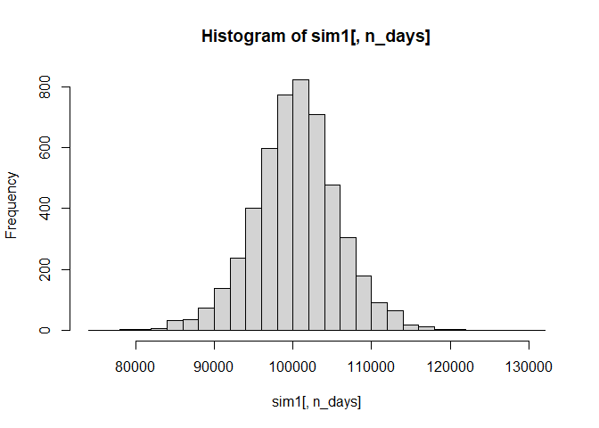
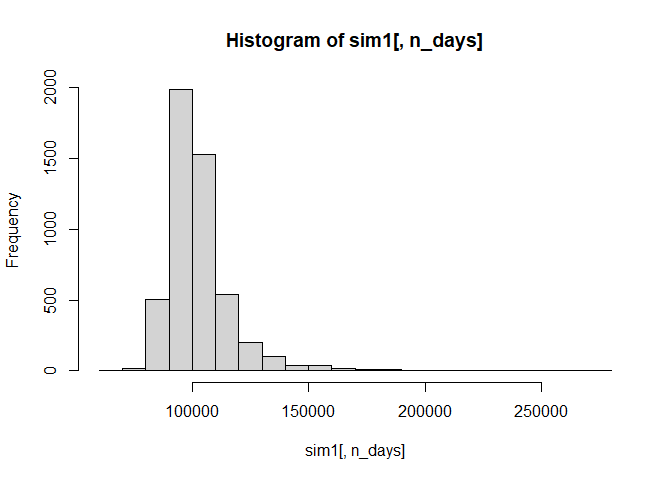
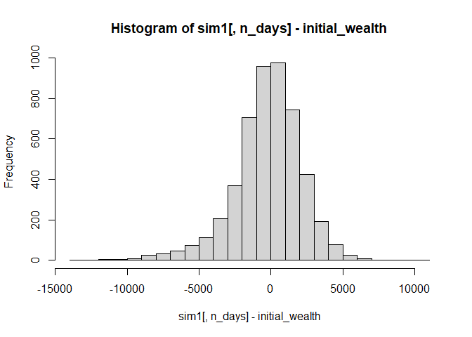
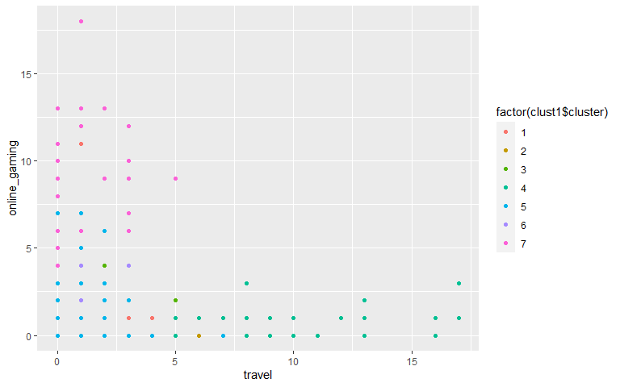
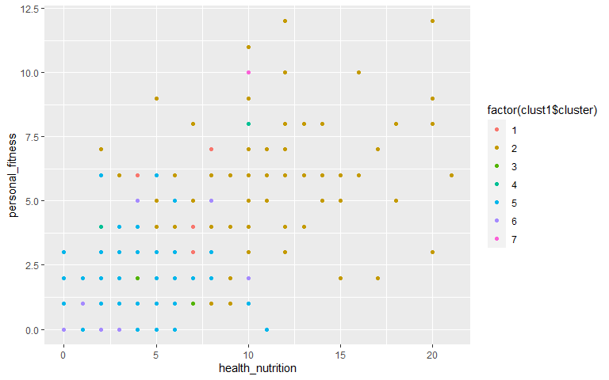

HW2
================
Shruti Kapur, Immanuel Ponminissery, Patricia Schutter, Dian Zhao
08/17/2020

    ## Loading required package: dplyr

    ## 
    ## Attaching package: 'dplyr'

    ## The following objects are masked from 'package:stats':
    ## 
    ##     filter, lag

    ## The following objects are masked from 'package:base':
    ## 
    ##     intersect, setdiff, setequal, union

    ## Loading required package: lattice

    ## Loading required package: ggformula

    ## Loading required package: ggplot2

    ## Loading required package: ggstance

    ## 
    ## Attaching package: 'ggstance'

    ## The following objects are masked from 'package:ggplot2':
    ## 
    ##     geom_errorbarh, GeomErrorbarh

    ## 
    ## New to ggformula?  Try the tutorials: 
    ##  learnr::run_tutorial("introduction", package = "ggformula")
    ##  learnr::run_tutorial("refining", package = "ggformula")

    ## Loading required package: mosaicData

    ## Loading required package: Matrix

    ## Registered S3 method overwritten by 'mosaic':
    ##   method                           from   
    ##   fortify.SpatialPolygonsDataFrame ggplot2

    ## 
    ## The 'mosaic' package masks several functions from core packages in order to add 
    ## additional features.  The original behavior of these functions should not be affected by this.
    ## 
    ## Note: If you use the Matrix package, be sure to load it BEFORE loading mosaic.
    ## 
    ## Have you tried the ggformula package for your plots?

    ## 
    ## Attaching package: 'mosaic'

    ## The following object is masked from 'package:Matrix':
    ## 
    ##     mean

    ## The following object is masked from 'package:ggplot2':
    ## 
    ##     stat

    ## The following objects are masked from 'package:dplyr':
    ## 
    ##     count, do, tally

    ## The following objects are masked from 'package:stats':
    ## 
    ##     binom.test, cor, cor.test, cov, fivenum, IQR, median, prop.test,
    ##     quantile, sd, t.test, var

    ## The following objects are masked from 'package:base':
    ## 
    ##     max, mean, min, prod, range, sample, sum

    ## -- Attaching packages ------------------------------------------------------------------------------ tidyverse 1.3.0 --

    ## v tibble  3.0.1     v purrr   0.3.4
    ## v tidyr   1.1.0     v stringr 1.4.0
    ## v readr   1.3.1     v forcats 0.5.0

    ## -- Conflicts --------------------------------------------------------------------------------- tidyverse_conflicts() --
    ## x mosaic::count()            masks dplyr::count()
    ## x purrr::cross()             masks mosaic::cross()
    ## x mosaic::do()               masks dplyr::do()
    ## x tidyr::expand()            masks Matrix::expand()
    ## x dplyr::filter()            masks stats::filter()
    ## x ggstance::geom_errorbarh() masks ggplot2::geom_errorbarh()
    ## x dplyr::lag()               masks stats::lag()
    ## x tidyr::pack()              masks Matrix::pack()
    ## x mosaic::stat()             masks ggplot2::stat()
    ## x mosaic::tally()            masks dplyr::tally()
    ## x tidyr::unpack()            masks Matrix::unpack()

    ## 
    ## Attaching package: 'scales'

    ## The following object is masked from 'package:purrr':
    ## 
    ##     discard

    ## The following object is masked from 'package:readr':
    ## 
    ##     col_factor

    ## The following object is masked from 'package:mosaic':
    ## 
    ##     rescale

# Problem 1

Basic information about our building: Total GFA: 250,000 sqft Storie: 15
Age: 0 Baseline Construction Cost per sqft: $400

The question we are trying to answer is whether buildings with green
certificates can commnad higher rent, with *everything else being
equal*. So the key is to use a comparable set of buildings data to
estimate rents for our building, both with and without green
certificates.

There are lots of factors that influence average rents. The stats guru
only accounted for leasing rate and outliers by getting rid of the
buildings with leasing\_rate \< 10% and use median rent instead of mean
rent. However, he did not account for other factors that may skew the
comparison between green buildings and non-green buildings.

For example, the following histogram shows that nearlly all of the green
buildings are less than 50 years but a significant amount of nongreen
buildings are more than 50 years old. Since newer buildings generally
charge higher rents, the rent differential between green and nongreen
buildings may be the result of the age of the building, and not
necessarily due to the green certificate.

``` r
ggplot(greenbuilding,aes(x=age)) + 
  geom_histogram(bins = 30,color="black", fill="white") +
  facet_wrap(~ green,nrow = 1)
```

<!-- -->

In addition, only one third of the nongreen buildings are class a
buildings whereas more than three quarters of green buildings are class
a building. Thus the higher rent charged by green buildings could also
be explained by building quality.

``` r
ggplot(greenbuilding) +
  geom_col(aes(x = 1, y = n, fill = class), position = "fill") +
  coord_polar(theta = "y") +
  facet_wrap(~ green) +
    theme_bw() +
    theme(axis.title = element_blank(),
          axis.text = element_blank(),
          axis.ticks = element_blank(),
          panel.grid.major = element_blank(),
          panel.grid.minor = element_blank(),
          panel.border = element_blank())
```

<!-- -->

Green buildings also tend to have better amenities.

``` r
ggplot(greenbuilding) +
  geom_col(aes(x = 1, y = n, fill = amenities), position = "fill") +
  coord_polar(theta = "y") +
  facet_wrap(~ green) +
    theme_bw() +
    theme(axis.title = element_blank(),
          axis.text = element_blank(),
          axis.ticks = element_blank(),
          panel.grid.major = element_blank(),
          panel.grid.minor = element_blank(),
          panel.border = element_blank()) +
  labs(
    caption = "Amenities = 1 means with amenities and 0 means without"
  )
```

<!-- -->

Lastly, we have to account for location. If green buildings are
generally built in areas with higher rent, then the rent differential
between green and nongreen buildings are not due to the green
certificate, but more likely due to location premium.

Thus, we have to compare rent differentials between buildings in the
same location. We first create a compare\_set that only include
buildings with leasing rate more than 10%, less than 50 years old, with
class a ratings and have amenities.

``` r
compare_set <- subset(greenbuilding, leasing_rate > 10 &
                      age < 50 & class_a == 1 & amenities == 1)
```

We then create two subsets for green and nongreen buildings. For each
subset, we calculate the median rent for each cluster. We then create a
separate data table with each cluster as one row and with three columns:
median rent for green buildings, median rent for nongreen buildings and
rent differentials between green and nongreen buildings.

``` r
green <- compare_set[compare_set$green_rating == 1, ]
nongreen <- compare_set[compare_set$green_rating == 0, ]

green_median = green %>%
  group_by(cluster) %>%
  summarize(median_rent = median(Rent))
```

    ## `summarise()` ungrouping output (override with `.groups` argument)

``` r
nongreen_median = nongreen %>%
  group_by(cluster) %>%
  summarize(median_rent = median(Rent))
```

    ## `summarise()` ungrouping output (override with `.groups` argument)

``` r
merged = merge(nongreen_median,green_median,by.x = 'cluster', by.y = 'cluster',suffixes  = c(".nongreen", ".green"))

merged$rent_diff = merged$median_rent.green-merged$median_rent.nongreen
```

The scatterplot shows that the rent differentials are equally spread
along the 0 line. The average rent differential is -0.123, suggesting
that green buildings do not in fact command a higher rent compared to
non green buildings.

``` r
ggplot(data = merged) + 
  geom_point(mapping = aes(x = cluster, y = rent_diff)) +
  geom_hline(aes(yintercept=0),
            color="blue", linetype="dashed", size=1) +
  annotate("text", x=20, y=20, color="red", label= paste('avg rent differential: ', mean(merged$rent_diff)),hjust=0) 
```

<!-- -->

In conclusion, our analysis shows that green certificates do not
generate rent premium. The higher rent charged by green buildings are
likely the result of other factors such as newer buildings and better
amenities. Thus, from a purely economic perspective, it is not advisable
to get green certified.

# Problem 2

The following is an analysis of Austin Bergstrom International Airport.
The data has been grouped in a way that shows optimal times for flying
in regards to month, day of week, time of day, and carrier in order to
avoid arrival and/or departure delays.

``` r
library(mosaic)
library(tidyverse)
library(ggplot2)

data1 <-"data/ABIA.csv"
ABIA = read.csv(data1)
#ABIA = read.csv('ABIA.csv')
head(ABIA)
```

    ##   Year Month DayofMonth DayOfWeek DepTime CRSDepTime ArrTime CRSArrTime
    ## 1 2008     1          1         2     120       1935     309       2130
    ## 2 2008     1          1         2     555        600     826        835
    ## 3 2008     1          1         2     600        600     728        729
    ## 4 2008     1          1         2     601        605     727        750
    ## 5 2008     1          1         2     601        600     654        700
    ## 6 2008     1          1         2     636        645     934        932
    ##   UniqueCarrier FlightNum TailNum ActualElapsedTime CRSElapsedTime AirTime
    ## 1            9E      5746  84129E               109            115      88
    ## 2            AA      1614  N438AA               151            155     133
    ## 3            YV      2883  N922FJ               148            149     125
    ## 4            9E      5743  89189E                86            105      70
    ## 5            AA      1157  N4XAAA                53             60      38
    ## 6            NW      1674   N967N               178            167     145
    ##   ArrDelay DepDelay Origin Dest Distance TaxiIn TaxiOut Cancelled
    ## 1      339      345    MEM  AUS      559      3      18         0
    ## 2       -9       -5    AUS  ORD      978      7      11         0
    ## 3       -1        0    AUS  PHX      872      7      16         0
    ## 4      -23       -4    AUS  MEM      559      4      12         0
    ## 5       -6        1    AUS  DFW      190      5      10         0
    ## 6        2       -9    AUS  MSP     1042     11      22         0
    ##   CancellationCode Diverted CarrierDelay WeatherDelay NASDelay SecurityDelay
    ## 1                         0          339            0        0             0
    ## 2                         0           NA           NA       NA            NA
    ## 3                         0           NA           NA       NA            NA
    ## 4                         0           NA           NA       NA            NA
    ## 5                         0           NA           NA       NA            NA
    ## 6                         0           NA           NA       NA            NA
    ##   LateAircraftDelay
    ## 1                 0
    ## 2                NA
    ## 3                NA
    ## 4                NA
    ## 5                NA
    ## 6                NA

``` r
# Delays vs. Month
plot(ABIA$Month, ABIA$ArrDelay, main = "Arrival Delays Occur Most in Dec. and March", xlab= "Month", ylab= "Arrival Delay")
```

<!-- --> This is
showing the arrival delays per month. From this, it appears that most
arrival delays occur in December and March.

``` r
plot(ABIA$Month, ABIA$DepDelay, main = "Departure Delay Occur Most in March and August", xlab= "Month", ylab= "Departure Delay")
```

<!-- --> To compare
arrival delays with depature delays, departure delays were aslo ran
against months. Departure delays occur most in March and August. As
March was present in both results, March seems to be full of delays of
both kinds.

``` r
# Delays vs. Day of Week
plot(ABIA$DayOfWeek, ABIA$ArrDelay, main = "Tuesday Has Lowest Arrival Delay", xlab= "Day of Week", ylab= "Arrival Delay")
```

<!-- -->

``` r
plot(ABIA$DayOfWeek, ABIA$DepDelay, main = "Tuesday Has Lowest Departure Delay", xlab= "Day of Week", ylab= "Departure Delay")
```

<!-- --> These are a
couple plots that represent what day is best to fly on in order to avoid
delays. Tuesday was found as the best day to fly in order to avoid
delays.

``` r
# Departure Time vs. Delay
ggplot(data = ABIA) + 
  geom_point(mapping = aes(x = DepTime, y = DepDelay)) +
  ggtitle("Later Departure Flights Have Higher Delays")
```

    ## Warning: Removed 1413 rows containing missing values (geom_point).

<!-- -->

``` r
# Arrival Time vs. Delay
ggplot(data = ABIA) + 
  geom_point(mapping = aes(x = ArrTime, y = ArrDelay)) +
  ggtitle("      Arrival Delays Greatest At Night")
```

    ## Warning: Removed 1601 rows containing missing values (geom_point).

<!-- --> Now that
month and day have been narrowed down, the next step was to narrow down
a time to fly. From these plots, it appears that mornings are best to
fly. However this does not mean morning as in midnight, but rather
around 5AM. The increase around midnight is rollover from the high level
of delays as it gets later in the night.

``` r
################################################

# Departure Delay vs. Distance
ggplot(data = ABIA) + 
  geom_point(mapping = aes(x = DepDelay, y = Distance, color = Distance)) + 
  ggtitle("Departure Delay Greatest For Small and Large Distances")
```

    ## Warning: Removed 1413 rows containing missing values (geom_point).

<!-- -->

``` r
# Arrival Delay vs. Distance
ggplot(data = ABIA) + 
  geom_point(mapping = aes(x = ArrDelay, y = Distance, color = Distance)) + 
  ggtitle("Arrival Delay Greatest For Small and Large Distances")
```

    ## Warning: Removed 1601 rows containing missing values (geom_point).

<!-- --> Next, I
wanted to see whether distance was a factor in delays. From these plots,
we can see that delays are greatest both on the extremes. This makes
sense as shorter flights don’t have enough distance to make up for lost
time and long distances tend to require more preparations.

``` r
# Arrival Delay vs. Carrier
ggplot(data = ABIA) + 
  geom_point(mapping = aes(x = ArrDelay, y = UniqueCarrier, color = UniqueCarrier)) + 
  ggtitle("Arrival Delay Greatest Among JetBlue and SouthWest")
```

    ## Warning: Removed 1601 rows containing missing values (geom_point).

<!-- -->

``` r
# Departure Delay vs. Carrier
ggplot(data = ABIA) + 
  geom_point(mapping = aes(x = DepDelay, y = UniqueCarrier, color = UniqueCarrier)) + 
  ggtitle("Departure Delay Greatest Among JetBlue")
```

    ## Warning: Removed 1413 rows containing missing values (geom_point).

<!-- --> These plots
are testing whether a specific carrier tends to have more delays than
others. Both Jetblue and SouthWest tend to have the most arrival delays,
while JetBlue also seems to have the greatest departure delays. To avoid
delays, one might want to fly with someone other than JetBlue.

``` r
###
# facets
###

#####################################################################
# Departure Delay vs. Day of Week vs. Month
ggplot(data = ABIA) + 
  geom_point(mapping = aes(x = DepDelay, y = DayOfWeek)) + 
  facet_wrap(~ Month, nrow = 2) +
  ggtitle("What Day to Fly, Per Month to Avoid Departure Delays")
```

    ## Warning: Removed 1413 rows containing missing values (geom_point).

<!-- -->

``` r
# Arrival Delay vs. Day of Week vs. Month
ggplot(data = ABIA) + 
  geom_point(mapping = aes(x = ArrDelay, y = DayOfWeek)) + 
  facet_wrap(~ Month, nrow = 2) +
  ggtitle("What Day to Fly, Per Month to Avoid Arrival Delays")
```

    ## Warning: Removed 1601 rows containing missing values (geom_point).

<!-- -->

``` r
###################################################################33
```

In preparation for your next flight, you might want to know what a
certain day looks like on the particular month you need to travel. These
two plots will point you in the right direction, where you will first be
able to look at the month that you are flying and then find the smallest
line, indicating that is the day with the fewest delays during that
month.

# Problem 3

``` r
library(mosaic)
library(quantmod)
```

    ## Loading required package: xts

    ## Loading required package: zoo

    ## 
    ## Attaching package: 'zoo'

    ## The following objects are masked from 'package:base':
    ## 
    ##     as.Date, as.Date.numeric

    ## 
    ## Attaching package: 'xts'

    ## The following objects are masked from 'package:dplyr':
    ## 
    ##     first, last

    ## Loading required package: TTR

    ## Registered S3 method overwritten by 'quantmod':
    ##   method            from
    ##   as.zoo.data.frame zoo

    ## Version 0.4-0 included new data defaults. See ?getSymbols.

``` r
library(foreach)
```

    ## 
    ## Attaching package: 'foreach'

    ## The following objects are masked from 'package:purrr':
    ## 
    ##     accumulate, when

``` r
#### Possibility 1
#### XLE is an energy ETF, XLI is an industrial ETF, XLP is a consumer staples ETF
#### This is a homogeneous portfolio

mystocks = c("XLE", "XLI", "XLP")
myprices = getSymbols(mystocks, from = "2014-01-01")
```

    ## 'getSymbols' currently uses auto.assign=TRUE by default, but will
    ## use auto.assign=FALSE in 0.5-0. You will still be able to use
    ## 'loadSymbols' to automatically load data. getOption("getSymbols.env")
    ## and getOption("getSymbols.auto.assign") will still be checked for
    ## alternate defaults.
    ## 
    ## This message is shown once per session and may be disabled by setting 
    ## options("getSymbols.warning4.0"=FALSE). See ?getSymbols for details.

``` r
#### Adjusting Stocks
for(ticker in mystocks) {
  expr = paste0(ticker, "a = adjustOHLC(", ticker, ")")
  eval(parse(text=expr))
}
```

    ## Warning in read.table(file = file, header = header, sep = sep,
    ## quote = quote, : incomplete final line found by readTableHeader
    ## on 'https://query2.finance.yahoo.com/v7/finance/download/XLE?
    ## period1=-2208988800&period2=1597708800&interval=1d&events=split&crumb=YJOwhJklOH8'

    ## Warning in read.table(file = file, header = header, sep = sep,
    ## quote = quote, : incomplete final line found by readTableHeader
    ## on 'https://query1.finance.yahoo.com/v7/finance/download/XLE?
    ## period1=-2208988800&period2=1597708800&interval=1d&events=split&crumb=YJOwhJklOH8'

    ## Warning in read.table(file = file, header = header, sep = sep,
    ## quote = quote, : incomplete final line found by readTableHeader
    ## on 'https://query1.finance.yahoo.com/v7/finance/download/XLI?
    ## period1=-2208988800&period2=1597708800&interval=1d&events=split&crumb=YJOwhJklOH8'

    ## Warning in read.table(file = file, header = header, sep = sep,
    ## quote = quote, : incomplete final line found by readTableHeader
    ## on 'https://query2.finance.yahoo.com/v7/finance/download/XLI?
    ## period1=-2208988800&period2=1597708800&interval=1d&events=split&crumb=YJOwhJklOH8'

    ## Warning in read.table(file = file, header = header, sep = sep,
    ## quote = quote, : incomplete final line found by readTableHeader
    ## on 'https://query1.finance.yahoo.com/v7/finance/download/XLP?
    ## period1=-2208988800&period2=1597708800&interval=1d&events=split&crumb=YJOwhJklOH8'

    ## Warning in read.table(file = file, header = header, sep = sep,
    ## quote = quote, : incomplete final line found by readTableHeader
    ## on 'https://query2.finance.yahoo.com/v7/finance/download/XLP?
    ## period1=-2208988800&period2=1597708800&interval=1d&events=split&crumb=YJOwhJklOH8'

``` r
# Combine all the returns in a matrix
all_returns = cbind(    ClCl(XLEa),
                     ClCl(XLIa),
                     ClCl(XLPa))
all_returns = as.matrix(na.omit(all_returns))

# Compute the returns from the closing prices
pairs(all_returns)
```

<!-- -->

``` r
# Sample a random return from the empirical joint distribution
return.today = resample(all_returns, 1, orig.ids=FALSE)

# Update the value of your holdings, assuming equal allocation
total_wealth = 100000
my_weights = c(0.34,0.33,0.33)
holdings = total_wealth*my_weights
holdings = holdings*(1 + return.today)

# Compute new total wealth
holdings
```

    ##            ClCl.XLEa ClCl.XLIa ClCl.XLPa
    ## 2018-09-11  34322.39  32991.54  32879.03

``` r
total_wealth = sum(holdings)
total_wealth
```

    ## [1] 100193

``` r
# Now simulate many different possible futures
initial_wealth = 100000
sim1 = foreach(i=1:5000, .combine='rbind') %do% {
  total_wealth = initial_wealth
  weights = c(0.34,0.33,0.33)
  holdings = weights * total_wealth
  n_days = 20
  wealthtracker = rep(0, n_days)
  for(today in 1:n_days) {
    return.today = resample(all_returns, 1, orig.ids=FALSE)
    holdings = holdings + holdings*return.today
    total_wealth = sum(holdings)
    wealthtracker[today] = total_wealth
  }
  wealthtracker
}

# each row is a simulated trajectory
# each column is a data
head(sim1)
```

    ##               [,1]      [,2]      [,3]      [,4]      [,5]      [,6]      [,7]
    ## result.1 105313.40 106193.43 106412.77 106800.24 107688.16 107846.30 109300.22
    ## result.2  99722.41  99780.44  99924.73  99528.57  99200.19 101559.54 102088.58
    ## result.3 100723.37 101272.25 101084.51 101347.74 101417.21 100504.73 100333.31
    ## result.4 100056.94 108586.71 109185.69 107017.46 106806.97 105871.20 105686.42
    ## result.5  99601.66 100149.08 102247.63 103502.24 103889.21 103931.19 105852.47
    ## result.6 100269.18 100764.78 101041.68 100764.78 100874.00  98266.15  98687.55
    ##               [,8]      [,9]     [,10]     [,11]     [,12]     [,13]     [,14]
    ## result.1 110168.23 109376.07 108938.36 108360.59 105974.50 104370.19 103635.10
    ## result.2 102169.91 100447.32 100915.44 103089.93 103843.30 104362.19 104465.24
    ## result.3  99856.16 100288.15  99156.63  98926.48  98693.72  96377.04  96522.01
    ## result.4 105839.14 106911.52 106067.74 106805.77 107522.40 105450.55 105474.25
    ## result.5 106142.38 105734.91 105558.08 105721.78 104949.09 107154.93 107437.34
    ## result.6  99510.22  99680.66 100644.88  99568.36  99477.84  99022.62  99798.15
    ##              [,15]     [,16]     [,17]     [,18]     [,19]     [,20]
    ## result.1 103535.87 103922.86 104365.26 105090.94 105540.79 106730.58
    ## result.2 103963.43 104178.78 102567.97 104230.08 104449.83 105250.10
    ## result.3  96259.44  96589.85  96731.19  97101.20  97192.37  97189.16
    ## result.4 105434.55 101992.83 101178.92 101889.98 102185.08 103414.77
    ## result.5 107724.83 107152.67 107255.37 106982.00 106405.68 105629.47
    ## result.6 100433.60  99886.42  98386.87  97921.91  96897.47  96575.05

``` r
hist(sim1[,n_days], 25)
```

<!-- -->

``` r
# Profit/loss
mean(sim1[,n_days])
```

    ## [1] 100414

``` r
mean(sim1[,n_days] - initial_wealth)
```

    ## [1] 413.9872

``` r
hist(sim1[,n_days]- initial_wealth, breaks=30)
```

<!-- -->

``` r
# 5% value at risk:
quantile(sim1[,n_days]- initial_wealth, prob=0.05)
```

    ##        5% 
    ## -8582.143

Portfolio 1 is a small and homogeneous portfolio containng : XLE - an
energy ETF, XLI - an industrial ETF, XXP - a consumer staples ETF. We
see a nearly normal distribution, with the returns skewed slightly
towards the negative side.

``` r
#### Possibility 2
#### VWO is an Asia Pacific ETF, GCX is a China ETF, EZU is an Europe ETF, EWJ is a Japan ETF, EWZ is a latin America ETF
#### This is a globally hedged portfolio

mystocks = c("VWO", "GCX", "EZU", "EWJ", "EWZ")
myprices = getSymbols(mystocks, from = "2014-01-01")
```

    ## Warning: GCX contains missing values. Some functions will not work if objects
    ## contain missing values in the middle of the series. Consider using na.omit(),
    ## na.approx(), na.fill(), etc to remove or replace them.

``` r
#### Adjusting Stocks
for(ticker in mystocks) {
  expr = paste0(ticker, "a = adjustOHLC(", ticker, ")")
  eval(parse(text=expr))
}
```

    ## Warning in read.table(file = file, header = header, sep = sep,
    ## quote = quote, : incomplete final line found by readTableHeader
    ## on 'https://query2.finance.yahoo.com/v7/finance/download/VWO?
    ## period1=-2208988800&period2=1597708800&interval=1d&events=split&crumb=YJOwhJklOH8'

    ## Warning in read.table(file = file, header = header, sep = sep,
    ## quote = quote, : incomplete final line found by readTableHeader
    ## on 'https://query1.finance.yahoo.com/v7/finance/download/VWO?
    ## period1=-2208988800&period2=1597708800&interval=1d&events=split&crumb=YJOwhJklOH8'

    ## Warning in read.table(file = file, header = header, sep = sep,
    ## quote = quote, : incomplete final line found by readTableHeader
    ## on 'https://query1.finance.yahoo.com/v7/finance/download/GCX?
    ## period1=-2208988800&period2=1597708800&interval=1d&events=div&crumb=YJOwhJklOH8'

    ## Warning in read.table(file = file, header = header, sep = sep,
    ## quote = quote, : incomplete final line found by readTableHeader
    ## on 'https://query2.finance.yahoo.com/v7/finance/download/GCX?
    ## period1=-2208988800&period2=1597708800&interval=1d&events=split&crumb=YJOwhJklOH8'

    ## Warning in read.table(file = file, header = header, sep = sep,
    ## quote = quote, : incomplete final line found by readTableHeader
    ## on 'https://query1.finance.yahoo.com/v7/finance/download/GCX?
    ## period1=-2208988800&period2=1597708800&interval=1d&events=split&crumb=YJOwhJklOH8'

    ## Warning in read.table(file = file, header = header, sep = sep,
    ## quote = quote, : incomplete final line found by readTableHeader
    ## on 'https://query2.finance.yahoo.com/v7/finance/download/EZU?
    ## period1=-2208988800&period2=1597708800&interval=1d&events=split&crumb=YJOwhJklOH8'
    
    ## Warning in read.table(file = file, header = header, sep = sep,
    ## quote = quote, : incomplete final line found by readTableHeader
    ## on 'https://query2.finance.yahoo.com/v7/finance/download/EZU?
    ## period1=-2208988800&period2=1597708800&interval=1d&events=split&crumb=YJOwhJklOH8'

    ## Warning in read.table(file = file, header = header, sep = sep,
    ## quote = quote, : incomplete final line found by readTableHeader
    ## on 'https://query2.finance.yahoo.com/v7/finance/download/EWJ?
    ## period1=-2208988800&period2=1597708800&interval=1d&events=split&crumb=YJOwhJklOH8'
    
    ## Warning in read.table(file = file, header = header, sep = sep,
    ## quote = quote, : incomplete final line found by readTableHeader
    ## on 'https://query2.finance.yahoo.com/v7/finance/download/EWJ?
    ## period1=-2208988800&period2=1597708800&interval=1d&events=split&crumb=YJOwhJklOH8'

    ## Warning in read.table(file = file, header = header, sep = sep,
    ## quote = quote, : incomplete final line found by readTableHeader
    ## on 'https://query1.finance.yahoo.com/v7/finance/download/EWZ?
    ## period1=-2208988800&period2=1597708800&interval=1d&events=split&crumb=YJOwhJklOH8'

    ## Warning in read.table(file = file, header = header, sep = sep,
    ## quote = quote, : incomplete final line found by readTableHeader
    ## on 'https://query2.finance.yahoo.com/v7/finance/download/EWZ?
    ## period1=-2208988800&period2=1597708800&interval=1d&events=split&crumb=YJOwhJklOH8'

``` r
# Combine all the returns in a matrix
all_returns = cbind(    ClCl(VWOa),
                     ClCl(GCXa),
                     ClCl(EZUa),
                     ClCl(EWJa),
                     ClCl(EWZa))
all_returns = as.matrix(na.omit(all_returns))

# Compute the returns from the closing prices
pairs(all_returns)
```

<!-- -->

``` r
# Sample a random return from the empirical joint distribution
return.today = resample(all_returns, 1, orig.ids=FALSE)

# Update the value of your holdings, assuming equal allocation
total_wealth = 100000
my_weights = c(0.2,0.2,0.2,0.2,0.2)
holdings = total_wealth*my_weights
holdings = holdings*(1 + return.today)

# Compute new total wealth
holdings
```

    ##            ClCl.VWOa ClCl.GCXa ClCl.EZUa ClCl.EWJa ClCl.EWZa
    ## 2017-01-09  19967.33     20000  19943.07  20019.82  19994.26

``` r
total_wealth = sum(holdings)
total_wealth
```

    ## [1] 99924.47

``` r
# Now simulate many different possible futures
initial_wealth = 100000
sim1 = foreach(i=1:5000, .combine='rbind') %do% {
  total_wealth = initial_wealth
  weights = c(0.2,0.2,0.2,0.2,0.2)
  holdings = weights * total_wealth
  n_days = 20
  wealthtracker = rep(0, n_days)
  for(today in 1:n_days) {
    return.today = resample(all_returns, 1, orig.ids=FALSE)
    holdings = holdings + holdings*return.today
    total_wealth = sum(holdings)
    wealthtracker[today] = total_wealth
  }
  wealthtracker
}

# each row is a simulated trajectory
# each column is a data
head(sim1)
```

    ##               [,1]      [,2]      [,3]      [,4]      [,5]      [,6]      [,7]
    ## result.1 100168.29 100774.12 102234.07 102929.61 101592.58 102053.21 102157.44
    ## result.2 100811.17 100344.58 100550.82 100755.51  95550.62  95289.20  95678.35
    ## result.3 100452.94 100542.64 100357.45 101246.10 102180.69 105170.46 104258.77
    ## result.4  99819.04 100317.22 101000.80 100251.79  99722.30  98018.66  97986.69
    ## result.5  99414.75  99343.49  99275.05  98891.88  99555.87 100032.99  99355.47
    ## result.6  99681.04  98985.94 100288.53 101065.41 101091.04 101593.99 101389.33
    ##               [,8]      [,9]     [,10]     [,11]    [,12]     [,13]     [,14]
    ## result.1 102858.20 103364.80  96549.38  92607.10 93556.04  92445.43  91653.73
    ## result.2  95728.41  95013.90  96483.99  95834.51 94594.08  93957.59  91527.28
    ## result.3 103261.03 104154.38 102824.71 101653.78 99873.60 107033.74 107888.84
    ## result.4  95694.88  95437.86  95189.11  96295.69 96156.83  96241.74  95661.31
    ## result.5  99170.81  92833.77  92670.13  92202.16 91825.73  92126.53  93525.72
    ## result.6 102089.84  95120.41  96009.92  95602.81 98050.14  98384.23  97488.00
    ##              [,15]     [,16]     [,17]     [,18]     [,19]     [,20]
    ## result.1  91754.66  92709.39  92062.51  90668.96  90963.73  91033.07
    ## result.2  90347.89  91369.75  91103.79  90813.42  91748.34  91465.54
    ## result.3 109625.08 109643.86 108950.11 109119.70 109453.77 109883.82
    ## result.4  95056.13  82288.30  81849.96  82352.38  82550.97  82894.25
    ## result.5  93876.46  95308.86  94928.37  94474.64  94681.72  94696.20
    ## result.6  96872.28 104538.21 104283.97 103870.43 101210.23 101893.42

``` r
hist(sim1[,n_days], 25)
```

<!-- -->

``` r
# Profit/loss
mean(sim1[,n_days])
```

    ## [1] 102784.8

``` r
mean(sim1[,n_days] - initial_wealth)
```

    ## [1] 2784.819

``` r
hist(sim1[,n_days]- initial_wealth, breaks=30)
```

<!-- -->

``` r
# 5% value at risk:
quantile(sim1[,n_days]- initial_wealth, prob=0.05)
```

    ##        5% 
    ## -12958.92

Portfolio 2 is a globally hedged portfolio, with holdings across
geographies. VWO is an Asia Pacific ETF, GCX is a China ETF, EZU is an
Europe ETF, EWJ is a Japan ETF, EWZ is a latin America ETF. We see the
simulation giving us a positively skewed return over time. This is
logical, given the geographic hedging. However, it is worthwhile to note
that the frequency is highest for the 0 to slightly negative bin (almost
-10,000).

``` r
#### Possibility 3
#### SPY is a large cap growth ETF, SHY is a short treasury bond ETF, MBB is a mortgage backed security ETF,
#### USO is an oil and gas commodity ETF, DBB is a metals commodity ETF, DBA is an agriculture commodity ETF,
#### VNQ is a real estate ETF, SH is an inverse equities ETF, EUO is a leveraged currencies ETF, FGD is a global equities ETF
#### This is an aggresive portfolio with an inverse ETF as a hedge

mystocks = c("SPY", "SHY", "MBB", "USO", "DBB", "DBA", "VNQ", "SH", "EUO", "FGD")
myprices = getSymbols(mystocks, from = "2014-01-01")
```

    ## pausing 1 second between requests for more than 5 symbols
    ## pausing 1 second between requests for more than 5 symbols
    ## pausing 1 second between requests for more than 5 symbols
    ## pausing 1 second between requests for more than 5 symbols
    ## pausing 1 second between requests for more than 5 symbols
    ## pausing 1 second between requests for more than 5 symbols

``` r
#### Adjusting Stocks
for(ticker in mystocks) {
  expr = paste0(ticker, "a = adjustOHLC(", ticker, ")")
  eval(parse(text=expr))
}
```

    ## Warning in read.table(file = file, header = header, sep = sep,
    ## quote = quote, : incomplete final line found by readTableHeader
    ## on 'https://query1.finance.yahoo.com/v7/finance/download/SPY?
    ## period1=-2208988800&period2=1597708800&interval=1d&events=split&crumb=YJOwhJklOH8'

    ## Warning in read.table(file = file, header = header, sep = sep,
    ## quote = quote, : incomplete final line found by readTableHeader
    ## on 'https://query2.finance.yahoo.com/v7/finance/download/SPY?
    ## period1=-2208988800&period2=1597708800&interval=1d&events=split&crumb=YJOwhJklOH8'

    ## Warning in read.table(file = file, header = header, sep = sep,
    ## quote = quote, : incomplete final line found by readTableHeader
    ## on 'https://query1.finance.yahoo.com/v7/finance/download/SHY?
    ## period1=-2208988800&period2=1597708800&interval=1d&events=split&crumb=YJOwhJklOH8'

    ## Warning in read.table(file = file, header = header, sep = sep,
    ## quote = quote, : incomplete final line found by readTableHeader
    ## on 'https://query2.finance.yahoo.com/v7/finance/download/SHY?
    ## period1=-2208988800&period2=1597708800&interval=1d&events=split&crumb=YJOwhJklOH8'

    ## Warning in read.table(file = file, header = header, sep = sep,
    ## quote = quote, : incomplete final line found by readTableHeader
    ## on 'https://query1.finance.yahoo.com/v7/finance/download/MBB?
    ## period1=-2208988800&period2=1597708800&interval=1d&events=split&crumb=YJOwhJklOH8'

    ## Warning in read.table(file = file, header = header, sep = sep,
    ## quote = quote, : incomplete final line found by readTableHeader
    ## on 'https://query2.finance.yahoo.com/v7/finance/download/MBB?
    ## period1=-2208988800&period2=1597708800&interval=1d&events=split&crumb=YJOwhJklOH8'

    ## Warning in read.table(file = file, header = header, sep = sep,
    ## quote = quote, : incomplete final line found by readTableHeader
    ## on 'https://query1.finance.yahoo.com/v7/finance/download/USO?
    ## period1=-2208988800&period2=1597708800&interval=1d&events=div&crumb=YJOwhJklOH8'

    ## Warning in read.table(file = file, header = header, sep = sep,
    ## quote = quote, : incomplete final line found by readTableHeader
    ## on 'https://query1.finance.yahoo.com/v7/finance/download/USO?
    ## period1=-2208988800&period2=1597708800&interval=1d&events=split&crumb=YJOwhJklOH8'

    ## Warning in read.table(file = file, header = header, sep = sep,
    ## quote = quote, : incomplete final line found by readTableHeader
    ## on 'https://query2.finance.yahoo.com/v7/finance/download/USO?
    ## period1=-2208988800&period2=1597708800&interval=1d&events=split&crumb=YJOwhJklOH8'

    ## Warning in read.table(file = file, header = header, sep = sep,
    ## quote = quote, : incomplete final line found by readTableHeader
    ## on 'https://query1.finance.yahoo.com/v7/finance/download/DBB?
    ## period1=-2208988800&period2=1597708800&interval=1d&events=div&crumb=YJOwhJklOH8'

    ## Warning in read.table(file = file, header = header, sep = sep,
    ## quote = quote, : incomplete final line found by readTableHeader
    ## on 'https://query1.finance.yahoo.com/v7/finance/download/DBB?
    ## period1=-2208988800&period2=1597708800&interval=1d&events=split&crumb=YJOwhJklOH8'

    ## Warning in read.table(file = file, header = header, sep = sep,
    ## quote = quote, : incomplete final line found by readTableHeader
    ## on 'https://query2.finance.yahoo.com/v7/finance/download/DBB?
    ## period1=-2208988800&period2=1597708800&interval=1d&events=split&crumb=YJOwhJklOH8'

    ## Warning in read.table(file = file, header = header, sep = sep,
    ## quote = quote, : incomplete final line found by readTableHeader
    ## on 'https://query1.finance.yahoo.com/v7/finance/download/DBA?
    ## period1=-2208988800&period2=1597708800&interval=1d&events=div&crumb=YJOwhJklOH8'

    ## Warning in read.table(file = file, header = header, sep = sep,
    ## quote = quote, : incomplete final line found by readTableHeader
    ## on 'https://query1.finance.yahoo.com/v7/finance/download/DBA?
    ## period1=-2208988800&period2=1597708800&interval=1d&events=split&crumb=YJOwhJklOH8'

    ## Warning in read.table(file = file, header = header, sep = sep,
    ## quote = quote, : incomplete final line found by readTableHeader
    ## on 'https://query2.finance.yahoo.com/v7/finance/download/DBA?
    ## period1=-2208988800&period2=1597708800&interval=1d&events=split&crumb=YJOwhJklOH8'

    ## Warning in read.table(file = file, header = header, sep = sep,
    ## quote = quote, : incomplete final line found by readTableHeader
    ## on 'https://query1.finance.yahoo.com/v7/finance/download/VNQ?
    ## period1=-2208988800&period2=1597708800&interval=1d&events=split&crumb=YJOwhJklOH8'

    ## Warning in read.table(file = file, header = header, sep = sep,
    ## quote = quote, : incomplete final line found by readTableHeader
    ## on 'https://query2.finance.yahoo.com/v7/finance/download/VNQ?
    ## period1=-2208988800&period2=1597708800&interval=1d&events=split&crumb=YJOwhJklOH8'

    ## Warning in read.table(file = file, header = header, sep = sep,
    ## quote = quote, : incomplete final line found by readTableHeader
    ## on 'https://query1.finance.yahoo.com/v7/finance/download/SH?
    ## period1=-2208988800&period2=1597708800&interval=1d&events=split&crumb=YJOwhJklOH8'

    ## Warning in read.table(file = file, header = header, sep = sep,
    ## quote = quote, : incomplete final line found by readTableHeader
    ## on 'https://query2.finance.yahoo.com/v7/finance/download/SH?
    ## period1=-2208988800&period2=1597708800&interval=1d&events=split&crumb=YJOwhJklOH8'

    ## Warning in read.table(file = file, header = header, sep = sep,
    ## quote = quote, : incomplete final line found by readTableHeader
    ## on 'https://query2.finance.yahoo.com/v7/finance/download/EUO?
    ## period1=-2208988800&period2=1597708800&interval=1d&events=div&crumb=YJOwhJklOH8'

    ## Warning in read.table(file = file, header = header, sep = sep,
    ## quote = quote, : incomplete final line found by readTableHeader
    ## on 'https://query1.finance.yahoo.com/v7/finance/download/EUO?
    ## period1=-2208988800&period2=1597708800&interval=1d&events=split&crumb=YJOwhJklOH8'
    
    ## Warning in read.table(file = file, header = header, sep = sep,
    ## quote = quote, : incomplete final line found by readTableHeader
    ## on 'https://query1.finance.yahoo.com/v7/finance/download/EUO?
    ## period1=-2208988800&period2=1597708800&interval=1d&events=split&crumb=YJOwhJklOH8'

    ## Warning in read.table(file = file, header = header, sep = sep,
    ## quote = quote, : incomplete final line found by readTableHeader
    ## on 'https://query2.finance.yahoo.com/v7/finance/download/FGD?
    ## period1=-2208988800&period2=1597708800&interval=1d&events=split&crumb=YJOwhJklOH8'

    ## Warning in read.table(file = file, header = header, sep = sep,
    ## quote = quote, : incomplete final line found by readTableHeader
    ## on 'https://query1.finance.yahoo.com/v7/finance/download/FGD?
    ## period1=-2208988800&period2=1597708800&interval=1d&events=split&crumb=YJOwhJklOH8'

``` r
# Combine all the returns in a matrix
all_returns = cbind(    ClCl(SPYa),
                     ClCl(SHYa),
                     ClCl(MBBa),
                     ClCl(USOa),
                     ClCl(DBBa),
                     ClCl(DBAa),
                     ClCl(VNQa),
                     ClCl(SHa),
                     ClCl(EUOa),
                     ClCl(FGDa))
all_returns = as.matrix(na.omit(all_returns))

# Compute the returns from the closing prices
pairs(all_returns)
```

<!-- -->

``` r
# Sample a random return from the empirical joint distribution
return.today = resample(all_returns, 1, orig.ids=FALSE)

# Update the value of your holdings, assuming equal allocation
total_wealth = 100000
my_weights = c(0.1,0.1,0.1,0.1,0.1,0.1,0.1,0.1,0.1,0.1)
holdings = total_wealth*my_weights
holdings = holdings*(1 + return.today)

# Compute new total wealth
holdings
```

    ##            ClCl.SPYa ClCl.SHYa ClCl.MBBa ClCl.USOa ClCl.DBBa ClCl.DBAa
    ## 2015-07-24   9896.28  10002.36  10001.83  9931.847  10029.18  9845.735
    ##            ClCl.VNQa ClCl.SHa ClCl.EUOa ClCl.FGDa
    ## 2015-07-24  10042.45 10100.58  10027.57  9892.517

``` r
total_wealth = sum(holdings)
total_wealth
```

    ## [1] 99770.34

``` r
# Now simulate many different possible futures
initial_wealth = 100000
sim1 = foreach(i=1:5000, .combine='rbind') %do% {
  total_wealth = initial_wealth
  weights = c(0.1,0.1,0.1,0.1,0.1,0.1,0.1,0.1,0.1,0.1)
  holdings = weights * total_wealth
  n_days = 20
  wealthtracker = rep(0, n_days)
  for(today in 1:n_days) {
    return.today = resample(all_returns, 1, orig.ids=FALSE)
    holdings = holdings + holdings*return.today
    total_wealth = sum(holdings)
    wealthtracker[today] = total_wealth
  }
  wealthtracker
}

# each row is a simulated trajectory
# each column is a data
head(sim1)
```

    ##               [,1]      [,2]      [,3]      [,4]      [,5]      [,6]      [,7]
    ## result.1 100786.85 100052.92 100075.28  99748.37  99049.43  98931.73  99001.04
    ## result.2  99968.27 100689.94 100855.00 101658.17 102147.11 101722.37 102005.19
    ## result.3 100134.44 100060.79 100149.50  99429.16  99666.78  99389.00 100165.00
    ## result.4 100229.43  99815.10  99773.72  99931.03  99629.31  99666.02  99570.72
    ## result.5  99736.85  99332.63  99009.19  99056.97  99342.20  99004.28  98425.77
    ## result.6 100208.49 100208.66 100238.39 100386.65 100264.20  99873.06  99787.47
    ##               [,8]      [,9]     [,10]     [,11]     [,12]     [,13]     [,14]
    ## result.1  98600.16  98790.15  98872.91  98828.39  98806.94  98569.39  99617.74
    ## result.2 101851.97 101751.64 100399.63 100244.26 100666.42 100589.52 100660.84
    ## result.3 100643.97 100722.49 100840.24 100383.57  99975.11 100130.89 100095.04
    ## result.4  99734.85  99976.63 100026.12 100350.49  99684.58  99901.27  99767.51
    ## result.5  99464.26  99556.20 100067.59 100043.60  99993.81  99709.86  99983.55
    ## result.6  99672.22  99944.99  99878.20 100515.64 100675.61 100846.34 100750.33
    ##              [,15]     [,16]     [,17]    [,18]     [,19]     [,20]
    ## result.1  99455.28 100740.59 100680.35 100626.0 100511.26 100610.12
    ## result.2  99744.21 100384.70 100503.85 100670.9  99776.97  99897.42
    ## result.3  99786.55 102227.83 102316.77 102973.5 103025.62 103375.86
    ## result.4  99484.81  99938.21  99742.15 100074.2 100352.34  99963.22
    ## result.5 100009.96 100241.30 100378.82 100896.6 101068.26 101554.19
    ## result.6 100224.76 101240.99 101279.34 102187.1 102378.84 102255.81

``` r
hist(sim1[,n_days], 25)
```

<!-- -->

``` r
# Profit/loss
mean(sim1[,n_days])
```

    ## [1] 99772.92

``` r
mean(sim1[,n_days] - initial_wealth)
```

    ## [1] -227.0793

``` r
hist(sim1[,n_days]- initial_wealth, breaks=30)
```

<!-- -->

``` r
# 5% value at risk:
quantile(sim1[,n_days]- initial_wealth, prob=0.05)
```

    ##        5% 
    ## -4425.311

This is an aggressive portolio with multiple ETF’s across bonds, large
caps, mid caps, commodities, inverse equities, leveraged currencies and
global equities. SPY is a large cap growth ETF, SHY is a short treasury
bond ETF, MBB is a mortgage backed security ETF, USO is an oil and gas
commodity ETF, DBB is a metals commodity ETF, DBA is an agriculture
commodity ETF, VNQ is a real estate ETF, SH is an inverse equities ETF,
EUO is a leveraged currencies ETF, FGD is a global equities ETF. Here we
see the high risk, high reward strategy paying dividends. We find the
highest frequency of returns to be positive, though by a slight margin.
Also, it is worthwhile to note here that there is a long tail of very
negative returns (high risk).

# Problem 4

The goal of this report is to help NutrientH2O find market segments that
may be of interest. For the purposes of this goal, k-means clustering
has been used and several different predictors have been plotted to try
and understand the market segments present with NutrientH2O’s online
audience.

## Cleaning data

It is important to note that the dataset received from Amazon’s
Mechanical Turk Service has to be cleaned in order to better understand
the market. In order to do this any row which had adult or spam content
was deleted from the dataset. The next step taken was to filter out rows
with high density of uncategorized and chatter content. Upon closer
inspection, it was recognized that several rows had high counts in the
chatter column. So, it was decided that any row that had a chatter count
of more than 2 would be deleted from the dataset along with rows that
had content in the uncategorized column.

## Scaling data

After cleaning the dataset, steps were taken to scale the dataset.In the
process of scaling, columns for adult, spam, uncategorized and chatter
were deleted. The means and the standard deviations of the dataset were
saved so that they could be reverted back to understandable data points
once clusters were made.

## Choosing a value for k

In order to create the model, a number had to be chosen for the k. The
Gap statistic method was first used for this purpose. The plot from the
gap statistic method is shown:


As can be seen, no clear dip could be observed. So, it was decided after
several trials that a k value of 7 would be chosen. This was based on
formation of discernible clusters for this specific value of k.

## Identifying clusters

At first, a combination of different variables were plotted. One of the
first pairs of covariates that showed an interesting cluster was beauty
and fashion.


The concentration of members of the same cluster for higher number of
tweets in fashion and beauty suggests that it is a pretty clear cluster
which can considered as an exploitable market.This cluster can be
thought as consisting of young individuals who are interested in
appearance and fashion trends.

Driven by this finding of clusters formed by individuals who were
interested in fashion and beauty, another plot was created with the
covariates of travel and personal\_fitness.


In the plot above, two other clusters emerge: one of people who are very
interested in personal fitness and another group for individuals who are
very interested in travel. In order to see if the cluster of people
interested in personal fitness were in someway also interested in
playing sports, another plot was created.


The above plot suggests that the hypothesis of the existence of a market
segment that is interested in both playing sports and fitness is
invalid. However, in order to further investigate if the brand’s
audience included active college students, a plot was created with the
variables college\_uni and sports\_playing.


The existence of two distinct clusters is clear in the plot above. One
with individuals who attend college and have an active lifestyle and
another with neither one of those qualities.Since the demographic that
goes to college and plays sports consists of young adults, further
investigation was conducted into the online gaming community since its
membership is dominated to a certain extent by young adults.


From the above plot, it is clear that there is cluster of individuals
who are heavily involved in online gaming and are interested in
NutrientH2O.In an effort to see if there exists clusters among tech
savvy individuals, the covariates online\_gaming and computers were
plotted.


This shows that there are actually two distinct clusters: a group for
online gamers and others who are solely interested in computers. So this
could be interpreted as clusters for younger individuals and another for
possibly older individuals just interested in computers.

In an effort to understand if individuals who were interested in healthy
eating were a target audience, a plot was made using personal\_fitness
and health\_nutrition. As can be seen below, two distinct clusetrs form:
one whose membership consists of individuals interested in healthy
eating and personal fitness and another who are not interested in
either.



It is worth noting that other covariates such as politics, news, family
etc. were plotted but informative clusters were not found.

## Conclusion

From the above analysis it is clear that the brand NutrientH2O appeals
to certain groups of the general populace, namely:

\-individuals interested in beauty and fashion: possibly the younger
side of the population who follow influencers. -active individuals
attending college: a demographic primarily between the ages of 18 and
22. -fitness obsessed individuals. -individuals interested in travel.
-online gamers: once again, most likely a younger portion of the
population. -individuals interested in technology.

# Problem 5

``` r
# library(stringr)
# library(dplyr)
# library(tm) 
# library(tidyverse)
# library(slam)
# library(proxy)
# 
# list_of_files<-list.files(path = "data/ReutersC50/", pattern= ".txt",recursive = TRUE)
# train<-NULL
# 
# for(i in 1:length(list_of_files)){
#   cur.file<-read.delim(header=FALSE,stringsAsFactors = FALSE,str_c("data/ReutersC50/",list_of_files[i]))
#   train<-c(train,cur.file)
# }
# train=train %>% unlist()
# 
# ## once you have documents in a vector, you 
# ## create a text mining 'corpus' with: 
# documents_raw = Corpus(VectorSource(train))
# 
# ## Some pre-processing/tokenization steps.
# ## tm_map just maps some function to every document in the corpus
# my_documents = documents_raw %>%
#   tm_map(content_transformer(tolower))  %>%             # make everything lowercase
#   tm_map(content_transformer(removeNumbers)) %>%        # remove numbers
#   tm_map(content_transformer(removePunctuation)) %>%    # remove punctuation
#   tm_map(content_transformer(stripWhitespace))          # remove excess white-space
# 
# ## Remove stopwords.  Always be careful with this: one person's trash is another one's treasure.
# # 2 example built-in sets of stop words
# stopwords("en")
# stopwords("SMART")
# ?stopwords
# # let's just use the "basic English" stop words
# my_documents = tm_map(my_documents, content_transformer(removeWords), stopwords("en"))
# 
# ## create a doc-term-matrix from the corpus
# DTM_train = DocumentTermMatrix(my_documents)
# DTM_train # some basic summary statistics
# 
# # Get test data
# test<-NULL
# 
# for(i in 1:length(list_of_files)){
#   test.file<-read.delim(header=FALSE,stringsAsFactors = FALSE,str_c("data/ReutersC50/",list_of_files[i]))
#   train<-c(test,test.file)
# }
# test=test %>% unlist()
# 
# ## once you have documents in a vector, you 
# ## create a text mining 'corpus' with: 
# test_raw = Corpus(VectorSource(test))
# 
# ## Some pre-processing/tokenization steps.
# ## tm_map just maps some function to every document in the corpus
# my_test_docs = test_raw %>%
#   tm_map(content_transformer(tolower))  %>%             # make everything lowercase
#   tm_map(content_transformer(removeNumbers)) %>%        # remove numbers
#   tm_map(content_transformer(removePunctuation)) %>%    # remove punctuation
#   tm_map(content_transformer(stripWhitespace))          # remove excess white-space
# 
# ## Remove stopwords.  Always be careful with this: one person's trash is another one's treasure.
# # 2 example built-in sets of stop words
# stopwords("en")
# stopwords("SMART")
# ?stopwords
# # let's just use the "basic English" stop words
# my_test_docs = tm_map(my_test_docs, content_transformer(removeWords), stopwords("en"))
# 
# ## create a doc-term-matrix from the corpus
# DTM_test = DocumentTermMatrix(my_test_docs)
# DTM_test 
# 
# 
# #############################################################
# 
# inspect(DTM_train[1:10,1:20])
# 
# findFreqTerms(DTM_train, 50)
# 
# findAssocs(DTM_train, "genetic", .5)
# 
# DTM_train = removeSparseTerms(DTM_train, 0.95)
# DTM_train
# 
# tfidf_train = weightTfIdf(DTM_train)
# 
# #####################################################
# 
# ####
# # Compare /cluster documents
# ####
# i = 15
# j = 16
# sum(tfidf_train[i,] * (tfidf_train[j,]))/(sqrt(sum(tfidf_train[i,]^2)) * sqrt(sum(tfidf_train[j,]^2)))
# # the proxy library has a built-in function to calculate cosine distance
# # define the cosine distance matrix for our DTM using this function
# cosine_dist_mat = proxy::dist(as.matrix(tfidf_train), method='cosine')
# ######### error: negative length vectors are not allowed
```

We attempted this problem by loading in the sets of test and training
data. For the pre-processing, we removed all white spaces, made
everything lowercase, removed all numbers, and removed punctuation. When
it came time to try the tests, we received the error “negative length
vectors are not allowed”. After some Googling, we saw that this could be
the result of our computer not having enough memory to run the code. The
suggestions were to run smaller samples or use a machine with more
memory. As these are not options for us, we had no choice but to forgo
that method.

If we were able to run this, we would have received the TF-IDF score for
the training data. We would have repeated this process for the test data
and compared the test to train to ultimately predict what author wrote
the piece of test data.

# Problem 6

``` r
library(tidyverse)
library(arules)  
```

    ## 
    ## Attaching package: 'arules'

    ## The following objects are masked from 'package:mosaic':
    ## 
    ##     inspect, lhs, rhs

    ## The following object is masked from 'package:dplyr':
    ## 
    ##     recode

    ## The following objects are masked from 'package:base':
    ## 
    ##     abbreviate, write

``` r
library(arulesViz)
```

    ## Loading required package: grid

    ## Registered S3 method overwritten by 'seriation':
    ##   method         from 
    ##   reorder.hclust gclus

``` r
# Reading in as a sparse matrix
grocery_list <- read.transactions("data/groceries.txt", sep=',')
summary(grocery_list)
```

    ## transactions as itemMatrix in sparse format with
    ##  9835 rows (elements/itemsets/transactions) and
    ##  169 columns (items) and a density of 0.02609146 
    ## 
    ## most frequent items:
    ##       whole milk other vegetables       rolls/buns             soda 
    ##             2513             1903             1809             1715 
    ##           yogurt          (Other) 
    ##             1372            34055 
    ## 
    ## element (itemset/transaction) length distribution:
    ## sizes
    ##    1    2    3    4    5    6    7    8    9   10   11   12   13   14   15   16 
    ## 2159 1643 1299 1005  855  645  545  438  350  246  182  117   78   77   55   46 
    ##   17   18   19   20   21   22   23   24   26   27   28   29   32 
    ##   29   14   14    9   11    4    6    1    1    1    1    3    1 
    ## 
    ##    Min. 1st Qu.  Median    Mean 3rd Qu.    Max. 
    ##   1.000   2.000   3.000   4.409   6.000  32.000 
    ## 
    ## includes extended item information - examples:
    ##             labels
    ## 1 abrasive cleaner
    ## 2 artif. sweetener
    ## 3   baby cosmetics

``` r
# Looking at items in first ten transactions
inspect(grocery_list[1:10])
```

    ##      items                     
    ## [1]  {citrus fruit,            
    ##       margarine,               
    ##       ready soups,             
    ##       semi-finished bread}     
    ## [2]  {coffee,                  
    ##       tropical fruit,          
    ##       yogurt}                  
    ## [3]  {whole milk}              
    ## [4]  {cream cheese,            
    ##       meat spreads,            
    ##       pip fruit,               
    ##       yogurt}                  
    ## [5]  {condensed milk,          
    ##       long life bakery product,
    ##       other vegetables,        
    ##       whole milk}              
    ## [6]  {abrasive cleaner,        
    ##       butter,                  
    ##       rice,                    
    ##       whole milk,              
    ##       yogurt}                  
    ## [7]  {rolls/buns}              
    ## [8]  {bottled beer,            
    ##       liquor (appetizer),      
    ##       other vegetables,        
    ##       rolls/buns,              
    ##       UHT-milk}                
    ## [9]  {pot plants}              
    ## [10] {cereals,                 
    ##       whole milk}

``` r
# Checking frequencies of first ten items. This will give us an idea on the 'support'
itemFrequency(grocery_list[, 1:10])
```

    ## abrasive cleaner artif. sweetener   baby cosmetics        baby food 
    ##     0.0035587189     0.0032536858     0.0006100661     0.0001016777 
    ##             bags    baking powder bathroom cleaner             beef 
    ##     0.0004067107     0.0176919166     0.0027452974     0.0524656838 
    ##          berries        beverages 
    ##     0.0332486019     0.0260294865

``` r
# Running the apriori rule
grocery_rules <- apriori(grocery_list, parameter = list(support = 0.006, confidence = 0.25, minlen = 2))
```

    ## Apriori
    ## 
    ## Parameter specification:
    ##  confidence minval smax arem  aval originalSupport maxtime support minlen
    ##        0.25    0.1    1 none FALSE            TRUE       5   0.006      2
    ##  maxlen target  ext
    ##      10  rules TRUE
    ## 
    ## Algorithmic control:
    ##  filter tree heap memopt load sort verbose
    ##     0.1 TRUE TRUE  FALSE TRUE    2    TRUE
    ## 
    ## Absolute minimum support count: 59 
    ## 
    ## set item appearances ...[0 item(s)] done [0.00s].
    ## set transactions ...[169 item(s), 9835 transaction(s)] done [0.00s].
    ## sorting and recoding items ... [109 item(s)] done [0.00s].
    ## creating transaction tree ... done [0.00s].
    ## checking subsets of size 1 2 3 4 done [0.00s].
    ## writing ... [463 rule(s)] done [0.00s].
    ## creating S4 object  ... done [0.00s].

``` r
summary(grocery_rules)
```

    ## set of 463 rules
    ## 
    ## rule length distribution (lhs + rhs):sizes
    ##   2   3   4 
    ## 150 297  16 
    ## 
    ##    Min. 1st Qu.  Median    Mean 3rd Qu.    Max. 
    ##   2.000   2.000   3.000   2.711   3.000   4.000 
    ## 
    ## summary of quality measures:
    ##     support           confidence        coverage             lift       
    ##  Min.   :0.006101   Min.   :0.2500   Min.   :0.009964   Min.   :0.9932  
    ##  1st Qu.:0.007117   1st Qu.:0.2971   1st Qu.:0.018709   1st Qu.:1.6229  
    ##  Median :0.008744   Median :0.3554   Median :0.024809   Median :1.9332  
    ##  Mean   :0.011539   Mean   :0.3786   Mean   :0.032608   Mean   :2.0351  
    ##  3rd Qu.:0.012303   3rd Qu.:0.4495   3rd Qu.:0.035892   3rd Qu.:2.3565  
    ##  Max.   :0.074835   Max.   :0.6600   Max.   :0.255516   Max.   :3.9565  
    ##      count      
    ##  Min.   : 60.0  
    ##  1st Qu.: 70.0  
    ##  Median : 86.0  
    ##  Mean   :113.5  
    ##  3rd Qu.:121.0  
    ##  Max.   :736.0  
    ## 
    ## mining info:
    ##          data ntransactions support confidence
    ##  grocery_list          9835   0.006       0.25

We see that our data contains 9835 transactions and 169 different items.
Also there were 2159 transactions with only one item purchased, 1643
transactions with two items purchased and so on. Also, item frequencies
tell us the support for the first ten products, like the abrasive
cleaner has 0.36% support, artificial sweetener has 0.32% support, baby
cosmetics have 0.061% support and so on.

``` r
# Looking at a list of first twenty grocery rules, ordered by lift (to find the most interesting ones)
inspect(sort(grocery_rules, by = 'lift')[1:20])
```

    ##      lhs                     rhs                      support confidence   coverage     lift count
    ## [1]  {herbs}              => {root vegetables}    0.007015760  0.4312500 0.01626843 3.956477    69
    ## [2]  {berries}            => {whipped/sour cream} 0.009049314  0.2721713 0.03324860 3.796886    89
    ## [3]  {other vegetables,                                                                           
    ##       tropical fruit,                                                                             
    ##       whole milk}         => {root vegetables}    0.007015760  0.4107143 0.01708185 3.768074    69
    ## [4]  {beef,                                                                                       
    ##       other vegetables}   => {root vegetables}    0.007930859  0.4020619 0.01972547 3.688692    78
    ## [5]  {other vegetables,                                                                           
    ##       tropical fruit}     => {pip fruit}          0.009456024  0.2634561 0.03589222 3.482649    93
    ## [6]  {beef,                                                                                       
    ##       whole milk}         => {root vegetables}    0.008032537  0.3779904 0.02125064 3.467851    79
    ## [7]  {other vegetables,                                                                           
    ##       pip fruit}          => {tropical fruit}     0.009456024  0.3618677 0.02613116 3.448613    93
    ## [8]  {pip fruit,                                                                                  
    ##       yogurt}             => {tropical fruit}     0.006405694  0.3559322 0.01799695 3.392048    63
    ## [9]  {citrus fruit,                                                                               
    ##       other vegetables}   => {root vegetables}    0.010371124  0.3591549 0.02887646 3.295045   102
    ## [10] {other vegetables,                                                                           
    ##       whole milk,                                                                                 
    ##       yogurt}             => {tropical fruit}     0.007625826  0.3424658 0.02226741 3.263712    75
    ## [11] {other vegetables,                                                                           
    ##       whole milk,                                                                                 
    ##       yogurt}             => {root vegetables}    0.007829181  0.3515982 0.02226741 3.225716    77
    ## [12] {tropical fruit,                                                                             
    ##       whipped/sour cream} => {yogurt}             0.006202339  0.4485294 0.01382816 3.215224    61
    ## [13] {other vegetables,                                                                           
    ##       tropical fruit,                                                                             
    ##       whole milk}         => {yogurt}             0.007625826  0.4464286 0.01708185 3.200164    75
    ## [14] {other vegetables,                                                                           
    ##       rolls/buns,                                                                                 
    ##       whole milk}         => {root vegetables}    0.006202339  0.3465909 0.01789527 3.179778    61
    ## [15] {frozen vegetables,                                                                          
    ##       other vegetables}   => {root vegetables}    0.006100661  0.3428571 0.01779359 3.145522    60
    ## [16] {other vegetables,                                                                           
    ##       tropical fruit}     => {root vegetables}    0.012302999  0.3427762 0.03589222 3.144780   121
    ## [17] {sliced cheese}      => {sausage}            0.007015760  0.2863071 0.02450432 3.047435    69
    ## [18] {other vegetables,                                                                           
    ##       tropical fruit}     => {citrus fruit}       0.009049314  0.2521246 0.03589222 3.046248    89
    ## [19] {beef}               => {root vegetables}    0.017386884  0.3313953 0.05246568 3.040367   171
    ## [20] {citrus fruit,                                                                               
    ##       root vegetables}    => {other vegetables}   0.010371124  0.5862069 0.01769192 3.029608   102

``` r
# Depending on the value of lifts in the previous output, generating a subset of rules to plot (cutoff by lift threshold)
int_rules <- subset(grocery_rules, subset= lift > 3.0)

# Visualizing the subset
plot(int_rules, method="graph", control=list(type="items"))
```

    ## Warning: Unknown control parameters: type

    ## Available control parameters (with default values):
    ## main  =  Graph for 25 rules
    ## nodeColors    =  c("#66CC6680", "#9999CC80")
    ## nodeCol   =  c("#EE0000FF", "#EE0303FF", "#EE0606FF", "#EE0909FF", "#EE0C0CFF", "#EE0F0FFF", "#EE1212FF", "#EE1515FF", "#EE1818FF", "#EE1B1BFF", "#EE1E1EFF", "#EE2222FF", "#EE2525FF", "#EE2828FF", "#EE2B2BFF", "#EE2E2EFF", "#EE3131FF", "#EE3434FF", "#EE3737FF", "#EE3A3AFF", "#EE3D3DFF", "#EE4040FF", "#EE4444FF", "#EE4747FF", "#EE4A4AFF", "#EE4D4DFF", "#EE5050FF", "#EE5353FF", "#EE5656FF", "#EE5959FF", "#EE5C5CFF", "#EE5F5FFF", "#EE6262FF", "#EE6666FF", "#EE6969FF", "#EE6C6CFF", "#EE6F6FFF", "#EE7272FF", "#EE7575FF",  "#EE7878FF", "#EE7B7BFF", "#EE7E7EFF", "#EE8181FF", "#EE8484FF", "#EE8888FF", "#EE8B8BFF", "#EE8E8EFF", "#EE9191FF", "#EE9494FF", "#EE9797FF", "#EE9999FF", "#EE9B9BFF", "#EE9D9DFF", "#EE9F9FFF", "#EEA0A0FF", "#EEA2A2FF", "#EEA4A4FF", "#EEA5A5FF", "#EEA7A7FF", "#EEA9A9FF", "#EEABABFF", "#EEACACFF", "#EEAEAEFF", "#EEB0B0FF", "#EEB1B1FF", "#EEB3B3FF", "#EEB5B5FF", "#EEB7B7FF", "#EEB8B8FF", "#EEBABAFF", "#EEBCBCFF", "#EEBDBDFF", "#EEBFBFFF", "#EEC1C1FF", "#EEC3C3FF", "#EEC4C4FF", "#EEC6C6FF", "#EEC8C8FF",  "#EEC9C9FF", "#EECBCBFF", "#EECDCDFF", "#EECFCFFF", "#EED0D0FF", "#EED2D2FF", "#EED4D4FF", "#EED5D5FF", "#EED7D7FF", "#EED9D9FF", "#EEDBDBFF", "#EEDCDCFF", "#EEDEDEFF", "#EEE0E0FF", "#EEE1E1FF", "#EEE3E3FF", "#EEE5E5FF", "#EEE7E7FF", "#EEE8E8FF", "#EEEAEAFF", "#EEECECFF", "#EEEEEEFF")
    ## edgeCol   =  c("#474747FF", "#494949FF", "#4B4B4BFF", "#4D4D4DFF", "#4F4F4FFF", "#515151FF", "#535353FF", "#555555FF", "#575757FF", "#595959FF", "#5B5B5BFF", "#5E5E5EFF", "#606060FF", "#626262FF", "#646464FF", "#666666FF", "#686868FF", "#6A6A6AFF", "#6C6C6CFF", "#6E6E6EFF", "#707070FF", "#727272FF", "#747474FF", "#767676FF", "#787878FF", "#7A7A7AFF", "#7C7C7CFF", "#7E7E7EFF", "#808080FF", "#828282FF", "#848484FF", "#868686FF", "#888888FF", "#8A8A8AFF", "#8C8C8CFF", "#8D8D8DFF", "#8F8F8FFF", "#919191FF", "#939393FF",  "#959595FF", "#979797FF", "#999999FF", "#9A9A9AFF", "#9C9C9CFF", "#9E9E9EFF", "#A0A0A0FF", "#A2A2A2FF", "#A3A3A3FF", "#A5A5A5FF", "#A7A7A7FF", "#A9A9A9FF", "#AAAAAAFF", "#ACACACFF", "#AEAEAEFF", "#AFAFAFFF", "#B1B1B1FF", "#B3B3B3FF", "#B4B4B4FF", "#B6B6B6FF", "#B7B7B7FF", "#B9B9B9FF", "#BBBBBBFF", "#BCBCBCFF", "#BEBEBEFF", "#BFBFBFFF", "#C1C1C1FF", "#C2C2C2FF", "#C3C3C4FF", "#C5C5C5FF", "#C6C6C6FF", "#C8C8C8FF", "#C9C9C9FF", "#CACACAFF", "#CCCCCCFF", "#CDCDCDFF", "#CECECEFF", "#CFCFCFFF", "#D1D1D1FF",  "#D2D2D2FF", "#D3D3D3FF", "#D4D4D4FF", "#D5D5D5FF", "#D6D6D6FF", "#D7D7D7FF", "#D8D8D8FF", "#D9D9D9FF", "#DADADAFF", "#DBDBDBFF", "#DCDCDCFF", "#DDDDDDFF", "#DEDEDEFF", "#DEDEDEFF", "#DFDFDFFF", "#E0E0E0FF", "#E0E0E0FF", "#E1E1E1FF", "#E1E1E1FF", "#E2E2E2FF", "#E2E2E2FF", "#E2E2E2FF")
    ## alpha     =  0.5
    ## cex   =  1
    ## itemLabels    =  TRUE
    ## labelCol  =  #000000B3
    ## measureLabels     =  FALSE
    ## precision     =  3
    ## layout    =  NULL
    ## layoutParams  =  list()
    ## arrowSize     =  0.5
    ## engine    =  igraph
    ## plot  =  TRUE
    ## plot_options  =  list()
    ## max   =  100
    ## verbose   =  FALSE

<!-- --> Here we
have created a graph to see the top rules with the highest ‘lifts’,
which signifies that these rules can probably be insightful as they
happen frequently and not at random. Here are some interesting trends:
1. Customers who bought instant food products are 12 times more likely
to buy hamburger meat\! 2. Customers who bought flour are 9 times more
likely to buy sugar. Seems like flour relates to baking more often than
not\! 3. Customers who bought processed cheese are 6 times more likely
to buy white bread. Looks like these go well together\! 4. An
interesting one is someone buying onions and whole milk is 5 times more
likely to buy butter. Speaking from personal experience, this could
relate to the similar frequency of usage of these items in cooking\! 5.
Another interesting one is someone who picks beef and soda is nearly 5
times more likely to pick root vegetables. Looks like an European
cuisine of meat and veggies with soda accompaniment is popular in the
US\!

``` r
# Visualizing on the value of support and lift, based on confidence
plotly_arules(grocery_rules, measure = c("support", "lift"), shading = "confidence")
```

    ## Warning: 'plotly_arules' is deprecated.
    ## Use 'plot' instead.
    ## See help("Deprecated")

    ## To reduce overplotting, jitter is added! Use jitter = 0 to prevent jitter.

    ## Warning: `arrange_()` is deprecated as of dplyr 0.7.0.
    ## Please use `arrange()` instead.
    ## See vignette('programming') for more help
    ## This warning is displayed once every 8 hours.
    ## Call `lifecycle::last_warnings()` to see where this warning was generated.

<!-- --> The plot
gives an overview of the distribution of support and lift in the grocery
rule set. There are a few high-lift rules, located close to the minimum
support threshold. This means that there are some items which might not
occur frequently but form strong rules with some other products,
according to the apriori principle.

``` r
plotly_arules(grocery_rules, method = "two-key plot")
```

    ## Warning: 'plotly_arules' is deprecated.
    ## Use 'plot' instead.
    ## See help("Deprecated")

    ## To reduce overplotting, jitter is added! Use jitter = 0 to prevent jitter.

<!-- --> Here we see
a plot between support and confidence. We find a lot of points with high
confidence and support in the bottom left corner, extending upwards on
both the x and the y axes. This means that there are items which occur
frequently in the grocery list and they also form strong rules with
other group of items as per the apriori principle.

``` r
# Visualizing frequency of top 10 support items
itemFrequencyPlot(grocery_list, topN = 10)
```

<!-- -->

``` r
# For each item in the previous list, building a subset of rules
# inspecting rules for 'whole milk'
milk_rules <- subset(grocery_rules, items %in% 'whole milk')
inspect(milk_rules)[1:10,]
```

    ##       lhs                           rhs                    support confidence    coverage      lift count
    ## [1]   {pot plants}               => {whole milk}       0.006914082  0.4000000 0.017285206 1.5654596    68
    ## [2]   {pasta}                    => {whole milk}       0.006100661  0.4054054 0.015048297 1.5866145    60
    ## [3]   {herbs}                    => {whole milk}       0.007727504  0.4750000 0.016268429 1.8589833    76
    ## [4]   {processed cheese}         => {whole milk}       0.007015760  0.4233129 0.016573462 1.6566981    69
    ## [5]   {semi-finished bread}      => {whole milk}       0.007117438  0.4022989 0.017691917 1.5744565    70
    ## [6]   {beverages}                => {whole milk}       0.006812405  0.2617188 0.026029487 1.0242753    67
    ## [7]   {detergent}                => {whole milk}       0.008947636  0.4656085 0.019217082 1.8222281    88
    ## [8]   {pickled vegetables}       => {whole milk}       0.007117438  0.3977273 0.017895272 1.5565650    70
    ## [9]   {baking powder}            => {whole milk}       0.009252669  0.5229885 0.017691917 2.0467935    91
    ## [10]  {flour}                    => {whole milk}       0.008439248  0.4853801 0.017386884 1.8996074    83
    ## [11]  {soft cheese}              => {whole milk}       0.007524148  0.4404762 0.017081851 1.7238692    74
    ## [12]  {grapes}                   => {whole milk}       0.007320793  0.3272727 0.022369090 1.2808306    72
    ## [13]  {cat food}                 => {whole milk}       0.008845958  0.3799127 0.023284189 1.4868448    87
    ## [14]  {specialty chocolate}      => {whole milk}       0.008032537  0.2642140 0.030401627 1.0340410    79
    ## [15]  {meat}                     => {whole milk}       0.009964413  0.3858268 0.025826131 1.5099906    98
    ## [16]  {frozen meals}             => {whole milk}       0.009862735  0.3476703 0.028368073 1.3606593    97
    ## [17]  {hard cheese}              => {whole milk}       0.010066090  0.4107884 0.024504321 1.6076815    99
    ## [18]  {butter milk}              => {whole milk}       0.011591256  0.4145455 0.027961362 1.6223854   114
    ## [19]  {candy}                    => {whole milk}       0.008235892  0.2755102 0.029893238 1.0782502    81
    ## [20]  {ham}                      => {whole milk}       0.011489578  0.4414062 0.026029487 1.7275091   113
    ## [21]  {sliced cheese}            => {whole milk}       0.010777834  0.4398340 0.024504321 1.7213560   106
    ## [22]  {oil}                      => {whole milk}       0.011286223  0.4021739 0.028063040 1.5739675   111
    ## [23]  {onions}                   => {whole milk}       0.012099644  0.3901639 0.031011693 1.5269647   119
    ## [24]  {berries}                  => {whole milk}       0.011794611  0.3547401 0.033248602 1.3883281   116
    ## [25]  {hamburger meat}           => {whole milk}       0.014743264  0.4434251 0.033248602 1.7354101   145
    ## [26]  {hygiene articles}         => {whole milk}       0.012811388  0.3888889 0.032943569 1.5219746   126
    ## [27]  {salty snack}              => {whole milk}       0.011184545  0.2956989 0.037824098 1.1572618   110
    ## [28]  {sugar}                    => {whole milk}       0.015048297  0.4444444 0.033858668 1.7393996   148
    ## [29]  {waffles}                  => {whole milk}       0.012709710  0.3306878 0.038434164 1.2941961   125
    ## [30]  {long life bakery product} => {whole milk}       0.013523132  0.3614130 0.037417387 1.4144438   133
    ## [31]  {dessert}                  => {whole milk}       0.013726487  0.3698630 0.037112354 1.4475140   135
    ## [32]  {cream cheese}             => {whole milk}       0.016471784  0.4153846 0.039654296 1.6256696   162
    ## [33]  {chicken}                  => {whole milk}       0.017590239  0.4099526 0.042907982 1.6044106   173
    ## [34]  {white bread}              => {whole milk}       0.017081851  0.4057971 0.042094560 1.5881474   168
    ## [35]  {chocolate}                => {whole milk}       0.016675140  0.3360656 0.049618709 1.3152427   164
    ## [36]  {coffee}                   => {whole milk}       0.018708693  0.3222417 0.058057956 1.2611408   184
    ## [37]  {frozen vegetables}        => {whole milk}       0.020437214  0.4249471 0.048093543 1.6630940   201
    ## [38]  {beef}                     => {whole milk}       0.021250635  0.4050388 0.052465684 1.5851795   209
    ## [39]  {curd}                     => {whole milk}       0.026131164  0.4904580 0.053279105 1.9194805   257
    ## [40]  {napkins}                  => {whole milk}       0.019725470  0.3766990 0.052364006 1.4742678   194
    ## [41]  {pork}                     => {whole milk}       0.022165735  0.3844797 0.057651246 1.5047187   218
    ## [42]  {frankfurter}              => {whole milk}       0.020538892  0.3482759 0.058973055 1.3630295   202
    ## [43]  {bottled beer}             => {whole milk}       0.020437214  0.2537879 0.080528724 0.9932367   201
    ## [44]  {brown bread}              => {whole milk}       0.025216065  0.3887147 0.064870361 1.5212930   248
    ## [45]  {margarine}                => {whole milk}       0.024199288  0.4131944 0.058566345 1.6170980   238
    ## [46]  {butter}                   => {whole milk}       0.027554652  0.4972477 0.055414337 1.9460530   271
    ## [47]  {newspapers}               => {whole milk}       0.027351296  0.3426752 0.079816980 1.3411103   269
    ## [48]  {domestic eggs}            => {whole milk}       0.029994916  0.4727564 0.063446873 1.8502027   295
    ## [49]  {fruit/vegetable juice}    => {whole milk}       0.026639553  0.3684951 0.072292832 1.4421604   262
    ## [50]  {whipped/sour cream}       => {whole milk}       0.032231825  0.4496454 0.071682766 1.7597542   317
    ## [51]  {pip fruit}                => {whole milk}       0.030096594  0.3978495 0.075648195 1.5570432   296
    ## [52]  {pastry}                   => {whole milk}       0.033248602  0.3737143 0.088967972 1.4625865   327
    ## [53]  {citrus fruit}             => {whole milk}       0.030503305  0.3685504 0.082765633 1.4423768   300
    ## [54]  {sausage}                  => {whole milk}       0.029893238  0.3181818 0.093950178 1.2452520   294
    ## [55]  {bottled water}            => {whole milk}       0.034367056  0.3109476 0.110523640 1.2169396   338
    ## [56]  {tropical fruit}           => {whole milk}       0.042297916  0.4031008 0.104931368 1.5775950   416
    ## [57]  {root vegetables}          => {whole milk}       0.048906965  0.4486940 0.108998475 1.7560310   481
    ## [58]  {yogurt}                   => {whole milk}       0.056024403  0.4016035 0.139501779 1.5717351   551
    ## [59]  {rolls/buns}               => {whole milk}       0.056634469  0.3079049 0.183934926 1.2050318   557
    ## [60]  {other vegetables}         => {whole milk}       0.074834774  0.3867578 0.193492628 1.5136341   736
    ## [61]  {whole milk}               => {other vegetables} 0.074834774  0.2928770 0.255516014 1.5136341   736
    ## [62]  {onions,                                                                                           
    ##        other vegetables}         => {whole milk}       0.006609049  0.4642857 0.014234875 1.8170513    65
    ## [63]  {onions,                                                                                           
    ##        whole milk}               => {other vegetables} 0.006609049  0.5462185 0.012099644 2.8229421    65
    ## [64]  {hamburger meat,                                                                                   
    ##        other vegetables}         => {whole milk}       0.006304016  0.4558824 0.013828165 1.7841635    62
    ## [65]  {hamburger meat,                                                                                   
    ##        whole milk}               => {other vegetables} 0.006304016  0.4275862 0.014743264 2.2098320    62
    ## [66]  {other vegetables,                                                                                 
    ##        sugar}                    => {whole milk}       0.006304016  0.5849057 0.010777834 2.2891155    62
    ## [67]  {sugar,                                                                                            
    ##        whole milk}               => {other vegetables} 0.006304016  0.4189189 0.015048297 2.1650381    62
    ## [68]  {cream cheese,                                                                                     
    ##        yogurt}                   => {whole milk}       0.006609049  0.5327869 0.012404677 2.0851409    65
    ## [69]  {cream cheese,                                                                                     
    ##        whole milk}               => {yogurt}           0.006609049  0.4012346 0.016471784 2.8761968    65
    ## [70]  {cream cheese,                                                                                     
    ##        other vegetables}         => {whole milk}       0.006710727  0.4888889 0.013726487 1.9133395    66
    ## [71]  {cream cheese,                                                                                     
    ##        whole milk}               => {other vegetables} 0.006710727  0.4074074 0.016471784 2.1055449    66
    ## [72]  {chicken,                                                                                          
    ##        other vegetables}         => {whole milk}       0.008439248  0.4715909 0.017895272 1.8456413    83
    ## [73]  {chicken,                                                                                          
    ##        whole milk}               => {other vegetables} 0.008439248  0.4797688 0.017590239 2.4795197    83
    ## [74]  {coffee,                                                                                           
    ##        other vegetables}         => {whole milk}       0.006405694  0.4772727 0.013421454 1.8678779    63
    ## [75]  {coffee,                                                                                           
    ##        whole milk}               => {other vegetables} 0.006405694  0.3423913 0.018708693 1.7695315    63
    ## [76]  {frozen vegetables,                                                                                
    ##        root vegetables}          => {whole milk}       0.006202339  0.5350877 0.011591256 2.0941455    61
    ## [77]  {frozen vegetables,                                                                                
    ##        whole milk}               => {root vegetables}  0.006202339  0.3034826 0.020437214 2.7842829    61
    ## [78]  {frozen vegetables,                                                                                
    ##        yogurt}                   => {whole milk}       0.006100661  0.4918033 0.012404677 1.9247454    60
    ## [79]  {frozen vegetables,                                                                                
    ##        whole milk}               => {yogurt}           0.006100661  0.2985075 0.020437214 2.1398111    60
    ## [80]  {frozen vegetables,                                                                                
    ##        other vegetables}         => {whole milk}       0.009659380  0.5428571 0.017793594 2.1245523    95
    ## [81]  {frozen vegetables,                                                                                
    ##        whole milk}               => {other vegetables} 0.009659380  0.4726368 0.020437214 2.4426606    95
    ## [82]  {beef,                                                                                             
    ##        root vegetables}          => {whole milk}       0.008032537  0.4619883 0.017386884 1.8080601    79
    ## [83]  {beef,                                                                                             
    ##        whole milk}               => {root vegetables}  0.008032537  0.3779904 0.021250635 3.4678506    79
    ## [84]  {beef,                                                                                             
    ##        yogurt}                   => {whole milk}       0.006100661  0.5217391 0.011692933 2.0419038    60
    ## [85]  {beef,                                                                                             
    ##        whole milk}               => {yogurt}           0.006100661  0.2870813 0.021250635 2.0579045    60
    ## [86]  {beef,                                                                                             
    ##        rolls/buns}               => {whole milk}       0.006812405  0.5000000 0.013624809 1.9568245    67
    ## [87]  {beef,                                                                                             
    ##        whole milk}               => {rolls/buns}       0.006812405  0.3205742 0.021250635 1.7428673    67
    ## [88]  {beef,                                                                                             
    ##        other vegetables}         => {whole milk}       0.009252669  0.4690722 0.019725470 1.8357838    91
    ## [89]  {beef,                                                                                             
    ##        whole milk}               => {other vegetables} 0.009252669  0.4354067 0.021250635 2.2502495    91
    ## [90]  {curd,                                                                                             
    ##        tropical fruit}           => {whole milk}       0.006507372  0.6336634 0.010269446 2.4799360    64
    ## [91]  {curd,                                                                                             
    ##        root vegetables}          => {whole milk}       0.006202339  0.5700935 0.010879512 2.2311457    61
    ## [92]  {curd,                                                                                             
    ##        yogurt}                   => {whole milk}       0.010066090  0.5823529 0.017285206 2.2791250    99
    ## [93]  {curd,                                                                                             
    ##        whole milk}               => {yogurt}           0.010066090  0.3852140 0.026131164 2.7613555    99
    ## [94]  {curd,                                                                                             
    ##        other vegetables}         => {whole milk}       0.009862735  0.5739645 0.017183528 2.2462956    97
    ## [95]  {curd,                                                                                             
    ##        whole milk}               => {other vegetables} 0.009862735  0.3774319 0.026131164 1.9506268    97
    ## [96]  {napkins,                                                                                          
    ##        yogurt}                   => {whole milk}       0.006100661  0.4958678 0.012302999 1.9406524    60
    ## [97]  {napkins,                                                                                          
    ##        whole milk}               => {yogurt}           0.006100661  0.3092784 0.019725470 2.2170208    60
    ## [98]  {napkins,                                                                                          
    ##        other vegetables}         => {whole milk}       0.006812405  0.4718310 0.014438231 1.8465809    67
    ## [99]  {napkins,                                                                                          
    ##        whole milk}               => {other vegetables} 0.006812405  0.3453608 0.019725470 1.7848785    67
    ## [100] {pork,                                                                                             
    ##        root vegetables}          => {whole milk}       0.006812405  0.5000000 0.013624809 1.9568245    67
    ## [101] {pork,                                                                                             
    ##        whole milk}               => {root vegetables}  0.006812405  0.3073394 0.022165735 2.8196674    67
    ## [102] {pork,                                                                                             
    ##        rolls/buns}               => {whole milk}       0.006202339  0.5495495 0.011286223 2.1507441    61
    ## [103] {pork,                                                                                             
    ##        whole milk}               => {rolls/buns}       0.006202339  0.2798165 0.022165735 1.5212799    61
    ## [104] {other vegetables,                                                                                 
    ##        pork}                     => {whole milk}       0.010167768  0.4694836 0.021657346 1.8373939   100
    ## [105] {pork,                                                                                             
    ##        whole milk}               => {other vegetables} 0.010167768  0.4587156 0.022165735 2.3707136   100
    ## [106] {frankfurter,                                                                                      
    ##        yogurt}                   => {whole milk}       0.006202339  0.5545455 0.011184545 2.1702963    61
    ## [107] {frankfurter,                                                                                      
    ##        whole milk}               => {yogurt}           0.006202339  0.3019802 0.020538892 2.1647050    61
    ## [108] {frankfurter,                                                                                      
    ##        other vegetables}         => {whole milk}       0.007625826  0.4629630 0.016471784 1.8118745    75
    ## [109] {frankfurter,                                                                                      
    ##        whole milk}               => {other vegetables} 0.007625826  0.3712871 0.020538892 1.9188696    75
    ## [110] {bottled beer,                                                                                     
    ##        bottled water}            => {whole milk}       0.006100661  0.3870968 0.015760041 1.5149609    60
    ## [111] {bottled beer,                                                                                     
    ##        whole milk}               => {bottled water}    0.006100661  0.2985075 0.020437214 2.7008472    60
    ## [112] {bottled beer,                                                                                     
    ##        other vegetables}         => {whole milk}       0.007625826  0.4716981 0.016166751 1.8460609    75
    ## [113] {bottled beer,                                                                                     
    ##        whole milk}               => {other vegetables} 0.007625826  0.3731343 0.020437214 1.9284162    75
    ## [114] {brown bread,                                                                                      
    ##        yogurt}                   => {whole milk}       0.007117438  0.4895105 0.014539908 1.9157723    70
    ## [115] {brown bread,                                                                                      
    ##        whole milk}               => {yogurt}           0.007117438  0.2822581 0.025216065 2.0233295    70
    ## [116] {brown bread,                                                                                      
    ##        other vegetables}         => {whole milk}       0.009354347  0.5000000 0.018708693 1.9568245    92
    ## [117] {brown bread,                                                                                      
    ##        whole milk}               => {other vegetables} 0.009354347  0.3709677 0.025216065 1.9172190    92
    ## [118] {margarine,                                                                                        
    ##        yogurt}                   => {whole milk}       0.007015760  0.4928571 0.014234875 1.9288699    69
    ## [119] {margarine,                                                                                        
    ##        whole milk}               => {yogurt}           0.007015760  0.2899160 0.024199288 2.0782241    69
    ## [120] {margarine,                                                                                        
    ##        rolls/buns}               => {whole milk}       0.007930859  0.5379310 0.014743264 2.1052733    78
    ## [121] {margarine,                                                                                        
    ##        whole milk}               => {rolls/buns}       0.007930859  0.3277311 0.024199288 1.7817774    78
    ## [122] {margarine,                                                                                        
    ##        other vegetables}         => {whole milk}       0.009252669  0.4690722 0.019725470 1.8357838    91
    ## [123] {margarine,                                                                                        
    ##        whole milk}               => {other vegetables} 0.009252669  0.3823529 0.024199288 1.9760595    91
    ## [124] {butter,                                                                                           
    ##        whipped/sour cream}       => {whole milk}       0.006710727  0.6600000 0.010167768 2.5830084    66
    ## [125] {butter,                                                                                           
    ##        tropical fruit}           => {whole milk}       0.006202339  0.6224490 0.009964413 2.4360468    61
    ## [126] {butter,                                                                                           
    ##        root vegetables}          => {whole milk}       0.008235892  0.6377953 0.012913066 2.4961069    81
    ## [127] {butter,                                                                                           
    ##        whole milk}               => {root vegetables}  0.008235892  0.2988930 0.027554652 2.7421759    81
    ## [128] {butter,                                                                                           
    ##        yogurt}                   => {whole milk}       0.009354347  0.6388889 0.014641586 2.5003869    92
    ## [129] {butter,                                                                                           
    ##        whole milk}               => {yogurt}           0.009354347  0.3394834 0.027554652 2.4335417    92
    ## [130] {butter,                                                                                           
    ##        rolls/buns}               => {whole milk}       0.006609049  0.4924242 0.013421454 1.9271757    65
    ## [131] {butter,                                                                                           
    ##        other vegetables}         => {whole milk}       0.011489578  0.5736041 0.020030503 2.2448850   113
    ## [132] {butter,                                                                                           
    ##        whole milk}               => {other vegetables} 0.011489578  0.4169742 0.027554652 2.1549874   113
    ## [133] {newspapers,                                                                                       
    ##        yogurt}                   => {whole milk}       0.006609049  0.4304636 0.015353330 1.6846834    65
    ## [134] {newspapers,                                                                                       
    ##        rolls/buns}               => {whole milk}       0.007625826  0.3865979 0.019725470 1.5130086    75
    ## [135] {newspapers,                                                                                       
    ##        whole milk}               => {rolls/buns}       0.007625826  0.2788104 0.027351296 1.5158100    75
    ## [136] {newspapers,                                                                                       
    ##        other vegetables}         => {whole milk}       0.008337570  0.4315789 0.019318760 1.6890485    82
    ## [137] {newspapers,                                                                                       
    ##        whole milk}               => {other vegetables} 0.008337570  0.3048327 0.027351296 1.5754229    82
    ## [138] {domestic eggs,                                                                                    
    ##        tropical fruit}           => {whole milk}       0.006914082  0.6071429 0.011387900 2.3761441    68
    ## [139] {domestic eggs,                                                                                    
    ##        root vegetables}          => {whole milk}       0.008540925  0.5957447 0.014336553 2.3315356    84
    ## [140] {domestic eggs,                                                                                    
    ##        whole milk}               => {root vegetables}  0.008540925  0.2847458 0.029994916 2.6123830    84
    ## [141] {domestic eggs,                                                                                    
    ##        yogurt}                   => {whole milk}       0.007727504  0.5390071 0.014336553 2.1094846    76
    ## [142] {domestic eggs,                                                                                    
    ##        whole milk}               => {yogurt}           0.007727504  0.2576271 0.029994916 1.8467658    76
    ## [143] {domestic eggs,                                                                                    
    ##        rolls/buns}               => {whole milk}       0.006609049  0.4220779 0.015658363 1.6518648    65
    ## [144] {domestic eggs,                                                                                    
    ##        other vegetables}         => {whole milk}       0.012302999  0.5525114 0.022267412 2.1623358   121
    ## [145] {domestic eggs,                                                                                    
    ##        whole milk}               => {other vegetables} 0.012302999  0.4101695 0.029994916 2.1198197   121
    ## [146] {fruit/vegetable juice,                                                                            
    ##        root vegetables}          => {whole milk}       0.006507372  0.5423729 0.011997966 2.1226571    64
    ## [147] {fruit/vegetable juice,                                                                            
    ##        soda}                     => {whole milk}       0.006100661  0.3314917 0.018403660 1.2973422    60
    ## [148] {fruit/vegetable juice,                                                                            
    ##        yogurt}                   => {whole milk}       0.009456024  0.5054348 0.018708693 1.9780943    93
    ## [149] {fruit/vegetable juice,                                                                            
    ##        whole milk}               => {yogurt}           0.009456024  0.3549618 0.026639553 2.5444968    93
    ## [150] {fruit/vegetable juice,                                                                            
    ##        other vegetables}         => {whole milk}       0.010472801  0.4975845 0.021047280 1.9473713   103
    ## [151] {fruit/vegetable juice,                                                                            
    ##        whole milk}               => {other vegetables} 0.010472801  0.3931298 0.026639553 2.0317558   103
    ## [152] {citrus fruit,                                                                                     
    ##        whipped/sour cream}       => {whole milk}       0.006304016  0.5794393 0.010879512 2.2677219    62
    ## [153] {tropical fruit,                                                                                   
    ##        whipped/sour cream}       => {whole milk}       0.007930859  0.5735294 0.013828165 2.2445928    78
    ## [154] {root vegetables,                                                                                  
    ##        whipped/sour cream}       => {whole milk}       0.009456024  0.5535714 0.017081851 2.1664843    93
    ## [155] {whipped/sour cream,                                                                               
    ##        whole milk}               => {root vegetables}  0.009456024  0.2933754 0.032231825 2.6915550    93
    ## [156] {whipped/sour cream,                                                                               
    ##        yogurt}                   => {whole milk}       0.010879512  0.5245098 0.020742247 2.0527473   107
    ## [157] {whipped/sour cream,                                                                               
    ##        whole milk}               => {yogurt}           0.010879512  0.3375394 0.032231825 2.4196066   107
    ## [158] {rolls/buns,                                                                                       
    ##        whipped/sour cream}       => {whole milk}       0.007829181  0.5347222 0.014641586 2.0927151    77
    ## [159] {other vegetables,                                                                                 
    ##        whipped/sour cream}       => {whole milk}       0.014641586  0.5070423 0.028876462 1.9843854   144
    ## [160] {whipped/sour cream,                                                                               
    ##        whole milk}               => {other vegetables} 0.014641586  0.4542587 0.032231825 2.3476795   144
    ## [161] {pip fruit,                                                                                        
    ##        tropical fruit}           => {whole milk}       0.008439248  0.4129353 0.020437214 1.6160839    83
    ## [162] {pip fruit,                                                                                        
    ##        whole milk}               => {tropical fruit}   0.008439248  0.2804054 0.030096594 2.6722744    83
    ## [163] {pip fruit,                                                                                        
    ##        root vegetables}          => {whole milk}       0.008947636  0.5751634 0.015556685 2.2509877    88
    ## [164] {pip fruit,                                                                                        
    ##        whole milk}               => {root vegetables}  0.008947636  0.2972973 0.030096594 2.7275363    88
    ## [165] {pip fruit,                                                                                        
    ##        yogurt}                   => {whole milk}       0.009557702  0.5310734 0.017996950 2.0784351    94
    ## [166] {pip fruit,                                                                                        
    ##        whole milk}               => {yogurt}           0.009557702  0.3175676 0.030096594 2.2764410    94
    ## [167] {pip fruit,                                                                                        
    ##        rolls/buns}               => {whole milk}       0.006202339  0.4452555 0.013929842 1.7425737    61
    ## [168] {other vegetables,                                                                                 
    ##        pip fruit}                => {whole milk}       0.013523132  0.5175097 0.026131164 2.0253514   133
    ## [169] {pip fruit,                                                                                        
    ##        whole milk}               => {other vegetables} 0.013523132  0.4493243 0.030096594 2.3221780   133
    ## [170] {pastry,                                                                                           
    ##        tropical fruit}           => {whole milk}       0.006710727  0.5076923 0.013218099 1.9869295    66
    ## [171] {pastry,                                                                                           
    ##        soda}                     => {whole milk}       0.008235892  0.3913043 0.021047280 1.5314279    81
    ## [172] {pastry,                                                                                           
    ##        yogurt}                   => {whole milk}       0.009150991  0.5172414 0.017691917 2.0243012    90
    ## [173] {pastry,                                                                                           
    ##        whole milk}               => {yogurt}           0.009150991  0.2752294 0.033248602 1.9729451    90
    ## [174] {pastry,                                                                                           
    ##        rolls/buns}               => {whole milk}       0.008540925  0.4077670 0.020945602 1.5958569    84
    ## [175] {pastry,                                                                                           
    ##        whole milk}               => {rolls/buns}       0.008540925  0.2568807 0.033248602 1.3965849    84
    ## [176] {other vegetables,                                                                                 
    ##        pastry}                   => {whole milk}       0.010574479  0.4684685 0.022572445 1.8334212   104
    ## [177] {pastry,                                                                                           
    ##        whole milk}               => {other vegetables} 0.010574479  0.3180428 0.033248602 1.6436947   104
    ## [178] {citrus fruit,                                                                                     
    ##        tropical fruit}           => {whole milk}       0.009049314  0.4540816 0.019928826 1.7771161    89
    ## [179] {citrus fruit,                                                                                     
    ##        whole milk}               => {tropical fruit}   0.009049314  0.2966667 0.030503305 2.8272448    89
    ## [180] {citrus fruit,                                                                                     
    ##        root vegetables}          => {whole milk}       0.009150991  0.5172414 0.017691917 2.0243012    90
    ## [181] {citrus fruit,                                                                                     
    ##        whole milk}               => {root vegetables}  0.009150991  0.3000000 0.030503305 2.7523321    90
    ## [182] {citrus fruit,                                                                                     
    ##        yogurt}                   => {whole milk}       0.010269446  0.4741784 0.021657346 1.8557678   101
    ## [183] {citrus fruit,                                                                                     
    ##        whole milk}               => {yogurt}           0.010269446  0.3366667 0.030503305 2.4133503   101
    ## [184] {citrus fruit,                                                                                     
    ##        rolls/buns}               => {whole milk}       0.007219115  0.4303030 0.016776817 1.6840550    71
    ## [185] {citrus fruit,                                                                                     
    ##        other vegetables}         => {whole milk}       0.013014743  0.4507042 0.028876462 1.7638982   128
    ## [186] {citrus fruit,                                                                                     
    ##        whole milk}               => {other vegetables} 0.013014743  0.4266667 0.030503305 2.2050797   128
    ## [187] {shopping bags,                                                                                    
    ##        soda}                     => {whole milk}       0.006812405  0.2768595 0.024605999 1.0835309    67
    ## [188] {shopping bags,                                                                                    
    ##        whole milk}               => {soda}             0.006812405  0.2780083 0.024504321 1.5942925    67
    ## [189] {other vegetables,                                                                                 
    ##        shopping bags}            => {whole milk}       0.007625826  0.3289474 0.023182511 1.2873845    75
    ## [190] {shopping bags,                                                                                    
    ##        whole milk}               => {other vegetables} 0.007625826  0.3112033 0.024504321 1.6083472    75
    ## [191] {sausage,                                                                                          
    ##        tropical fruit}           => {whole milk}       0.007219115  0.5182482 0.013929842 2.0282415    71
    ## [192] {root vegetables,                                                                                  
    ##        sausage}                  => {whole milk}       0.007727504  0.5170068 0.014946619 2.0233832    76
    ## [193] {sausage,                                                                                          
    ##        whole milk}               => {root vegetables}  0.007727504  0.2585034 0.029893238 2.3716240    76
    ## [194] {sausage,                                                                                          
    ##        soda}                     => {whole milk}       0.006710727  0.2761506 0.024300966 1.0807566    66
    ## [195] {sausage,                                                                                          
    ##        yogurt}                   => {whole milk}       0.008744281  0.4455959 0.019623793 1.7439058    86
    ## [196] {sausage,                                                                                          
    ##        whole milk}               => {yogurt}           0.008744281  0.2925170 0.029893238 2.0968694    86
    ## [197] {rolls/buns,                                                                                       
    ##        sausage}                  => {whole milk}       0.009354347  0.3056478 0.030604982 1.1961984    92
    ## [198] {sausage,                                                                                          
    ##        whole milk}               => {rolls/buns}       0.009354347  0.3129252 0.029893238 1.7012820    92
    ## [199] {other vegetables,                                                                                 
    ##        sausage}                  => {whole milk}       0.010167768  0.3773585 0.026944586 1.4768487   100
    ## [200] {sausage,                                                                                          
    ##        whole milk}               => {other vegetables} 0.010167768  0.3401361 0.029893238 1.7578760   100
    ## [201] {bottled water,                                                                                    
    ##        tropical fruit}           => {whole milk}       0.008032537  0.4340659 0.018505338 1.6987817    79
    ## [202] {bottled water,                                                                                    
    ##        root vegetables}          => {whole milk}       0.007320793  0.4675325 0.015658363 1.8297580    72
    ## [203] {bottled water,                                                                                    
    ##        soda}                     => {whole milk}       0.007524148  0.2596491 0.028978139 1.0161755    74
    ## [204] {bottled water,                                                                                    
    ##        yogurt}                   => {whole milk}       0.009659380  0.4203540 0.022979156 1.6451180    95
    ## [205] {bottled water,                                                                                    
    ##        whole milk}               => {yogurt}           0.009659380  0.2810651 0.034367056 2.0147778    95
    ## [206] {bottled water,                                                                                    
    ##        rolls/buns}               => {whole milk}       0.008744281  0.3613445 0.024199288 1.4141757    86
    ## [207] {bottled water,                                                                                    
    ##        whole milk}               => {rolls/buns}       0.008744281  0.2544379 0.034367056 1.3833037    86
    ## [208] {bottled water,                                                                                    
    ##        other vegetables}         => {whole milk}       0.010777834  0.4344262 0.024809354 1.7001918   106
    ## [209] {bottled water,                                                                                    
    ##        whole milk}               => {other vegetables} 0.010777834  0.3136095 0.034367056 1.6207825   106
    ## [210] {root vegetables,                                                                                  
    ##        tropical fruit}           => {whole milk}       0.011997966  0.5700483 0.021047280 2.2309690   118
    ## [211] {tropical fruit,                                                                                   
    ##        whole milk}               => {root vegetables}  0.011997966  0.2836538 0.042297916 2.6023653   118
    ## [212] {soda,                                                                                             
    ##        tropical fruit}           => {whole milk}       0.007829181  0.3756098 0.020843925 1.4700048    77
    ## [213] {tropical fruit,                                                                                   
    ##        yogurt}                   => {whole milk}       0.015149975  0.5173611 0.029283172 2.0247698   149
    ## [214] {tropical fruit,                                                                                   
    ##        whole milk}               => {yogurt}           0.015149975  0.3581731 0.042297916 2.5675162   149
    ## [215] {whole milk,                                                                                       
    ##        yogurt}                   => {tropical fruit}   0.015149975  0.2704174 0.056024403 2.5770885   149
    ## [216] {rolls/buns,                                                                                       
    ##        tropical fruit}           => {whole milk}       0.010981190  0.4462810 0.024605999 1.7465872   108
    ## [217] {tropical fruit,                                                                                   
    ##        whole milk}               => {rolls/buns}       0.010981190  0.2596154 0.042297916 1.4114524   108
    ## [218] {other vegetables,                                                                                 
    ##        tropical fruit}           => {whole milk}       0.017081851  0.4759207 0.035892222 1.8625865   168
    ## [219] {tropical fruit,                                                                                   
    ##        whole milk}               => {other vegetables} 0.017081851  0.4038462 0.042297916 2.0871397   168
    ## [220] {root vegetables,                                                                                  
    ##        soda}                     => {whole milk}       0.008134215  0.4371585 0.018607016 1.7108848    80
    ## [221] {root vegetables,                                                                                  
    ##        yogurt}                   => {whole milk}       0.014539908  0.5629921 0.025826131 2.2033536   143
    ## [222] {root vegetables,                                                                                  
    ##        whole milk}               => {yogurt}           0.014539908  0.2972973 0.048906965 2.1311362   143
    ## [223] {whole milk,                                                                                       
    ##        yogurt}                   => {root vegetables}  0.014539908  0.2595281 0.056024403 2.3810253   143
    ## [224] {rolls/buns,                                                                                       
    ##        root vegetables}          => {whole milk}       0.012709710  0.5230126 0.024300966 2.0468876   125
    ## [225] {root vegetables,                                                                                  
    ##        whole milk}               => {rolls/buns}       0.012709710  0.2598753 0.048906965 1.4128652   125
    ## [226] {other vegetables,                                                                                 
    ##        root vegetables}          => {whole milk}       0.023182511  0.4892704 0.047381800 1.9148326   228
    ## [227] {root vegetables,                                                                                  
    ##        whole milk}               => {other vegetables} 0.023182511  0.4740125 0.048906965 2.4497702   228
    ## [228] {other vegetables,                                                                                 
    ##        whole milk}               => {root vegetables}  0.023182511  0.3097826 0.074834774 2.8420820   228
    ## [229] {soda,                                                                                             
    ##        yogurt}                   => {whole milk}       0.010472801  0.3828996 0.027351296 1.4985348   103
    ## [230] {soda,                                                                                             
    ##        whole milk}               => {yogurt}           0.010472801  0.2614213 0.040061007 1.8739641   103
    ## [231] {other vegetables,                                                                                 
    ##        soda}                     => {whole milk}       0.013929842  0.4254658 0.032740214 1.6651240   137
    ## [232] {soda,                                                                                             
    ##        whole milk}               => {other vegetables} 0.013929842  0.3477157 0.040061007 1.7970490   137
    ## [233] {rolls/buns,                                                                                       
    ##        yogurt}                   => {whole milk}       0.015556685  0.4526627 0.034367056 1.7715630   153
    ## [234] {whole milk,                                                                                       
    ##        yogurt}                   => {rolls/buns}       0.015556685  0.2776770 0.056024403 1.5096478   153
    ## [235] {rolls/buns,                                                                                       
    ##        whole milk}               => {yogurt}           0.015556685  0.2746858 0.056634469 1.9690488   153
    ## [236] {other vegetables,                                                                                 
    ##        yogurt}                   => {whole milk}       0.022267412  0.5128806 0.043416370 2.0072345   219
    ## [237] {whole milk,                                                                                       
    ##        yogurt}                   => {other vegetables} 0.022267412  0.3974592 0.056024403 2.0541308   219
    ## [238] {other vegetables,                                                                                 
    ##        whole milk}               => {yogurt}           0.022267412  0.2975543 0.074834774 2.1329789   219
    ## [239] {other vegetables,                                                                                 
    ##        rolls/buns}               => {whole milk}       0.017895272  0.4200477 0.042602949 1.6439194   176
    ## [240] {rolls/buns,                                                                                       
    ##        whole milk}               => {other vegetables} 0.017895272  0.3159785 0.056634469 1.6330258   176
    ## [241] {other vegetables,                                                                                 
    ##        root vegetables,                                                                                  
    ##        tropical fruit}           => {whole milk}       0.007015760  0.5702479 0.012302999 2.2317503    69
    ## [242] {root vegetables,                                                                                  
    ##        tropical fruit,                                                                                   
    ##        whole milk}               => {other vegetables} 0.007015760  0.5847458 0.011997966 3.0220571    69
    ## [243] {other vegetables,                                                                                 
    ##        tropical fruit,                                                                                   
    ##        whole milk}               => {root vegetables}  0.007015760  0.4107143 0.017081851 3.7680737    69
    ## [244] {other vegetables,                                                                                 
    ##        root vegetables,                                                                                  
    ##        whole milk}               => {tropical fruit}   0.007015760  0.3026316 0.023182511 2.8840907    69
    ## [245] {other vegetables,                                                                                 
    ##        tropical fruit,                                                                                   
    ##        yogurt}                   => {whole milk}       0.007625826  0.6198347 0.012302999 2.4258155    75
    ## [246] {tropical fruit,                                                                                   
    ##        whole milk,                                                                                       
    ##        yogurt}                   => {other vegetables} 0.007625826  0.5033557 0.015149975 2.6014206    75
    ## [247] {other vegetables,                                                                                 
    ##        tropical fruit,                                                                                   
    ##        whole milk}               => {yogurt}           0.007625826  0.4464286 0.017081851 3.2001640    75
    ## [248] {other vegetables,                                                                                 
    ##        whole milk,                                                                                       
    ##        yogurt}                   => {tropical fruit}   0.007625826  0.3424658 0.022267412 3.2637119    75
    ## [249] {other vegetables,                                                                                 
    ##        root vegetables,                                                                                  
    ##        yogurt}                   => {whole milk}       0.007829181  0.6062992 0.012913066 2.3728423    77
    ## [250] {root vegetables,                                                                                  
    ##        whole milk,                                                                                       
    ##        yogurt}                   => {other vegetables} 0.007829181  0.5384615 0.014539908 2.7828530    77
    ## [251] {other vegetables,                                                                                 
    ##        root vegetables,                                                                                  
    ##        whole milk}               => {yogurt}           0.007829181  0.3377193 0.023182511 2.4208960    77
    ## [252] {other vegetables,                                                                                 
    ##        whole milk,                                                                                       
    ##        yogurt}                   => {root vegetables}  0.007829181  0.3515982 0.022267412 3.2257165    77
    ## [253] {other vegetables,                                                                                 
    ##        rolls/buns,                                                                                       
    ##        root vegetables}          => {whole milk}       0.006202339  0.5083333 0.012201322 1.9894383    61
    ## [254] {rolls/buns,                                                                                       
    ##        root vegetables,                                                                                  
    ##        whole milk}               => {other vegetables} 0.006202339  0.4880000 0.012709710 2.5220599    61
    ## [255] {other vegetables,                                                                                 
    ##        root vegetables,                                                                                  
    ##        whole milk}               => {rolls/buns}       0.006202339  0.2675439 0.023182511 1.4545571    61
    ## [256] {other vegetables,                                                                                 
    ##        rolls/buns,                                                                                       
    ##        whole milk}               => {root vegetables}  0.006202339  0.3465909 0.017895272 3.1797776    61

    ## NULL

``` r
# inspecting rules for 'other vegetables'
veg_rules <- subset(grocery_rules, items %in% 'other vegetables')
inspect(veg_rules)[1:10,]
```

    ##       lhs                           rhs                    support confidence   coverage     lift count
    ## [1]   {herbs}                    => {other vegetables} 0.007727504  0.4750000 0.01626843 2.454874    76
    ## [2]   {detergent}                => {other vegetables} 0.006405694  0.3333333 0.01921708 1.722719    63
    ## [3]   {pickled vegetables}       => {other vegetables} 0.006405694  0.3579545 0.01789527 1.849965    63
    ## [4]   {baking powder}            => {other vegetables} 0.007320793  0.4137931 0.01769192 2.138547    72
    ## [5]   {flour}                    => {other vegetables} 0.006304016  0.3625731 0.01738688 1.873834    62
    ## [6]   {soft cheese}              => {other vegetables} 0.007117438  0.4166667 0.01708185 2.153398    70
    ## [7]   {grapes}                   => {other vegetables} 0.009049314  0.4045455 0.02236909 2.090754    89
    ## [8]   {cat food}                 => {other vegetables} 0.006507372  0.2794760 0.02328419 1.444375    64
    ## [9]   {meat}                     => {other vegetables} 0.009964413  0.3858268 0.02582613 1.994013    98
    ## [10]  {frozen meals}             => {other vegetables} 0.007524148  0.2652330 0.02836807 1.370765    74
    ## [11]  {hard cheese}              => {other vegetables} 0.009456024  0.3858921 0.02450432 1.994350    93
    ## [12]  {butter milk}              => {other vegetables} 0.010371124  0.3709091 0.02796136 1.916916   102
    ## [13]  {ham}                      => {other vegetables} 0.009150991  0.3515625 0.02602949 1.816930    90
    ## [14]  {sliced cheese}            => {other vegetables} 0.009049314  0.3692946 0.02450432 1.908572    89
    ## [15]  {oil}                      => {other vegetables} 0.009964413  0.3550725 0.02806304 1.835070    98
    ## [16]  {onions}                   => {other vegetables} 0.014234875  0.4590164 0.03101169 2.372268   140
    ## [17]  {berries}                  => {other vegetables} 0.010269446  0.3088685 0.03324860 1.596280   101
    ## [18]  {hamburger meat}           => {other vegetables} 0.013828165  0.4159021 0.03324860 2.149447   136
    ## [19]  {hygiene articles}         => {other vegetables} 0.009557702  0.2901235 0.03294357 1.499403    94
    ## [20]  {salty snack}              => {other vegetables} 0.010777834  0.2849462 0.03782410 1.472646   106
    ## [21]  {sugar}                    => {other vegetables} 0.010777834  0.3183183 0.03385867 1.645119   106
    ## [22]  {waffles}                  => {other vegetables} 0.010066090  0.2619048 0.03843416 1.353565    99
    ## [23]  {long life bakery product} => {other vegetables} 0.010676157  0.2853261 0.03741739 1.474610   105
    ## [24]  {dessert}                  => {other vegetables} 0.011591256  0.3123288 0.03711235 1.614164   114
    ## [25]  {cream cheese}             => {other vegetables} 0.013726487  0.3461538 0.03965430 1.788977   135
    ## [26]  {chicken}                  => {other vegetables} 0.017895272  0.4170616 0.04290798 2.155439   176
    ## [27]  {white bread}              => {other vegetables} 0.013726487  0.3260870 0.04209456 1.685268   135
    ## [28]  {chocolate}                => {other vegetables} 0.012709710  0.2561475 0.04961871 1.323810   125
    ## [29]  {frozen vegetables}        => {other vegetables} 0.017793594  0.3699789 0.04809354 1.912108   175
    ## [30]  {beef}                     => {other vegetables} 0.019725470  0.3759690 0.05246568 1.943066   194
    ## [31]  {curd}                     => {other vegetables} 0.017183528  0.3225191 0.05327911 1.666829   169
    ## [32]  {napkins}                  => {other vegetables} 0.014438231  0.2757282 0.05236401 1.425006   142
    ## [33]  {pork}                     => {other vegetables} 0.021657346  0.3756614 0.05765125 1.941476   213
    ## [34]  {frankfurter}              => {other vegetables} 0.016471784  0.2793103 0.05897306 1.443519   162
    ## [35]  {brown bread}              => {other vegetables} 0.018708693  0.2884013 0.06487036 1.490503   184
    ## [36]  {margarine}                => {other vegetables} 0.019725470  0.3368056 0.05856634 1.740663   194
    ## [37]  {butter}                   => {other vegetables} 0.020030503  0.3614679 0.05541434 1.868122   197
    ## [38]  {domestic eggs}            => {other vegetables} 0.022267412  0.3509615 0.06344687 1.813824   219
    ## [39]  {fruit/vegetable juice}    => {other vegetables} 0.021047280  0.2911392 0.07229283 1.504653   207
    ## [40]  {whipped/sour cream}       => {other vegetables} 0.028876462  0.4028369 0.07168277 2.081924   284
    ## [41]  {pip fruit}                => {other vegetables} 0.026131164  0.3454301 0.07564820 1.785237   257
    ## [42]  {pastry}                   => {other vegetables} 0.022572445  0.2537143 0.08896797 1.311235   222
    ## [43]  {citrus fruit}             => {other vegetables} 0.028876462  0.3488943 0.08276563 1.803140   284
    ## [44]  {sausage}                  => {other vegetables} 0.026944586  0.2867965 0.09395018 1.482209   265
    ## [45]  {tropical fruit}           => {other vegetables} 0.035892222  0.3420543 0.10493137 1.767790   353
    ## [46]  {root vegetables}          => {other vegetables} 0.047381800  0.4347015 0.10899847 2.246605   466
    ## [47]  {yogurt}                   => {other vegetables} 0.043416370  0.3112245 0.13950178 1.608457   427
    ## [48]  {other vegetables}         => {whole milk}       0.074834774  0.3867578 0.19349263 1.513634   736
    ## [49]  {whole milk}               => {other vegetables} 0.074834774  0.2928770 0.25551601 1.513634   736
    ## [50]  {onions,                                                                                         
    ##        other vegetables}         => {whole milk}       0.006609049  0.4642857 0.01423488 1.817051    65
    ## [51]  {onions,                                                                                         
    ##        whole milk}               => {other vegetables} 0.006609049  0.5462185 0.01209964 2.822942    65
    ## [52]  {hamburger meat,                                                                                 
    ##        other vegetables}         => {whole milk}       0.006304016  0.4558824 0.01382816 1.784164    62
    ## [53]  {hamburger meat,                                                                                 
    ##        whole milk}               => {other vegetables} 0.006304016  0.4275862 0.01474326 2.209832    62
    ## [54]  {other vegetables,                                                                               
    ##        sugar}                    => {whole milk}       0.006304016  0.5849057 0.01077783 2.289115    62
    ## [55]  {sugar,                                                                                          
    ##        whole milk}               => {other vegetables} 0.006304016  0.4189189 0.01504830 2.165038    62
    ## [56]  {cream cheese,                                                                                   
    ##        other vegetables}         => {whole milk}       0.006710727  0.4888889 0.01372649 1.913340    66
    ## [57]  {cream cheese,                                                                                   
    ##        whole milk}               => {other vegetables} 0.006710727  0.4074074 0.01647178 2.105545    66
    ## [58]  {chicken,                                                                                        
    ##        other vegetables}         => {whole milk}       0.008439248  0.4715909 0.01789527 1.845641    83
    ## [59]  {chicken,                                                                                        
    ##        whole milk}               => {other vegetables} 0.008439248  0.4797688 0.01759024 2.479520    83
    ## [60]  {coffee,                                                                                         
    ##        other vegetables}         => {whole milk}       0.006405694  0.4772727 0.01342145 1.867878    63
    ## [61]  {coffee,                                                                                         
    ##        whole milk}               => {other vegetables} 0.006405694  0.3423913 0.01870869 1.769532    63
    ## [62]  {frozen vegetables,                                                                              
    ##        root vegetables}          => {other vegetables} 0.006100661  0.5263158 0.01159126 2.720082    60
    ## [63]  {frozen vegetables,                                                                              
    ##        other vegetables}         => {root vegetables}  0.006100661  0.3428571 0.01779359 3.145522    60
    ## [64]  {frozen vegetables,                                                                              
    ##        other vegetables}         => {whole milk}       0.009659380  0.5428571 0.01779359 2.124552    95
    ## [65]  {frozen vegetables,                                                                              
    ##        whole milk}               => {other vegetables} 0.009659380  0.4726368 0.02043721 2.442661    95
    ## [66]  {beef,                                                                                           
    ##        root vegetables}          => {other vegetables} 0.007930859  0.4561404 0.01738688 2.357404    78
    ## [67]  {beef,                                                                                           
    ##        other vegetables}         => {root vegetables}  0.007930859  0.4020619 0.01972547 3.688692    78
    ## [68]  {beef,                                                                                           
    ##        other vegetables}         => {whole milk}       0.009252669  0.4690722 0.01972547 1.835784    91
    ## [69]  {beef,                                                                                           
    ##        whole milk}               => {other vegetables} 0.009252669  0.4354067 0.02125064 2.250250    91
    ## [70]  {curd,                                                                                           
    ##        yogurt}                   => {other vegetables} 0.006100661  0.3529412 0.01728521 1.824055    60
    ## [71]  {curd,                                                                                           
    ##        other vegetables}         => {yogurt}           0.006100661  0.3550296 0.01718353 2.544982    60
    ## [72]  {curd,                                                                                           
    ##        other vegetables}         => {whole milk}       0.009862735  0.5739645 0.01718353 2.246296    97
    ## [73]  {curd,                                                                                           
    ##        whole milk}               => {other vegetables} 0.009862735  0.3774319 0.02613116 1.950627    97
    ## [74]  {napkins,                                                                                        
    ##        other vegetables}         => {whole milk}       0.006812405  0.4718310 0.01443823 1.846581    67
    ## [75]  {napkins,                                                                                        
    ##        whole milk}               => {other vegetables} 0.006812405  0.3453608 0.01972547 1.784878    67
    ## [76]  {pork,                                                                                           
    ##        root vegetables}          => {other vegetables} 0.007015760  0.5149254 0.01362481 2.661214    69
    ## [77]  {other vegetables,                                                                               
    ##        pork}                     => {root vegetables}  0.007015760  0.3239437 0.02165735 2.972002    69
    ## [78]  {other vegetables,                                                                               
    ##        pork}                     => {whole milk}       0.010167768  0.4694836 0.02165735 1.837394   100
    ## [79]  {pork,                                                                                           
    ##        whole milk}               => {other vegetables} 0.010167768  0.4587156 0.02216573 2.370714   100
    ## [80]  {frankfurter,                                                                                    
    ##        other vegetables}         => {whole milk}       0.007625826  0.4629630 0.01647178 1.811875    75
    ## [81]  {frankfurter,                                                                                    
    ##        whole milk}               => {other vegetables} 0.007625826  0.3712871 0.02053889 1.918870    75
    ## [82]  {bottled beer,                                                                                   
    ##        other vegetables}         => {whole milk}       0.007625826  0.4716981 0.01616675 1.846061    75
    ## [83]  {bottled beer,                                                                                   
    ##        whole milk}               => {other vegetables} 0.007625826  0.3731343 0.02043721 1.928416    75
    ## [84]  {brown bread,                                                                                    
    ##        other vegetables}         => {whole milk}       0.009354347  0.5000000 0.01870869 1.956825    92
    ## [85]  {brown bread,                                                                                    
    ##        whole milk}               => {other vegetables} 0.009354347  0.3709677 0.02521607 1.917219    92
    ## [86]  {margarine,                                                                                      
    ##        other vegetables}         => {whole milk}       0.009252669  0.4690722 0.01972547 1.835784    91
    ## [87]  {margarine,                                                                                      
    ##        whole milk}               => {other vegetables} 0.009252669  0.3823529 0.02419929 1.976059    91
    ## [88]  {butter,                                                                                         
    ##        root vegetables}          => {other vegetables} 0.006609049  0.5118110 0.01291307 2.645119    65
    ## [89]  {butter,                                                                                         
    ##        other vegetables}         => {root vegetables}  0.006609049  0.3299492 0.02003050 3.027100    65
    ## [90]  {butter,                                                                                         
    ##        yogurt}                   => {other vegetables} 0.006405694  0.4375000 0.01464159 2.261068    63
    ## [91]  {butter,                                                                                         
    ##        other vegetables}         => {yogurt}           0.006405694  0.3197970 0.02003050 2.292422    63
    ## [92]  {butter,                                                                                         
    ##        other vegetables}         => {whole milk}       0.011489578  0.5736041 0.02003050 2.244885   113
    ## [93]  {butter,                                                                                         
    ##        whole milk}               => {other vegetables} 0.011489578  0.4169742 0.02755465 2.154987   113
    ## [94]  {newspapers,                                                                                     
    ##        other vegetables}         => {whole milk}       0.008337570  0.4315789 0.01931876 1.689049    82
    ## [95]  {newspapers,                                                                                     
    ##        whole milk}               => {other vegetables} 0.008337570  0.3048327 0.02735130 1.575423    82
    ## [96]  {domestic eggs,                                                                                  
    ##        root vegetables}          => {other vegetables} 0.007320793  0.5106383 0.01433655 2.639058    72
    ## [97]  {domestic eggs,                                                                                  
    ##        other vegetables}         => {root vegetables}  0.007320793  0.3287671 0.02226741 3.016254    72
    ## [98]  {domestic eggs,                                                                                  
    ##        other vegetables}         => {whole milk}       0.012302999  0.5525114 0.02226741 2.162336   121
    ## [99]  {domestic eggs,                                                                                  
    ##        whole milk}               => {other vegetables} 0.012302999  0.4101695 0.02999492 2.119820   121
    ## [100] {fruit/vegetable juice,                                                                          
    ##        tropical fruit}           => {other vegetables} 0.006609049  0.4814815 0.01372649 2.488371    65
    ## [101] {fruit/vegetable juice,                                                                          
    ##        other vegetables}         => {tropical fruit}   0.006609049  0.3140097 0.02104728 2.992524    65
    ## [102] {fruit/vegetable juice,                                                                          
    ##        root vegetables}          => {other vegetables} 0.006609049  0.5508475 0.01199797 2.846865    65
    ## [103] {fruit/vegetable juice,                                                                          
    ##        other vegetables}         => {root vegetables}  0.006609049  0.3140097 0.02104728 2.880863    65
    ## [104] {fruit/vegetable juice,                                                                          
    ##        yogurt}                   => {other vegetables} 0.008235892  0.4402174 0.01870869 2.275112    81
    ## [105] {fruit/vegetable juice,                                                                          
    ##        other vegetables}         => {yogurt}           0.008235892  0.3913043 0.02104728 2.805013    81
    ## [106] {fruit/vegetable juice,                                                                          
    ##        other vegetables}         => {whole milk}       0.010472801  0.4975845 0.02104728 1.947371   103
    ## [107] {fruit/vegetable juice,                                                                          
    ##        whole milk}               => {other vegetables} 0.010472801  0.3931298 0.02663955 2.031756   103
    ## [108] {tropical fruit,                                                                                 
    ##        whipped/sour cream}       => {other vegetables} 0.007829181  0.5661765 0.01382816 2.926088    77
    ## [109] {other vegetables,                                                                               
    ##        whipped/sour cream}       => {tropical fruit}   0.007829181  0.2711268 0.02887646 2.583849    77
    ## [110] {root vegetables,                                                                                
    ##        whipped/sour cream}       => {other vegetables} 0.008540925  0.5000000 0.01708185 2.584078    84
    ## [111] {other vegetables,                                                                               
    ##        whipped/sour cream}       => {root vegetables}  0.008540925  0.2957746 0.02887646 2.713567    84
    ## [112] {whipped/sour cream,                                                                             
    ##        yogurt}                   => {other vegetables} 0.010167768  0.4901961 0.02074225 2.533410   100
    ## [113] {other vegetables,                                                                               
    ##        whipped/sour cream}       => {yogurt}           0.010167768  0.3521127 0.02887646 2.524073   100
    ## [114] {rolls/buns,                                                                                     
    ##        whipped/sour cream}       => {other vegetables} 0.006710727  0.4583333 0.01464159 2.368738    66
    ## [115] {other vegetables,                                                                               
    ##        whipped/sour cream}       => {whole milk}       0.014641586  0.5070423 0.02887646 1.984385   144
    ## [116] {whipped/sour cream,                                                                             
    ##        whole milk}               => {other vegetables} 0.014641586  0.4542587 0.03223183 2.347679   144
    ## [117] {pip fruit,                                                                                      
    ##        tropical fruit}           => {other vegetables} 0.009456024  0.4626866 0.02043721 2.391236    93
    ## [118] {other vegetables,                                                                               
    ##        pip fruit}                => {tropical fruit}   0.009456024  0.3618677 0.02613116 3.448613    93
    ## [119] {other vegetables,                                                                               
    ##        tropical fruit}           => {pip fruit}        0.009456024  0.2634561 0.03589222 3.482649    93
    ## [120] {pip fruit,                                                                                      
    ##        root vegetables}          => {other vegetables} 0.008134215  0.5228758 0.01555669 2.702304    80
    ## [121] {other vegetables,                                                                               
    ##        pip fruit}                => {root vegetables}  0.008134215  0.3112840 0.02613116 2.855857    80
    ## [122] {pip fruit,                                                                                      
    ##        yogurt}                   => {other vegetables} 0.008134215  0.4519774 0.01799695 2.335890    80
    ## [123] {other vegetables,                                                                               
    ##        pip fruit}                => {yogurt}           0.008134215  0.3112840 0.02613116 2.231398    80
    ## [124] {other vegetables,                                                                               
    ##        pip fruit}                => {whole milk}       0.013523132  0.5175097 0.02613116 2.025351   133
    ## [125] {pip fruit,                                                                                      
    ##        whole milk}               => {other vegetables} 0.013523132  0.4493243 0.03009659 2.322178   133
    ## [126] {pastry,                                                                                         
    ##        yogurt}                   => {other vegetables} 0.006609049  0.3735632 0.01769192 1.930633    65
    ## [127] {other vegetables,                                                                               
    ##        pastry}                   => {yogurt}           0.006609049  0.2927928 0.02257245 2.098846    65
    ## [128] {pastry,                                                                                         
    ##        rolls/buns}               => {other vegetables} 0.006100661  0.2912621 0.02094560 1.505288    60
    ## [129] {other vegetables,                                                                               
    ##        pastry}                   => {rolls/buns}       0.006100661  0.2702703 0.02257245 1.469380    60
    ## [130] {other vegetables,                                                                               
    ##        pastry}                   => {whole milk}       0.010574479  0.4684685 0.02257245 1.833421   104
    ## [131] {pastry,                                                                                         
    ##        whole milk}               => {other vegetables} 0.010574479  0.3180428 0.03324860 1.643695   104
    ## [132] {citrus fruit,                                                                                   
    ##        tropical fruit}           => {other vegetables} 0.009049314  0.4540816 0.01992883 2.346765    89
    ## [133] {citrus fruit,                                                                                   
    ##        other vegetables}         => {tropical fruit}   0.009049314  0.3133803 0.02887646 2.986526    89
    ## [134] {other vegetables,                                                                               
    ##        tropical fruit}           => {citrus fruit}     0.009049314  0.2521246 0.03589222 3.046248    89
    ## [135] {citrus fruit,                                                                                   
    ##        root vegetables}          => {other vegetables} 0.010371124  0.5862069 0.01769192 3.029608   102
    ## [136] {citrus fruit,                                                                                   
    ##        other vegetables}         => {root vegetables}  0.010371124  0.3591549 0.02887646 3.295045   102
    ## [137] {citrus fruit,                                                                                   
    ##        yogurt}                   => {other vegetables} 0.007625826  0.3521127 0.02165735 1.819773    75
    ## [138] {citrus fruit,                                                                                   
    ##        other vegetables}         => {yogurt}           0.007625826  0.2640845 0.02887646 1.893055    75
    ## [139] {citrus fruit,                                                                                   
    ##        other vegetables}         => {whole milk}       0.013014743  0.4507042 0.02887646 1.763898   128
    ## [140] {citrus fruit,                                                                                   
    ##        whole milk}               => {other vegetables} 0.013014743  0.4266667 0.03050330 2.205080   128
    ## [141] {root vegetables,                                                                                
    ##        shopping bags}            => {other vegetables} 0.006609049  0.5158730 0.01281139 2.666112    65
    ## [142] {other vegetables,                                                                               
    ##        shopping bags}            => {root vegetables}  0.006609049  0.2850877 0.02318251 2.615520    65
    ## [143] {other vegetables,                                                                               
    ##        shopping bags}            => {whole milk}       0.007625826  0.3289474 0.02318251 1.287385    75
    ## [144] {shopping bags,                                                                                  
    ##        whole milk}               => {other vegetables} 0.007625826  0.3112033 0.02450432 1.608347    75
    ## [145] {root vegetables,                                                                                
    ##        sausage}                  => {other vegetables} 0.006812405  0.4557823 0.01494662 2.355554    67
    ## [146] {other vegetables,                                                                               
    ##        sausage}                  => {root vegetables}  0.006812405  0.2528302 0.02694459 2.319575    67
    ## [147] {sausage,                                                                                        
    ##        soda}                     => {other vegetables} 0.007219115  0.2970711 0.02430097 1.535310    71
    ## [148] {other vegetables,                                                                               
    ##        sausage}                  => {soda}             0.007219115  0.2679245 0.02694459 1.536465    71
    ## [149] {sausage,                                                                                        
    ##        yogurt}                   => {other vegetables} 0.008134215  0.4145078 0.01962379 2.142241    80
    ## [150] {other vegetables,                                                                               
    ##        sausage}                  => {yogurt}           0.008134215  0.3018868 0.02694459 2.164035    80
    ## [151] {rolls/buns,                                                                                     
    ##        sausage}                  => {other vegetables} 0.008845958  0.2890365 0.03060498 1.493786    87
    ## [152] {other vegetables,                                                                               
    ##        sausage}                  => {rolls/buns}       0.008845958  0.3283019 0.02694459 1.784881    87
    ## [153] {other vegetables,                                                                               
    ##        sausage}                  => {whole milk}       0.010167768  0.3773585 0.02694459 1.476849   100
    ## [154] {sausage,                                                                                        
    ##        whole milk}               => {other vegetables} 0.010167768  0.3401361 0.02989324 1.757876   100
    ## [155] {bottled water,                                                                                  
    ##        tropical fruit}           => {other vegetables} 0.006202339  0.3351648 0.01850534 1.732184    61
    ## [156] {bottled water,                                                                                  
    ##        other vegetables}         => {tropical fruit}   0.006202339  0.2500000 0.02480935 2.382510    61
    ## [157] {bottled water,                                                                                  
    ##        root vegetables}          => {other vegetables} 0.007015760  0.4480519 0.01565836 2.315602    69
    ## [158] {bottled water,                                                                                  
    ##        other vegetables}         => {root vegetables}  0.007015760  0.2827869 0.02480935 2.594411    69
    ## [159] {bottled water,                                                                                  
    ##        yogurt}                   => {other vegetables} 0.008134215  0.3539823 0.02297916 1.829436    80
    ## [160] {bottled water,                                                                                  
    ##        other vegetables}         => {yogurt}           0.008134215  0.3278689 0.02480935 2.350284    80
    ## [161] {bottled water,                                                                                  
    ##        rolls/buns}               => {other vegetables} 0.007320793  0.3025210 0.02419929 1.563476    72
    ## [162] {bottled water,                                                                                  
    ##        other vegetables}         => {rolls/buns}       0.007320793  0.2950820 0.02480935 1.604274    72
    ## [163] {bottled water,                                                                                  
    ##        other vegetables}         => {whole milk}       0.010777834  0.4344262 0.02480935 1.700192   106
    ## [164] {bottled water,                                                                                  
    ##        whole milk}               => {other vegetables} 0.010777834  0.3136095 0.03436706 1.620783   106
    ## [165] {root vegetables,                                                                                
    ##        tropical fruit}           => {other vegetables} 0.012302999  0.5845411 0.02104728 3.020999   121
    ## [166] {other vegetables,                                                                               
    ##        tropical fruit}           => {root vegetables}  0.012302999  0.3427762 0.03589222 3.144780   121
    ## [167] {other vegetables,                                                                               
    ##        root vegetables}          => {tropical fruit}   0.012302999  0.2596567 0.04738180 2.474538   121
    ## [168] {soda,                                                                                           
    ##        tropical fruit}           => {other vegetables} 0.007219115  0.3463415 0.02084392 1.789947    71
    ## [169] {tropical fruit,                                                                                 
    ##        yogurt}                   => {other vegetables} 0.012302999  0.4201389 0.02928317 2.171343   121
    ## [170] {other vegetables,                                                                               
    ##        tropical fruit}           => {yogurt}           0.012302999  0.3427762 0.03589222 2.457146   121
    ## [171] {other vegetables,                                                                               
    ##        yogurt}                   => {tropical fruit}   0.012302999  0.2833724 0.04341637 2.700550   121
    ## [172] {rolls/buns,                                                                                     
    ##        tropical fruit}           => {other vegetables} 0.007829181  0.3181818 0.02460600 1.644413    77
    ## [173] {other vegetables,                                                                               
    ##        tropical fruit}           => {whole milk}       0.017081851  0.4759207 0.03589222 1.862587   168
    ## [174] {tropical fruit,                                                                                 
    ##        whole milk}               => {other vegetables} 0.017081851  0.4038462 0.04229792 2.087140   168
    ## [175] {root vegetables,                                                                                
    ##        soda}                     => {other vegetables} 0.008235892  0.4426230 0.01860702 2.287544    81
    ## [176] {other vegetables,                                                                               
    ##        soda}                     => {root vegetables}  0.008235892  0.2515528 0.03274021 2.307856    81
    ## [177] {root vegetables,                                                                                
    ##        yogurt}                   => {other vegetables} 0.012913066  0.5000000 0.02582613 2.584078   127
    ## [178] {other vegetables,                                                                               
    ##        root vegetables}          => {yogurt}           0.012913066  0.2725322 0.04738180 1.953611   127
    ## [179] {other vegetables,                                                                               
    ##        yogurt}                   => {root vegetables}  0.012913066  0.2974239 0.04341637 2.728698   127
    ## [180] {rolls/buns,                                                                                     
    ##        root vegetables}          => {other vegetables} 0.012201322  0.5020921 0.02430097 2.594890   120
    ## [181] {other vegetables,                                                                               
    ##        root vegetables}          => {rolls/buns}       0.012201322  0.2575107 0.04738180 1.400010   120
    ## [182] {other vegetables,                                                                               
    ##        rolls/buns}               => {root vegetables}  0.012201322  0.2863962 0.04260295 2.627525   120
    ## [183] {other vegetables,                                                                               
    ##        root vegetables}          => {whole milk}       0.023182511  0.4892704 0.04738180 1.914833   228
    ## [184] {root vegetables,                                                                                
    ##        whole milk}               => {other vegetables} 0.023182511  0.4740125 0.04890696 2.449770   228
    ## [185] {other vegetables,                                                                               
    ##        whole milk}               => {root vegetables}  0.023182511  0.3097826 0.07483477 2.842082   228
    ## [186] {soda,                                                                                           
    ##        yogurt}                   => {other vegetables} 0.008337570  0.3048327 0.02735130 1.575423    82
    ## [187] {other vegetables,                                                                               
    ##        soda}                     => {yogurt}           0.008337570  0.2546584 0.03274021 1.825485    82
    ## [188] {rolls/buns,                                                                                     
    ##        soda}                     => {other vegetables} 0.009862735  0.2572944 0.03833249 1.329738    97
    ## [189] {other vegetables,                                                                               
    ##        soda}                     => {rolls/buns}       0.009862735  0.3012422 0.03274021 1.637765    97
    ## [190] {other vegetables,                                                                               
    ##        soda}                     => {whole milk}       0.013929842  0.4254658 0.03274021 1.665124   137
    ## [191] {soda,                                                                                           
    ##        whole milk}               => {other vegetables} 0.013929842  0.3477157 0.04006101 1.797049   137
    ## [192] {rolls/buns,                                                                                     
    ##        yogurt}                   => {other vegetables} 0.011489578  0.3343195 0.03436706 1.727815   113
    ## [193] {other vegetables,                                                                               
    ##        yogurt}                   => {rolls/buns}       0.011489578  0.2646370 0.04341637 1.438753   113
    ## [194] {other vegetables,                                                                               
    ##        rolls/buns}               => {yogurt}           0.011489578  0.2696897 0.04260295 1.933235   113
    ## [195] {other vegetables,                                                                               
    ##        yogurt}                   => {whole milk}       0.022267412  0.5128806 0.04341637 2.007235   219
    ## [196] {whole milk,                                                                                     
    ##        yogurt}                   => {other vegetables} 0.022267412  0.3974592 0.05602440 2.054131   219
    ## [197] {other vegetables,                                                                               
    ##        whole milk}               => {yogurt}           0.022267412  0.2975543 0.07483477 2.132979   219
    ## [198] {other vegetables,                                                                               
    ##        rolls/buns}               => {whole milk}       0.017895272  0.4200477 0.04260295 1.643919   176
    ## [199] {rolls/buns,                                                                                     
    ##        whole milk}               => {other vegetables} 0.017895272  0.3159785 0.05663447 1.633026   176
    ## [200] {other vegetables,                                                                               
    ##        root vegetables,                                                                                
    ##        tropical fruit}           => {whole milk}       0.007015760  0.5702479 0.01230300 2.231750    69
    ## [201] {root vegetables,                                                                                
    ##        tropical fruit,                                                                                 
    ##        whole milk}               => {other vegetables} 0.007015760  0.5847458 0.01199797 3.022057    69
    ## [202] {other vegetables,                                                                               
    ##        tropical fruit,                                                                                 
    ##        whole milk}               => {root vegetables}  0.007015760  0.4107143 0.01708185 3.768074    69
    ## [203] {other vegetables,                                                                               
    ##        root vegetables,                                                                                
    ##        whole milk}               => {tropical fruit}   0.007015760  0.3026316 0.02318251 2.884091    69
    ## [204] {other vegetables,                                                                               
    ##        tropical fruit,                                                                                 
    ##        yogurt}                   => {whole milk}       0.007625826  0.6198347 0.01230300 2.425816    75
    ## [205] {tropical fruit,                                                                                 
    ##        whole milk,                                                                                     
    ##        yogurt}                   => {other vegetables} 0.007625826  0.5033557 0.01514997 2.601421    75
    ## [206] {other vegetables,                                                                               
    ##        tropical fruit,                                                                                 
    ##        whole milk}               => {yogurt}           0.007625826  0.4464286 0.01708185 3.200164    75
    ## [207] {other vegetables,                                                                               
    ##        whole milk,                                                                                     
    ##        yogurt}                   => {tropical fruit}   0.007625826  0.3424658 0.02226741 3.263712    75
    ## [208] {other vegetables,                                                                               
    ##        root vegetables,                                                                                
    ##        yogurt}                   => {whole milk}       0.007829181  0.6062992 0.01291307 2.372842    77
    ## [209] {root vegetables,                                                                                
    ##        whole milk,                                                                                     
    ##        yogurt}                   => {other vegetables} 0.007829181  0.5384615 0.01453991 2.782853    77
    ## [210] {other vegetables,                                                                               
    ##        root vegetables,                                                                                
    ##        whole milk}               => {yogurt}           0.007829181  0.3377193 0.02318251 2.420896    77
    ## [211] {other vegetables,                                                                               
    ##        whole milk,                                                                                     
    ##        yogurt}                   => {root vegetables}  0.007829181  0.3515982 0.02226741 3.225716    77
    ## [212] {other vegetables,                                                                               
    ##        rolls/buns,                                                                                     
    ##        root vegetables}          => {whole milk}       0.006202339  0.5083333 0.01220132 1.989438    61
    ## [213] {rolls/buns,                                                                                     
    ##        root vegetables,                                                                                
    ##        whole milk}               => {other vegetables} 0.006202339  0.4880000 0.01270971 2.522060    61
    ## [214] {other vegetables,                                                                               
    ##        root vegetables,                                                                                
    ##        whole milk}               => {rolls/buns}       0.006202339  0.2675439 0.02318251 1.454557    61
    ## [215] {other vegetables,                                                                               
    ##        rolls/buns,                                                                                     
    ##        whole milk}               => {root vegetables}  0.006202339  0.3465909 0.01789527 3.179778    61

    ## NULL

``` r
# inspecting rules for 'rolls/buns'
bun_rules <- subset(grocery_rules, items %in% 'rolls/buns')
inspect(bun_rules)[1:10,]
```

    ##      lhs                     rhs                    support confidence   coverage     lift count
    ## [1]  {meat}               => {rolls/buns}       0.006914082  0.2677165 0.02582613 1.455496    68
    ## [2]  {butter milk}        => {rolls/buns}       0.007625826  0.2727273 0.02796136 1.482738    75
    ## [3]  {ham}                => {rolls/buns}       0.006914082  0.2656250 0.02602949 1.444125    68
    ## [4]  {sliced cheese}      => {rolls/buns}       0.007625826  0.3112033 0.02450432 1.691921    75
    ## [5]  {hamburger meat}     => {rolls/buns}       0.008642603  0.2599388 0.03324860 1.413211    85
    ## [6]  {cream cheese}       => {rolls/buns}       0.009964413  0.2512821 0.03965430 1.366146    98
    ## [7]  {beef}               => {rolls/buns}       0.013624809  0.2596899 0.05246568 1.411858   134
    ## [8]  {frankfurter}        => {rolls/buns}       0.019217082  0.3258621 0.05897306 1.771616   189
    ## [9]  {margarine}          => {rolls/buns}       0.014743264  0.2517361 0.05856634 1.368615   145
    ## [10] {sausage}            => {rolls/buns}       0.030604982  0.3257576 0.09395018 1.771048   301
    ## [11] {rolls/buns}         => {whole milk}       0.056634469  0.3079049 0.18393493 1.205032   557
    ## [12] {beef,                                                                                     
    ##       rolls/buns}         => {whole milk}       0.006812405  0.5000000 0.01362481 1.956825    67
    ## [13] {beef,                                                                                     
    ##       whole milk}         => {rolls/buns}       0.006812405  0.3205742 0.02125064 1.742867    67
    ## [14] {pork,                                                                                     
    ##       rolls/buns}         => {whole milk}       0.006202339  0.5495495 0.01128622 2.150744    61
    ## [15] {pork,                                                                                     
    ##       whole milk}         => {rolls/buns}       0.006202339  0.2798165 0.02216573 1.521280    61
    ## [16] {margarine,                                                                                
    ##       rolls/buns}         => {whole milk}       0.007930859  0.5379310 0.01474326 2.105273    78
    ## [17] {margarine,                                                                                
    ##       whole milk}         => {rolls/buns}       0.007930859  0.3277311 0.02419929 1.781777    78
    ## [18] {butter,                                                                                   
    ##       rolls/buns}         => {whole milk}       0.006609049  0.4924242 0.01342145 1.927176    65
    ## [19] {newspapers,                                                                               
    ##       rolls/buns}         => {whole milk}       0.007625826  0.3865979 0.01972547 1.513009    75
    ## [20] {newspapers,                                                                               
    ##       whole milk}         => {rolls/buns}       0.007625826  0.2788104 0.02735130 1.515810    75
    ## [21] {domestic eggs,                                                                            
    ##       rolls/buns}         => {whole milk}       0.006609049  0.4220779 0.01565836 1.651865    65
    ## [22] {rolls/buns,                                                                               
    ##       whipped/sour cream} => {other vegetables} 0.006710727  0.4583333 0.01464159 2.368738    66
    ## [23] {rolls/buns,                                                                               
    ##       whipped/sour cream} => {whole milk}       0.007829181  0.5347222 0.01464159 2.092715    77
    ## [24] {pip fruit,                                                                                
    ##       rolls/buns}         => {whole milk}       0.006202339  0.4452555 0.01392984 1.742574    61
    ## [25] {pastry,                                                                                   
    ##       rolls/buns}         => {other vegetables} 0.006100661  0.2912621 0.02094560 1.505288    60
    ## [26] {other vegetables,                                                                         
    ##       pastry}             => {rolls/buns}       0.006100661  0.2702703 0.02257245 1.469380    60
    ## [27] {pastry,                                                                                   
    ##       rolls/buns}         => {whole milk}       0.008540925  0.4077670 0.02094560 1.595857    84
    ## [28] {pastry,                                                                                   
    ##       whole milk}         => {rolls/buns}       0.008540925  0.2568807 0.03324860 1.396585    84
    ## [29] {citrus fruit,                                                                             
    ##       rolls/buns}         => {whole milk}       0.007219115  0.4303030 0.01677682 1.684055    71
    ## [30] {shopping bags,                                                                            
    ##       soda}               => {rolls/buns}       0.006304016  0.2561983 0.02460600 1.392875    62
    ## [31] {rolls/buns,                                                                               
    ##       shopping bags}      => {soda}             0.006304016  0.3229167 0.01952211 1.851828    62
    ## [32] {sausage,                                                                                  
    ##       soda}               => {rolls/buns}       0.009659380  0.3974895 0.02430097 2.161034    95
    ## [33] {rolls/buns,                                                                               
    ##       sausage}            => {soda}             0.009659380  0.3156146 0.03060498 1.809953    95
    ## [34] {rolls/buns,                                                                               
    ##       soda}               => {sausage}          0.009659380  0.2519894 0.03833249 2.682160    95
    ## [35] {rolls/buns,                                                                               
    ##       sausage}            => {other vegetables} 0.008845958  0.2890365 0.03060498 1.493786    87
    ## [36] {other vegetables,                                                                         
    ##       sausage}            => {rolls/buns}       0.008845958  0.3283019 0.02694459 1.784881    87
    ## [37] {rolls/buns,                                                                               
    ##       sausage}            => {whole milk}       0.009354347  0.3056478 0.03060498 1.196198    92
    ## [38] {sausage,                                                                                  
    ##       whole milk}         => {rolls/buns}       0.009354347  0.3129252 0.02989324 1.701282    92
    ## [39] {bottled water,                                                                            
    ##       rolls/buns}         => {soda}             0.006812405  0.2815126 0.02419929 1.614389    67
    ## [40] {bottled water,                                                                            
    ##       yogurt}             => {rolls/buns}       0.007117438  0.3097345 0.02297916 1.683935    70
    ## [41] {bottled water,                                                                            
    ##       rolls/buns}         => {yogurt}           0.007117438  0.2941176 0.02419929 2.108343    70
    ## [42] {bottled water,                                                                            
    ##       rolls/buns}         => {other vegetables} 0.007320793  0.3025210 0.02419929 1.563476    72
    ## [43] {bottled water,                                                                            
    ##       other vegetables}   => {rolls/buns}       0.007320793  0.2950820 0.02480935 1.604274    72
    ## [44] {bottled water,                                                                            
    ##       rolls/buns}         => {whole milk}       0.008744281  0.3613445 0.02419929 1.414176    86
    ## [45] {bottled water,                                                                            
    ##       whole milk}         => {rolls/buns}       0.008744281  0.2544379 0.03436706 1.383304    86
    ## [46] {tropical fruit,                                                                           
    ##       yogurt}             => {rolls/buns}       0.008744281  0.2986111 0.02928317 1.623461    86
    ## [47] {rolls/buns,                                                                               
    ##       tropical fruit}     => {yogurt}           0.008744281  0.3553719 0.02460600 2.547436    86
    ## [48] {rolls/buns,                                                                               
    ##       yogurt}             => {tropical fruit}   0.008744281  0.2544379 0.03436706 2.424803    86
    ## [49] {rolls/buns,                                                                               
    ##       tropical fruit}     => {other vegetables} 0.007829181  0.3181818 0.02460600 1.644413    77
    ## [50] {rolls/buns,                                                                               
    ##       tropical fruit}     => {whole milk}       0.010981190  0.4462810 0.02460600 1.746587   108
    ## [51] {tropical fruit,                                                                           
    ##       whole milk}         => {rolls/buns}       0.010981190  0.2596154 0.04229792 1.411452   108
    ## [52] {root vegetables,                                                                          
    ##       yogurt}             => {rolls/buns}       0.007219115  0.2795276 0.02582613 1.519709    71
    ## [53] {rolls/buns,                                                                               
    ##       root vegetables}    => {yogurt}           0.007219115  0.2970711 0.02430097 2.129515    71
    ## [54] {rolls/buns,                                                                               
    ##       root vegetables}    => {other vegetables} 0.012201322  0.5020921 0.02430097 2.594890   120
    ## [55] {other vegetables,                                                                         
    ##       root vegetables}    => {rolls/buns}       0.012201322  0.2575107 0.04738180 1.400010   120
    ## [56] {other vegetables,                                                                         
    ##       rolls/buns}         => {root vegetables}  0.012201322  0.2863962 0.04260295 2.627525   120
    ## [57] {rolls/buns,                                                                               
    ##       root vegetables}    => {whole milk}       0.012709710  0.5230126 0.02430097 2.046888   125
    ## [58] {root vegetables,                                                                          
    ##       whole milk}         => {rolls/buns}       0.012709710  0.2598753 0.04890696 1.412865   125
    ## [59] {soda,                                                                                     
    ##       yogurt}             => {rolls/buns}       0.008642603  0.3159851 0.02735130 1.717918    85
    ## [60] {rolls/buns,                                                                               
    ##       yogurt}             => {soda}             0.008642603  0.2514793 0.03436706 1.442157    85
    ## [61] {rolls/buns,                                                                               
    ##       soda}               => {other vegetables} 0.009862735  0.2572944 0.03833249 1.329738    97
    ## [62] {other vegetables,                                                                         
    ##       soda}               => {rolls/buns}       0.009862735  0.3012422 0.03274021 1.637765    97
    ## [63] {rolls/buns,                                                                               
    ##       yogurt}             => {other vegetables} 0.011489578  0.3343195 0.03436706 1.727815   113
    ## [64] {other vegetables,                                                                         
    ##       yogurt}             => {rolls/buns}       0.011489578  0.2646370 0.04341637 1.438753   113
    ## [65] {other vegetables,                                                                         
    ##       rolls/buns}         => {yogurt}           0.011489578  0.2696897 0.04260295 1.933235   113
    ## [66] {rolls/buns,                                                                               
    ##       yogurt}             => {whole milk}       0.015556685  0.4526627 0.03436706 1.771563   153
    ## [67] {whole milk,                                                                               
    ##       yogurt}             => {rolls/buns}       0.015556685  0.2776770 0.05602440 1.509648   153
    ## [68] {rolls/buns,                                                                               
    ##       whole milk}         => {yogurt}           0.015556685  0.2746858 0.05663447 1.969049   153
    ## [69] {other vegetables,                                                                         
    ##       rolls/buns}         => {whole milk}       0.017895272  0.4200477 0.04260295 1.643919   176
    ## [70] {rolls/buns,                                                                               
    ##       whole milk}         => {other vegetables} 0.017895272  0.3159785 0.05663447 1.633026   176
    ## [71] {other vegetables,                                                                         
    ##       rolls/buns,                                                                               
    ##       root vegetables}    => {whole milk}       0.006202339  0.5083333 0.01220132 1.989438    61
    ## [72] {rolls/buns,                                                                               
    ##       root vegetables,                                                                          
    ##       whole milk}         => {other vegetables} 0.006202339  0.4880000 0.01270971 2.522060    61
    ## [73] {other vegetables,                                                                         
    ##       root vegetables,                                                                          
    ##       whole milk}         => {rolls/buns}       0.006202339  0.2675439 0.02318251 1.454557    61
    ## [74] {other vegetables,                                                                         
    ##       rolls/buns,                                                                               
    ##       whole milk}         => {root vegetables}  0.006202339  0.3465909 0.01789527 3.179778    61

    ## NULL

``` r
# inspecting rules for 'soda'
soda_rules <- subset(grocery_rules, items %in% 'soda')
inspect(soda_rules)[1:10,]
```

    ##      lhs                             rhs                support     confidence
    ## [1]  {specialty bar}              => {soda}             0.007219115 0.2639405 
    ## [2]  {misc. beverages}            => {soda}             0.007320793 0.2580645 
    ## [3]  {candy}                      => {soda}             0.008642603 0.2891156 
    ## [4]  {dessert}                    => {soda}             0.009862735 0.2657534 
    ## [5]  {chocolate}                  => {soda}             0.013523132 0.2725410 
    ## [6]  {fruit/vegetable juice}      => {soda}             0.018403660 0.2545710 
    ## [7]  {sausage}                    => {soda}             0.024300966 0.2586580 
    ## [8]  {bottled water}              => {soda}             0.028978139 0.2621895 
    ## [9]  {fruit/vegetable juice,soda} => {whole milk}       0.006100661 0.3314917 
    ## [10] {pastry,soda}                => {whole milk}       0.008235892 0.3913043 
    ## [11] {shopping bags,soda}         => {rolls/buns}       0.006304016 0.2561983 
    ## [12] {rolls/buns,shopping bags}   => {soda}             0.006304016 0.3229167 
    ## [13] {shopping bags,soda}         => {whole milk}       0.006812405 0.2768595 
    ## [14] {shopping bags,whole milk}   => {soda}             0.006812405 0.2780083 
    ## [15] {sausage,soda}               => {rolls/buns}       0.009659380 0.3974895 
    ## [16] {rolls/buns,sausage}         => {soda}             0.009659380 0.3156146 
    ## [17] {rolls/buns,soda}            => {sausage}          0.009659380 0.2519894 
    ## [18] {sausage,soda}               => {other vegetables} 0.007219115 0.2970711 
    ## [19] {other vegetables,sausage}   => {soda}             0.007219115 0.2679245 
    ## [20] {sausage,soda}               => {whole milk}       0.006710727 0.2761506 
    ## [21] {bottled water,soda}         => {yogurt}           0.007422471 0.2561404 
    ## [22] {bottled water,yogurt}       => {soda}             0.007422471 0.3230088 
    ## [23] {soda,yogurt}                => {bottled water}    0.007422471 0.2713755 
    ## [24] {bottled water,rolls/buns}   => {soda}             0.006812405 0.2815126 
    ## [25] {bottled water,soda}         => {whole milk}       0.007524148 0.2596491 
    ## [26] {soda,tropical fruit}        => {yogurt}           0.006609049 0.3170732 
    ## [27] {soda,tropical fruit}        => {other vegetables} 0.007219115 0.3463415 
    ## [28] {soda,tropical fruit}        => {whole milk}       0.007829181 0.3756098 
    ## [29] {root vegetables,soda}       => {other vegetables} 0.008235892 0.4426230 
    ## [30] {other vegetables,soda}      => {root vegetables}  0.008235892 0.2515528 
    ## [31] {root vegetables,soda}       => {whole milk}       0.008134215 0.4371585 
    ## [32] {soda,yogurt}                => {rolls/buns}       0.008642603 0.3159851 
    ## [33] {rolls/buns,yogurt}          => {soda}             0.008642603 0.2514793 
    ## [34] {soda,yogurt}                => {other vegetables} 0.008337570 0.3048327 
    ## [35] {other vegetables,soda}      => {yogurt}           0.008337570 0.2546584 
    ## [36] {soda,yogurt}                => {whole milk}       0.010472801 0.3828996 
    ## [37] {soda,whole milk}            => {yogurt}           0.010472801 0.2614213 
    ## [38] {rolls/buns,soda}            => {other vegetables} 0.009862735 0.2572944 
    ## [39] {other vegetables,soda}      => {rolls/buns}       0.009862735 0.3012422 
    ## [40] {other vegetables,soda}      => {whole milk}       0.013929842 0.4254658 
    ## [41] {soda,whole milk}            => {other vegetables} 0.013929842 0.3477157 
    ##      coverage   lift     count
    ## [1]  0.02735130 1.513618  71  
    ## [2]  0.02836807 1.479921  72  
    ## [3]  0.02989324 1.657990  85  
    ## [4]  0.03711235 1.524015  97  
    ## [5]  0.04961871 1.562939 133  
    ## [6]  0.07229283 1.459887 181  
    ## [7]  0.09395018 1.483324 239  
    ## [8]  0.11052364 1.503577 285  
    ## [9]  0.01840366 1.297342  60  
    ## [10] 0.02104728 1.531428  81  
    ## [11] 0.02460600 1.392875  62  
    ## [12] 0.01952211 1.851828  62  
    ## [13] 0.02460600 1.083531  67  
    ## [14] 0.02450432 1.594292  67  
    ## [15] 0.02430097 2.161034  95  
    ## [16] 0.03060498 1.809953  95  
    ## [17] 0.03833249 2.682160  95  
    ## [18] 0.02430097 1.535310  71  
    ## [19] 0.02694459 1.536465  71  
    ## [20] 0.02430097 1.080757  66  
    ## [21] 0.02897814 1.836108  73  
    ## [22] 0.02297916 1.852357  73  
    ## [23] 0.02735130 2.455361  73  
    ## [24] 0.02419929 1.614389  67  
    ## [25] 0.02897814 1.016176  74  
    ## [26] 0.02084392 2.272897  65  
    ## [27] 0.02084392 1.789947  71  
    ## [28] 0.02084392 1.470005  77  
    ## [29] 0.01860702 2.287544  81  
    ## [30] 0.03274021 2.307856  81  
    ## [31] 0.01860702 1.710885  80  
    ## [32] 0.02735130 1.717918  85  
    ## [33] 0.03436706 1.442157  85  
    ## [34] 0.02735130 1.575423  82  
    ## [35] 0.03274021 1.825485  82  
    ## [36] 0.02735130 1.498535 103  
    ## [37] 0.04006101 1.873964 103  
    ## [38] 0.03833249 1.329738  97  
    ## [39] 0.03274021 1.637765  97  
    ## [40] 0.03274021 1.665124 137  
    ## [41] 0.04006101 1.797049 137

    ##                               lhs             rhs     support confidence
    ## [1]               {specialty bar} =>       {soda} 0.007219115  0.2639405
    ## [2]             {misc. beverages} =>       {soda} 0.007320793  0.2580645
    ## [3]                       {candy} =>       {soda} 0.008642603  0.2891156
    ## [4]                     {dessert} =>       {soda} 0.009862735  0.2657534
    ## [5]                   {chocolate} =>       {soda} 0.013523132  0.2725410
    ## [6]       {fruit/vegetable juice} =>       {soda} 0.018403660  0.2545710
    ## [7]                     {sausage} =>       {soda} 0.024300966  0.2586580
    ## [8]               {bottled water} =>       {soda} 0.028978139  0.2621895
    ## [9]  {fruit/vegetable juice,soda} => {whole milk} 0.006100661  0.3314917
    ## [10]                {pastry,soda} => {whole milk} 0.008235892  0.3913043
    ##        coverage     lift count
    ## [1]  0.02735130 1.513618    71
    ## [2]  0.02836807 1.479921    72
    ## [3]  0.02989324 1.657990    85
    ## [4]  0.03711235 1.524015    97
    ## [5]  0.04961871 1.562939   133
    ## [6]  0.07229283 1.459887   181
    ## [7]  0.09395018 1.483324   239
    ## [8]  0.11052364 1.503577   285
    ## [9]  0.01840366 1.297342    60
    ## [10] 0.02104728 1.531428    81

``` r
# inspecting rules for 'yogurt'
yogurt_rules <- subset(grocery_rules, items %in% 'yogurt')
inspect(yogurt_rules)[1:4,]
```

    ##       lhs                        rhs                    support confidence   coverage     lift count
    ## [1]   {cat food}              => {yogurt}           0.006202339  0.2663755 0.02328419 1.909478    61
    ## [2]   {hard cheese}           => {yogurt}           0.006405694  0.2614108 0.02450432 1.873889    63
    ## [3]   {butter milk}           => {yogurt}           0.008540925  0.3054545 0.02796136 2.189610    84
    ## [4]   {ham}                   => {yogurt}           0.006710727  0.2578125 0.02602949 1.848095    66
    ## [5]   {sliced cheese}         => {yogurt}           0.008032537  0.3278008 0.02450432 2.349797    79
    ## [6]   {berries}               => {yogurt}           0.010574479  0.3180428 0.03324860 2.279848   104
    ## [7]   {dessert}               => {yogurt}           0.009862735  0.2657534 0.03711235 1.905018    97
    ## [8]   {cream cheese}          => {yogurt}           0.012404677  0.3128205 0.03965430 2.242412   122
    ## [9]   {frozen vegetables}     => {yogurt}           0.012404677  0.2579281 0.04809354 1.848924   122
    ## [10]  {curd}                  => {yogurt}           0.017285206  0.3244275 0.05327911 2.325615   170
    ## [11]  {butter}                => {yogurt}           0.014641586  0.2642202 0.05541434 1.894027   144
    ## [12]  {fruit/vegetable juice} => {yogurt}           0.018708693  0.2587904 0.07229283 1.855105   184
    ## [13]  {whipped/sour cream}    => {yogurt}           0.020742247  0.2893617 0.07168277 2.074251   204
    ## [14]  {citrus fruit}          => {yogurt}           0.021657346  0.2616708 0.08276563 1.875752   213
    ## [15]  {tropical fruit}        => {yogurt}           0.029283172  0.2790698 0.10493137 2.000475   288
    ## [16]  {yogurt}                => {other vegetables} 0.043416370  0.3112245 0.13950178 1.608457   427
    ## [17]  {yogurt}                => {whole milk}       0.056024403  0.4016035 0.13950178 1.571735   551
    ## [18]  {cream cheese,                                                                                
    ##        yogurt}                => {whole milk}       0.006609049  0.5327869 0.01240468 2.085141    65
    ## [19]  {cream cheese,                                                                                
    ##        whole milk}            => {yogurt}           0.006609049  0.4012346 0.01647178 2.876197    65
    ## [20]  {frozen vegetables,                                                                           
    ##        yogurt}                => {whole milk}       0.006100661  0.4918033 0.01240468 1.924745    60
    ## [21]  {frozen vegetables,                                                                           
    ##        whole milk}            => {yogurt}           0.006100661  0.2985075 0.02043721 2.139811    60
    ## [22]  {beef,                                                                                        
    ##        yogurt}                => {whole milk}       0.006100661  0.5217391 0.01169293 2.041904    60
    ## [23]  {beef,                                                                                        
    ##        whole milk}            => {yogurt}           0.006100661  0.2870813 0.02125064 2.057905    60
    ## [24]  {curd,                                                                                        
    ##        yogurt}                => {other vegetables} 0.006100661  0.3529412 0.01728521 1.824055    60
    ## [25]  {curd,                                                                                        
    ##        other vegetables}      => {yogurt}           0.006100661  0.3550296 0.01718353 2.544982    60
    ## [26]  {curd,                                                                                        
    ##        yogurt}                => {whole milk}       0.010066090  0.5823529 0.01728521 2.279125    99
    ## [27]  {curd,                                                                                        
    ##        whole milk}            => {yogurt}           0.010066090  0.3852140 0.02613116 2.761356    99
    ## [28]  {napkins,                                                                                     
    ##        yogurt}                => {whole milk}       0.006100661  0.4958678 0.01230300 1.940652    60
    ## [29]  {napkins,                                                                                     
    ##        whole milk}            => {yogurt}           0.006100661  0.3092784 0.01972547 2.217021    60
    ## [30]  {frankfurter,                                                                                 
    ##        yogurt}                => {whole milk}       0.006202339  0.5545455 0.01118454 2.170296    61
    ## [31]  {frankfurter,                                                                                 
    ##        whole milk}            => {yogurt}           0.006202339  0.3019802 0.02053889 2.164705    61
    ## [32]  {brown bread,                                                                                 
    ##        yogurt}                => {whole milk}       0.007117438  0.4895105 0.01453991 1.915772    70
    ## [33]  {brown bread,                                                                                 
    ##        whole milk}            => {yogurt}           0.007117438  0.2822581 0.02521607 2.023329    70
    ## [34]  {margarine,                                                                                   
    ##        yogurt}                => {whole milk}       0.007015760  0.4928571 0.01423488 1.928870    69
    ## [35]  {margarine,                                                                                   
    ##        whole milk}            => {yogurt}           0.007015760  0.2899160 0.02419929 2.078224    69
    ## [36]  {butter,                                                                                      
    ##        yogurt}                => {other vegetables} 0.006405694  0.4375000 0.01464159 2.261068    63
    ## [37]  {butter,                                                                                      
    ##        other vegetables}      => {yogurt}           0.006405694  0.3197970 0.02003050 2.292422    63
    ## [38]  {butter,                                                                                      
    ##        yogurt}                => {whole milk}       0.009354347  0.6388889 0.01464159 2.500387    92
    ## [39]  {butter,                                                                                      
    ##        whole milk}            => {yogurt}           0.009354347  0.3394834 0.02755465 2.433542    92
    ## [40]  {newspapers,                                                                                  
    ##        yogurt}                => {whole milk}       0.006609049  0.4304636 0.01535333 1.684683    65
    ## [41]  {domestic eggs,                                                                               
    ##        yogurt}                => {whole milk}       0.007727504  0.5390071 0.01433655 2.109485    76
    ## [42]  {domestic eggs,                                                                               
    ##        whole milk}            => {yogurt}           0.007727504  0.2576271 0.02999492 1.846766    76
    ## [43]  {fruit/vegetable juice,                                                                       
    ##        yogurt}                => {other vegetables} 0.008235892  0.4402174 0.01870869 2.275112    81
    ## [44]  {fruit/vegetable juice,                                                                       
    ##        other vegetables}      => {yogurt}           0.008235892  0.3913043 0.02104728 2.805013    81
    ## [45]  {fruit/vegetable juice,                                                                       
    ##        yogurt}                => {whole milk}       0.009456024  0.5054348 0.01870869 1.978094    93
    ## [46]  {fruit/vegetable juice,                                                                       
    ##        whole milk}            => {yogurt}           0.009456024  0.3549618 0.02663955 2.544497    93
    ## [47]  {tropical fruit,                                                                              
    ##        whipped/sour cream}    => {yogurt}           0.006202339  0.4485294 0.01382816 3.215224    61
    ## [48]  {whipped/sour cream,                                                                          
    ##        yogurt}                => {tropical fruit}   0.006202339  0.2990196 0.02074225 2.849668    61
    ## [49]  {root vegetables,                                                                             
    ##        whipped/sour cream}    => {yogurt}           0.006405694  0.3750000 0.01708185 2.688138    63
    ## [50]  {whipped/sour cream,                                                                          
    ##        yogurt}                => {root vegetables}  0.006405694  0.3088235 0.02074225 2.833283    63
    ## [51]  {whipped/sour cream,                                                                          
    ##        yogurt}                => {other vegetables} 0.010167768  0.4901961 0.02074225 2.533410   100
    ## [52]  {other vegetables,                                                                            
    ##        whipped/sour cream}    => {yogurt}           0.010167768  0.3521127 0.02887646 2.524073   100
    ## [53]  {whipped/sour cream,                                                                          
    ##        yogurt}                => {whole milk}       0.010879512  0.5245098 0.02074225 2.052747   107
    ## [54]  {whipped/sour cream,                                                                          
    ##        whole milk}            => {yogurt}           0.010879512  0.3375394 0.03223183 2.419607   107
    ## [55]  {pip fruit,                                                                                   
    ##        tropical fruit}        => {yogurt}           0.006405694  0.3134328 0.02043721 2.246802    63
    ## [56]  {pip fruit,                                                                                   
    ##        yogurt}                => {tropical fruit}   0.006405694  0.3559322 0.01799695 3.392048    63
    ## [57]  {pip fruit,                                                                                   
    ##        yogurt}                => {other vegetables} 0.008134215  0.4519774 0.01799695 2.335890    80
    ## [58]  {other vegetables,                                                                            
    ##        pip fruit}             => {yogurt}           0.008134215  0.3112840 0.02613116 2.231398    80
    ## [59]  {pip fruit,                                                                                   
    ##        yogurt}                => {whole milk}       0.009557702  0.5310734 0.01799695 2.078435    94
    ## [60]  {pip fruit,                                                                                   
    ##        whole milk}            => {yogurt}           0.009557702  0.3175676 0.03009659 2.276441    94
    ## [61]  {pastry,                                                                                      
    ##        yogurt}                => {other vegetables} 0.006609049  0.3735632 0.01769192 1.930633    65
    ## [62]  {other vegetables,                                                                            
    ##        pastry}                => {yogurt}           0.006609049  0.2927928 0.02257245 2.098846    65
    ## [63]  {pastry,                                                                                      
    ##        yogurt}                => {whole milk}       0.009150991  0.5172414 0.01769192 2.024301    90
    ## [64]  {pastry,                                                                                      
    ##        whole milk}            => {yogurt}           0.009150991  0.2752294 0.03324860 1.972945    90
    ## [65]  {citrus fruit,                                                                                
    ##        tropical fruit}        => {yogurt}           0.006304016  0.3163265 0.01992883 2.267545    62
    ## [66]  {citrus fruit,                                                                                
    ##        yogurt}                => {tropical fruit}   0.006304016  0.2910798 0.02165735 2.774002    62
    ## [67]  {citrus fruit,                                                                                
    ##        yogurt}                => {other vegetables} 0.007625826  0.3521127 0.02165735 1.819773    75
    ## [68]  {citrus fruit,                                                                                
    ##        other vegetables}      => {yogurt}           0.007625826  0.2640845 0.02887646 1.893055    75
    ## [69]  {citrus fruit,                                                                                
    ##        yogurt}                => {whole milk}       0.010269446  0.4741784 0.02165735 1.855768   101
    ## [70]  {citrus fruit,                                                                                
    ##        whole milk}            => {yogurt}           0.010269446  0.3366667 0.03050330 2.413350   101
    ## [71]  {sausage,                                                                                     
    ##        yogurt}                => {other vegetables} 0.008134215  0.4145078 0.01962379 2.142241    80
    ## [72]  {other vegetables,                                                                            
    ##        sausage}               => {yogurt}           0.008134215  0.3018868 0.02694459 2.164035    80
    ## [73]  {sausage,                                                                                     
    ##        yogurt}                => {whole milk}       0.008744281  0.4455959 0.01962379 1.743906    86
    ## [74]  {sausage,                                                                                     
    ##        whole milk}            => {yogurt}           0.008744281  0.2925170 0.02989324 2.096869    86
    ## [75]  {bottled water,                                                                               
    ##        tropical fruit}        => {yogurt}           0.007117438  0.3846154 0.01850534 2.757064    70
    ## [76]  {bottled water,                                                                               
    ##        yogurt}                => {tropical fruit}   0.007117438  0.3097345 0.02297916 2.951782    70
    ## [77]  {bottled water,                                                                               
    ##        soda}                  => {yogurt}           0.007422471  0.2561404 0.02897814 1.836108    73
    ## [78]  {bottled water,                                                                               
    ##        yogurt}                => {soda}             0.007422471  0.3230088 0.02297916 1.852357    73
    ## [79]  {soda,                                                                                        
    ##        yogurt}                => {bottled water}    0.007422471  0.2713755 0.02735130 2.455361    73
    ## [80]  {bottled water,                                                                               
    ##        yogurt}                => {rolls/buns}       0.007117438  0.3097345 0.02297916 1.683935    70
    ## [81]  {bottled water,                                                                               
    ##        rolls/buns}            => {yogurt}           0.007117438  0.2941176 0.02419929 2.108343    70
    ## [82]  {bottled water,                                                                               
    ##        yogurt}                => {other vegetables} 0.008134215  0.3539823 0.02297916 1.829436    80
    ## [83]  {bottled water,                                                                               
    ##        other vegetables}      => {yogurt}           0.008134215  0.3278689 0.02480935 2.350284    80
    ## [84]  {bottled water,                                                                               
    ##        yogurt}                => {whole milk}       0.009659380  0.4203540 0.02297916 1.645118    95
    ## [85]  {bottled water,                                                                               
    ##        whole milk}            => {yogurt}           0.009659380  0.2810651 0.03436706 2.014778    95
    ## [86]  {root vegetables,                                                                             
    ##        tropical fruit}        => {yogurt}           0.008134215  0.3864734 0.02104728 2.770384    80
    ## [87]  {tropical fruit,                                                                              
    ##        yogurt}                => {root vegetables}  0.008134215  0.2777778 0.02928317 2.548456    80
    ## [88]  {root vegetables,                                                                             
    ##        yogurt}                => {tropical fruit}   0.008134215  0.3149606 0.02582613 3.001587    80
    ## [89]  {soda,                                                                                        
    ##        tropical fruit}        => {yogurt}           0.006609049  0.3170732 0.02084392 2.272897    65
    ## [90]  {tropical fruit,                                                                              
    ##        yogurt}                => {rolls/buns}       0.008744281  0.2986111 0.02928317 1.623461    86
    ## [91]  {rolls/buns,                                                                                  
    ##        tropical fruit}        => {yogurt}           0.008744281  0.3553719 0.02460600 2.547436    86
    ## [92]  {rolls/buns,                                                                                  
    ##        yogurt}                => {tropical fruit}   0.008744281  0.2544379 0.03436706 2.424803    86
    ## [93]  {tropical fruit,                                                                              
    ##        yogurt}                => {other vegetables} 0.012302999  0.4201389 0.02928317 2.171343   121
    ## [94]  {other vegetables,                                                                            
    ##        tropical fruit}        => {yogurt}           0.012302999  0.3427762 0.03589222 2.457146   121
    ## [95]  {other vegetables,                                                                            
    ##        yogurt}                => {tropical fruit}   0.012302999  0.2833724 0.04341637 2.700550   121
    ## [96]  {tropical fruit,                                                                              
    ##        yogurt}                => {whole milk}       0.015149975  0.5173611 0.02928317 2.024770   149
    ## [97]  {tropical fruit,                                                                              
    ##        whole milk}            => {yogurt}           0.015149975  0.3581731 0.04229792 2.567516   149
    ## [98]  {whole milk,                                                                                  
    ##        yogurt}                => {tropical fruit}   0.015149975  0.2704174 0.05602440 2.577089   149
    ## [99]  {root vegetables,                                                                             
    ##        yogurt}                => {rolls/buns}       0.007219115  0.2795276 0.02582613 1.519709    71
    ## [100] {rolls/buns,                                                                                  
    ##        root vegetables}       => {yogurt}           0.007219115  0.2970711 0.02430097 2.129515    71
    ## [101] {root vegetables,                                                                             
    ##        yogurt}                => {other vegetables} 0.012913066  0.5000000 0.02582613 2.584078   127
    ## [102] {other vegetables,                                                                            
    ##        root vegetables}       => {yogurt}           0.012913066  0.2725322 0.04738180 1.953611   127
    ## [103] {other vegetables,                                                                            
    ##        yogurt}                => {root vegetables}  0.012913066  0.2974239 0.04341637 2.728698   127
    ## [104] {root vegetables,                                                                             
    ##        yogurt}                => {whole milk}       0.014539908  0.5629921 0.02582613 2.203354   143
    ## [105] {root vegetables,                                                                             
    ##        whole milk}            => {yogurt}           0.014539908  0.2972973 0.04890696 2.131136   143
    ## [106] {whole milk,                                                                                  
    ##        yogurt}                => {root vegetables}  0.014539908  0.2595281 0.05602440 2.381025   143
    ## [107] {soda,                                                                                        
    ##        yogurt}                => {rolls/buns}       0.008642603  0.3159851 0.02735130 1.717918    85
    ## [108] {rolls/buns,                                                                                  
    ##        yogurt}                => {soda}             0.008642603  0.2514793 0.03436706 1.442157    85
    ## [109] {soda,                                                                                        
    ##        yogurt}                => {other vegetables} 0.008337570  0.3048327 0.02735130 1.575423    82
    ## [110] {other vegetables,                                                                            
    ##        soda}                  => {yogurt}           0.008337570  0.2546584 0.03274021 1.825485    82
    ## [111] {soda,                                                                                        
    ##        yogurt}                => {whole milk}       0.010472801  0.3828996 0.02735130 1.498535   103
    ## [112] {soda,                                                                                        
    ##        whole milk}            => {yogurt}           0.010472801  0.2614213 0.04006101 1.873964   103
    ## [113] {rolls/buns,                                                                                  
    ##        yogurt}                => {other vegetables} 0.011489578  0.3343195 0.03436706 1.727815   113
    ## [114] {other vegetables,                                                                            
    ##        yogurt}                => {rolls/buns}       0.011489578  0.2646370 0.04341637 1.438753   113
    ## [115] {other vegetables,                                                                            
    ##        rolls/buns}            => {yogurt}           0.011489578  0.2696897 0.04260295 1.933235   113
    ## [116] {rolls/buns,                                                                                  
    ##        yogurt}                => {whole milk}       0.015556685  0.4526627 0.03436706 1.771563   153
    ## [117] {whole milk,                                                                                  
    ##        yogurt}                => {rolls/buns}       0.015556685  0.2776770 0.05602440 1.509648   153
    ## [118] {rolls/buns,                                                                                  
    ##        whole milk}            => {yogurt}           0.015556685  0.2746858 0.05663447 1.969049   153
    ## [119] {other vegetables,                                                                            
    ##        yogurt}                => {whole milk}       0.022267412  0.5128806 0.04341637 2.007235   219
    ## [120] {whole milk,                                                                                  
    ##        yogurt}                => {other vegetables} 0.022267412  0.3974592 0.05602440 2.054131   219
    ## [121] {other vegetables,                                                                            
    ##        whole milk}            => {yogurt}           0.022267412  0.2975543 0.07483477 2.132979   219
    ## [122] {other vegetables,                                                                            
    ##        tropical fruit,                                                                              
    ##        yogurt}                => {whole milk}       0.007625826  0.6198347 0.01230300 2.425816    75
    ## [123] {tropical fruit,                                                                              
    ##        whole milk,                                                                                  
    ##        yogurt}                => {other vegetables} 0.007625826  0.5033557 0.01514997 2.601421    75
    ## [124] {other vegetables,                                                                            
    ##        tropical fruit,                                                                              
    ##        whole milk}            => {yogurt}           0.007625826  0.4464286 0.01708185 3.200164    75
    ## [125] {other vegetables,                                                                            
    ##        whole milk,                                                                                  
    ##        yogurt}                => {tropical fruit}   0.007625826  0.3424658 0.02226741 3.263712    75
    ## [126] {other vegetables,                                                                            
    ##        root vegetables,                                                                             
    ##        yogurt}                => {whole milk}       0.007829181  0.6062992 0.01291307 2.372842    77
    ## [127] {root vegetables,                                                                             
    ##        whole milk,                                                                                  
    ##        yogurt}                => {other vegetables} 0.007829181  0.5384615 0.01453991 2.782853    77
    ## [128] {other vegetables,                                                                            
    ##        root vegetables,                                                                             
    ##        whole milk}            => {yogurt}           0.007829181  0.3377193 0.02318251 2.420896    77
    ## [129] {other vegetables,                                                                            
    ##        whole milk,                                                                                  
    ##        yogurt}                => {root vegetables}  0.007829181  0.3515982 0.02226741 3.225716    77

    ## NULL

``` r
# inspecting rules for 'bottled water'
water_rules <- subset(grocery_rules, items %in% 'bottled water')
inspect(water_rules)[1:10,]
```

    ##      lhs                                 rhs                support    
    ## [1]  {bottled water}                  => {soda}             0.028978139
    ## [2]  {bottled water}                  => {whole milk}       0.034367056
    ## [3]  {bottled beer,bottled water}     => {whole milk}       0.006100661
    ## [4]  {bottled beer,whole milk}        => {bottled water}    0.006100661
    ## [5]  {bottled water,tropical fruit}   => {yogurt}           0.007117438
    ## [6]  {bottled water,yogurt}           => {tropical fruit}   0.007117438
    ## [7]  {bottled water,tropical fruit}   => {other vegetables} 0.006202339
    ## [8]  {bottled water,other vegetables} => {tropical fruit}   0.006202339
    ## [9]  {bottled water,tropical fruit}   => {whole milk}       0.008032537
    ## [10] {bottled water,root vegetables}  => {other vegetables} 0.007015760
    ## [11] {bottled water,other vegetables} => {root vegetables}  0.007015760
    ## [12] {bottled water,root vegetables}  => {whole milk}       0.007320793
    ## [13] {bottled water,soda}             => {yogurt}           0.007422471
    ## [14] {bottled water,yogurt}           => {soda}             0.007422471
    ## [15] {soda,yogurt}                    => {bottled water}    0.007422471
    ## [16] {bottled water,rolls/buns}       => {soda}             0.006812405
    ## [17] {bottled water,soda}             => {whole milk}       0.007524148
    ## [18] {bottled water,yogurt}           => {rolls/buns}       0.007117438
    ## [19] {bottled water,rolls/buns}       => {yogurt}           0.007117438
    ## [20] {bottled water,yogurt}           => {other vegetables} 0.008134215
    ## [21] {bottled water,other vegetables} => {yogurt}           0.008134215
    ## [22] {bottled water,yogurt}           => {whole milk}       0.009659380
    ## [23] {bottled water,whole milk}       => {yogurt}           0.009659380
    ## [24] {bottled water,rolls/buns}       => {other vegetables} 0.007320793
    ## [25] {bottled water,other vegetables} => {rolls/buns}       0.007320793
    ## [26] {bottled water,rolls/buns}       => {whole milk}       0.008744281
    ## [27] {bottled water,whole milk}       => {rolls/buns}       0.008744281
    ## [28] {bottled water,other vegetables} => {whole milk}       0.010777834
    ## [29] {bottled water,whole milk}       => {other vegetables} 0.010777834
    ##      confidence coverage   lift     count
    ## [1]  0.2621895  0.11052364 1.503577 285  
    ## [2]  0.3109476  0.11052364 1.216940 338  
    ## [3]  0.3870968  0.01576004 1.514961  60  
    ## [4]  0.2985075  0.02043721 2.700847  60  
    ## [5]  0.3846154  0.01850534 2.757064  70  
    ## [6]  0.3097345  0.02297916 2.951782  70  
    ## [7]  0.3351648  0.01850534 1.732184  61  
    ## [8]  0.2500000  0.02480935 2.382510  61  
    ## [9]  0.4340659  0.01850534 1.698782  79  
    ## [10] 0.4480519  0.01565836 2.315602  69  
    ## [11] 0.2827869  0.02480935 2.594411  69  
    ## [12] 0.4675325  0.01565836 1.829758  72  
    ## [13] 0.2561404  0.02897814 1.836108  73  
    ## [14] 0.3230088  0.02297916 1.852357  73  
    ## [15] 0.2713755  0.02735130 2.455361  73  
    ## [16] 0.2815126  0.02419929 1.614389  67  
    ## [17] 0.2596491  0.02897814 1.016176  74  
    ## [18] 0.3097345  0.02297916 1.683935  70  
    ## [19] 0.2941176  0.02419929 2.108343  70  
    ## [20] 0.3539823  0.02297916 1.829436  80  
    ## [21] 0.3278689  0.02480935 2.350284  80  
    ## [22] 0.4203540  0.02297916 1.645118  95  
    ## [23] 0.2810651  0.03436706 2.014778  95  
    ## [24] 0.3025210  0.02419929 1.563476  72  
    ## [25] 0.2950820  0.02480935 1.604274  72  
    ## [26] 0.3613445  0.02419929 1.414176  86  
    ## [27] 0.2544379  0.03436706 1.383304  86  
    ## [28] 0.4344262  0.02480935 1.700192 106  
    ## [29] 0.3136095  0.03436706 1.620783 106

    ##                                   lhs                   rhs     support
    ## [1]                   {bottled water} =>             {soda} 0.028978139
    ## [2]                   {bottled water} =>       {whole milk} 0.034367056
    ## [3]      {bottled beer,bottled water} =>       {whole milk} 0.006100661
    ## [4]         {bottled beer,whole milk} =>    {bottled water} 0.006100661
    ## [5]    {bottled water,tropical fruit} =>           {yogurt} 0.007117438
    ## [6]            {bottled water,yogurt} =>   {tropical fruit} 0.007117438
    ## [7]    {bottled water,tropical fruit} => {other vegetables} 0.006202339
    ## [8]  {bottled water,other vegetables} =>   {tropical fruit} 0.006202339
    ## [9]    {bottled water,tropical fruit} =>       {whole milk} 0.008032537
    ## [10]  {bottled water,root vegetables} => {other vegetables} 0.007015760
    ##      confidence   coverage     lift count
    ## [1]   0.2621895 0.11052364 1.503577   285
    ## [2]   0.3109476 0.11052364 1.216940   338
    ## [3]   0.3870968 0.01576004 1.514961    60
    ## [4]   0.2985075 0.02043721 2.700847    60
    ## [5]   0.3846154 0.01850534 2.757064    70
    ## [6]   0.3097345 0.02297916 2.951782    70
    ## [7]   0.3351648 0.01850534 1.732184    61
    ## [8]   0.2500000 0.02480935 2.382510    61
    ## [9]   0.4340659 0.01850534 1.698782    79
    ## [10]  0.4480519 0.01565836 2.315602    69

``` r
# inspecting rules for 'root vegetables'
root_rules <- subset(grocery_rules, items %in% 'root vegetables')
inspect(root_rules)[1:10,]
```

    ##      lhs                        rhs                    support confidence   coverage     lift count
    ## [1]  {herbs}                 => {root vegetables}  0.007015760  0.4312500 0.01626843 3.956477    69
    ## [2]  {oil}                   => {root vegetables}  0.007015760  0.2500000 0.02806304 2.293610    69
    ## [3]  {onions}                => {root vegetables}  0.009456024  0.3049180 0.03101169 2.797452    93
    ## [4]  {chicken}               => {root vegetables}  0.010879512  0.2535545 0.04290798 2.326221   107
    ## [5]  {beef}                  => {root vegetables}  0.017386884  0.3313953 0.05246568 3.040367   171
    ## [6]  {root vegetables}       => {other vegetables} 0.047381800  0.4347015 0.10899847 2.246605   466
    ## [7]  {root vegetables}       => {whole milk}       0.048906965  0.4486940 0.10899847 1.756031   481
    ## [8]  {frozen vegetables,                                                                           
    ##       root vegetables}       => {other vegetables} 0.006100661  0.5263158 0.01159126 2.720082    60
    ## [9]  {frozen vegetables,                                                                           
    ##       other vegetables}      => {root vegetables}  0.006100661  0.3428571 0.01779359 3.145522    60
    ## [10] {frozen vegetables,                                                                           
    ##       root vegetables}       => {whole milk}       0.006202339  0.5350877 0.01159126 2.094146    61
    ## [11] {frozen vegetables,                                                                           
    ##       whole milk}            => {root vegetables}  0.006202339  0.3034826 0.02043721 2.784283    61
    ## [12] {beef,                                                                                        
    ##       root vegetables}       => {other vegetables} 0.007930859  0.4561404 0.01738688 2.357404    78
    ## [13] {beef,                                                                                        
    ##       other vegetables}      => {root vegetables}  0.007930859  0.4020619 0.01972547 3.688692    78
    ## [14] {beef,                                                                                        
    ##       root vegetables}       => {whole milk}       0.008032537  0.4619883 0.01738688 1.808060    79
    ## [15] {beef,                                                                                        
    ##       whole milk}            => {root vegetables}  0.008032537  0.3779904 0.02125064 3.467851    79
    ## [16] {curd,                                                                                        
    ##       root vegetables}       => {whole milk}       0.006202339  0.5700935 0.01087951 2.231146    61
    ## [17] {pork,                                                                                        
    ##       root vegetables}       => {other vegetables} 0.007015760  0.5149254 0.01362481 2.661214    69
    ## [18] {other vegetables,                                                                            
    ##       pork}                  => {root vegetables}  0.007015760  0.3239437 0.02165735 2.972002    69
    ## [19] {pork,                                                                                        
    ##       root vegetables}       => {whole milk}       0.006812405  0.5000000 0.01362481 1.956825    67
    ## [20] {pork,                                                                                        
    ##       whole milk}            => {root vegetables}  0.006812405  0.3073394 0.02216573 2.819667    67
    ## [21] {butter,                                                                                      
    ##       root vegetables}       => {other vegetables} 0.006609049  0.5118110 0.01291307 2.645119    65
    ## [22] {butter,                                                                                      
    ##       other vegetables}      => {root vegetables}  0.006609049  0.3299492 0.02003050 3.027100    65
    ## [23] {butter,                                                                                      
    ##       root vegetables}       => {whole milk}       0.008235892  0.6377953 0.01291307 2.496107    81
    ## [24] {butter,                                                                                      
    ##       whole milk}            => {root vegetables}  0.008235892  0.2988930 0.02755465 2.742176    81
    ## [25] {domestic eggs,                                                                               
    ##       root vegetables}       => {other vegetables} 0.007320793  0.5106383 0.01433655 2.639058    72
    ## [26] {domestic eggs,                                                                               
    ##       other vegetables}      => {root vegetables}  0.007320793  0.3287671 0.02226741 3.016254    72
    ## [27] {domestic eggs,                                                                               
    ##       root vegetables}       => {whole milk}       0.008540925  0.5957447 0.01433655 2.331536    84
    ## [28] {domestic eggs,                                                                               
    ##       whole milk}            => {root vegetables}  0.008540925  0.2847458 0.02999492 2.612383    84
    ## [29] {fruit/vegetable juice,                                                                       
    ##       root vegetables}       => {other vegetables} 0.006609049  0.5508475 0.01199797 2.846865    65
    ## [30] {fruit/vegetable juice,                                                                       
    ##       other vegetables}      => {root vegetables}  0.006609049  0.3140097 0.02104728 2.880863    65
    ## [31] {fruit/vegetable juice,                                                                       
    ##       root vegetables}       => {whole milk}       0.006507372  0.5423729 0.01199797 2.122657    64
    ## [32] {root vegetables,                                                                             
    ##       whipped/sour cream}    => {yogurt}           0.006405694  0.3750000 0.01708185 2.688138    63
    ## [33] {whipped/sour cream,                                                                          
    ##       yogurt}                => {root vegetables}  0.006405694  0.3088235 0.02074225 2.833283    63
    ## [34] {root vegetables,                                                                             
    ##       whipped/sour cream}    => {other vegetables} 0.008540925  0.5000000 0.01708185 2.584078    84
    ## [35] {other vegetables,                                                                            
    ##       whipped/sour cream}    => {root vegetables}  0.008540925  0.2957746 0.02887646 2.713567    84
    ## [36] {root vegetables,                                                                             
    ##       whipped/sour cream}    => {whole milk}       0.009456024  0.5535714 0.01708185 2.166484    93
    ## [37] {whipped/sour cream,                                                                          
    ##       whole milk}            => {root vegetables}  0.009456024  0.2933754 0.03223183 2.691555    93
    ## [38] {pip fruit,                                                                                   
    ##       root vegetables}       => {other vegetables} 0.008134215  0.5228758 0.01555669 2.702304    80
    ## [39] {other vegetables,                                                                            
    ##       pip fruit}             => {root vegetables}  0.008134215  0.3112840 0.02613116 2.855857    80
    ## [40] {pip fruit,                                                                                   
    ##       root vegetables}       => {whole milk}       0.008947636  0.5751634 0.01555669 2.250988    88
    ## [41] {pip fruit,                                                                                   
    ##       whole milk}            => {root vegetables}  0.008947636  0.2972973 0.03009659 2.727536    88
    ## [42] {citrus fruit,                                                                                
    ##       root vegetables}       => {other vegetables} 0.010371124  0.5862069 0.01769192 3.029608   102
    ## [43] {citrus fruit,                                                                                
    ##       other vegetables}      => {root vegetables}  0.010371124  0.3591549 0.02887646 3.295045   102
    ## [44] {citrus fruit,                                                                                
    ##       root vegetables}       => {whole milk}       0.009150991  0.5172414 0.01769192 2.024301    90
    ## [45] {citrus fruit,                                                                                
    ##       whole milk}            => {root vegetables}  0.009150991  0.3000000 0.03050330 2.752332    90
    ## [46] {root vegetables,                                                                             
    ##       shopping bags}         => {other vegetables} 0.006609049  0.5158730 0.01281139 2.666112    65
    ## [47] {other vegetables,                                                                            
    ##       shopping bags}         => {root vegetables}  0.006609049  0.2850877 0.02318251 2.615520    65
    ## [48] {root vegetables,                                                                             
    ##       sausage}               => {other vegetables} 0.006812405  0.4557823 0.01494662 2.355554    67
    ## [49] {other vegetables,                                                                            
    ##       sausage}               => {root vegetables}  0.006812405  0.2528302 0.02694459 2.319575    67
    ## [50] {root vegetables,                                                                             
    ##       sausage}               => {whole milk}       0.007727504  0.5170068 0.01494662 2.023383    76
    ## [51] {sausage,                                                                                     
    ##       whole milk}            => {root vegetables}  0.007727504  0.2585034 0.02989324 2.371624    76
    ## [52] {bottled water,                                                                               
    ##       root vegetables}       => {other vegetables} 0.007015760  0.4480519 0.01565836 2.315602    69
    ## [53] {bottled water,                                                                               
    ##       other vegetables}      => {root vegetables}  0.007015760  0.2827869 0.02480935 2.594411    69
    ## [54] {bottled water,                                                                               
    ##       root vegetables}       => {whole milk}       0.007320793  0.4675325 0.01565836 1.829758    72
    ## [55] {root vegetables,                                                                             
    ##       tropical fruit}        => {yogurt}           0.008134215  0.3864734 0.02104728 2.770384    80
    ## [56] {tropical fruit,                                                                              
    ##       yogurt}                => {root vegetables}  0.008134215  0.2777778 0.02928317 2.548456    80
    ## [57] {root vegetables,                                                                             
    ##       yogurt}                => {tropical fruit}   0.008134215  0.3149606 0.02582613 3.001587    80
    ## [58] {root vegetables,                                                                             
    ##       tropical fruit}        => {other vegetables} 0.012302999  0.5845411 0.02104728 3.020999   121
    ## [59] {other vegetables,                                                                            
    ##       tropical fruit}        => {root vegetables}  0.012302999  0.3427762 0.03589222 3.144780   121
    ## [60] {other vegetables,                                                                            
    ##       root vegetables}       => {tropical fruit}   0.012302999  0.2596567 0.04738180 2.474538   121
    ## [61] {root vegetables,                                                                             
    ##       tropical fruit}        => {whole milk}       0.011997966  0.5700483 0.02104728 2.230969   118
    ## [62] {tropical fruit,                                                                              
    ##       whole milk}            => {root vegetables}  0.011997966  0.2836538 0.04229792 2.602365   118
    ## [63] {root vegetables,                                                                             
    ##       soda}                  => {other vegetables} 0.008235892  0.4426230 0.01860702 2.287544    81
    ## [64] {other vegetables,                                                                            
    ##       soda}                  => {root vegetables}  0.008235892  0.2515528 0.03274021 2.307856    81
    ## [65] {root vegetables,                                                                             
    ##       soda}                  => {whole milk}       0.008134215  0.4371585 0.01860702 1.710885    80
    ## [66] {root vegetables,                                                                             
    ##       yogurt}                => {rolls/buns}       0.007219115  0.2795276 0.02582613 1.519709    71
    ## [67] {rolls/buns,                                                                                  
    ##       root vegetables}       => {yogurt}           0.007219115  0.2970711 0.02430097 2.129515    71
    ## [68] {root vegetables,                                                                             
    ##       yogurt}                => {other vegetables} 0.012913066  0.5000000 0.02582613 2.584078   127
    ## [69] {other vegetables,                                                                            
    ##       root vegetables}       => {yogurt}           0.012913066  0.2725322 0.04738180 1.953611   127
    ## [70] {other vegetables,                                                                            
    ##       yogurt}                => {root vegetables}  0.012913066  0.2974239 0.04341637 2.728698   127
    ## [71] {root vegetables,                                                                             
    ##       yogurt}                => {whole milk}       0.014539908  0.5629921 0.02582613 2.203354   143
    ## [72] {root vegetables,                                                                             
    ##       whole milk}            => {yogurt}           0.014539908  0.2972973 0.04890696 2.131136   143
    ## [73] {whole milk,                                                                                  
    ##       yogurt}                => {root vegetables}  0.014539908  0.2595281 0.05602440 2.381025   143
    ## [74] {rolls/buns,                                                                                  
    ##       root vegetables}       => {other vegetables} 0.012201322  0.5020921 0.02430097 2.594890   120
    ## [75] {other vegetables,                                                                            
    ##       root vegetables}       => {rolls/buns}       0.012201322  0.2575107 0.04738180 1.400010   120
    ## [76] {other vegetables,                                                                            
    ##       rolls/buns}            => {root vegetables}  0.012201322  0.2863962 0.04260295 2.627525   120
    ## [77] {rolls/buns,                                                                                  
    ##       root vegetables}       => {whole milk}       0.012709710  0.5230126 0.02430097 2.046888   125
    ## [78] {root vegetables,                                                                             
    ##       whole milk}            => {rolls/buns}       0.012709710  0.2598753 0.04890696 1.412865   125
    ## [79] {other vegetables,                                                                            
    ##       root vegetables}       => {whole milk}       0.023182511  0.4892704 0.04738180 1.914833   228
    ## [80] {root vegetables,                                                                             
    ##       whole milk}            => {other vegetables} 0.023182511  0.4740125 0.04890696 2.449770   228
    ## [81] {other vegetables,                                                                            
    ##       whole milk}            => {root vegetables}  0.023182511  0.3097826 0.07483477 2.842082   228
    ## [82] {other vegetables,                                                                            
    ##       root vegetables,                                                                             
    ##       tropical fruit}        => {whole milk}       0.007015760  0.5702479 0.01230300 2.231750    69
    ## [83] {root vegetables,                                                                             
    ##       tropical fruit,                                                                              
    ##       whole milk}            => {other vegetables} 0.007015760  0.5847458 0.01199797 3.022057    69
    ## [84] {other vegetables,                                                                            
    ##       tropical fruit,                                                                              
    ##       whole milk}            => {root vegetables}  0.007015760  0.4107143 0.01708185 3.768074    69
    ## [85] {other vegetables,                                                                            
    ##       root vegetables,                                                                             
    ##       whole milk}            => {tropical fruit}   0.007015760  0.3026316 0.02318251 2.884091    69
    ## [86] {other vegetables,                                                                            
    ##       root vegetables,                                                                             
    ##       yogurt}                => {whole milk}       0.007829181  0.6062992 0.01291307 2.372842    77
    ## [87] {root vegetables,                                                                             
    ##       whole milk,                                                                                  
    ##       yogurt}                => {other vegetables} 0.007829181  0.5384615 0.01453991 2.782853    77
    ## [88] {other vegetables,                                                                            
    ##       root vegetables,                                                                             
    ##       whole milk}            => {yogurt}           0.007829181  0.3377193 0.02318251 2.420896    77
    ## [89] {other vegetables,                                                                            
    ##       whole milk,                                                                                  
    ##       yogurt}                => {root vegetables}  0.007829181  0.3515982 0.02226741 3.225716    77
    ## [90] {other vegetables,                                                                            
    ##       rolls/buns,                                                                                  
    ##       root vegetables}       => {whole milk}       0.006202339  0.5083333 0.01220132 1.989438    61
    ## [91] {rolls/buns,                                                                                  
    ##       root vegetables,                                                                             
    ##       whole milk}            => {other vegetables} 0.006202339  0.4880000 0.01270971 2.522060    61
    ## [92] {other vegetables,                                                                            
    ##       root vegetables,                                                                             
    ##       whole milk}            => {rolls/buns}       0.006202339  0.2675439 0.02318251 1.454557    61
    ## [93] {other vegetables,                                                                            
    ##       rolls/buns,                                                                                  
    ##       whole milk}            => {root vegetables}  0.006202339  0.3465909 0.01789527 3.179778    61

    ## NULL

``` r
# inspecting rules for 'tropical fruit'
fruit_rules <- subset(grocery_rules, items %in% 'tropical fruit')
inspect(fruit_rules)[1:10,]
```

    ##      lhs                        rhs                    support confidence    coverage     lift count
    ## [1]  {grapes}                => {tropical fruit}   0.006100661  0.2727273 0.022369090 2.599101    60
    ## [2]  {pip fruit}             => {tropical fruit}   0.020437214  0.2701613 0.075648195 2.574648   201
    ## [3]  {tropical fruit}        => {yogurt}           0.029283172  0.2790698 0.104931368 2.000475   288
    ## [4]  {tropical fruit}        => {other vegetables} 0.035892222  0.3420543 0.104931368 1.767790   353
    ## [5]  {tropical fruit}        => {whole milk}       0.042297916  0.4031008 0.104931368 1.577595   416
    ## [6]  {curd,                                                                                         
    ##       tropical fruit}        => {whole milk}       0.006507372  0.6336634 0.010269446 2.479936    64
    ## [7]  {butter,                                                                                       
    ##       tropical fruit}        => {whole milk}       0.006202339  0.6224490 0.009964413 2.436047    61
    ## [8]  {domestic eggs,                                                                                
    ##       tropical fruit}        => {whole milk}       0.006914082  0.6071429 0.011387900 2.376144    68
    ## [9]  {fruit/vegetable juice,                                                                        
    ##       tropical fruit}        => {other vegetables} 0.006609049  0.4814815 0.013726487 2.488371    65
    ## [10] {fruit/vegetable juice,                                                                        
    ##       other vegetables}      => {tropical fruit}   0.006609049  0.3140097 0.021047280 2.992524    65
    ## [11] {tropical fruit,                                                                               
    ##       whipped/sour cream}    => {yogurt}           0.006202339  0.4485294 0.013828165 3.215224    61
    ## [12] {whipped/sour cream,                                                                           
    ##       yogurt}                => {tropical fruit}   0.006202339  0.2990196 0.020742247 2.849668    61
    ## [13] {tropical fruit,                                                                               
    ##       whipped/sour cream}    => {other vegetables} 0.007829181  0.5661765 0.013828165 2.926088    77
    ## [14] {other vegetables,                                                                             
    ##       whipped/sour cream}    => {tropical fruit}   0.007829181  0.2711268 0.028876462 2.583849    77
    ## [15] {tropical fruit,                                                                               
    ##       whipped/sour cream}    => {whole milk}       0.007930859  0.5735294 0.013828165 2.244593    78
    ## [16] {pip fruit,                                                                                    
    ##       tropical fruit}        => {yogurt}           0.006405694  0.3134328 0.020437214 2.246802    63
    ## [17] {pip fruit,                                                                                    
    ##       yogurt}                => {tropical fruit}   0.006405694  0.3559322 0.017996950 3.392048    63
    ## [18] {pip fruit,                                                                                    
    ##       tropical fruit}        => {other vegetables} 0.009456024  0.4626866 0.020437214 2.391236    93
    ## [19] {other vegetables,                                                                             
    ##       pip fruit}             => {tropical fruit}   0.009456024  0.3618677 0.026131164 3.448613    93
    ## [20] {other vegetables,                                                                             
    ##       tropical fruit}        => {pip fruit}        0.009456024  0.2634561 0.035892222 3.482649    93
    ## [21] {pip fruit,                                                                                    
    ##       tropical fruit}        => {whole milk}       0.008439248  0.4129353 0.020437214 1.616084    83
    ## [22] {pip fruit,                                                                                    
    ##       whole milk}            => {tropical fruit}   0.008439248  0.2804054 0.030096594 2.672274    83
    ## [23] {pastry,                                                                                       
    ##       tropical fruit}        => {whole milk}       0.006710727  0.5076923 0.013218099 1.986930    66
    ## [24] {citrus fruit,                                                                                 
    ##       tropical fruit}        => {yogurt}           0.006304016  0.3163265 0.019928826 2.267545    62
    ## [25] {citrus fruit,                                                                                 
    ##       yogurt}                => {tropical fruit}   0.006304016  0.2910798 0.021657346 2.774002    62
    ## [26] {citrus fruit,                                                                                 
    ##       tropical fruit}        => {other vegetables} 0.009049314  0.4540816 0.019928826 2.346765    89
    ## [27] {citrus fruit,                                                                                 
    ##       other vegetables}      => {tropical fruit}   0.009049314  0.3133803 0.028876462 2.986526    89
    ## [28] {other vegetables,                                                                             
    ##       tropical fruit}        => {citrus fruit}     0.009049314  0.2521246 0.035892222 3.046248    89
    ## [29] {citrus fruit,                                                                                 
    ##       tropical fruit}        => {whole milk}       0.009049314  0.4540816 0.019928826 1.777116    89
    ## [30] {citrus fruit,                                                                                 
    ##       whole milk}            => {tropical fruit}   0.009049314  0.2966667 0.030503305 2.827245    89
    ## [31] {sausage,                                                                                      
    ##       tropical fruit}        => {whole milk}       0.007219115  0.5182482 0.013929842 2.028241    71
    ## [32] {bottled water,                                                                                
    ##       tropical fruit}        => {yogurt}           0.007117438  0.3846154 0.018505338 2.757064    70
    ## [33] {bottled water,                                                                                
    ##       yogurt}                => {tropical fruit}   0.007117438  0.3097345 0.022979156 2.951782    70
    ## [34] {bottled water,                                                                                
    ##       tropical fruit}        => {other vegetables} 0.006202339  0.3351648 0.018505338 1.732184    61
    ## [35] {bottled water,                                                                                
    ##       other vegetables}      => {tropical fruit}   0.006202339  0.2500000 0.024809354 2.382510    61
    ## [36] {bottled water,                                                                                
    ##       tropical fruit}        => {whole milk}       0.008032537  0.4340659 0.018505338 1.698782    79
    ## [37] {root vegetables,                                                                              
    ##       tropical fruit}        => {yogurt}           0.008134215  0.3864734 0.021047280 2.770384    80
    ## [38] {tropical fruit,                                                                               
    ##       yogurt}                => {root vegetables}  0.008134215  0.2777778 0.029283172 2.548456    80
    ## [39] {root vegetables,                                                                              
    ##       yogurt}                => {tropical fruit}   0.008134215  0.3149606 0.025826131 3.001587    80
    ## [40] {root vegetables,                                                                              
    ##       tropical fruit}        => {other vegetables} 0.012302999  0.5845411 0.021047280 3.020999   121
    ## [41] {other vegetables,                                                                             
    ##       tropical fruit}        => {root vegetables}  0.012302999  0.3427762 0.035892222 3.144780   121
    ## [42] {other vegetables,                                                                             
    ##       root vegetables}       => {tropical fruit}   0.012302999  0.2596567 0.047381800 2.474538   121
    ## [43] {root vegetables,                                                                              
    ##       tropical fruit}        => {whole milk}       0.011997966  0.5700483 0.021047280 2.230969   118
    ## [44] {tropical fruit,                                                                               
    ##       whole milk}            => {root vegetables}  0.011997966  0.2836538 0.042297916 2.602365   118
    ## [45] {soda,                                                                                         
    ##       tropical fruit}        => {yogurt}           0.006609049  0.3170732 0.020843925 2.272897    65
    ## [46] {soda,                                                                                         
    ##       tropical fruit}        => {other vegetables} 0.007219115  0.3463415 0.020843925 1.789947    71
    ## [47] {soda,                                                                                         
    ##       tropical fruit}        => {whole milk}       0.007829181  0.3756098 0.020843925 1.470005    77
    ## [48] {tropical fruit,                                                                               
    ##       yogurt}                => {rolls/buns}       0.008744281  0.2986111 0.029283172 1.623461    86
    ## [49] {rolls/buns,                                                                                   
    ##       tropical fruit}        => {yogurt}           0.008744281  0.3553719 0.024605999 2.547436    86
    ## [50] {rolls/buns,                                                                                   
    ##       yogurt}                => {tropical fruit}   0.008744281  0.2544379 0.034367056 2.424803    86
    ## [51] {tropical fruit,                                                                               
    ##       yogurt}                => {other vegetables} 0.012302999  0.4201389 0.029283172 2.171343   121
    ## [52] {other vegetables,                                                                             
    ##       tropical fruit}        => {yogurt}           0.012302999  0.3427762 0.035892222 2.457146   121
    ## [53] {other vegetables,                                                                             
    ##       yogurt}                => {tropical fruit}   0.012302999  0.2833724 0.043416370 2.700550   121
    ## [54] {tropical fruit,                                                                               
    ##       yogurt}                => {whole milk}       0.015149975  0.5173611 0.029283172 2.024770   149
    ## [55] {tropical fruit,                                                                               
    ##       whole milk}            => {yogurt}           0.015149975  0.3581731 0.042297916 2.567516   149
    ## [56] {whole milk,                                                                                   
    ##       yogurt}                => {tropical fruit}   0.015149975  0.2704174 0.056024403 2.577089   149
    ## [57] {rolls/buns,                                                                                   
    ##       tropical fruit}        => {other vegetables} 0.007829181  0.3181818 0.024605999 1.644413    77
    ## [58] {rolls/buns,                                                                                   
    ##       tropical fruit}        => {whole milk}       0.010981190  0.4462810 0.024605999 1.746587   108
    ## [59] {tropical fruit,                                                                               
    ##       whole milk}            => {rolls/buns}       0.010981190  0.2596154 0.042297916 1.411452   108
    ## [60] {other vegetables,                                                                             
    ##       tropical fruit}        => {whole milk}       0.017081851  0.4759207 0.035892222 1.862587   168
    ## [61] {tropical fruit,                                                                               
    ##       whole milk}            => {other vegetables} 0.017081851  0.4038462 0.042297916 2.087140   168
    ## [62] {other vegetables,                                                                             
    ##       root vegetables,                                                                              
    ##       tropical fruit}        => {whole milk}       0.007015760  0.5702479 0.012302999 2.231750    69
    ## [63] {root vegetables,                                                                              
    ##       tropical fruit,                                                                               
    ##       whole milk}            => {other vegetables} 0.007015760  0.5847458 0.011997966 3.022057    69
    ## [64] {other vegetables,                                                                             
    ##       tropical fruit,                                                                               
    ##       whole milk}            => {root vegetables}  0.007015760  0.4107143 0.017081851 3.768074    69
    ## [65] {other vegetables,                                                                             
    ##       root vegetables,                                                                              
    ##       whole milk}            => {tropical fruit}   0.007015760  0.3026316 0.023182511 2.884091    69
    ## [66] {other vegetables,                                                                             
    ##       tropical fruit,                                                                               
    ##       yogurt}                => {whole milk}       0.007625826  0.6198347 0.012302999 2.425816    75
    ## [67] {tropical fruit,                                                                               
    ##       whole milk,                                                                                   
    ##       yogurt}                => {other vegetables} 0.007625826  0.5033557 0.015149975 2.601421    75
    ## [68] {other vegetables,                                                                             
    ##       tropical fruit,                                                                               
    ##       whole milk}            => {yogurt}           0.007625826  0.4464286 0.017081851 3.200164    75
    ## [69] {other vegetables,                                                                             
    ##       whole milk,                                                                                   
    ##       yogurt}                => {tropical fruit}   0.007625826  0.3424658 0.022267412 3.263712    75

    ## NULL

``` r
# inspecting rules for 'shopping bags'
bag_rules <- subset(grocery_rules, items %in% 'shopping bags')
inspect(bag_rules)[1:10,]
```

    ##     lhs                                 rhs                support    
    ## [1] {root vegetables,shopping bags}  => {other vegetables} 0.006609049
    ## [2] {other vegetables,shopping bags} => {root vegetables}  0.006609049
    ## [3] {shopping bags,soda}             => {rolls/buns}       0.006304016
    ## [4] {rolls/buns,shopping bags}       => {soda}             0.006304016
    ## [5] {shopping bags,soda}             => {whole milk}       0.006812405
    ## [6] {shopping bags,whole milk}       => {soda}             0.006812405
    ## [7] {other vegetables,shopping bags} => {whole milk}       0.007625826
    ## [8] {shopping bags,whole milk}       => {other vegetables} 0.007625826
    ##     confidence coverage   lift     count
    ## [1] 0.5158730  0.01281139 2.666112 65   
    ## [2] 0.2850877  0.02318251 2.615520 65   
    ## [3] 0.2561983  0.02460600 1.392875 62   
    ## [4] 0.3229167  0.01952211 1.851828 62   
    ## [5] 0.2768595  0.02460600 1.083531 67   
    ## [6] 0.2780083  0.02450432 1.594292 67   
    ## [7] 0.3289474  0.02318251 1.287385 75   
    ## [8] 0.3112033  0.02450432 1.608347 75

    ##                                   lhs                     rhs     support
    ## [1]   {root vegetables,shopping bags}   => {other vegetables} 0.006609049
    ## [2]  {other vegetables,shopping bags}   =>  {root vegetables} 0.006609049
    ## [3]              {shopping bags,soda}   =>       {rolls/buns} 0.006304016
    ## [4]        {rolls/buns,shopping bags}   =>             {soda} 0.006304016
    ## [5]              {shopping bags,soda}   =>       {whole milk} 0.006812405
    ## [6]        {shopping bags,whole milk}   =>             {soda} 0.006812405
    ## [7]  {other vegetables,shopping bags}   =>       {whole milk} 0.007625826
    ## [8]        {shopping bags,whole milk}   => {other vegetables} 0.007625826
    ## NA                               <NA> <NA>               <NA>          NA
    ## NA.1                             <NA> <NA>               <NA>          NA
    ##      confidence   coverage     lift count
    ## [1]   0.5158730 0.01281139 2.666112    65
    ## [2]   0.2850877 0.02318251 2.615520    65
    ## [3]   0.2561983 0.02460600 1.392875    62
    ## [4]   0.3229167 0.01952211 1.851828    62
    ## [5]   0.2768595 0.02460600 1.083531    67
    ## [6]   0.2780083 0.02450432 1.594292    67
    ## [7]   0.3289474 0.02318251 1.287385    75
    ## [8]   0.3112033 0.02450432 1.608347    75
    ## NA           NA         NA       NA    NA
    ## NA.1         NA         NA       NA    NA

``` r
# inspecting rules for 'sausage'
sausage_rules <- subset(grocery_rules, items %in% 'sausage')
inspect(sausage_rules)[1:10,]
```

    ##      lhs                           rhs                support     confidence
    ## [1]  {sliced cheese}            => {sausage}          0.007015760 0.2863071 
    ## [2]  {sausage}                  => {soda}             0.024300966 0.2586580 
    ## [3]  {sausage}                  => {rolls/buns}       0.030604982 0.3257576 
    ## [4]  {sausage}                  => {other vegetables} 0.026944586 0.2867965 
    ## [5]  {sausage}                  => {whole milk}       0.029893238 0.3181818 
    ## [6]  {sausage,tropical fruit}   => {whole milk}       0.007219115 0.5182482 
    ## [7]  {root vegetables,sausage}  => {other vegetables} 0.006812405 0.4557823 
    ## [8]  {other vegetables,sausage} => {root vegetables}  0.006812405 0.2528302 
    ## [9]  {root vegetables,sausage}  => {whole milk}       0.007727504 0.5170068 
    ## [10] {sausage,whole milk}       => {root vegetables}  0.007727504 0.2585034 
    ## [11] {sausage,soda}             => {rolls/buns}       0.009659380 0.3974895 
    ## [12] {rolls/buns,sausage}       => {soda}             0.009659380 0.3156146 
    ## [13] {rolls/buns,soda}          => {sausage}          0.009659380 0.2519894 
    ## [14] {sausage,soda}             => {other vegetables} 0.007219115 0.2970711 
    ## [15] {other vegetables,sausage} => {soda}             0.007219115 0.2679245 
    ## [16] {sausage,soda}             => {whole milk}       0.006710727 0.2761506 
    ## [17] {sausage,yogurt}           => {other vegetables} 0.008134215 0.4145078 
    ## [18] {other vegetables,sausage} => {yogurt}           0.008134215 0.3018868 
    ## [19] {sausage,yogurt}           => {whole milk}       0.008744281 0.4455959 
    ## [20] {sausage,whole milk}       => {yogurt}           0.008744281 0.2925170 
    ## [21] {rolls/buns,sausage}       => {other vegetables} 0.008845958 0.2890365 
    ## [22] {other vegetables,sausage} => {rolls/buns}       0.008845958 0.3283019 
    ## [23] {rolls/buns,sausage}       => {whole milk}       0.009354347 0.3056478 
    ## [24] {sausage,whole milk}       => {rolls/buns}       0.009354347 0.3129252 
    ## [25] {other vegetables,sausage} => {whole milk}       0.010167768 0.3773585 
    ## [26] {sausage,whole milk}       => {other vegetables} 0.010167768 0.3401361 
    ##      coverage   lift     count
    ## [1]  0.02450432 3.047435  69  
    ## [2]  0.09395018 1.483324 239  
    ## [3]  0.09395018 1.771048 301  
    ## [4]  0.09395018 1.482209 265  
    ## [5]  0.09395018 1.245252 294  
    ## [6]  0.01392984 2.028241  71  
    ## [7]  0.01494662 2.355554  67  
    ## [8]  0.02694459 2.319575  67  
    ## [9]  0.01494662 2.023383  76  
    ## [10] 0.02989324 2.371624  76  
    ## [11] 0.02430097 2.161034  95  
    ## [12] 0.03060498 1.809953  95  
    ## [13] 0.03833249 2.682160  95  
    ## [14] 0.02430097 1.535310  71  
    ## [15] 0.02694459 1.536465  71  
    ## [16] 0.02430097 1.080757  66  
    ## [17] 0.01962379 2.142241  80  
    ## [18] 0.02694459 2.164035  80  
    ## [19] 0.01962379 1.743906  86  
    ## [20] 0.02989324 2.096869  86  
    ## [21] 0.03060498 1.493786  87  
    ## [22] 0.02694459 1.784881  87  
    ## [23] 0.03060498 1.196198  92  
    ## [24] 0.02989324 1.701282  92  
    ## [25] 0.02694459 1.476849 100  
    ## [26] 0.02989324 1.757876 100

    ##                             lhs                   rhs     support confidence
    ## [1]             {sliced cheese} =>          {sausage} 0.007015760  0.2863071
    ## [2]                   {sausage} =>             {soda} 0.024300966  0.2586580
    ## [3]                   {sausage} =>       {rolls/buns} 0.030604982  0.3257576
    ## [4]                   {sausage} => {other vegetables} 0.026944586  0.2867965
    ## [5]                   {sausage} =>       {whole milk} 0.029893238  0.3181818
    ## [6]    {sausage,tropical fruit} =>       {whole milk} 0.007219115  0.5182482
    ## [7]   {root vegetables,sausage} => {other vegetables} 0.006812405  0.4557823
    ## [8]  {other vegetables,sausage} =>  {root vegetables} 0.006812405  0.2528302
    ## [9]   {root vegetables,sausage} =>       {whole milk} 0.007727504  0.5170068
    ## [10]       {sausage,whole milk} =>  {root vegetables} 0.007727504  0.2585034
    ##        coverage     lift count
    ## [1]  0.02450432 3.047435    69
    ## [2]  0.09395018 1.483324   239
    ## [3]  0.09395018 1.771048   301
    ## [4]  0.09395018 1.482209   265
    ## [5]  0.09395018 1.245252   294
    ## [6]  0.01392984 2.028241    71
    ## [7]  0.01494662 2.355554    67
    ## [8]  0.02694459 2.319575    67
    ## [9]  0.01494662 2.023383    76
    ## [10] 0.02989324 2.371624    76

Going through this list, we find some interesting rules such as:
1.Customers who buy speciality cheese are 3 times more likely to buy
other vegetables. 2.Customers who buy herbs and other vegetables are 5
times more likely to buy root vegetables. This seems counter-intuitive
since these customrs have already bought vegetables\! Interesting
insight. 3.Customers who bought baking power and whole milk are 3 times
more likely to buy other vegetables. This insight can dictate where to
place the vegetables relative to the baking and the dairy section in a
supermart\! 4.Customers who buy hard cheese and other veg are 4 times
more likely to pick root vegetables, building on our hunch of placing
the dairy section right next to the vegetable section. 5.Customers who
pick butter, other vegetables and yoghurt are 5 times more likely to
pick tropical fruits (not citrus fruits). This insight could be useful
in placing fruits in a supermart and increasing sales on a perishable
item\!
