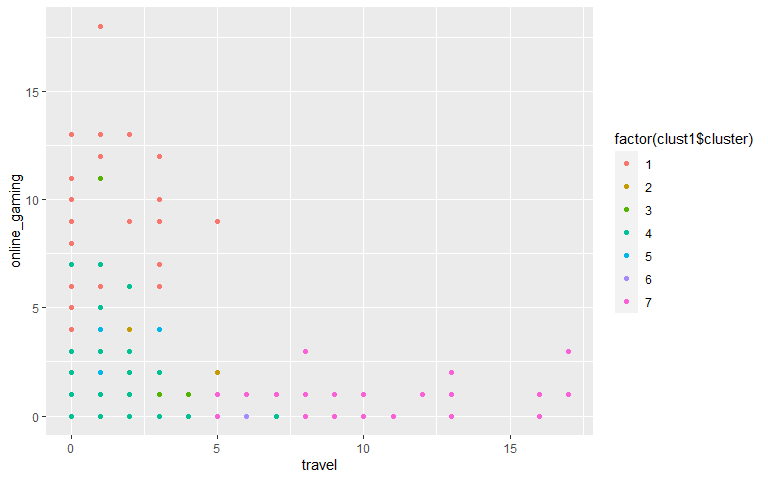
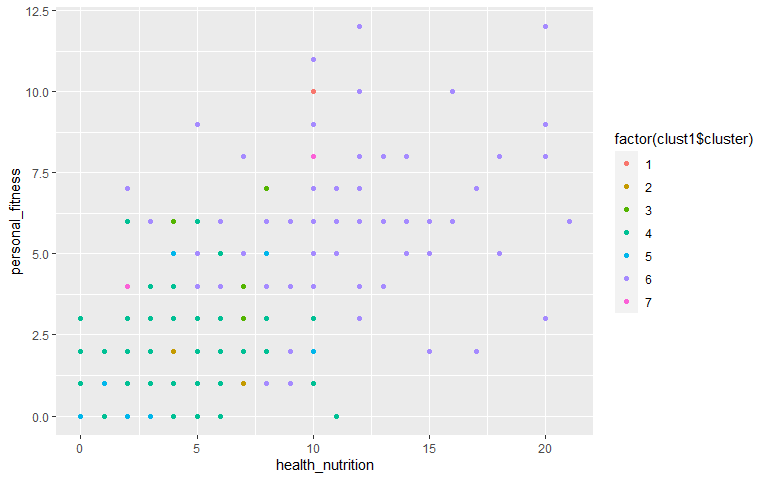

q4
================

# Market Segmentation

The goal of this report is to help NutrientH2O find market segments that
may be of interest. For the purposes of this goal, k-means clustering
has been used and several different predictors have been plotted to try
and understand the market segments present with NutrientH2O’s online
audience.

## Cleaning data

It is important to note that the dataset received from Amazon’s
Mechanical Turk Service has to be cleaned in order to better understand
the market. In order to do this any row which had adult or spam content
was deleted from the dataset. The next step taken was to filter out rows
with high density of uncategorized and chatter content. Upon closer
inspection, it was recognized that several rows had high counts in the
chatter column. So, it was decided that any row that had a chatter count
of more than 2 would be deleted from the dataset along with rows that
had content in the uncategorized column.

## Scaling data

After cleaning the dataset, steps were taken to scale the dataset.In the
process of scaling, columns for adult, spam, uncategorized and chatter
were deleted. The means and the standard deviations of the dataset were
saved so that they could be reverted back to understandable data points
once clusters were made.

## Choosing a value for k

In order to create the model, a number had to be chosen for the k. The
Gap statistic method was first used for this purpose. The plot from the
gap statistic method is shown:

\#{r gap, echo = FALSE,fig.align=‘center’, fig.height = 5, fig.width =
8,echo = FALSE, message = FALSE, warning = \#FALSE} \#library(cluster)
\#mark\_gap = clusGap(social, FUN = kmeans, nstart = 50, K.max = 20, B =
100) \#plot(mark\_gap)

As can be seen, no clear dip could be observed. So, it was decided after
several trials that a k value of 7 would be chosen. This was based on
formation of discernible clusters for this specific value of k.

## Identifying clusters

At first, a combination of different variables were plotted. One of the
first pairs of covariates that showed an interesting cluster was beauty
and fashion.

The concentration of members of the same cluster for higher number of
tweets in fashion and beauty suggests that it is a pretty clear cluster
which can considered as an exploitable market.This cluster can be
thought as consisting of young individuals who are interested in
appearance and fashion trends.

Driven by this finding of clusters formed by individuals who were
interested in fashion and beauty, another plot was created with the
covariates of travel and personal\_fitness.

In the plot above, two other clusters emerge: one of people who are very
interested in personal fitness and another group for individuals who are
very interested in travel. In order to see if the cluster of people
interested in personal fitness were in someway also interested in
playing sports, another plot was created.

The above plot suggests that the hypothesis of the existence of a market
segment that is interested in both playing sports and fitness is
invalid. However, in order to further investigate if the brand’s
audience included active college students, a plot was created with the
variables college\_uni and sports\_playing.

The existence of two distinct clusters is clear in the plot above. One
with individuals who attend college and have an active lifestyle and
another with neither one of those qualities.Since the demographic that
goes to college and plays sports consists of young adults, further
investigation was conducted into the online gaming community since its
membership is dominated to a certain extent by young adults.

From the above plot, it is clear that there is cluster of individuals
who are heavily involved in online gaming and are interested in
NutrientH2O.In an effort to see if there exists clusters among tech
savvy individuals, the covariates online\_gaming and computers were
plotted.

This shows that there are actually two distinct clusters: a group for
online gamers and others who are solely interested in computers. So this
could be interpreted as clusters for younger individuals and another for
possibly older individuals just interested in computers.

In an effort to understand if individuals who were interested in healthy
eating were a target audience, a plot was made using personal\_fitness
and health\_nutrition. As can be seen below, two distinct clusetrs form:
one whose membership consists of individuals interested in healthy
eating and personal fitness and another who are not interested in
either.

It is worth noting that other covariates such as politics, news, family
etc. were plotted but informative clusters were not found.

## Conclusion

From the above analysis it is clear that the brand NutrientH2O appeals
to certain groups of the general populace, namely:

\-individuals interested in beauty and fashion: possibly the younger
side of the population who follow influencers. -active individuals
attending college: a demographic primarily between the ages of 18 and
22. -fitness obsessed individuals. -individuals interested in travel.
-online gamers: once again, most likely a younger portion of the
population. -individuals interested in technology.
